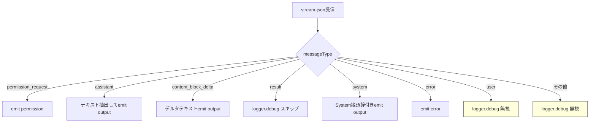

# 設計: JSON表示問題の修正

## 要件との整合性

| 要件ID | 設計要素 | 対応状況 |
|--------|----------|----------|
| REQ-001 | `'user'`タイプを無視 | handleStreamJsonMessageにcaseを追加 |
| REQ-002 | 認識されないタイプを非表示 | defaultケースで出力しない |
| REQ-003 | `'assistant'`タイプの処理 | 既存実装を維持 |
| NFR-001 | デバッグログ出力 | defaultケースでlogger.debug |
| NFR-002 | 既存処理維持 | 既存caseは変更しない |

## アーキテクチャ概要

修正対象は`src/services/process-manager.ts`の`handleStreamJsonMessage`メソッドのみ。

```
Claude Code (子プロセス)
    ↓ stream-json出力
process-manager.ts
    handleStreamJsonMessage()
        ↓ 'assistant', 'content_block_delta' → emit('output')
        ↓ 'user', その他 → ログのみ（出力しない）
    ↓
WebSocket → クライアント
```

## 修正対象

### ファイル: `src/services/process-manager.ts`

**メソッド**: `handleStreamJsonMessage` (312-396行目)

### 現在のコード（問題箇所）

```typescript
// 388-395行目
default:
  // その他のメッセージタイプはそのまま出力
  this.emit('output', {
    sessionId,
    type: 'output',
    content: JSON.stringify(json),
  });
```

### 修正後のコード

```typescript
case 'user':
  // userタイプはClaude CLIが会話履歴として出力するもの
  // クライアントには既にユーザー入力が表示されているため、無視する
  logger.debug('Stream-json user message received (ignored)', { sessionId });
  break;

default:
  // 認識されないメッセージタイプはログのみ出力し、クライアントには送信しない
  logger.debug('Unknown stream-json message type (ignored)', {
    sessionId,
    messageType,
    json
  });
  break;
```

## 処理フロー



## テスト設計

### テストケース

| ID | シナリオ | 入力 | 期待結果 |
|----|----------|------|----------|
| T1 | userタイプのメッセージ | `{"type":"user","message":...}` | outputイベントが発火されない |
| T2 | 認識されないタイプ | `{"type":"unknown",...}` | outputイベントが発火されない |
| T3 | assistantタイプ | `{"type":"assistant","message":{"content":[...]}}` | テキストがoutputイベントで発火 |

## 影響範囲

- **変更ファイル**: `src/services/process-manager.ts`のみ
- **変更行数**: 約10行（caseの追加とdefaultの修正）
- **副作用**: なし（既存の処理には影響しない）
