# 設計書

## アーキテクチャ概要

ClaudeWorkは、Next.js統合アーキテクチャを採用する。フロントエンド（Pages/Components）、バックエンド（API Routes）、WebSocketサーバー（カスタムサーバー）を1つのNext.jsプロジェクトに統合し、`npx claude-work`コマンドで起動する。バックエンドはClaude Code CLIプロセスを管理し、WebSocket経由でリアルタイム通信を行う。

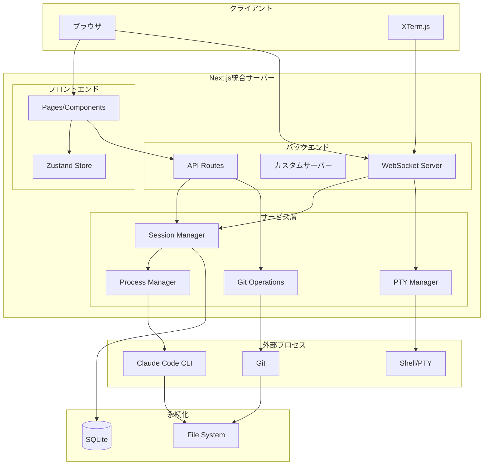
```mermaid
graph TD
    subgraph "クライアント"
        Browser[ブラウザ]
        XTerm[XTerm.js]
    end

    subgraph "Next.js統合サーバー"
        subgraph "フロントエンド"
            Pages[Pages/Components]
            State[Zustand Store]
        end

        subgraph "バックエンド"
            APIRoutes[API Routes]
            CustomServer[カスタムサーバー]
            WSServer[WebSocket Server]
        end

        subgraph "サービス層"
            SessionMgr[Session Manager]
            ProcessMgr[Process Manager]
            GitOps[Git Operations]
            PTYMgr[PTY Manager]
        end
    end

    subgraph "外部プロセス"
        ClaudeCode[Claude Code CLI]
        Git[Git]
        Shell[Shell/PTY]
    end

    subgraph "永続化"
        SQLite[(SQLite)]
        FileSystem[File System]
    end

    Browser --> Pages
    XTerm --> WSServer
    Pages --> State
    Pages --> APIRoutes
    Browser --> WSServer

    APIRoutes --> SessionMgr
    APIRoutes --> GitOps
    WSServer --> SessionMgr
    WSServer --> PTYMgr

    SessionMgr --> ProcessMgr
    ProcessMgr --> ClaudeCode
    GitOps --> Git
    PTYMgr --> Shell

    SessionMgr --> SQLite
    ClaudeCode --> FileSystem
    Git --> FileSystem
```

## コンポーネント

### フロントエンド

#### コンポーネント: Pages

**目的**: ユーザーインターフェースの提供

**責務**:
- プロジェクト一覧・詳細の表示
- セッション一覧・詳細の表示
- Claude Codeの出力表示とユーザー入力
- Diff表示とGit操作UI
- ターミナルUI
- 認証画面

**主要ページ構成**:
- `/login` - ログインページ
- `/` - ダッシュボード（プロジェクト一覧）
- `/projects/[id]` - プロジェクト詳細（セッション一覧）
- `/sessions/[id]` - セッション詳細（Claude Code対話）

#### コンポーネント: Zustand Store

**目的**: クライアント状態管理

**責務**:
- プロジェクト・セッション状態の管理
- 認証状態の管理
- テーマ設定の管理
- WebSocket接続状態の管理

**ストア構成**:
```typescript
interface AppState {
  // 認証
  isAuthenticated: boolean;
  token: string | null;

  // プロジェクト
  projects: Project[];
  selectedProjectId: string | null;

  // セッション
  sessions: Session[];
  selectedSessionId: string | null;

  // UI
  theme: 'light' | 'dark' | 'system';
  isMobile: boolean;
}

// 通知設定（別ストアとして実装）
interface NotificationState {
  // 通知許可状態
  permission: 'default' | 'granted' | 'denied';

  // イベント別通知設定
  settings: {
    onTaskComplete: boolean;    // タスク完了時
    onPermissionRequest: boolean; // 権限要求時
    onError: boolean;           // エラー発生時
  };

  // アクション
  requestPermission: () => Promise<void>;
  updateSettings: (settings: Partial<NotificationSettings>) => void;
  sendNotification: (event: NotificationEvent) => void;
}
```

#### コンポーネント: WebSocket Client

**目的**: リアルタイム通信の管理

**責務**:
- Claude Code出力のストリーミング受信
- ターミナル入出力の送受信
- ランスクリプト出力のストリーミング受信
- 接続状態の管理と自動再接続

#### コンポーネント: Notification Service

**目的**: ブラウザ通知とアプリ内toast通知の管理

**責務**:
- ブラウザ通知権限のリクエストと状態管理
- OS通知（Notification API）の送信
- アプリ内toast通知の送信
- タブのアクティブ/バックグラウンド状態の検出
- イベント別通知設定の管理と永続化

**実装場所**: `src/lib/notification-service.ts`

**対応イベント**:

| イベント | OS通知タイトル | 条件 |
|----------|----------------|------|
| タスク完了 | タスク完了: [セッション名] | `status_change` で `completed` |
| 権限要求 | アクション要求: [セッション名] | `permission_request` メッセージ |
| エラー発生 | エラー発生: [セッション名] | `status_change` で `error` または `error` メッセージ |

**通知ルーティング**:
```typescript
function sendNotification(event: NotificationEvent): void {
  const settings = getSettings();

  // イベント別の有効/無効チェック
  if (!isEventEnabled(event.type, settings)) return;

  // タブのアクティブ状態で通知方法を切り替え
  if (document.visibilityState === 'visible') {
    // アプリ内toast通知
    showToast(event);
  } else {
    // OS通知（権限がある場合のみ）
    if (Notification.permission === 'granted') {
      showOSNotification(event);
    }
  }
}
```

**設定の永続化**:
- ローカルストレージのキー: `claudework:notification-settings`
- デフォルト: すべてのイベントで通知有効

### バックエンド

#### コンポーネント: API Routes

**目的**: CRUD操作とGit操作のエンドポイント提供

**責務**:
- プロジェクト管理API（Next.js API Routes）
- セッション管理API（Next.js API Routes）
- Git操作API（diff、rebase、merge）
- 認証API（Next.js API Routes）
- プロンプト履歴API

**実装場所**: `src/app/api/`配下

#### コンポーネント: WebSocket Server

**目的**: リアルタイム双方向通信

**責務**:
- Claude Code出力のブロードキャスト
- ユーザー入力のClaude Codeへの転送
- ターミナル入出力の中継
- 権限確認リクエストの送信

**実装場所**: カスタムサーバー（`server.ts`）にws/socket.ioで実装

#### コンポーネント: Session Manager

**目的**: セッションのライフサイクル管理

**責務**:
- セッションの作成・削除
- セッション状態の追跡
- 複数セッションの一括作成
- サーバー再起動後のセッション復元

#### コンポーネント: Process Manager

**目的**: Claude Codeプロセスの管理

**責務**:
- Claude Code CLIの起動・停止
- プロセス出力の監視とパース
- 権限確認リクエストの検出
- サブエージェント出力の検出
- プロセス異常終了の検出
- stream-jsonメッセージのフィルタリング（`user`タイプ、認識されないタイプは出力しない）

**実装場所**: `src/services/process-manager.ts`（Node.js child_process使用）

**stream-jsonメッセージ処理**:

| メッセージタイプ | 処理 |
|-----------------|------|
| `assistant` | テキストを抽出して`output`イベント発火 |
| `content_block_delta` | デルタテキストを`output`イベント発火 |
| `system` | `[System]`接頭辞付きで`output`イベント発火 |
| `error` | `error`イベント発火 |
| `permission_request` | `permission`イベント発火 |
| `result` | スキップ（既にテキスト送信済み） |
| `user` | ログのみ（クライアントに送信しない） |
| その他 | ログのみ（クライアントに送信しない） |

#### コンポーネント: Process Lifecycle Manager

**目的**: Claude Codeプロセスのライフサイクル自動管理

**責務**:
- サーバーシャットダウン時の全プロセス自動停止
- アイドルタイムアウトによるプロセス自動停止
- アクティビティトラッキング（最終アクティビティ時刻の記録）
- セッション再開時の--resumeオプション使用による会話履歴復元
- プロセスライフサイクルイベントのWebSocket通知

**実装場所**: `src/services/process-lifecycle-manager.ts`

**状態定義**:
```typescript
interface ProcessLifecycleState {
  sessionId: string;
  lastActivityAt: Date;
  isStopped: boolean;      // アイドルタイムアウトで停止された状態
  resumeSessionId: string | null;  // Claude Codeの--resume用セッションID
}

// セッションステータスの拡張
type SessionStatus =
  | 'initializing'   // 初期化中
  | 'running'        // プロセス実行中
  | 'waiting_input'  // ユーザー入力待ち
  | 'completed'      // 正常終了
  | 'error'          // エラー終了
  | 'stopped';       // 停止中（アイドルタイムアウトなど）
```

**設定**:
- `PROCESS_IDLE_TIMEOUT_MINUTES`: アイドルタイムアウト（分）。デフォルト30分。0で無効化。

**シャットダウンフロー**:
1. SIGTERM/SIGINTシグナルを受信
2. 全アクティブプロセスにSIGTERMを送信
3. 5秒のグレースフル終了待機
4. タイムアウト後、残存プロセスにSIGKILLを送信
5. サーバープロセス終了

**アイドルタイムアウトフロー**:
1. 定期的なアイドルチェック（1分間隔）
2. 最終アクティビティからの経過時間を計算
3. タイムアウト超過時:
   - プロセスにSIGTERMを送信
   - セッションステータスを`stopped`に更新
   - 接続中クライアントにWebSocket通知
   - Claude Codeセッション識別子を保存

**セッション再開フロー**:
1. `stopped`状態のセッションにユーザーがアクセス
2. 保存されたセッション識別子を取得
3. `claude --resume <session-id>`でプロセス再起動
4. セッションステータスを`running`に更新
5. WebSocket接続を再確立

#### コンポーネント: Git Operations

**目的**: Git操作の実行

**責務**:
- worktreeの作成・削除
- diff取得
- rebase実行
- squash & merge実行
- コミット履歴取得
- コミットへのリセット

**実装場所**: `src/services/git-service.ts`（Node.js child_process使用）

#### コンポーネント: PTY Manager

**目的**: ターミナルセッションの管理

**責務**:
- PTYプロセスの生成
- 入出力のWebSocket中継
- セッションごとのPTY管理
- ANSIエスケープシーケンスの透過的転送

**実装場所**: `src/services/pty-manager.ts`（node-ptyライブラリ使用）

#### コンポーネント: Environment Validator

**目的**: サーバー起動時の環境検証

**責務**:
- CLAUDE_CODE_PATH環境変数のチェック
- PATH環境変数からclaudeコマンドの自動検出
- 既存のCLAUDE_CODE_PATHの有効性検証
- claudeコマンドの実行可能性確認
- 検出結果のログ出力

**実装場所**: `src/lib/env-validation.ts`

**検証フロー**:
1. CLAUDE_CODE_PATH環境変数をチェック
2. 設定済みの場合 → パスの有効性を検証
3. 未設定の場合 → PATH環境変数から自動検出
4. 検出/検証失敗時 → エラーメッセージを表示してプロセス終了
5. 検出/検証成功時 → process.env.CLAUDE_CODE_PATHに設定してログ出力

## データフロー

### シーケンス: サーバー起動時の環境検証

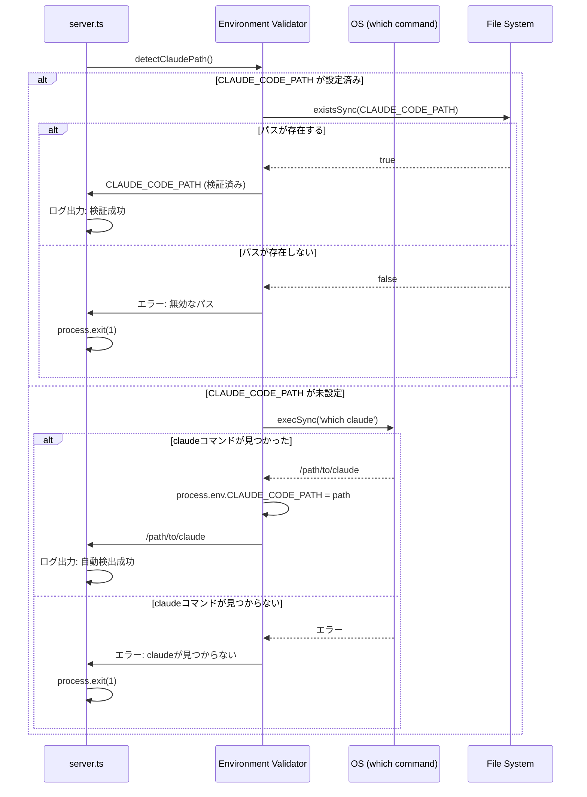
```mermaid
sequenceDiagram
    participant Server as server.ts
    participant Validator as Environment Validator
    participant OS as OS (which command)
    participant FS as File System

    Server->>Validator: detectClaudePath()

    alt CLAUDE_CODE_PATH が設定済み
        Validator->>FS: existsSync(CLAUDE_CODE_PATH)
        alt パスが存在する
            FS-->>Validator: true
            Validator->>Server: CLAUDE_CODE_PATH (検証済み)
            Server->>Server: ログ出力: 検証成功
        else パスが存在しない
            FS-->>Validator: false
            Validator->>Server: エラー: 無効なパス
            Server->>Server: process.exit(1)
        end
    else CLAUDE_CODE_PATH が未設定
        Validator->>OS: execSync('which claude')
        alt claudeコマンドが見つかった
            OS-->>Validator: /path/to/claude
            Validator->>Validator: process.env.CLAUDE_CODE_PATH = path
            Validator->>Server: /path/to/claude
            Server->>Server: ログ出力: 自動検出成功
        else claudeコマンドが見つからない
            OS-->>Validator: エラー
            Validator->>Server: エラー: claudeが見つからない
            Server->>Server: process.exit(1)
        end
    end
```

### シーケンス: セッション作成

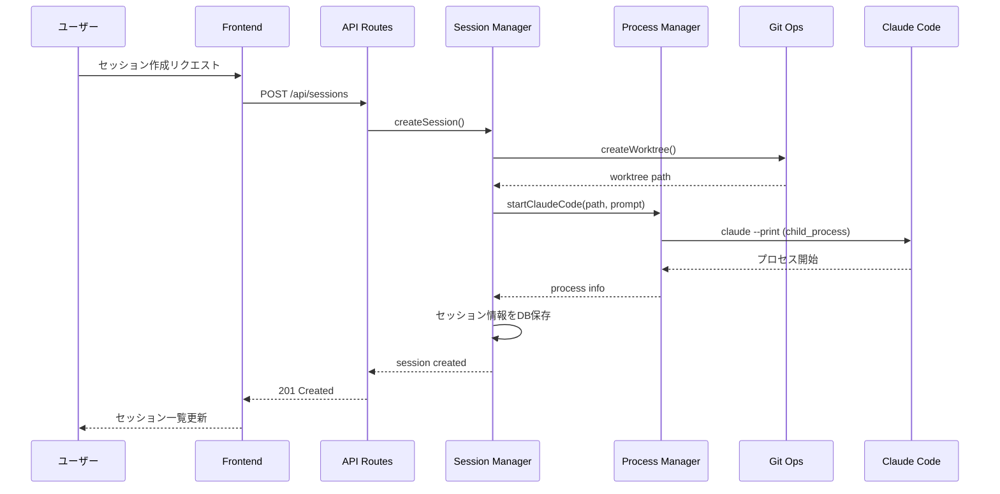
```mermaid
sequenceDiagram
    participant U as ユーザー
    participant F as Frontend
    participant API as API Routes
    participant SM as Session Manager
    participant PM as Process Manager
    participant Git as Git Ops
    participant CC as Claude Code

    U->>F: セッション作成リクエスト
    F->>API: POST /api/sessions
    API->>SM: createSession()
    SM->>Git: createWorktree()
    Git-->>SM: worktree path
    SM->>PM: startClaudeCode(path, prompt)
    PM->>CC: claude --print (child_process)
    CC-->>PM: プロセス開始
    PM-->>SM: process info
    SM->>SM: セッション情報をDB保存
    SM-->>API: session created
    API-->>F: 201 Created
    F-->>U: セッション一覧更新
```

### シーケンス: Claude Code対話

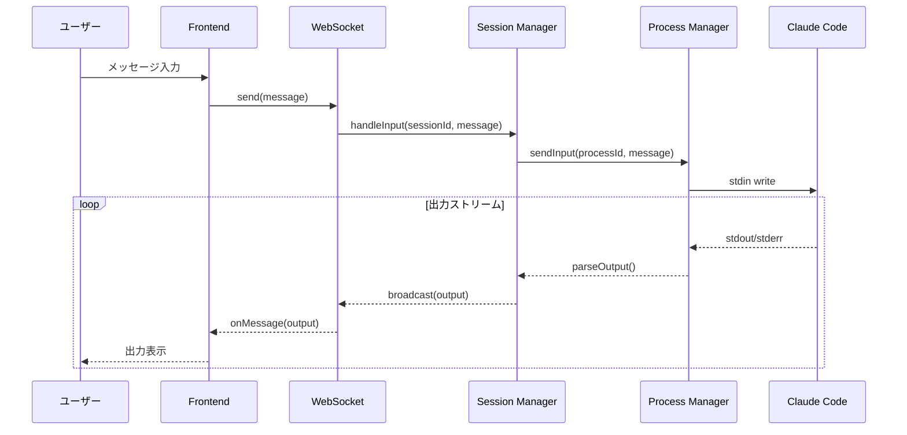
```mermaid
sequenceDiagram
    participant U as ユーザー
    participant F as Frontend
    participant WS as WebSocket
    participant SM as Session Manager
    participant PM as Process Manager
    participant CC as Claude Code

    U->>F: メッセージ入力
    F->>WS: send(message)
    WS->>SM: handleInput(sessionId, message)
    SM->>PM: sendInput(processId, message)
    PM->>CC: stdin write
    
    loop 出力ストリーム
        CC-->>PM: stdout/stderr
        PM-->>SM: parseOutput()
        SM-->>WS: broadcast(output)
        WS-->>F: onMessage(output)
        F-->>U: 出力表示
    end
```

### シーケンス: 権限確認

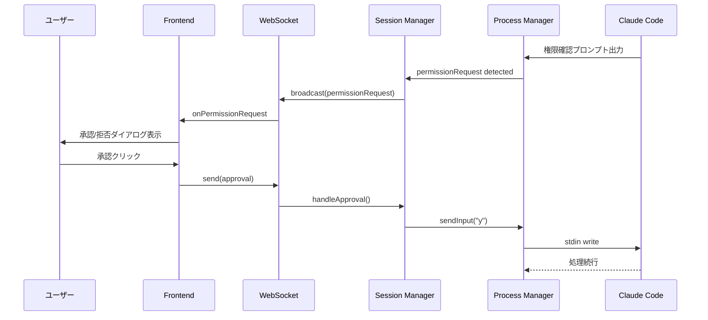
```mermaid
sequenceDiagram
    participant U as ユーザー
    participant F as Frontend
    participant WS as WebSocket
    participant SM as Session Manager
    participant PM as Process Manager
    participant CC as Claude Code

    CC->>PM: 権限確認プロンプト出力
    PM->>SM: permissionRequest detected
    SM->>WS: broadcast(permissionRequest)
    WS->>F: onPermissionRequest
    F->>U: 承認/拒否ダイアログ表示
    U->>F: 承認クリック
    F->>WS: send(approval)
    WS->>SM: handleApproval()
    SM->>PM: sendInput("y")
    PM->>CC: stdin write
    CC-->>PM: 処理続行
```

### シーケンス: ターミナル操作

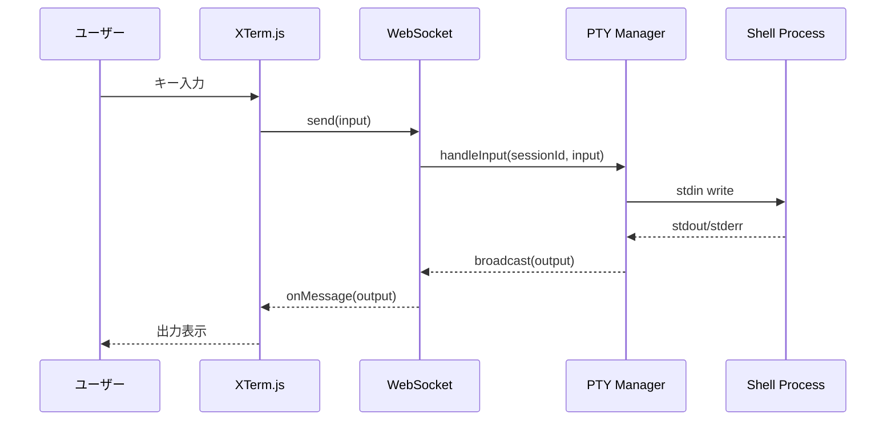
```mermaid
sequenceDiagram
    participant U as ユーザー
    participant XT as XTerm.js
    participant WS as WebSocket
    participant PTY as PTY Manager
    participant Shell as Shell Process

    U->>XT: キー入力
    XT->>WS: send(input)
    WS->>PTY: handleInput(sessionId, input)
    PTY->>Shell: stdin write
    Shell-->>PTY: stdout/stderr
    PTY-->>WS: broadcast(output)
    WS-->>XT: onMessage(output)
    XT-->>U: 出力表示
```

### シーケンス: ブラウザ通知

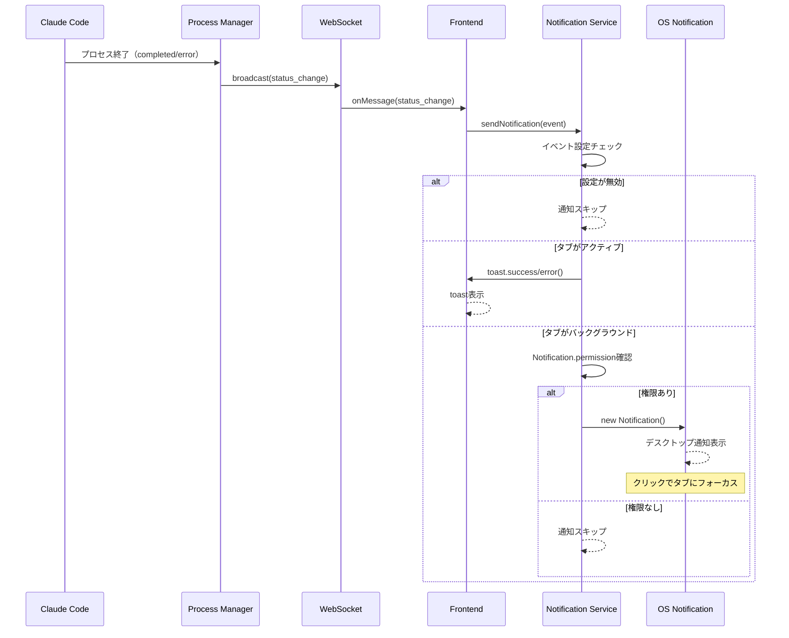
```mermaid
sequenceDiagram
    participant CC as Claude Code
    participant PM as Process Manager
    participant WS as WebSocket
    participant F as Frontend
    participant NS as Notification Service
    participant OS as OS Notification

    CC->>PM: プロセス終了（completed/error）
    PM->>WS: broadcast(status_change)
    WS->>F: onMessage(status_change)
    F->>NS: sendNotification(event)

    NS->>NS: イベント設定チェック

    alt 設定が無効
        NS-->>NS: 通知スキップ
    else タブがアクティブ
        NS->>F: toast.success/error()
        F-->>F: toast表示
    else タブがバックグラウンド
        NS->>NS: Notification.permission確認
        alt 権限あり
            NS->>OS: new Notification()
            OS-->>OS: デスクトップ通知表示
            Note over OS: クリックでタブにフォーカス
        else 権限なし
            NS-->>NS: 通知スキップ
        end
    end
```

### シーケンス: 通知許可リクエスト

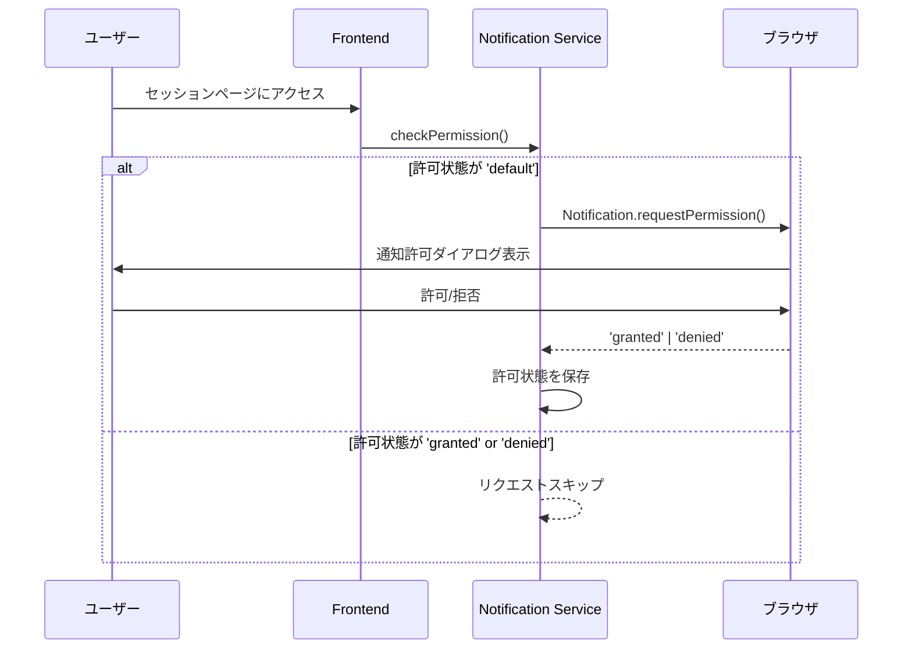
```mermaid
sequenceDiagram
    participant U as ユーザー
    participant F as Frontend
    participant NS as Notification Service
    participant Browser as ブラウザ

    U->>F: セッションページにアクセス
    F->>NS: checkPermission()

    alt 許可状態が 'default'
        NS->>Browser: Notification.requestPermission()
        Browser->>U: 通知許可ダイアログ表示
        U->>Browser: 許可/拒否
        Browser-->>NS: 'granted' | 'denied'
        NS->>NS: 許可状態を保存
    else 許可状態が 'granted' or 'denied'
        NS-->>NS: リクエストスキップ
    end
```

### シーケンス: サーバーシャットダウン時のプロセス終了

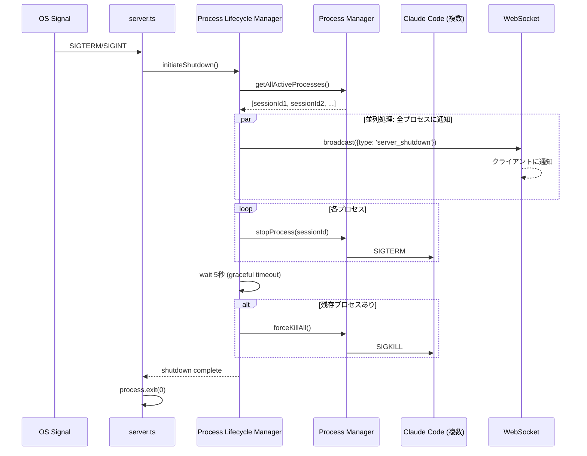
```mermaid
sequenceDiagram
    participant OS as OS Signal
    participant Server as server.ts
    participant PLM as Process Lifecycle Manager
    participant PM as Process Manager
    participant CC as Claude Code (複数)
    participant WS as WebSocket

    OS->>Server: SIGTERM/SIGINT
    Server->>PLM: initiateShutdown()
    PLM->>PM: getAllActiveProcesses()
    PM-->>PLM: [sessionId1, sessionId2, ...]

    par 並列処理: 全プロセスに通知
        PLM->>WS: broadcast({type: 'server_shutdown'})
        WS-->>WS: クライアントに通知
    end

    loop 各プロセス
        PLM->>PM: stopProcess(sessionId)
        PM->>CC: SIGTERM
    end

    PLM->>PLM: wait 5秒 (graceful timeout)

    alt 残存プロセスあり
        PLM->>PM: forceKillAll()
        PM->>CC: SIGKILL
    end

    PLM-->>Server: shutdown complete
    Server->>Server: process.exit(0)
```

### シーケンス: アイドルタイムアウトによるプロセス停止

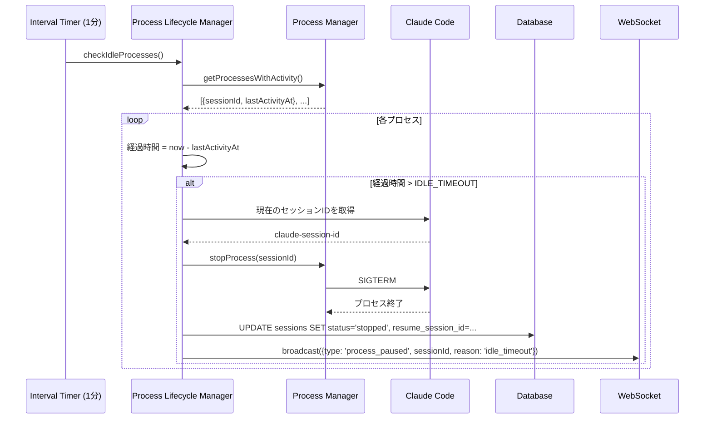
```mermaid
sequenceDiagram
    participant Timer as Interval Timer (1分)
    participant PLM as Process Lifecycle Manager
    participant PM as Process Manager
    participant CC as Claude Code
    participant DB as Database
    participant WS as WebSocket

    Timer->>PLM: checkIdleProcesses()
    PLM->>PM: getProcessesWithActivity()
    PM-->>PLM: [{sessionId, lastActivityAt}, ...]

    loop 各プロセス
        PLM->>PLM: 経過時間 = now - lastActivityAt
        alt 経過時間 > IDLE_TIMEOUT
            PLM->>CC: 現在のセッションIDを取得
            CC-->>PLM: claude-session-id
            PLM->>PM: stopProcess(sessionId)
            PM->>CC: SIGTERM
            CC-->>PM: プロセス終了
            PLM->>DB: UPDATE sessions SET status='stopped', resume_session_id=...
            PLM->>WS: broadcast({type: 'process_paused', sessionId, reason: 'idle_timeout'})
        end
    end
```

### シーケンス: セッション再開（--resume使用）

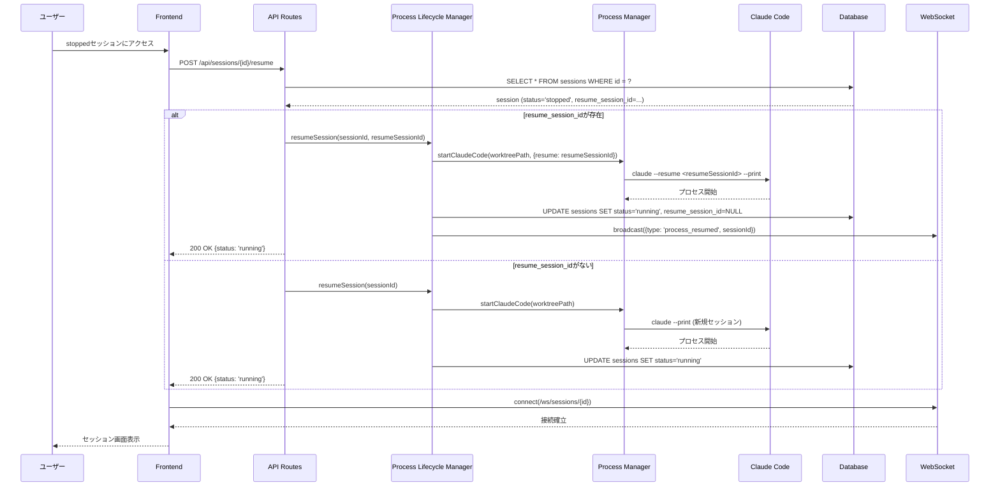
```mermaid
sequenceDiagram
    participant U as ユーザー
    participant F as Frontend
    participant API as API Routes
    participant PLM as Process Lifecycle Manager
    participant PM as Process Manager
    participant CC as Claude Code
    participant DB as Database
    participant WS as WebSocket

    U->>F: stoppedセッションにアクセス
    F->>API: POST /api/sessions/{id}/resume
    API->>DB: SELECT * FROM sessions WHERE id = ?
    DB-->>API: session (status='stopped', resume_session_id=...)

    alt resume_session_idが存在
        API->>PLM: resumeSession(sessionId, resumeSessionId)
        PLM->>PM: startClaudeCode(worktreePath, {resume: resumeSessionId})
        PM->>CC: claude --resume <resumeSessionId> --print
        CC-->>PM: プロセス開始
        PLM->>DB: UPDATE sessions SET status='running', resume_session_id=NULL
        PLM->>WS: broadcast({type: 'process_resumed', sessionId})
        API-->>F: 200 OK {status: 'running'}
    else resume_session_idがない
        API->>PLM: resumeSession(sessionId)
        PLM->>PM: startClaudeCode(worktreePath)
        PM->>CC: claude --print (新規セッション)
        CC-->>PM: プロセス開始
        PLM->>DB: UPDATE sessions SET status='running'
        API-->>F: 200 OK {status: 'running'}
    end

    F->>WS: connect(/ws/sessions/{id})
    WS-->>F: 接続確立
    F-->>U: セッション画面表示
```

### シーケンス: アクティビティトラッキング

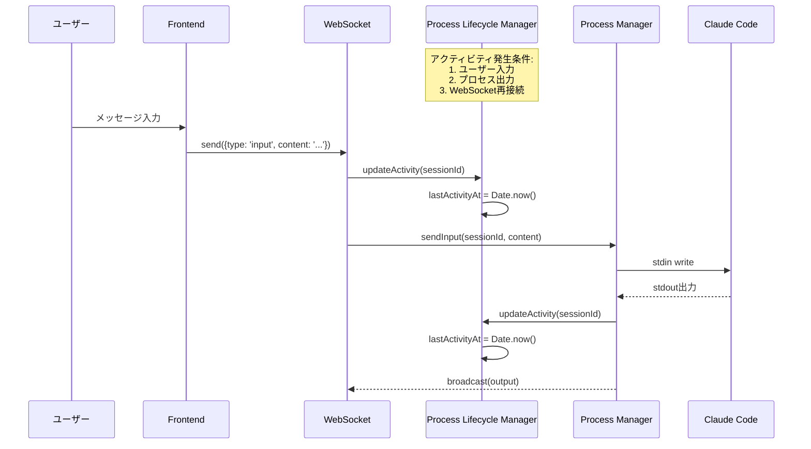
```mermaid
sequenceDiagram
    participant U as ユーザー
    participant F as Frontend
    participant WS as WebSocket
    participant PLM as Process Lifecycle Manager
    participant PM as Process Manager
    participant CC as Claude Code

    Note over PLM: アクティビティ発生条件:<br/>1. ユーザー入力<br/>2. プロセス出力<br/>3. WebSocket再接続

    U->>F: メッセージ入力
    F->>WS: send({type: 'input', content: '...'})
    WS->>PLM: updateActivity(sessionId)
    PLM->>PLM: lastActivityAt = Date.now()
    WS->>PM: sendInput(sessionId, content)
    PM->>CC: stdin write

    CC-->>PM: stdout出力
    PM->>PLM: updateActivity(sessionId)
    PLM->>PLM: lastActivityAt = Date.now()
    PM-->>WS: broadcast(output)
```

## API設計

### 認証

#### POST /api/auth/login
**目的**: トークン認証によるログイン

**リクエスト**:
```json
{
  "token": "user-provided-token"
}
```

**レスポンス（200）**:
```json
{
  "message": "Login successful",
  "session_id": "uuid",
  "expires_at": "2025-12-08T12:00:00Z"
}
```

**レスポンス（401）**:
```json
{
  "error": "Invalid token"
}
```

#### POST /api/auth/logout
**目的**: ログアウト

**レスポンス（200）**:
```json
{
  "message": "Logout successful"
}
```

### プロジェクト

#### GET /api/projects
**目的**: プロジェクト一覧取得

**レスポンス（200）**:
```json
{
  "projects": [
    {
      "id": "uuid",
      "name": "my-project",
      "path": "/path/to/repo",
      "default_model": "auto",
      "run_scripts": [
        {"name": "test", "command": "npm test"},
        {"name": "build", "command": "npm run build"}
      ],
      "session_count": 3,
      "created_at": "2025-12-01T00:00:00Z"
    }
  ]
}
```

#### POST /api/projects
**目的**: プロジェクト追加

**リクエスト**:
```json
{
  "path": "/path/to/git/repo",
  "default_model": "auto",
  "run_scripts": []
}
```

**レスポンス（201）**:
```json
{
  "project": {
    "id": "uuid",
    "name": "repo-name",
    "path": "/path/to/git/repo",
    "default_model": "auto",
    "run_scripts": [],
    "created_at": "2025-12-01T00:00:00Z"
  }
}
```

**レスポンス（400）**:
```json
{
  "error": "Not a Git repository"
}
```

**レスポンス（403）**:
```json
{
  "error": "指定されたパスは許可されていません"
}
```

**レスポンス（409）**:
```json
{
  "error": "このパスは既に登録されています"
}
```

#### PUT /api/projects/{id}
**目的**: プロジェクト設定更新

**リクエスト**:
```json
{
  "default_model": "sonnet",
  "run_scripts": [
    {"name": "test", "command": "npm test"}
  ]
}
```

**レスポンス（200）**:
```json
{
  "project": {
    "id": "uuid",
    "name": "repo-name",
    "path": "/path/to/git/repo",
    "default_model": "sonnet",
    "run_scripts": [
      {"name": "test", "command": "npm test"}
    ],
    "created_at": "2025-12-01T00:00:00Z"
  }
}
```

#### DELETE /api/projects/{id}
**目的**: プロジェクト削除（worktreeは保持）

### セッション

#### GET /api/projects/{project_id}/sessions
**目的**: セッション一覧取得

**レスポンス（200）**:
```json
{
  "sessions": [
    {
      "id": "uuid",
      "name": "feature-auth",
      "status": "running",
      "git_status": "dirty",
      "model": "sonnet",
      "worktree_path": "/path/to/worktree",
      "created_at": "2025-12-08T10:00:00Z"
    }
  ]
}
```

#### POST /api/projects/{project_id}/sessions
**目的**: セッション作成（単一または複数）

**リクエスト**:
```json
{
  "name": "feature",
  "prompt": "Implement user authentication",
  "model": "auto",
  "count": 3
}
```

**レスポンス（201）**:
```json
{
  "sessions": [
    {"id": "uuid1", "name": "feature-1"},
    {"id": "uuid2", "name": "feature-2"},
    {"id": "uuid3", "name": "feature-3"}
  ]
}
```

#### GET /api/sessions/{id}
**目的**: セッション詳細取得

**レスポンス（200）**:
```json
{
  "session": {
    "id": "uuid",
    "name": "feature-auth",
    "status": "waiting_input",
    "git_status": "dirty",
    "model": "sonnet",
    "worktree_path": "/path/to/worktree",
    "messages": [
      {
        "role": "user",
        "content": "Implement auth",
        "timestamp": "2025-12-08T10:00:00Z"
      },
      {
        "role": "assistant",
        "content": "I'll implement...",
        "timestamp": "2025-12-08T10:00:05Z",
        "sub_agents": [
          {"name": "file_edit", "output": "..."}
        ]
      }
    ]
  }
}
```

#### POST /api/sessions/{id}/input
**目的**: セッションへの入力送信（REST fallback）

**リクエスト**:
```json
{
  "content": "Please also add tests"
}
```

**レスポンス（200）**:
```json
{
  "message": {
    "id": "msg-uuid",
    "role": "user",
    "content": "Please also add tests",
    "timestamp": "2025-12-08T10:05:00Z"
  }
}
```

#### POST /api/sessions/{id}/approve
**目的**: 権限承認

**リクエスト**:
```json
{
  "action": "approve",
  "permission_id": "perm-uuid"
}
```

**レスポンス（200）**:
```json
{
  "success": true,
  "action": "approve"
}
```

#### POST /api/sessions/{id}/stop
**目的**: セッション停止

**レスポンス（200）**:
```json
{
  "session": {
    "id": "uuid",
    "name": "feature-auth",
    "status": "stopped",
    "git_status": "dirty",
    "model": "sonnet",
    "worktree_path": "/path/to/worktree",
    "created_at": "2025-12-08T10:00:00Z"
  }
}
```

#### POST /api/sessions/{id}/resume
**目的**: 一時停止中のセッションを再開

**説明**: アイドルタイムアウトで停止（stopped）されたセッションのClaude Codeプロセスを再起動します。resume_session_idが保存されている場合は`--resume`オプションを使用して会話履歴を復元します。

**リクエスト**: なし（ボディ不要）

**レスポンス（200）**:
```json
{
  "session": {
    "id": "uuid",
    "name": "feature-auth",
    "status": "running",
    "git_status": "dirty",
    "model": "sonnet",
    "worktree_path": "/path/to/worktree",
    "created_at": "2025-12-08T10:00:00Z"
  },
  "resumed_with_history": true
}
```

**レスポンス（400）** - セッションがstopped状態でない場合:
```json
{
  "error": "Session is not stopped",
  "current_status": "running"
}
```

**レスポンス（404）** - セッションが存在しない場合:
```json
{
  "error": "Session not found"
}
```

#### DELETE /api/sessions/{id}
**目的**: セッション削除（worktreeも削除）

### Git操作

#### GET /api/sessions/{id}/diff
**目的**: mainブランチとの差分取得

**レスポンス（200）**:
```json
{
  "diff": {
    "files": [
      {
        "path": "src/auth.ts",
        "status": "modified",
        "additions": 45,
        "deletions": 12,
        "hunks": [
          {
            "old_start": 10,
            "old_lines": 5,
            "new_start": 10,
            "new_lines": 8,
            "content": "@@ -10,5 +10,8 @@\n-old line\n+new line"
          }
        ]
      }
    ],
    "totalAdditions": 45,
    "totalDeletions": 12
  }
}
```

#### GET /api/sessions/{id}/commits
**目的**: コミット履歴取得

**レスポンス（200）**:
```json
{
  "commits": [
    {
      "hash": "abc123",
      "short_hash": "abc123",
      "message": "Add authentication",
      "author": "Claude",
      "date": "2025-12-08T10:05:00Z",
      "files_changed": 3
    }
  ]
}
```

#### POST /api/sessions/{id}/rebase
**目的**: mainからのrebase

**レスポンス（200）**:
```json
{
  "success": true
}
```

**レスポンス（409）**:
```json
{
  "success": false,
  "conflicts": ["src/auth.ts"]
}
```

#### POST /api/sessions/{id}/reset
**目的**: 特定コミットへのリセット

**注意**: このエンドポイントは未実装です。

**リクエスト**:
```json
{
  "commit_hash": "abc123"
}
```

#### POST /api/sessions/{id}/merge
**目的**: mainへのsquash merge

**リクエスト**:
```json
{
  "commit_message": "feat: Add user authentication",
  "delete_worktree": true
}
```

**レスポンス（200）**:
```json
{
  "success": true
}
```

**レスポンス（409）**:
```json
{
  "success": false,
  "conflicts": ["src/auth.ts", "src/utils.ts"]
}
```

### ランスクリプト

#### POST /api/sessions/{id}/run
**目的**: ランスクリプト実行

**注意**: このエンドポイントは未実装です。

**リクエスト**:
```json
{
  "script_name": "test"
}
```

**レスポンス（202）**:
```json
{
  "run_id": "uuid"
}
```

#### POST /api/sessions/{id}/run/{run_id}/stop
**目的**: ランスクリプト停止

**注意**: このエンドポイントは未実装です。

### プロンプト履歴

#### GET /api/prompts
**目的**: プロンプト履歴取得

**注意**: このエンドポイントは未実装です。

**レスポンス（200）**:
```json
{
  "prompts": [
    {
      "id": "uuid",
      "content": "Implement user auth",
      "used_count": 3,
      "last_used_at": "2025-12-08T10:00:00Z"
    }
  ]
}
```

#### DELETE /api/prompts/{id}
**目的**: プロンプト履歴削除

**注意**: このエンドポイントは未実装です。

## WebSocket API

### 接続

```
ws://host/ws/sessions/{session_id}
```

### メッセージ形式

#### クライアント → サーバー

```json
{
  "type": "input" | "approve" | "deny",
  "content": "string (for input)",
  "request_id": "string (for approve/deny)"
}
```

#### サーバー → クライアント

```json
{
  "type": "output" | "permission_request" | "status_change" | "error" | "process_paused" | "process_resumed" | "server_shutdown",
  "content": "string",
  "sub_agent": {
    "name": "string",
    "output": "string"
  },
  "permission": {
    "request_id": "string",
    "action": "string",
    "details": "string"
  },
  "status": "initializing" | "running" | "waiting_input" | "completed" | "error" | "stopped"
}
```

#### プロセスライフサイクルメッセージ

**process_paused** - プロセスが一時停止された時:
```json
{
  "type": "process_paused",
  "sessionId": "uuid",
  "reason": "idle_timeout" | "manual" | "server_shutdown",
  "idleMinutes": 30,
  "canResume": true
}
```

**process_resumed** - プロセスが再開された時:
```json
{
  "type": "process_resumed",
  "sessionId": "uuid",
  "resumedWithHistory": true
}
```

**server_shutdown** - サーバーがシャットダウンする時:
```json
{
  "type": "server_shutdown",
  "reason": "SIGTERM" | "SIGINT",
  "gracePeriodSeconds": 5
}
```

### ターミナルWebSocket

```
ws://host/ws/terminal/{session_id}
```

バイナリデータとして入出力を送受信。

## データベーススキーマ

### テーブル: projects

| カラム | 型 | 制約 | 説明 |
|--------|------|------|------|
| id | TEXT | PRIMARY KEY | UUID |
| name | TEXT | NOT NULL | プロジェクト名 |
| path | TEXT | NOT NULL UNIQUE | Gitリポジトリパス |
| default_model | TEXT | DEFAULT 'auto' | デフォルトモデル |
| created_at | TEXT | NOT NULL | 作成日時（ISO 8601） |
| updated_at | TEXT | NOT NULL | 更新日時（ISO 8601） |

**リレーション**:
- `RunScript` テーブルと1対多のリレーション（project_id経由）

### テーブル: sessions

| カラム | 型 | 制約 | 説明 |
|--------|------|------|------|
| id | TEXT | PRIMARY KEY | UUID |
| project_id | TEXT | FOREIGN KEY | プロジェクトID |
| name | TEXT | NOT NULL | セッション名 |
| status | TEXT | NOT NULL | ステータス（initializing/running/waiting_input/completed/error/stopped） |
| model | TEXT | NOT NULL | 使用モデル |
| worktree_path | TEXT | NOT NULL | worktreeパス |
| branch_name | TEXT | NOT NULL | ブランチ名 |
| resume_session_id | TEXT | NULLABLE | Claude Codeの--resume用セッションID（stopped時に保存） |
| last_activity_at | TEXT | NULLABLE | 最終アクティビティ日時（アイドルタイムアウト計算用） |
| created_at | TEXT | NOT NULL | 作成日時 |
| updated_at | TEXT | NOT NULL | 更新日時 |

### テーブル: messages

| カラム | 型 | 制約 | 説明 |
|--------|------|------|------|
| id | TEXT | PRIMARY KEY | UUID |
| session_id | TEXT | FOREIGN KEY | セッションID |
| role | TEXT | NOT NULL | user/assistant |
| content | TEXT | NOT NULL | メッセージ内容 |
| sub_agents | TEXT | | JSON形式のサブエージェント出力 |
| created_at | TEXT | NOT NULL | 作成日時 |

### テーブル: prompts

| カラム | 型 | 制約 | 説明 |
|--------|------|------|------|
| id | TEXT | PRIMARY KEY | UUID |
| content | TEXT | NOT NULL UNIQUE | プロンプト内容 |
| used_count | INTEGER | DEFAULT 1 | 使用回数 |
| last_used_at | TEXT | NOT NULL | 最終使用日時 |
| created_at | TEXT | NOT NULL | 作成日時 |

### テーブル: run_scripts

| カラム | 型 | 制約 | 説明 |
|--------|------|------|------|
| id | TEXT | PRIMARY KEY | UUID |
| project_id | TEXT | FOREIGN KEY | プロジェクトID |
| name | TEXT | NOT NULL | スクリプト名 |
| description | TEXT | | スクリプトの説明 |
| command | TEXT | NOT NULL | 実行するコマンド |
| created_at | TEXT | NOT NULL | 作成日時（ISO 8601） |
| updated_at | TEXT | NOT NULL | 更新日時（ISO 8601） |

**インデックス**:
- `project_id` にインデックス

**リレーション**:
- `Project` テーブルと多対1のリレーション（project_id経由）

### テーブル: auth_sessions

| カラム | 型 | 制約 | 説明 |
|--------|------|------|------|
| id | TEXT | PRIMARY KEY | セッションID |
| token_hash | TEXT | NOT NULL | トークンハッシュ |
| expires_at | TEXT | NOT NULL | 有効期限 |
| created_at | TEXT | NOT NULL | 作成日時 |

## 技術的決定事項

### 決定1: Next.js統合アーキテクチャを採用

**検討した選択肢**:
1. Next.js統合構成 - フロントエンドとバックエンドを1つのプロジェクトに統合
2. Monorepo構成 - フロントエンド(Next.js) + バックエンド(Fastify)を別プロセスで実行

**決定**: Next.js統合構成

**根拠**:
- `npx claude-work`1コマンドで起動できるシンプルさ
- 技術スタックがTypeScriptに統一され、型共有が容易
- デプロイが容易（単一プロセス）
- Next.jsカスタムサーバーでWebSocket統合が可能

### 決定2: データベースにSQLiteを採用

**検討した選択肢**:
1. SQLite - シンプル、ファイルベース、セットアップ不要
2. PostgreSQL - 高機能、スケーラブル、複雑なクエリ対応

**決定**: SQLite（better-sqlite3）

**根拠**:
- 単一ユーザー向けローカル環境では十分な性能
- セットアップ不要でnpmインストールのみで完結
- バックアップがファイルコピーで完了
- better-sqlite3は高速で同期APIが使いやすい

### 決定3: 状態管理にZustandを採用

**検討した選択肢**:
1. Zustand - シンプル、軽量、TypeScript親和性
2. Redux Toolkit - 豊富なエコシステム、複雑
3. Jotai - アトミック、シンプル

**決定**: Zustand

**根拠**:
- APIがシンプルでボイラープレートが少ない
- TypeScriptとの相性が良い
- 中規模アプリケーションに適切なサイズ

### 決定4: プロセス管理にNode.js child_processを採用

**検討した選択肢**:
1. child_process - Node.js標準、非同期I/O対応
2. node-pty - PTY制御、ターミナルエミュレーション

**決定**: child_process（Claude Code用）+ node-pty（ターミナル用）

**根拠**:
- Claude Codeはパイプベースで十分
- ターミナル機能はPTY（node-pty）が必須
- 用途に応じた適切な選択
- Node.js標準APIで追加依存が少ない

### 決定5: 認証方式にトークンベース認証を採用

**検討した選択肢**:
1. トークンベース認証 - シンプル、環境変数で設定
2. OAuth2 - 外部IdP連携、複雑
3. Basic認証 - 最シンプル、セキュリティ懸念

**決定**: トークンベース認証

**根拠**:
- 単一ユーザー向けで十分なセキュリティ
- 環境変数での設定が容易
- リバースプロキシと組み合わせて使用

### 決定6: Claude CLIパスの自動検出機能を実装

**検討した選択肢**:
1. PATH環境変数から自動検出 - ユーザーフレンドリー、設定不要
2. CLAUDE_CODE_PATH必須 - 明示的だが設定が手間
3. デフォルトパス検索 - 環境依存、メンテナンス困難

**決定**: PATH環境変数から自動検出（CLAUDE_CODE_PATH設定時は検証のみ）

**根拠**:
- ユーザーがclaudeコマンドをインストール済みなら追加設定不要
- CLAUDE_CODE_PATHが設定済みの場合は既存動作を維持
- 起動時にパスを検証することでエラーを早期発見
- macOS/Linux環境では`which`コマンドで確実に検出可能

**実装方針**:
- `src/lib/env-validation.ts`に検出ロジックを実装
- `server.ts`起動時に自動的に実行
- 検出失敗時はエラーメッセージを表示してサーバー起動停止
- 検出成功時はログに検出されたパスを出力

### 決定7: プロセスライフサイクル管理の自動化

**検討した選択肢**:
1. 手動管理のみ - ユーザーが明示的にプロセスを停止/再開
2. 自動タイムアウト + 手動再開 - アイドル時に自動停止、再開は手動
3. 完全自動管理 - アイドル停止、アクセス時に自動再開

**決定**: 自動タイムアウト + 手動再開（オプション2）

**根拠**:
- サーバーリソースの効率的な利用（未使用プロセスの自動解放）
- ユーザーが明示的に再開することで、意図しないプロセス起動を防止
- Claude Codeの`--resume`オプションにより会話履歴を保持可能
- 手動再開によりユーザーの意思確認が可能

**設定項目**:
- `PROCESS_IDLE_TIMEOUT_MINUTES`: アイドルタイムアウト時間（分）
  - デフォルト: 30分
  - 最小値: 5分
  - 0: 無効化（タイムアウトなし）
- `PROCESS_SHUTDOWN_GRACE_SECONDS`: シャットダウン時のグレース期間（秒）
  - デフォルト: 5秒

**実装方針**:
- `src/services/process-lifecycle-manager.ts`に実装
- ProcessManagerと連携してプロセス状態を管理
- server.tsでSIGTERM/SIGINTハンドラを登録
- 1分間隔でアイドルチェックを実行

## セキュリティ考慮事項

### 認証・認可

- トークンは環境変数`AUTH_TOKEN`で設定
- トークンはbcryptでハッシュ化して比較
- セッションは24時間で期限切れ
- HTTPOnlyクッキーでセッションID管理

### プロジェクトパス制限

- プロジェクトとして登録可能なパスは環境変数`ALLOWED_PROJECT_DIRS`で制限可能
- `ALLOWED_PROJECT_DIRS`はカンマ区切りで複数のディレクトリパスを指定（例: `/home/user/projects,/var/www`）
- 空文字列または未設定の場合、すべてのパスを許可（開発環境向け）
- 設定されたパス配下のディレクトリのみプロジェクトとして登録可能
- 許可外のパスを指定した場合、403 Forbiddenエラーを返す
- 本番環境では必ず設定することを推奨（セキュリティリスク軽減）

### 通信

- 開発環境はHTTP、本番環境ではリバースプロキシ（Caddy/nginx推奨）でHTTPS化
- WebSocket接続も認証済みセッションでのみ許可
- CORS設定で許可オリジンを制限

### プロセス実行

- Claude Codeは指定されたworktree内でのみ実行
- ターミナルセッションも同様にworktree内に制限
- ランスクリプトは事前に登録されたコマンドのみ実行可能

### 入力検証

- パス入力はディレクトリトラバーサル攻撃を防止
- すべての入力はサニタイズ
- SQLインジェクション対策としてパラメータ化クエリを使用

## パフォーマンス考慮事項

### リアルタイム通信

- WebSocketで500ms以内の出力表示を実現
- 出力バッファリングは100ms単位で実施
- 大量出力時は自動的にスロットリング

### 並列セッション

- 10セッションまでの並列実行をサポート
- 各セッションは独立したプロセスで管理
- メモリ使用量の監視と制限

### データベース

- インデックス: sessions(project_id), messages(session_id)
- 古いメッセージは定期的にアーカイブ
- SQLite WALモードで読み取り性能向上

---

## ストーリー18〜22: UX改善機能の設計

### 概要

以下の5つの機能追加に対する技術設計を定義します：
- ストーリー18: ターミナルサイズの自動調整 (REQ-114〜118)
- ストーリー19: Claudeセッション復帰機能 (REQ-119〜122)
- ストーリー20: セッション一覧のTree表示化 (REQ-123〜128)
- ストーリー21: セッション作成の簡略化 (REQ-129〜136)
- ストーリー22: ユーザーアクション要求時のブラウザ通知強化 (REQ-137〜141)

---

### ストーリー18: ターミナルサイズの自動調整

#### コンポーネント変更

**変更対象**: `src/hooks/useClaudeTerminal.ts`, `src/hooks/useTerminal.ts`

```typescript
// XTerm.js FitAddon の追加
import { FitAddon } from 'xterm-addon-fit';

interface UseTerminalOptions {
  sessionId: string;
  onResize?: (cols: number, rows: number) => void;
}

// ターミナル初期化時にFitAddonを追加
const fitAddon = new FitAddon();
terminal.loadAddon(fitAddon);

// 初期フィット実行
useEffect(() => {
  if (terminalRef.current && isConnected) {
    fitAddon.fit();
    // サーバーにリサイズイベント送信
    sendResize(terminal.cols, terminal.rows);
  }
}, [isConnected, isVisible]);

// ウィンドウリサイズ時のデバウンス付きリサイズ
useEffect(() => {
  const handleResize = debounce(() => {
    if (terminalRef.current) {
      fitAddon.fit();
      sendResize(terminal.cols, terminal.rows);
    }
  }, 300);

  window.addEventListener('resize', handleResize);
  return () => window.removeEventListener('resize', handleResize);
}, []);
```

**変更対象**: `src/components/sessions/ClaudeTerminalPanel.tsx`, `src/components/sessions/TerminalPanel.tsx`

- `isVisible` prop を hooks に渡してタブ切り替え時のリサイズをトリガー
- コンテナに `ref` を設定し、ResizeObserver でサイズ変更を検知

#### WebSocket メッセージ拡張

```typescript
// クライアント → サーバー
interface ResizeMessage {
  type: 'resize';
  cols: number;
  rows: number;
}
```

**サーバー側変更**: `src/services/claude-pty-manager.ts`, `src/services/pty-manager.ts`

```typescript
// リサイズメッセージ受信時
handleMessage(sessionId: string, message: WebSocketMessage) {
  if (message.type === 'resize') {
    const pty = this.getPty(sessionId);
    if (pty) {
      pty.resize(message.cols, message.rows);
    }
  }
}
```

#### 依存パッケージ追加

```bash
npm install xterm-addon-fit
```

---

### ストーリー19: Claudeセッション復帰機能

#### コンポーネント変更

**変更対象**: `src/services/claude-pty-manager.ts`

```typescript
interface StartOptions {
  worktreePath: string;
  model?: string;
  prompt?: string;
  resumeSessionId?: string;  // 追加
}

async startClaude(sessionId: string, options: StartOptions): Promise<void> {
  const args: string[] = [];

  // --resume オプションの追加
  if (options.resumeSessionId) {
    args.push('--resume', options.resumeSessionId);
  }

  // モデル指定
  if (options.model && options.model !== 'auto') {
    args.push('--model', options.model);
  }

  // PTY起動
  const pty = spawn(CLAUDE_CODE_PATH, args, {
    cwd: options.worktreePath,
    // ...
  });

  // セッションID抽出（Claude CLI出力からパース）
  this.extractAndSaveSessionId(sessionId, pty);
}

private extractAndSaveSessionId(sessionId: string, pty: IPty): void {
  // Claude CLIの出力からセッションIDを抽出
  // パターン: "Session ID: xxxx" または類似形式
  pty.onData((data) => {
    const match = data.match(/session[:\s]+([a-f0-9-]+)/i);
    if (match) {
      this.updateResumeSessionId(sessionId, match[1]);
    }
  });
}
```

**変更対象**: `src/app/api/sessions/[id]/resume/route.ts`

```typescript
export async function POST(request: Request, { params }: { params: { id: string } }) {
  const session = await prisma.session.findUnique({
    where: { id: params.id }
  });

  if (!session) {
    return NextResponse.json({ error: 'Session not found' }, { status: 404 });
  }

  if (session.status !== 'stopped') {
    return NextResponse.json({
      error: 'Session is not stopped',
      current_status: session.status
    }, { status: 400 });
  }

  // resume_session_id を使用して再開
  await claudePtyManager.startClaude(session.id, {
    worktreePath: session.worktree_path,
    model: session.model,
    resumeSessionId: session.resume_session_id || undefined
  });

  await prisma.session.update({
    where: { id: params.id },
    data: { status: 'running' }
  });

  return NextResponse.json({
    session: { ...session, status: 'running' },
    resumed_with_history: !!session.resume_session_id
  });
}
```

#### データベース

既存の `resume_session_id` フィールドを活用（変更不要）

---

### ストーリー20: セッション一覧のTree表示化

#### 新規コンポーネント

**新規**: `src/components/layout/ProjectTreeItem.tsx`

```typescript
interface ProjectTreeItemProps {
  project: Project;
  sessions: Session[];
  isExpanded: boolean;
  onToggle: () => void;
  currentSessionId?: string;
}

export function ProjectTreeItem({
  project,
  sessions,
  isExpanded,
  onToggle,
  currentSessionId
}: ProjectTreeItemProps) {
  const router = useRouter();

  return (
    <div className="select-none">
      {/* プロジェクトノード */}
      <button
        onClick={onToggle}
        className="flex items-center gap-2 w-full px-2 py-1.5 hover:bg-gray-100 dark:hover:bg-gray-700 rounded"
      >
        <ChevronRight
          className={`w-4 h-4 transition-transform ${isExpanded ? 'rotate-90' : ''}`}
        />
        <FolderGit2 className="w-4 h-4" />
        <span className="truncate">{project.name}</span>
        {/* クイック作成ボタン */}
        <button
          onClick={(e) => {
            e.stopPropagation();
            handleQuickCreate(project.id);
          }}
          className="ml-auto p-1 hover:bg-gray-200 dark:hover:bg-gray-600 rounded"
        >
          <Plus className="w-3 h-3" />
        </button>
      </button>

      {/* セッションリスト */}
      {isExpanded && (
        <div className="ml-4 border-l border-gray-200 dark:border-gray-700">
          {sessions.map((session) => (
            <SessionTreeItem
              key={session.id}
              session={session}
              isActive={session.id === currentSessionId}
              onClick={() => router.push(`/sessions/${session.id}`)}
            />
          ))}
        </div>
      )}
    </div>
  );
}
```

**新規**: `src/components/layout/SessionTreeItem.tsx`

```typescript
interface SessionTreeItemProps {
  session: Session;
  isActive: boolean;
  onClick: () => void;
}

export function SessionTreeItem({ session, isActive, onClick }: SessionTreeItemProps) {
  return (
    <button
      onClick={onClick}
      className={`
        flex items-center gap-2 w-full px-2 py-1 text-sm
        hover:bg-gray-100 dark:hover:bg-gray-700 rounded
        ${isActive ? 'bg-blue-50 dark:bg-blue-900/30 text-blue-600 dark:text-blue-400' : ''}
      `}
    >
      <SessionStatusIcon status={session.status} size={14} />
      <span className="truncate">{session.name}</span>
    </button>
  );
}
```

**変更対象**: `src/components/layout/Sidebar.tsx`

```typescript
export function Sidebar() {
  const { projects, sessions, currentSessionId } = useAppStore();
  const [expandedProjects, setExpandedProjects] = useState<Set<string>>(new Set());

  // プロジェクトごとのセッションをグループ化
  const sessionsByProject = useMemo(() => {
    return sessions.reduce((acc, session) => {
      if (!acc[session.project_id]) {
        acc[session.project_id] = [];
      }
      acc[session.project_id].push(session);
      return acc;
    }, {} as Record<string, Session[]>);
  }, [sessions]);

  return (
    <aside className="...">
      <h2 className="...">プロジェクト</h2>
      <div className="overflow-y-auto">
        {projects.map((project) => (
          <ProjectTreeItem
            key={project.id}
            project={project}
            sessions={sessionsByProject[project.id] || []}
            isExpanded={expandedProjects.has(project.id)}
            onToggle={() => toggleProject(project.id)}
            currentSessionId={currentSessionId}
          />
        ))}
      </div>
    </aside>
  );
}
```

#### ストア変更

**変更対象**: `src/store/index.ts`

```typescript
interface AppState {
  // 既存フィールド
  // ...

  // 追加: 全プロジェクトのセッションをキャッシュ
  allSessions: Session[];
  currentSessionId: string | null;

  // アクション追加
  fetchAllSessions: () => Promise<void>;
  setCurrentSessionId: (id: string | null) => void;
}
```

---

### ストーリー21: セッション作成の簡略化

#### 新規コンポーネント

**新規**: `src/components/sessions/QuickCreateButton.tsx`

```typescript
interface QuickCreateButtonProps {
  projectId: string;
  onSuccess?: (sessionId: string) => void;
}

export function QuickCreateButton({ projectId, onSuccess }: QuickCreateButtonProps) {
  const { createSession } = useAppStore();
  const { defaultModel } = useSettingsStore();
  const [isCreating, setIsCreating] = useState(false);

  const handleClick = async () => {
    setIsCreating(true);
    try {
      const sessionId = await createSession(projectId, {
        name: '', // 自動生成
        prompt: '', // 空
        model: defaultModel
      });
      onSuccess?.(sessionId);
    } catch (error) {
      toast.error('セッション作成に失敗しました');
    } finally {
      setIsCreating(false);
    }
  };

  return (
    <button
      onClick={handleClick}
      disabled={isCreating}
      className="p-1 hover:bg-gray-200 dark:hover:bg-gray-600 rounded"
      title="新しいセッションを作成"
    >
      {isCreating ? (
        <Loader2 className="w-4 h-4 animate-spin" />
      ) : (
        <Plus className="w-4 h-4" />
      )}
    </button>
  );
}
```

**新規**: `src/components/common/ModelSelector.tsx`

```typescript
interface ModelSelectorProps {
  value: string;
  onChange: (model: string) => void;
  compact?: boolean;
}

export function ModelSelector({ value, onChange, compact = false }: ModelSelectorProps) {
  const models = ['auto', 'opus', 'sonnet', 'haiku'];

  if (compact) {
    return (
      <select
        value={value}
        onChange={(e) => onChange(e.target.value)}
        className="text-xs p-1 border rounded"
      >
        {models.map((m) => (
          <option key={m} value={m}>{m.charAt(0).toUpperCase() + m.slice(1)}</option>
        ))}
      </select>
    );
  }

  return (
    <div className="flex gap-1">
      {models.map((m) => (
        <button
          key={m}
          onClick={() => onChange(m)}
          className={`px-2 py-1 text-xs rounded ${
            value === m ? 'bg-blue-500 text-white' : 'bg-gray-100 dark:bg-gray-700'
          }`}
        >
          {m.charAt(0).toUpperCase() + m.slice(1)}
        </button>
      ))}
    </div>
  );
}
```

**新規**: `src/components/sessions/SessionNameEditor.tsx`

```typescript
interface SessionNameEditorProps {
  sessionId: string;
  currentName: string;
}

export function SessionNameEditor({ sessionId, currentName }: SessionNameEditorProps) {
  const [isEditing, setIsEditing] = useState(false);
  const [name, setName] = useState(currentName);
  const { updateSession } = useAppStore();

  const handleSave = async () => {
    if (name.trim() && name !== currentName) {
      await updateSession(sessionId, { name: name.trim() });
    }
    setIsEditing(false);
  };

  if (isEditing) {
    return (
      <input
        type="text"
        value={name}
        onChange={(e) => setName(e.target.value)}
        onBlur={handleSave}
        onKeyDown={(e) => e.key === 'Enter' && handleSave()}
        className="text-2xl font-bold bg-transparent border-b border-blue-500 outline-none"
        autoFocus
      />
    );
  }

  return (
    <h1
      onClick={() => setIsEditing(true)}
      className="text-2xl font-bold cursor-pointer hover:text-blue-500"
      title="クリックして編集"
    >
      {currentName}
      <Pencil className="inline-block w-4 h-4 ml-2 opacity-50" />
    </h1>
  );
}
```

#### 新規ストア

**新規**: `src/store/settings.ts`

```typescript
interface SettingsState {
  defaultModel: 'auto' | 'opus' | 'sonnet' | 'haiku';
  setDefaultModel: (model: string) => void;
}

export const useSettingsStore = create<SettingsState>()(
  persist(
    (set) => ({
      defaultModel: 'auto',
      setDefaultModel: (model) => set({ defaultModel: model as SettingsState['defaultModel'] }),
    }),
    {
      name: 'claudework:settings',
    }
  )
);
```

#### API変更

**変更対象**: `src/app/api/projects/[id]/sessions/route.ts`

```typescript
// POST: セッション作成
export async function POST(request: Request, { params }: { params: { id: string } }) {
  const body = await request.json();

  // プロンプトを必須から任意に変更
  const { name, prompt = '', model = 'auto' } = body;

  // セッション名の自動生成（既存ロジックを維持）
  const sessionName = name || `session-${Date.now()}`;

  // ...既存の作成ロジック
}
```

**新規**: `src/app/api/sessions/[id]/route.ts` (PATCH追加)

```typescript
// PATCH: セッション名更新
export async function PATCH(request: Request, { params }: { params: { id: string } }) {
  const body = await request.json();
  const { name } = body;

  if (!name?.trim()) {
    return NextResponse.json({ error: 'Name is required' }, { status: 400 });
  }

  const session = await prisma.session.update({
    where: { id: params.id },
    data: { name: name.trim() }
  });

  return NextResponse.json({ session });
}
```

---

### ストーリー22: ユーザーアクション要求時のブラウザ通知強化

#### 新規ユーティリティ

**新規**: `src/lib/action-detector.ts`

```typescript
// ANSIエスケープシーケンス除去
export function stripAnsi(str: string): string {
  return str.replace(/\x1B\[[0-9;]*[A-Za-z]/g, '');
}

// ユーザーアクション要求パターン
const ACTION_PATTERNS = [
  // Allow/Deny選択
  /\[A\]llow.*\[D\]eny/i,
  /Allow.*Deny/i,
  // ツール実行確認
  /Do you want to/i,
  /Would you like to/i,
  /Confirm/i,
  // 入力待ち
  /\?$/,
  /Enter.*:/i,
  /Press.*to continue/i,
];

// 重複通知抑制用
let lastNotificationTime = 0;
const NOTIFICATION_COOLDOWN = 5000; // 5秒

export function detectActionRequest(output: string): boolean {
  const cleanOutput = stripAnsi(output);

  for (const pattern of ACTION_PATTERNS) {
    if (pattern.test(cleanOutput)) {
      return true;
    }
  }
  return false;
}

export function shouldNotify(): boolean {
  const now = Date.now();
  if (now - lastNotificationTime < NOTIFICATION_COOLDOWN) {
    return false;
  }
  lastNotificationTime = now;
  return true;
}
```

#### フック変更

**変更対象**: `src/hooks/useClaudeTerminal.ts`

```typescript
import { detectActionRequest, shouldNotify, stripAnsi } from '@/lib/action-detector';
import { sendNotification } from '@/lib/notification-service';

export function useClaudeTerminal(sessionId: string) {
  // ...既存コード

  // 出力受信時の処理を拡張
  const handleOutput = useCallback((data: string) => {
    terminal?.write(data);

    // アクション要求パターン検出
    if (detectActionRequest(data) && shouldNotify()) {
      sendNotification({
        type: 'permissionRequest',
        sessionId,
        sessionName: currentSession?.name || 'Unknown',
        message: 'Claudeがユーザーアクションを待っています'
      });
    }
  }, [terminal, sessionId, currentSession]);

  // WebSocketメッセージハンドラ
  useEffect(() => {
    if (!ws) return;

    ws.onmessage = (event) => {
      const data = event.data;
      if (typeof data === 'string') {
        try {
          const message = JSON.parse(data);
          if (message.type === 'data') {
            handleOutput(message.content);
          }
        } catch {
          // バイナリデータとして処理
          handleOutput(data);
        }
      }
    };
  }, [ws, handleOutput]);

  // ...
}
```

#### 通知サービス変更

**変更対象**: `src/lib/notification-service.ts`

```typescript
// 既存のNotificationEventTypeを拡張
export type NotificationEventType =
  | 'taskComplete'
  | 'permissionRequest'
  | 'error'
  | 'actionRequired';  // 追加

// デフォルトメッセージに追加
const DEFAULT_MESSAGES: Record<NotificationEventType, string> = {
  taskComplete: 'タスクが完了しました',
  permissionRequest: '権限確認が必要です',
  error: 'エラーが発生しました',
  actionRequired: 'ユーザーアクションが必要です',  // 追加
};

// 通知設定にactionRequiredを追加
export interface NotificationSettings {
  onTaskComplete: boolean;
  onPermissionRequest: boolean;
  onError: boolean;
  onActionRequired: boolean;  // 追加（初期値: true）
}
```

---

### シーケンス図: ターミナルリサイズフロー

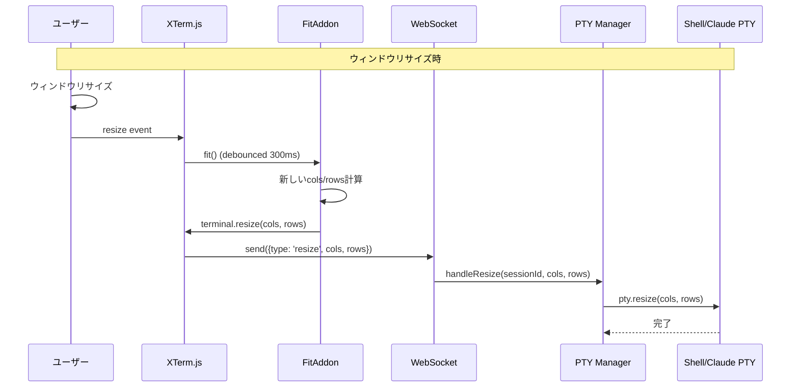
```mermaid
sequenceDiagram
    participant U as ユーザー
    participant XT as XTerm.js
    participant FA as FitAddon
    participant WS as WebSocket
    participant PTY as PTY Manager
    participant Shell as Shell/Claude PTY

    Note over U,Shell: ウィンドウリサイズ時

    U->>U: ウィンドウリサイズ
    U->>XT: resize event
    XT->>FA: fit() (debounced 300ms)
    FA->>FA: 新しいcols/rows計算
    FA->>XT: terminal.resize(cols, rows)
    XT->>WS: send({type: 'resize', cols, rows})
    WS->>PTY: handleResize(sessionId, cols, rows)
    PTY->>Shell: pty.resize(cols, rows)
    Shell-->>PTY: 完了
```

### シーケンス図: ワンクリックセッション作成

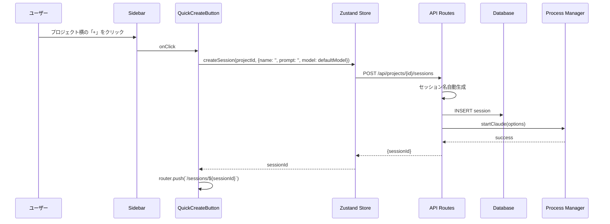
```mermaid
sequenceDiagram
    participant U as ユーザー
    participant SB as Sidebar
    participant QC as QuickCreateButton
    participant Store as Zustand Store
    participant API as API Routes
    participant DB as Database
    participant PM as Process Manager

    U->>SB: プロジェクト横の「+」をクリック
    SB->>QC: onClick
    QC->>Store: createSession(projectId, {name: '', prompt: '', model: defaultModel})
    Store->>API: POST /api/projects/{id}/sessions
    API->>API: セッション名自動生成
    API->>DB: INSERT session
    API->>PM: startClaude(options)
    PM-->>API: success
    API-->>Store: {sessionId}
    Store-->>QC: sessionId
    QC->>QC: router.push(`/sessions/${sessionId}`)
```

### シーケンス図: アクション要求検出と通知

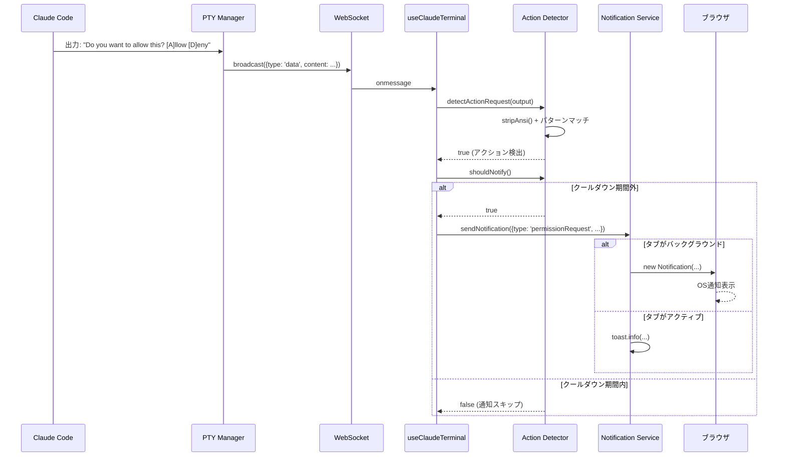
```mermaid
sequenceDiagram
    participant CC as Claude Code
    participant PTY as PTY Manager
    participant WS as WebSocket
    participant Hook as useClaudeTerminal
    participant AD as Action Detector
    participant NS as Notification Service
    participant Browser as ブラウザ

    CC->>PTY: 出力: "Do you want to allow this? [A]llow [D]eny"
    PTY->>WS: broadcast({type: 'data', content: ...})
    WS->>Hook: onmessage
    Hook->>AD: detectActionRequest(output)
    AD->>AD: stripAnsi() + パターンマッチ
    AD-->>Hook: true (アクション検出)
    Hook->>AD: shouldNotify()

    alt クールダウン期間外
        AD-->>Hook: true
        Hook->>NS: sendNotification({type: 'permissionRequest', ...})

        alt タブがバックグラウンド
            NS->>Browser: new Notification(...)
            Browser-->>Browser: OS通知表示
        else タブがアクティブ
            NS->>NS: toast.info(...)
        end
    else クールダウン期間内
        AD-->>Hook: false (通知スキップ)
    end
```

---

## 要件との整合性チェック

| 要件ID | 要件内容 | 設計対応 |
|--------|----------|----------|
| REQ-114 | コンテナサイズに合わせたターミナルサイズ計算 | FitAddon + ResizeObserver |
| REQ-115 | ウィンドウリサイズ時の300ms以内再計算 | debounce(300ms) + fit() |
| REQ-116 | タブ切り替え時のリサイズ | isVisible prop + useEffect |
| REQ-117 | WebSocketでリサイズイベント送信 | ResizeMessage + pty.resize() |
| REQ-118 | Claude/Shell両方に同じリサイズ動作 | 共通フック実装 |
| REQ-119 | --resumeオプションでの復帰 | ClaudePTYManager.startClaude() |
| REQ-120 | 初回は新規セッション起動 | resumeSessionId未設定時 |
| REQ-121 | resume_session_idの更新 | extractAndSaveSessionId() |
| REQ-122 | Claude CLI出力からID抽出 | 正規表現パース |
| REQ-123 | プロジェクト配下のTree表示 | ProjectTreeItem + SessionTreeItem |
| REQ-124 | 展開/折りたたみ切り替え | expandedProjects state |
| REQ-125 | セッションクリックで遷移 | router.push() |
| REQ-126 | 現在セッションのハイライト | isActive prop |
| REQ-127 | セッション名+ステータスアイコン | SessionStatusIcon |
| REQ-128 | プロジェクトページの既存グリッド維持 | 変更なし |
| REQ-129 | プロジェクト横の「+」ボタン | QuickCreateButton |
| REQ-130 | 自動生成セッション名 | 既存ロジック維持 |
| REQ-131 | グローバルデフォルトモデル使用 | useSettingsStore |
| REQ-132 | プロンプト空で作成 | prompt: '' |
| REQ-133 | セッション名編集機能 | SessionNameEditor |
| REQ-134 | グローバルデフォルトモデル設定 | useSettingsStore |
| REQ-135 | セッション作成時のモデル選択UI | ModelSelector (compact) |
| REQ-136 | 既存フォーム維持 | 変更なし |
| REQ-137 | パターン検出で通知送信 | action-detector.ts |
| REQ-138 | Allow/Deny等のパターン検出 | ACTION_PATTERNS配列 |
| REQ-139 | ANSIエスケープ除去後に検出 | stripAnsi() |
| REQ-140 | 5秒以内の重複通知抑制 | NOTIFICATION_COOLDOWN |
| REQ-141 | 設定オフ時は通知しない | isEventEnabled()チェック |

---

## エラー処理

### 環境検証（サーバー起動時）

- **claudeコマンド未検出**:
  - エラーメッセージ: `Error: claude command not found in PATH. Please install Claude Code CLI or set CLAUDE_CODE_PATH environment variable.`
  - サーバー起動を停止（process.exit(1)）
  - ログレベル: error

- **CLAUDE_CODE_PATH無効**:
  - エラーメッセージ: `Error: CLAUDE_CODE_PATH is set but the path does not exist: ${path}`
  - サーバー起動を停止（process.exit(1)）
  - ログレベル: error

- **Windows環境**:
  - エラーメッセージ: `Error: Windows is not supported. Please use macOS or Linux.`
  - サーバー起動を停止（process.exit(1)）
  - ログレベル: error

### Claude Codeプロセス

- 異常終了時はステータスを「error」に更新
- 終了コードとstderrをエラーメッセージとして保存
- 自動再起動は行わない（ユーザーの明示的な操作を要求）

### プロセスライフサイクル

- **アイドルタイムアウト時**:
  - セッションステータスを「stopped」に更新
  - 接続中のWebSocketクライアントに`process_paused`メッセージを送信
  - resume_session_idを保存（--resumeで復元可能にする）
  - ログレベル: info（`Session ${sessionId} stopped due to idle timeout`）

- **セッション再開失敗時**:
  - Claude Codeの`--resume`が失敗した場合、新規セッションとして開始
  - エラーをログに記録（ログレベル: warn）
  - クライアントに`resumed_with_history: false`を返却

- **サーバーシャットダウン時**:
  - 全アクティブプロセスにSIGTERMを送信
  - 5秒のグレース期間後、残存プロセスにSIGKILLを送信
  - シャットダウン完了をログに記録
  - 全WebSocket接続に`server_shutdown`メッセージを送信

### Git操作

- rebase失敗時はコンフリクトファイルを通知
- merge失敗時はロールバック
- worktree作成失敗時は詳細なエラーメッセージを返却

### WebSocket

- 接続切断時は自動再接続（最大5回、指数バックオフ）
- 再接続後は最新状態を自動同期
- 永続的な接続失敗時はREST APIにフォールバック

### 一般的なエラー

- すべてのAPIエラーは統一フォーマットで返却
- エラーログはJSON形式で出力
- クリティカルエラーは別ファイルにも記録

---

## ストーリー23〜27: UI/UX改善機能の設計

### 概要

以下の5つの機能追加に対する技術設計を定義します：
- ストーリー23: セッション一覧ページの廃止とTree表示への統一 (REQ-142〜145)
- ストーリー24: Tree表示のデフォルト展開 (REQ-146〜149)
- ストーリー25: セッション詳細ページからのセッション削除 (REQ-150〜155)
- ストーリー26: アクション要求時ブラウザ通知の修正 (REQ-156〜160)
- ストーリー27: セッション画面からのPR作成とリンク (REQ-161〜170)

---

### ストーリー23: セッション一覧ページの廃止とTree表示への統一

#### 変更対象ファイル

1. **削除**: `src/app/sessions/page.tsx`
2. **変更**: `src/components/layout/Navigation.tsx` - Sessionsリンク削除
3. **新規**: `src/app/sessions/route.ts` - リダイレクト処理

#### 実装詳細

**リダイレクト処理**: `src/app/sessions/page.tsx`

```typescript
import { redirect } from 'next/navigation';

export default function SessionsPage() {
  redirect('/');
}
```

**Navigation変更**: `src/components/layout/Navigation.tsx`

```typescript
// 削除するリンク
// { href: '/sessions', label: 'Sessions', icon: Terminal }

// 変更後のナビゲーション項目
const navItems = [
  { href: '/', label: 'Projects', icon: FolderGit2 },
  { href: '/settings', label: 'Settings', icon: Settings },
];
```

**Sidebar変更**: `src/components/layout/Sidebar.tsx`

既存のTree表示実装を維持。REQ-144に対応し、プロジェクト配下のセッションを常に表示。

---

### ストーリー24: Tree表示のデフォルト展開

#### 変更対象ファイル

1. **変更**: `src/components/layout/Sidebar.tsx`
2. **新規**: `src/store/ui.ts` - UI状態管理ストア

#### 実装詳細

**UIストア**: `src/store/ui.ts`

```typescript
import { create } from 'zustand';
import { persist } from 'zustand/middleware';

interface UIState {
  // プロジェクトの展開状態（true = 展開、false = 折りたたみ）
  expandedProjects: Record<string, boolean>;

  // アクション
  toggleProject: (projectId: string) => void;
  setProjectExpanded: (projectId: string, expanded: boolean) => void;
  isProjectExpanded: (projectId: string) => boolean;
}

export const useUIStore = create<UIState>()(
  persist(
    (set, get) => ({
      expandedProjects: {},

      toggleProject: (projectId) => {
        set((state) => ({
          expandedProjects: {
            ...state.expandedProjects,
            [projectId]: !(state.expandedProjects[projectId] ?? true), // デフォルトは展開
          },
        }));
      },

      setProjectExpanded: (projectId, expanded) => {
        set((state) => ({
          expandedProjects: {
            ...state.expandedProjects,
            [projectId]: expanded,
          },
        }));
      },

      // デフォルトは展開（true）
      isProjectExpanded: (projectId) => {
        const state = get();
        return state.expandedProjects[projectId] ?? true;
      },
    }),
    {
      name: 'claudework:ui-state',
    }
  )
);
```

**Sidebar変更**: `src/components/layout/Sidebar.tsx`

```typescript
import { useUIStore } from '@/store/ui';

export function Sidebar() {
  const { isProjectExpanded, toggleProject } = useUIStore();

  return (
    <aside>
      {projects.map((project) => (
        <ProjectTreeItem
          key={project.id}
          project={project}
          sessions={sessionsByProject[project.id] || []}
          isExpanded={isProjectExpanded(project.id)} // デフォルトtrue
          onToggle={() => toggleProject(project.id)}
          currentSessionId={currentSessionId}
        />
      ))}
    </aside>
  );
}
```

---

### ストーリー25: セッション詳細ページからのセッション削除

#### 変更対象ファイル

1. **変更**: `src/app/sessions/[id]/page.tsx` - 削除ボタン追加
2. **新規**: `src/components/sessions/DeleteSessionButton.tsx`
3. **新規**: `src/components/sessions/DeleteSessionDialog.tsx`

#### 実装詳細

**DeleteSessionButton**: `src/components/sessions/DeleteSessionButton.tsx`

```typescript
interface DeleteSessionButtonProps {
  sessionId: string;
  sessionName: string;
  worktreePath: string;
  projectId: string;
}

export function DeleteSessionButton({
  sessionId,
  sessionName,
  worktreePath,
  projectId,
}: DeleteSessionButtonProps) {
  const [isDialogOpen, setIsDialogOpen] = useState(false);

  return (
    <>
      <button
        onClick={() => setIsDialogOpen(true)}
        className="flex items-center gap-2 px-3 py-2 text-red-600 hover:bg-red-50 dark:hover:bg-red-900/20 rounded"
      >
        <Trash2 className="w-4 h-4" />
        セッション削除
      </button>

      <DeleteSessionDialog
        isOpen={isDialogOpen}
        onClose={() => setIsDialogOpen(false)}
        sessionId={sessionId}
        sessionName={sessionName}
        worktreePath={worktreePath}
        projectId={projectId}
      />
    </>
  );
}
```

**DeleteSessionDialog**: `src/components/sessions/DeleteSessionDialog.tsx`

```typescript
import { Dialog } from '@headlessui/react';
import { useRouter } from 'next/navigation';
import { toast } from 'react-hot-toast';

interface DeleteSessionDialogProps {
  isOpen: boolean;
  onClose: () => void;
  sessionId: string;
  sessionName: string;
  worktreePath: string;
  projectId: string;
}

export function DeleteSessionDialog({
  isOpen,
  onClose,
  sessionId,
  sessionName,
  worktreePath,
  projectId,
}: DeleteSessionDialogProps) {
  const router = useRouter();
  const [isDeleting, setIsDeleting] = useState(false);

  const handleDelete = async () => {
    setIsDeleting(true);
    try {
      const response = await fetch(`/api/sessions/${sessionId}`, {
        method: 'DELETE',
      });

      if (!response.ok) {
        const error = await response.json();
        throw new Error(error.message || 'Failed to delete session');
      }

      toast.success('セッションを削除しました');
      router.push(`/projects/${projectId}`);
    } catch (error) {
      toast.error(error instanceof Error ? error.message : '削除に失敗しました');
    } finally {
      setIsDeleting(false);
      onClose();
    }
  };

  return (
    <Dialog open={isOpen} onClose={onClose} className="relative z-50">
      <div className="fixed inset-0 bg-black/30" aria-hidden="true" />
      <div className="fixed inset-0 flex items-center justify-center p-4">
        <Dialog.Panel className="w-full max-w-md rounded-lg bg-white dark:bg-gray-800 p-6 shadow-xl">
          <Dialog.Title className="text-lg font-bold text-red-600">
            セッションを削除しますか？
          </Dialog.Title>

          <div className="mt-4 space-y-2 text-sm">
            <p><strong>セッション名:</strong> {sessionName}</p>
            <p><strong>Worktreeパス:</strong> {worktreePath}</p>
            <p className="text-red-500">
              この操作は取り消せません。Worktreeも削除されます。
            </p>
          </div>

          <div className="mt-6 flex justify-end gap-3">
            <button
              onClick={onClose}
              className="px-4 py-2 text-gray-600 hover:bg-gray-100 dark:hover:bg-gray-700 rounded"
              disabled={isDeleting}
            >
              キャンセル
            </button>
            <button
              onClick={handleDelete}
              disabled={isDeleting}
              className="px-4 py-2 bg-red-600 text-white hover:bg-red-700 rounded disabled:opacity-50"
            >
              {isDeleting ? '削除中...' : '削除'}
            </button>
          </div>
        </Dialog.Panel>
      </div>
    </Dialog>
  );
}
```

**セッションページ変更**: `src/app/sessions/[id]/page.tsx`

ヘッダー部分に`DeleteSessionButton`を追加

---

### ストーリー26: アクション要求時ブラウザ通知の修正

#### 変更対象ファイル

1. **変更**: `src/lib/action-detector.ts` - パターン改善
2. **変更**: `src/hooks/useClaudeTerminal.ts` - 通知トリガー修正

#### 実装詳細

**action-detector.ts の改善**:

```typescript
// ANSIエスケープシーケンス除去（より完全なパターン）
export function stripAnsi(str: string): string {
  // CSI sequences, OSC sequences, その他のコントロールシーケンスを除去
  return str
    .replace(/\x1B\[[0-9;]*[A-Za-z]/g, '')  // CSI
    .replace(/\x1B\][^\x07]*\x07/g, '')      // OSC
    .replace(/\x1B[PX^_][^\x1B]*\x1B\\/g, '') // DCS, SOS, PM, APC
    .replace(/\x1B[\x40-\x5F]/g, '');         // C1 control codes
}

// ユーザーアクション要求パターン（Claude CLI実際の出力に対応）
const ACTION_PATTERNS = [
  // Allow/Deny選択（Claude CLIの実際のパターン）
  /Allow|Deny/,
  /\[Y\]es.*\[N\]o/i,
  /Yes.*to confirm/i,
  /Press Enter to continue/i,
  // ツール実行確認
  /Do you want to/i,
  /Would you like to/i,
  /Shall I/i,
  // 入力待ちプロンプト
  /\?[\s]*$/,
  /Enter your/i,
  /Type your/i,
  // Claude特有のパターン
  /waiting for.*input/i,
  /requires.*confirmation/i,
];

// 通知クールダウンをクロージャで実装
export function createCooldownChecker(cooldownMs: number = 5000): () => boolean {
  let lastTime = 0;
  return () => {
    const now = Date.now();
    if (now - lastTime >= cooldownMs) {
      lastTime = now;
      return true;
    }
    return false;
  };
}

export function detectActionRequest(output: string): boolean {
  const cleanOutput = stripAnsi(output);

  // 短すぎる出力は無視
  if (cleanOutput.trim().length < 5) {
    return false;
  }

  for (const pattern of ACTION_PATTERNS) {
    if (pattern.test(cleanOutput)) {
      return true;
    }
  }
  return false;
}
```

**useClaudeTerminal.ts の変更**:

```typescript
// クールダウンチェッカーを初期化時に一度だけ作成
const notificationCooldownRef = useRef<(() => boolean) | null>(null);
if (!notificationCooldownRef.current) {
  notificationCooldownRef.current = createCooldownChecker(5000);
}

// WebSocketメッセージ受信時
ws.onmessage = (event) => {
  const message = JSON.parse(event.data);

  if (message.type === 'data') {
    terminal?.write(message.content);

    // アクション要求パターン検出
    if (
      detectActionRequest(message.content) &&
      notificationCooldownRef.current &&
      notificationCooldownRef.current()
    ) {
      sendNotification({
        type: 'actionRequired',
        sessionId,
        sessionName,
        message: 'Claudeがアクションを求めています',
      });
    }
  }
};
```

---

### ストーリー27: セッション画面からのPR作成とリンク

#### 新規ファイル

1. **新規API**: `src/app/api/sessions/[id]/pr/route.ts`
2. **新規コンポーネント**: `src/components/sessions/PRSection.tsx`
3. **新規コンポーネント**: `src/components/sessions/CreatePRDialog.tsx`

#### データベース変更

**Prisma schema追加**:

```prisma
model Session {
  // 既存フィールド
  // ...

  // PR関連フィールド追加
  pr_url        String?   // GitHub PR URL
  pr_number     Int?      // PR番号
  pr_status     String?   // open, merged, closed
  pr_updated_at DateTime? // PRステータス最終確認日時
}
```

#### API設計

**POST /api/sessions/[id]/pr** - PR作成

リクエスト:
```json
{
  "title": "feat: Add new feature",
  "body": "## Description\n..."
}
```

レスポンス (201):
```json
{
  "pr": {
    "url": "https://github.com/owner/repo/pull/123",
    "number": 123,
    "status": "open"
  }
}
```

**GET /api/sessions/[id]/pr** - PRステータス取得

レスポンス (200):
```json
{
  "pr": {
    "url": "https://github.com/owner/repo/pull/123",
    "number": 123,
    "status": "merged",
    "title": "feat: Add new feature"
  }
}
```

#### 実装詳細

**PR APIエンドポイント**: `src/app/api/sessions/[id]/pr/route.ts`

```typescript
import { exec } from 'child_process';
import { promisify } from 'util';

const execAsync = promisify(exec);

export async function POST(
  request: Request,
  { params }: { params: { id: string } }
) {
  const session = await prisma.session.findUnique({
    where: { id: params.id },
    include: { project: true },
  });

  if (!session) {
    return NextResponse.json({ error: 'Session not found' }, { status: 404 });
  }

  const { title, body } = await request.json();

  try {
    // gh CLI でPR作成
    const { stdout } = await execAsync(
      `gh pr create --title "${title.replace(/"/g, '\\"')}" --body "${body.replace(/"/g, '\\"')}" --head "${session.branch_name}"`,
      { cwd: session.worktree_path, timeout: 30000 }
    );

    // PRのURLを抽出
    const prUrlMatch = stdout.match(/https:\/\/github\.com\/[^\s]+\/pull\/\d+/);
    const prNumberMatch = stdout.match(/pull\/(\d+)/);

    if (!prUrlMatch) {
      throw new Error('Failed to parse PR URL from gh output');
    }

    const prUrl = prUrlMatch[0];
    const prNumber = prNumberMatch ? parseInt(prNumberMatch[1], 10) : null;

    // セッションにPR情報を保存
    await prisma.session.update({
      where: { id: params.id },
      data: {
        pr_url: prUrl,
        pr_number: prNumber,
        pr_status: 'open',
        pr_updated_at: new Date(),
      },
    });

    return NextResponse.json({
      pr: { url: prUrl, number: prNumber, status: 'open' },
    }, { status: 201 });
  } catch (error) {
    // gh CLIが利用できない場合のエラーハンドリング
    if (error instanceof Error && error.message.includes('gh: command not found')) {
      return NextResponse.json(
        { error: 'GitHub CLI (gh) is not installed or not in PATH' },
        { status: 503 }
      );
    }
    throw error;
  }
}

export async function GET(
  request: Request,
  { params }: { params: { id: string } }
) {
  const session = await prisma.session.findUnique({
    where: { id: params.id },
  });

  if (!session) {
    return NextResponse.json({ error: 'Session not found' }, { status: 404 });
  }

  if (!session.pr_url) {
    return NextResponse.json({ pr: null });
  }

  // PRステータスを更新（キャッシュが古い場合）
  const cacheAge = session.pr_updated_at
    ? Date.now() - session.pr_updated_at.getTime()
    : Infinity;

  if (cacheAge > 60000) { // 1分以上経過していたら更新
    try {
      const { stdout } = await execAsync(
        `gh pr view ${session.pr_number} --json state`,
        { cwd: session.worktree_path, timeout: 10000 }
      );
      const { state } = JSON.parse(stdout);
      const prStatus = state.toLowerCase(); // OPEN, MERGED, CLOSED

      await prisma.session.update({
        where: { id: params.id },
        data: {
          pr_status: prStatus,
          pr_updated_at: new Date(),
        },
      });

      return NextResponse.json({
        pr: {
          url: session.pr_url,
          number: session.pr_number,
          status: prStatus,
        },
      });
    } catch {
      // ステータス取得に失敗した場合はキャッシュを返す
    }
  }

  return NextResponse.json({
    pr: {
      url: session.pr_url,
      number: session.pr_number,
      status: session.pr_status,
    },
  });
}
```

**PRSection コンポーネント**: `src/components/sessions/PRSection.tsx`

```typescript
interface PRSectionProps {
  sessionId: string;
  branchName: string;
}

export function PRSection({ sessionId, branchName }: PRSectionProps) {
  const [pr, setPR] = useState<PR | null>(null);
  const [isCreateDialogOpen, setIsCreateDialogOpen] = useState(false);
  const [isLoading, setIsLoading] = useState(true);
  const [ghAvailable, setGhAvailable] = useState(true);

  useEffect(() => {
    fetchPRStatus();
  }, [sessionId]);

  const fetchPRStatus = async () => {
    try {
      const response = await fetch(`/api/sessions/${sessionId}/pr`);
      const data = await response.json();
      setPR(data.pr);
    } catch {
      setGhAvailable(false);
    } finally {
      setIsLoading(false);
    }
  };

  if (isLoading) {
    return <Skeleton className="h-10" />;
  }

  return (
    <div className="flex items-center gap-4 p-4 bg-gray-50 dark:bg-gray-800 rounded-lg">
      {pr ? (
        // PR存在時: リンクとステータス表示
        <>
          <a
            href={pr.url}
            target="_blank"
            rel="noopener noreferrer"
            className="flex items-center gap-2 text-blue-600 hover:underline"
          >
            <GitPullRequest className="w-4 h-4" />
            PR #{pr.number}
            <ExternalLink className="w-3 h-3" />
          </a>
          <PRStatusBadge status={pr.status} />
        </>
      ) : (
        // PR未作成時: 作成ボタン
        <button
          onClick={() => setIsCreateDialogOpen(true)}
          disabled={!ghAvailable}
          className="flex items-center gap-2 px-4 py-2 bg-green-600 text-white rounded hover:bg-green-700 disabled:opacity-50"
          title={ghAvailable ? 'PRを作成' : 'gh CLIが利用できません'}
        >
          <GitPullRequest className="w-4 h-4" />
          PRを作成
        </button>
      )}

      <CreatePRDialog
        isOpen={isCreateDialogOpen}
        onClose={() => setIsCreateDialogOpen(false)}
        sessionId={sessionId}
        branchName={branchName}
        onSuccess={(newPR) => {
          setPR(newPR);
          setIsCreateDialogOpen(false);
        }}
      />
    </div>
  );
}

function PRStatusBadge({ status }: { status: string }) {
  const styles = {
    open: 'bg-green-100 text-green-800',
    merged: 'bg-purple-100 text-purple-800',
    closed: 'bg-red-100 text-red-800',
  };

  return (
    <span className={`px-2 py-1 text-xs font-medium rounded ${styles[status] || ''}`}>
      {status.toUpperCase()}
    </span>
  );
}
```

**CreatePRDialog コンポーネント**: `src/components/sessions/CreatePRDialog.tsx`

```typescript
interface CreatePRDialogProps {
  isOpen: boolean;
  onClose: () => void;
  sessionId: string;
  branchName: string;
  onSuccess: (pr: PR) => void;
}

export function CreatePRDialog({
  isOpen,
  onClose,
  sessionId,
  branchName,
  onSuccess,
}: CreatePRDialogProps) {
  const [title, setTitle] = useState('');
  const [body, setBody] = useState('');
  const [isCreating, setIsCreating] = useState(false);

  const handleCreate = async () => {
    if (!title.trim()) {
      toast.error('タイトルを入力してください');
      return;
    }

    setIsCreating(true);
    try {
      const response = await fetch(`/api/sessions/${sessionId}/pr`, {
        method: 'POST',
        headers: { 'Content-Type': 'application/json' },
        body: JSON.stringify({ title, body }),
      });

      if (!response.ok) {
        const error = await response.json();
        throw new Error(error.error || 'Failed to create PR');
      }

      const data = await response.json();
      toast.success('PRを作成しました');
      onSuccess(data.pr);
    } catch (error) {
      toast.error(error instanceof Error ? error.message : 'PR作成に失敗しました');
    } finally {
      setIsCreating(false);
    }
  };

  return (
    <Dialog open={isOpen} onClose={onClose} className="relative z-50">
      <div className="fixed inset-0 bg-black/30" aria-hidden="true" />
      <div className="fixed inset-0 flex items-center justify-center p-4">
        <Dialog.Panel className="w-full max-w-lg rounded-lg bg-white dark:bg-gray-800 p-6 shadow-xl">
          <Dialog.Title className="text-lg font-bold">
            Pull Request を作成
          </Dialog.Title>

          <div className="mt-4 space-y-4">
            <div>
              <label className="block text-sm font-medium mb-1">
                ソースブランチ
              </label>
              <input
                type="text"
                value={branchName}
                disabled
                className="w-full px-3 py-2 bg-gray-100 dark:bg-gray-700 rounded"
              />
            </div>

            <div>
              <label className="block text-sm font-medium mb-1">
                タイトル <span className="text-red-500">*</span>
              </label>
              <input
                type="text"
                value={title}
                onChange={(e) => setTitle(e.target.value)}
                placeholder="feat: Add new feature"
                className="w-full px-3 py-2 border rounded dark:bg-gray-700"
              />
            </div>

            <div>
              <label className="block text-sm font-medium mb-1">
                説明
              </label>
              <textarea
                value={body}
                onChange={(e) => setBody(e.target.value)}
                rows={6}
                placeholder="## 概要&#10;&#10;## 変更内容&#10;&#10;## テスト方法"
                className="w-full px-3 py-2 border rounded dark:bg-gray-700"
              />
            </div>
          </div>

          <div className="mt-6 flex justify-end gap-3">
            <button
              onClick={onClose}
              className="px-4 py-2 text-gray-600 hover:bg-gray-100 dark:hover:bg-gray-700 rounded"
              disabled={isCreating}
            >
              キャンセル
            </button>
            <button
              onClick={handleCreate}
              disabled={isCreating || !title.trim()}
              className="px-4 py-2 bg-green-600 text-white hover:bg-green-700 rounded disabled:opacity-50"
            >
              {isCreating ? (
                <>
                  <Loader2 className="inline w-4 h-4 mr-2 animate-spin" />
                  作成中...
                </>
              ) : (
                'PRを作成'
              )}
            </button>
          </div>
        </Dialog.Panel>
      </div>
    </Dialog>
  );
}
```

---

### シーケンス図: セッション削除フロー

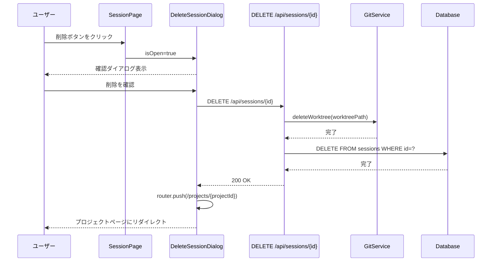
```mermaid
sequenceDiagram
    participant U as ユーザー
    participant SP as SessionPage
    participant Dialog as DeleteSessionDialog
    participant API as DELETE /api/sessions/{id}
    participant Git as GitService
    participant DB as Database

    U->>SP: 削除ボタンをクリック
    SP->>Dialog: isOpen=true
    Dialog-->>U: 確認ダイアログ表示

    U->>Dialog: 削除を確認
    Dialog->>API: DELETE /api/sessions/{id}
    API->>Git: deleteWorktree(worktreePath)
    Git-->>API: 完了
    API->>DB: DELETE FROM sessions WHERE id=?
    DB-->>API: 完了
    API-->>Dialog: 200 OK
    Dialog->>Dialog: router.push(/projects/{projectId})
    Dialog-->>U: プロジェクトページにリダイレクト
```

### シーケンス図: PR作成フロー

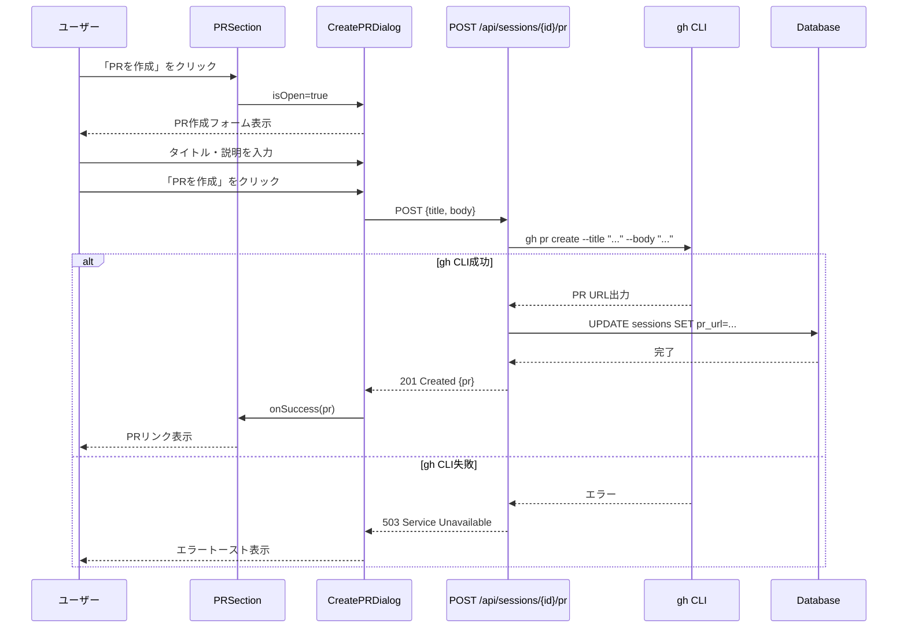
```mermaid
sequenceDiagram
    participant U as ユーザー
    participant PRS as PRSection
    participant Dialog as CreatePRDialog
    participant API as POST /api/sessions/{id}/pr
    participant GH as gh CLI
    participant DB as Database

    U->>PRS: 「PRを作成」をクリック
    PRS->>Dialog: isOpen=true
    Dialog-->>U: PR作成フォーム表示

    U->>Dialog: タイトル・説明を入力
    U->>Dialog: 「PRを作成」をクリック
    Dialog->>API: POST {title, body}
    API->>GH: gh pr create --title "..." --body "..."

    alt gh CLI成功
        GH-->>API: PR URL出力
        API->>DB: UPDATE sessions SET pr_url=...
        DB-->>API: 完了
        API-->>Dialog: 201 Created {pr}
        Dialog->>PRS: onSuccess(pr)
        PRS-->>U: PRリンク表示
    else gh CLI失敗
        GH-->>API: エラー
        API-->>Dialog: 503 Service Unavailable
        Dialog-->>U: エラートースト表示
    end
```

---

### 要件との整合性チェック（ストーリー23〜27）

| 要件ID | 要件内容 | 設計対応 |
|--------|----------|----------|
| REQ-142 | /sessions/アクセス時リダイレクト | redirect('/') in sessions/page.tsx |
| REQ-143 | Sessionsリンク削除 | navItems配列から削除 |
| REQ-144 | Tree表示でセッション常時表示 | 既存Sidebar実装維持 |
| REQ-145 | セッションクリックで詳細ページ遷移 | router.push() |
| REQ-146 | デフォルトで全プロジェクト展開 | isProjectExpanded() デフォルトtrue |
| REQ-147 | 折りたたみ状態をローカルストレージ保存 | zustand persist |
| REQ-148 | 展開状態の復元 | persist middleware |
| REQ-149 | 新規プロジェクトは展開状態で表示 | デフォルトtrue |
| REQ-150 | 削除ボタン表示 | DeleteSessionButton |
| REQ-151 | 確認ダイアログ表示 | DeleteSessionDialog |
| REQ-152 | セッション名とパス表示 | Dialog内のpタグ |
| REQ-153 | セッションとworktree削除 | DELETE API |
| REQ-154 | 削除後プロジェクトページへ | router.push() |
| REQ-155 | エラー時トースト表示 | toast.error() |
| REQ-156 | ユーザー入力待機時に通知 | detectActionRequest() |
| REQ-157 | Yes/Noパターン検出 | ACTION_PATTERNS |
| REQ-158 | ANSIエスケープ除去 | stripAnsi()改善 |
| REQ-159 | バックグラウンド時のみOS通知 | sendNotification()内部 |
| REQ-160 | 5秒クールダウン | createCooldownChecker() |
| REQ-161 | PR作成ボタン表示 | PRSection |
| REQ-162 | PR作成フォーム表示 | CreatePRDialog |
| REQ-163 | タイトル・説明入力フィールド | input, textarea |
| REQ-164 | ブランチ名自動設定 | branchName prop |
| REQ-165 | gh pr create実行 | execAsync() |
| REQ-166 | PRのURL保存 | prisma.session.update() |
| REQ-167 | PRリンク表示 | PRSection内のaタグ |
| REQ-168 | 新規タブでPRページ | target="_blank" |
| REQ-169 | PRステータス表示 | PRStatusBadge |
| REQ-170 | gh CLI未インストール時ボタン無効化 | disabled={!ghAvailable} |

---

## ストーリー28: 認証機能の削除

### 概要

シングルユーザー向けアプリケーションとして、認証機能を完全に削除する。これにより、コードベースの簡略化と利便性の向上を実現する。

### 変更概要図

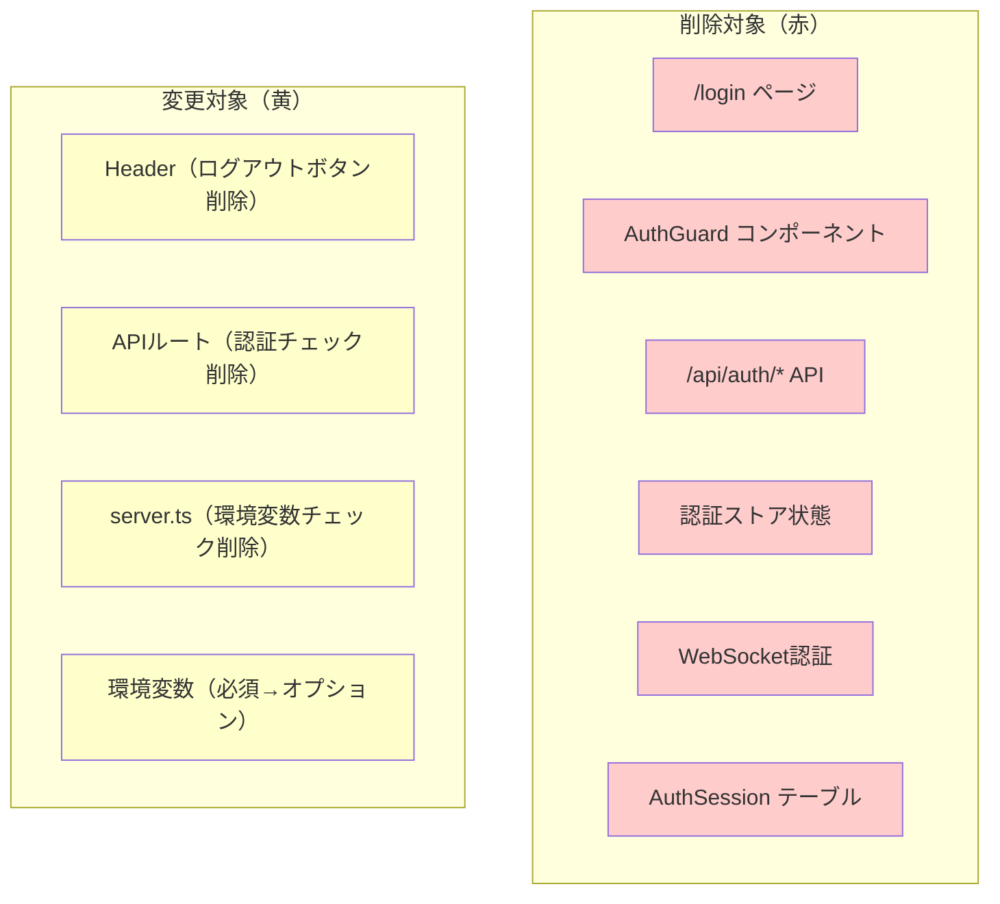
```mermaid
graph TD
    subgraph "削除対象（赤）"
        style LoginPage fill:#ffcccc
        style AuthGuard fill:#ffcccc
        style AuthAPI fill:#ffcccc
        style AuthStore fill:#ffcccc
        style WSAuth fill:#ffcccc
        style AuthSession fill:#ffcccc

        LoginPage["/login ページ"]
        AuthGuard["AuthGuard コンポーネント"]
        AuthAPI["/api/auth/* API"]
        AuthStore["認証ストア状態"]
        WSAuth["WebSocket認証"]
        AuthSession["AuthSession テーブル"]
    end

    subgraph "変更対象（黄）"
        style Header fill:#ffffcc
        style APIRoutes fill:#ffffcc
        style ServerTS fill:#ffffcc
        style EnvVars fill:#ffffcc

        Header["Header（ログアウトボタン削除）"]
        APIRoutes["APIルート（認証チェック削除）"]
        ServerTS["server.ts（環境変数チェック削除）"]
        EnvVars["環境変数（必須→オプション）"]
    end
```

### 削除対象ファイル一覧

| ファイルパス | 種別 | 説明 |
|-------------|------|------|
| `src/app/login/page.tsx` | 削除 | ログインページ |
| `src/app/api/auth/login/route.ts` | 削除 | ログインAPI |
| `src/app/api/auth/logout/route.ts` | 削除 | ログアウトAPI |
| `src/app/api/auth/check/route.ts` | 削除 | 認証チェックAPI |
| `src/components/AuthGuard.tsx` | 削除 | 認証ガードコンポーネント |
| `src/lib/auth.ts` | 削除 | 認証ユーティリティ |
| `src/lib/websocket/auth-middleware.ts` | 削除 | WebSocket認証ミドルウェア |

### 変更対象ファイル一覧

| ファイルパス | 変更内容 |
|-------------|----------|
| `src/store/index.ts` | 認証関連状態・アクションを削除 |
| `src/components/layout/Header.tsx` | ログアウトボタンを削除 |
| `src/app/page.tsx` | AuthGuardラッパーを削除 |
| `src/app/sessions/[id]/page.tsx` | AuthGuardラッパーを削除 |
| `src/app/projects/[id]/page.tsx` | AuthGuardラッパーを削除 |
| `src/app/projects/[id]/settings/page.tsx` | AuthGuardラッパーを削除 |
| `src/app/api/*/route.ts` | 認証チェック処理を削除（約20ファイル） |
| `server.ts` | 環境変数必須チェックを削除、WebSocket認証を削除 |
| `prisma/schema.prisma` | AuthSessionモデルを削除 |
| `.env.example` | CLAUDE_WORK_TOKEN, SESSION_SECRETをオプションに変更 |
| `src/middleware.ts` | 認証リダイレクトロジックを削除 |

### コンポーネント設計

#### 1. ストア変更（src/store/index.ts）

**削除する状態:**
```typescript
// 削除
isAuthenticated: boolean;
token: string | null;
sessionId: string | null;
expiresAt: string | null;
```

**削除するアクション:**
```typescript
// 削除
login: (token: string) => Promise<void>;
logout: () => Promise<void>;
checkAuth: () => Promise<void>;
```

#### 2. Header変更（src/components/layout/Header.tsx）

**削除する要素:**
- ログアウトボタン
- 認証状態に基づく条件分岐

**変更後の構成:**
```tsx
export function Header() {
  return (
    <header>
      <Logo />
      <Navigation />
      <div className="flex items-center gap-4">
        <NotificationButton />
        <ThemeToggle />
        {/* ログアウトボタンを削除 */}
      </div>
    </header>
  );
}
```

#### 3. ページコンポーネント変更

**変更前:**
```tsx
export default function Page() {
  return (
    <AuthGuard>
      <MainLayout>
        <Content />
      </MainLayout>
    </AuthGuard>
  );
}
```

**変更後:**
```tsx
export default function Page() {
  return (
    <MainLayout>
      <Content />
    </MainLayout>
  );
}
```

#### 4. /loginページのリダイレクト

`src/app/login/page.tsx`を削除し、`src/middleware.ts`で/loginへのアクセスを/にリダイレクト:

```typescript
// src/middleware.ts
export function middleware(request: NextRequest) {
  // /loginへのアクセスは/にリダイレクト
  if (request.nextUrl.pathname === '/login') {
    return NextResponse.redirect(new URL('/', request.url));
  }
  return NextResponse.next();
}

export const config = {
  matcher: ['/login'],
};
```

### API設計

#### 認証チェック削除パターン

**変更前:**
```typescript
export async function GET(request: NextRequest) {
  const sessionId = request.cookies.get('sessionId')?.value;
  if (!sessionId) {
    return NextResponse.json({ error: 'Unauthorized' }, { status: 401 });
  }
  const session = await getSession(sessionId);
  if (!session) {
    return NextResponse.json({ error: 'Unauthorized' }, { status: 401 });
  }
  // ... 処理
}
```

**変更後:**
```typescript
export async function GET(request: NextRequest) {
  // 認証チェックなし、直接処理を実行
  // ... 処理
}
```

#### 影響を受けるAPIエンドポイント

| エンドポイント | 変更内容 |
|---------------|----------|
| `GET /api/projects` | 認証チェック削除 |
| `POST /api/projects` | 認証チェック削除 |
| `GET /api/projects/[id]` | 認証チェック削除 |
| `DELETE /api/projects/[id]` | 認証チェック削除 |
| `PUT /api/projects/[id]/settings` | 認証チェック削除 |
| `GET /api/projects/[id]/sessions` | 認証チェック削除 |
| `POST /api/projects/[id]/sessions` | 認証チェック削除 |
| `GET /api/sessions/[id]` | 認証チェック削除 |
| `DELETE /api/sessions/[id]` | 認証チェック削除 |
| `GET /api/sessions/[id]/diff` | 認証チェック削除 |
| `POST /api/sessions/[id]/rebase` | 認証チェック削除 |
| `POST /api/sessions/[id]/merge` | 認証チェック削除 |
| `POST /api/sessions/[id]/reset` | 認証チェック削除 |
| `GET /api/sessions/[id]/commits` | 認証チェック削除 |
| `GET /api/sessions/[id]/process` | 認証チェック削除 |
| `POST /api/sessions/[id]/process` | 認証チェック削除 |
| `POST /api/sessions/[id]/stop` | 認証チェック削除 |
| `POST /api/sessions/[id]/resume` | 認証チェック削除 |
| `POST /api/sessions/[id]/pr` | 認証チェック削除 |
| `GET /api/sessions/[id]/pr` | 認証チェック削除 |

### WebSocket設計

#### 認証ミドルウェア削除

**server.ts変更:**
```typescript
// 削除: import { authenticateWebSocket } from './src/lib/websocket/auth-middleware';

// 変更前
wss.on('connection', async (ws, request) => {
  const authResult = await authenticateWebSocket(request);
  if (!authResult.authenticated) {
    ws.close(4001, 'Unauthorized');
    return;
  }
  // ...
});

// 変更後
wss.on('connection', async (ws, request) => {
  // 認証なしで直接接続を許可
  // ...
});
```

### データベース設計

#### AuthSessionテーブル削除

**変更前 (prisma/schema.prisma):**
```prisma
model AuthSession {
  id         String   @id @default(uuid())
  token_hash String
  expires_at DateTime
  created_at DateTime @default(now())
}
```

**変更後:**
AuthSessionモデルを完全に削除。

**マイグレーション:**
```bash
# AuthSessionテーブルを削除
npx prisma db push
```

### 環境変数設計

#### 必須からオプションへ変更

**変更前 (.env.example):**
```bash
# 必須
CLAUDE_WORK_TOKEN=your-secure-token-here
SESSION_SECRET=your-session-secret-at-least-32-characters-long
```

**変更後 (.env.example):**
```bash
# オプション（認証機能削除により不要）
# CLAUDE_WORK_TOKEN=your-secure-token-here
# SESSION_SECRET=your-session-secret-at-least-32-characters-long
```

#### server.ts環境変数チェック削除

**変更前:**
```typescript
const requiredEnvVars = ['CLAUDE_WORK_TOKEN', 'SESSION_SECRET', 'DATABASE_URL'];
for (const envVar of requiredEnvVars) {
  if (!process.env[envVar]) {
    throw new Error(`${envVar} is required`);
  }
}
```

**変更後:**
```typescript
const requiredEnvVars = ['DATABASE_URL'];
for (const envVar of requiredEnvVars) {
  if (!process.env[envVar]) {
    throw new Error(`${envVar} is required`);
  }
}
```

### シーケンス図: 認証削除後のアクセスフロー

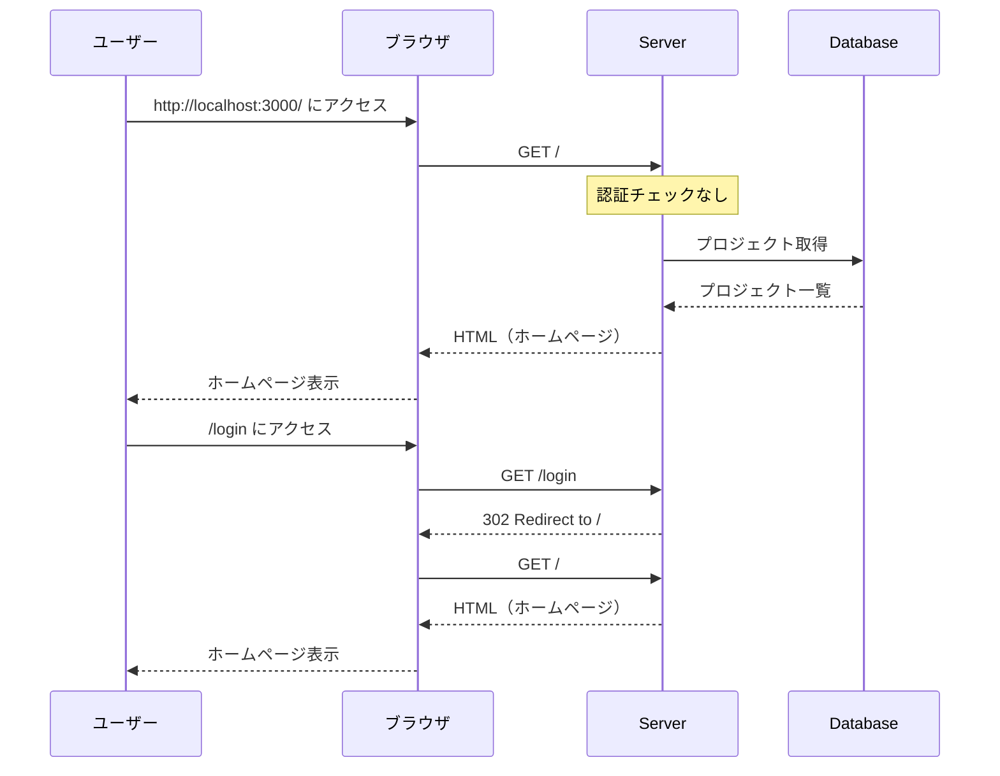
```mermaid
sequenceDiagram
    participant U as ユーザー
    participant B as ブラウザ
    participant S as Server
    participant DB as Database

    U->>B: http://localhost:3000/ にアクセス
    B->>S: GET /
    Note over S: 認証チェックなし
    S->>DB: プロジェクト取得
    DB-->>S: プロジェクト一覧
    S-->>B: HTML（ホームページ）
    B-->>U: ホームページ表示

    U->>B: /login にアクセス
    B->>S: GET /login
    S-->>B: 302 Redirect to /
    B->>S: GET /
    S-->>B: HTML（ホームページ）
    B-->>U: ホームページ表示
```

### 要件との整合性チェック（ストーリー28）

| 要件ID | 要件内容 | 設計対応 |
|--------|----------|----------|
| REQ-171 | ルートURL認証なしアクセス | AuthGuard削除、認証チェック削除 |
| REQ-172 | API認証チェック削除 | 全APIルートから認証コード削除 |
| REQ-173 | WebSocket認証チェック削除 | auth-middleware.ts削除 |
| REQ-174 | ログアウトボタン非表示 | Header.tsxから削除 |
| REQ-175 | /loginリダイレクト | middleware.tsでリダイレクト |
| REQ-176 | AuthSession未使用 | schema.prismaから削除 |
| REQ-177 | 環境変数オプション化 | server.ts必須チェック削除 |
