# 設計書

## アーキテクチャ概要

ClaudeWorkは、Next.js統合アーキテクチャを採用する。フロントエンド（Pages/Components）、バックエンド（API Routes）、WebSocketサーバー（カスタムサーバー）を1つのNext.jsプロジェクトに統合し、`npx claude-work`コマンドで起動する。バックエンドはClaude Code CLIプロセスを管理し、WebSocket経由でリアルタイム通信を行う。

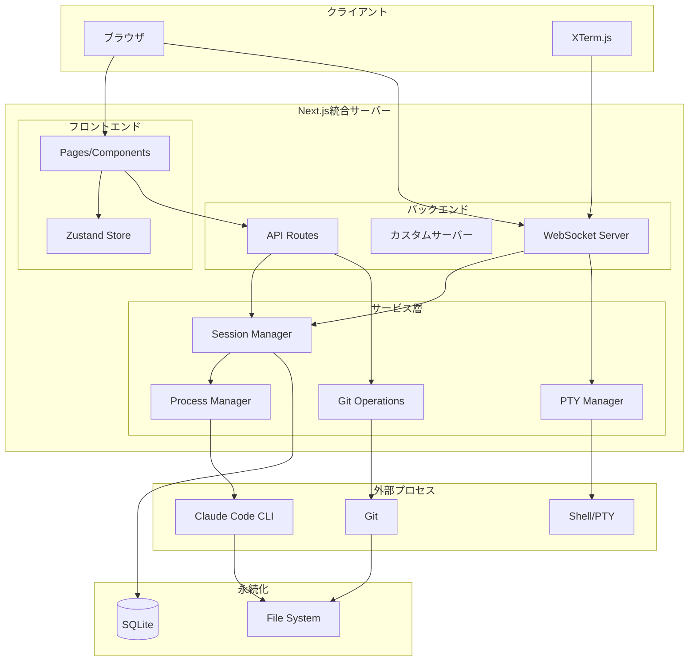

## コンポーネント

### フロントエンド

#### コンポーネント: Pages

**目的**: ユーザーインターフェースの提供

**責務**:
- プロジェクト一覧・詳細の表示
- セッション一覧・詳細の表示
- Claude Codeの出力表示とユーザー入力
- Diff表示とGit操作UI
- ターミナルUI
- 認証画面

**主要ページ構成**:
- `/login` - ログインページ
- `/` - ダッシュボード（プロジェクト一覧）
- `/projects/[id]` - プロジェクト詳細（セッション一覧）
- `/sessions/[id]` - セッション詳細（Claude Code対話）

#### コンポーネント: Zustand Store

**目的**: クライアント状態管理

**責務**:
- プロジェクト・セッション状態の管理
- 認証状態の管理
- テーマ設定の管理
- WebSocket接続状態の管理

**ストア構成**:
```typescript
interface AppState {
  // 認証
  isAuthenticated: boolean;
  token: string | null;

  // プロジェクト
  projects: Project[];
  selectedProjectId: string | null;

  // セッション
  sessions: Session[];
  selectedSessionId: string | null;

  // UI
  theme: 'light' | 'dark' | 'system';
  isMobile: boolean;
}

// 通知設定（別ストアとして実装）
interface NotificationState {
  // 通知許可状態
  permission: 'default' | 'granted' | 'denied';

  // イベント別通知設定
  settings: {
    onTaskComplete: boolean;    // タスク完了時
    onPermissionRequest: boolean; // 権限要求時
    onError: boolean;           // エラー発生時
  };

  // アクション
  requestPermission: () => Promise<void>;
  updateSettings: (settings: Partial<NotificationSettings>) => void;
  sendNotification: (event: NotificationEvent) => void;
}
```

#### コンポーネント: WebSocket Client

**目的**: リアルタイム通信の管理

**責務**:
- Claude Code出力のストリーミング受信
- ターミナル入出力の送受信
- ランスクリプト出力のストリーミング受信
- 接続状態の管理と自動再接続

#### コンポーネント: Notification Service

**目的**: ブラウザ通知とアプリ内toast通知の管理

**責務**:
- ブラウザ通知権限のリクエストと状態管理
- OS通知（Notification API）の送信
- アプリ内toast通知の送信
- タブのアクティブ/バックグラウンド状態の検出
- イベント別通知設定の管理と永続化

**実装場所**: `src/lib/notification-service.ts`

**対応イベント**:

| イベント | OS通知タイトル | 条件 |
|----------|----------------|------|
| タスク完了 | タスク完了: [セッション名] | `status_change` で `completed` |
| 権限要求 | アクション要求: [セッション名] | `permission_request` メッセージ |
| エラー発生 | エラー発生: [セッション名] | `status_change` で `error` または `error` メッセージ |

**通知ルーティング**:
```typescript
function sendNotification(event: NotificationEvent): void {
  const settings = getSettings();

  // イベント別の有効/無効チェック
  if (!isEventEnabled(event.type, settings)) return;

  // タブのアクティブ状態で通知方法を切り替え
  if (document.visibilityState === 'visible') {
    // アプリ内toast通知
    showToast(event);
  } else {
    // OS通知（権限がある場合のみ）
    if (Notification.permission === 'granted') {
      showOSNotification(event);
    }
  }
}
```

**設定の永続化**:
- ローカルストレージのキー: `claudework:notification-settings`
- デフォルト: すべてのイベントで通知有効

### バックエンド

#### コンポーネント: API Routes

**目的**: CRUD操作とGit操作のエンドポイント提供

**責務**:
- プロジェクト管理API（Next.js API Routes）
- セッション管理API（Next.js API Routes）
- Git操作API（diff、rebase、merge）
- 認証API（Next.js API Routes）
- プロンプト履歴API

**実装場所**: `src/app/api/`配下

#### コンポーネント: WebSocket Server

**目的**: リアルタイム双方向通信

**責務**:
- Claude Code出力のブロードキャスト
- ユーザー入力のClaude Codeへの転送
- ターミナル入出力の中継
- 権限確認リクエストの送信

**実装場所**: カスタムサーバー（`server.ts`）にws/socket.ioで実装

#### コンポーネント: Session Manager

**目的**: セッションのライフサイクル管理

**責務**:
- セッションの作成・削除
- セッション状態の追跡
- 複数セッションの一括作成
- サーバー再起動後のセッション復元

#### コンポーネント: Process Manager

**目的**: Claude Codeプロセスの管理

**責務**:
- Claude Code CLIの起動・停止
- プロセス出力の監視とパース
- 権限確認リクエストの検出
- サブエージェント出力の検出
- プロセス異常終了の検出

**実装場所**: `src/services/process-manager.ts`（Node.js child_process使用）

#### コンポーネント: Git Operations

**目的**: Git操作の実行

**責務**:
- worktreeの作成・削除
- diff取得
- rebase実行
- squash & merge実行
- コミット履歴取得
- コミットへのリセット

**実装場所**: `src/services/git-service.ts`（Node.js child_process使用）

#### コンポーネント: PTY Manager

**目的**: ターミナルセッションの管理

**責務**:
- PTYプロセスの生成
- 入出力のWebSocket中継
- セッションごとのPTY管理
- ANSIエスケープシーケンスの透過的転送

**実装場所**: `src/services/pty-manager.ts`（node-ptyライブラリ使用）

#### コンポーネント: Environment Validator

**目的**: サーバー起動時の環境検証

**責務**:
- CLAUDE_CODE_PATH環境変数のチェック
- PATH環境変数からclaudeコマンドの自動検出
- 既存のCLAUDE_CODE_PATHの有効性検証
- claudeコマンドの実行可能性確認
- 検出結果のログ出力

**実装場所**: `src/lib/env-validation.ts`

**検証フロー**:
1. CLAUDE_CODE_PATH環境変数をチェック
2. 設定済みの場合 → パスの有効性を検証
3. 未設定の場合 → PATH環境変数から自動検出
4. 検出/検証失敗時 → エラーメッセージを表示してプロセス終了
5. 検出/検証成功時 → process.env.CLAUDE_CODE_PATHに設定してログ出力

## データフロー

### シーケンス: サーバー起動時の環境検証

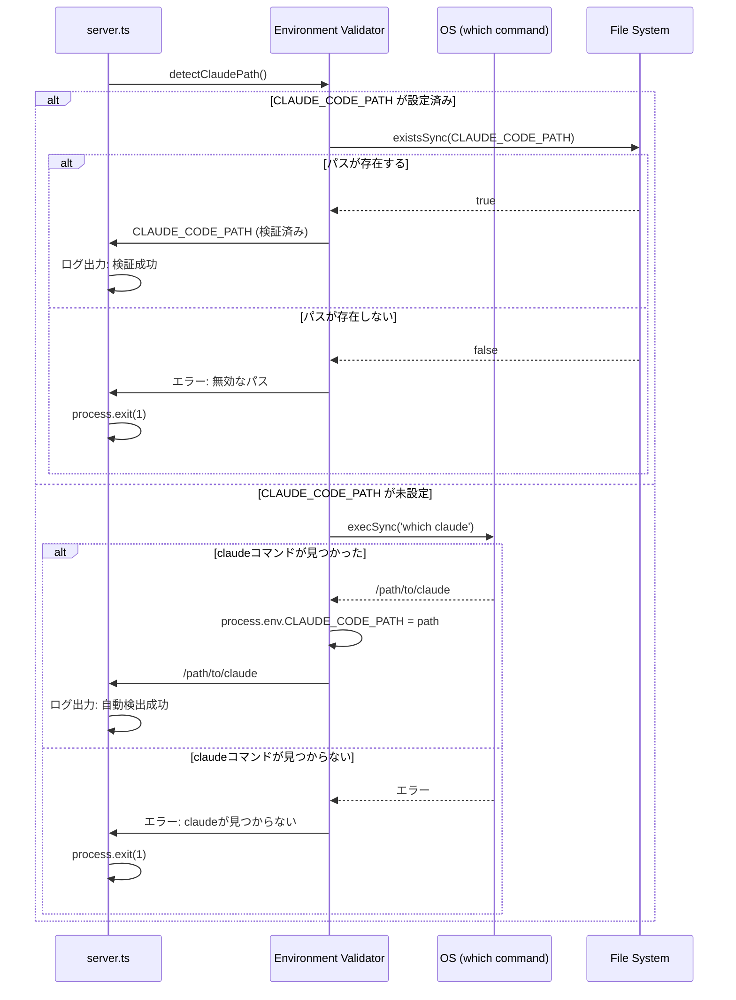

### シーケンス: セッション作成

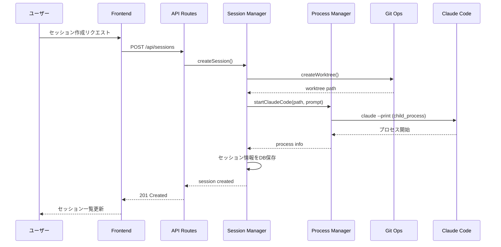

### シーケンス: Claude Code対話

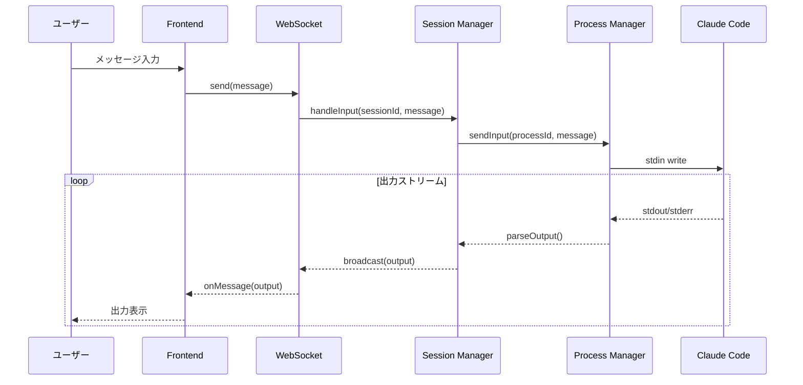

### シーケンス: 権限確認

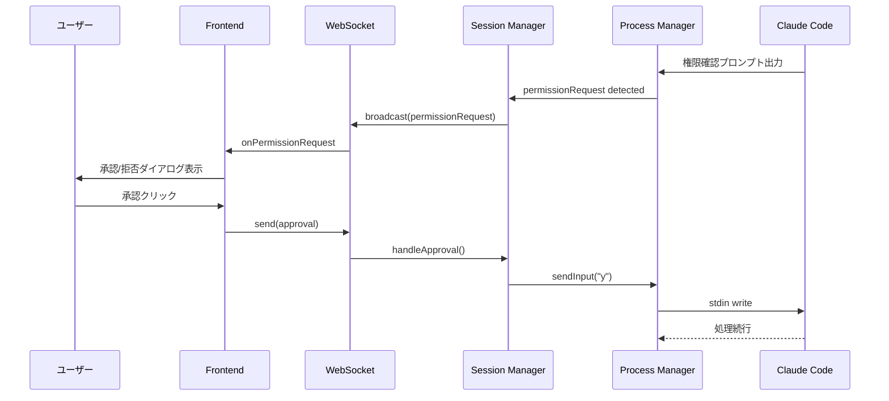

### シーケンス: ターミナル操作

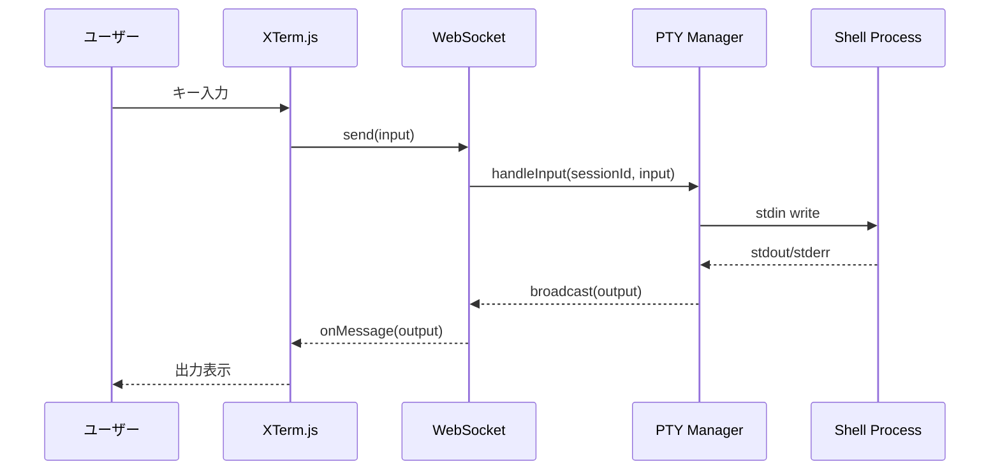

### シーケンス: ブラウザ通知

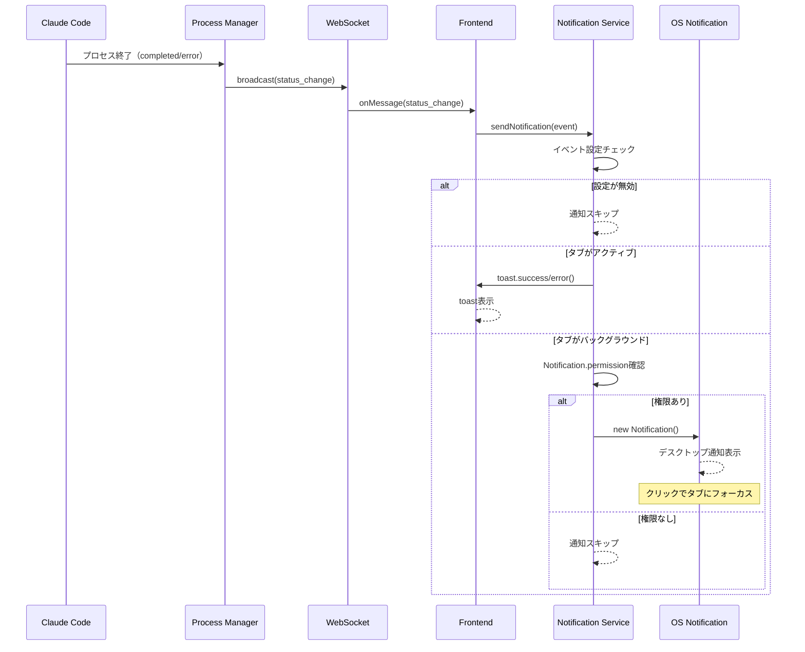

### シーケンス: 通知許可リクエスト

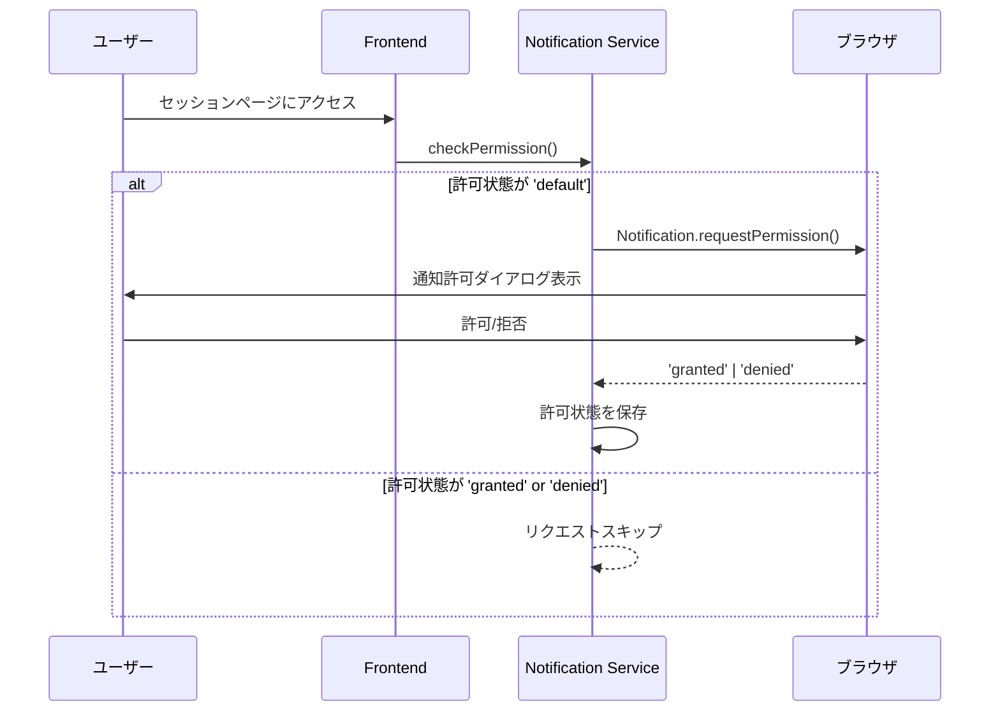

## API設計

### 認証

#### POST /api/auth/login
**目的**: トークン認証によるログイン

**リクエスト**:
```json
{
  "token": "user-provided-token"
}
```

**レスポンス（200）**:
```json
{
  "message": "Login successful",
  "session_id": "uuid",
  "expires_at": "2025-12-08T12:00:00Z"
}
```

**レスポンス（401）**:
```json
{
  "error": "Invalid token"
}
```

#### POST /api/auth/logout
**目的**: ログアウト

**レスポンス（200）**:
```json
{
  "message": "Logout successful"
}
```

### プロジェクト

#### GET /api/projects
**目的**: プロジェクト一覧取得

**レスポンス（200）**:
```json
{
  "projects": [
    {
      "id": "uuid",
      "name": "my-project",
      "path": "/path/to/repo",
      "default_model": "auto",
      "run_scripts": [
        {"name": "test", "command": "npm test"},
        {"name": "build", "command": "npm run build"}
      ],
      "session_count": 3,
      "created_at": "2025-12-01T00:00:00Z"
    }
  ]
}
```

#### POST /api/projects
**目的**: プロジェクト追加

**リクエスト**:
```json
{
  "path": "/path/to/git/repo",
  "default_model": "auto",
  "run_scripts": []
}
```

**レスポンス（201）**:
```json
{
  "project": {
    "id": "uuid",
    "name": "repo-name",
    "path": "/path/to/git/repo",
    "default_model": "auto",
    "run_scripts": [],
    "created_at": "2025-12-01T00:00:00Z"
  }
}
```

**レスポンス（400）**:
```json
{
  "error": "Not a Git repository"
}
```

**レスポンス（403）**:
```json
{
  "error": "指定されたパスは許可されていません"
}
```

**レスポンス（409）**:
```json
{
  "error": "このパスは既に登録されています"
}
```

#### PUT /api/projects/{id}
**目的**: プロジェクト設定更新

**リクエスト**:
```json
{
  "default_model": "sonnet",
  "run_scripts": [
    {"name": "test", "command": "npm test"}
  ]
}
```

**レスポンス（200）**:
```json
{
  "project": {
    "id": "uuid",
    "name": "repo-name",
    "path": "/path/to/git/repo",
    "default_model": "sonnet",
    "run_scripts": [
      {"name": "test", "command": "npm test"}
    ],
    "created_at": "2025-12-01T00:00:00Z"
  }
}
```

#### DELETE /api/projects/{id}
**目的**: プロジェクト削除（worktreeは保持）

### セッション

#### GET /api/projects/{project_id}/sessions
**目的**: セッション一覧取得

**レスポンス（200）**:
```json
{
  "sessions": [
    {
      "id": "uuid",
      "name": "feature-auth",
      "status": "running",
      "git_status": "dirty",
      "model": "sonnet",
      "worktree_path": "/path/to/worktree",
      "created_at": "2025-12-08T10:00:00Z"
    }
  ]
}
```

#### POST /api/projects/{project_id}/sessions
**目的**: セッション作成（単一または複数）

**リクエスト**:
```json
{
  "name": "feature",
  "prompt": "Implement user authentication",
  "model": "auto",
  "count": 3
}
```

**レスポンス（201）**:
```json
{
  "sessions": [
    {"id": "uuid1", "name": "feature-1"},
    {"id": "uuid2", "name": "feature-2"},
    {"id": "uuid3", "name": "feature-3"}
  ]
}
```

#### GET /api/sessions/{id}
**目的**: セッション詳細取得

**レスポンス（200）**:
```json
{
  "session": {
    "id": "uuid",
    "name": "feature-auth",
    "status": "waiting_input",
    "git_status": "dirty",
    "model": "sonnet",
    "worktree_path": "/path/to/worktree",
    "messages": [
      {
        "role": "user",
        "content": "Implement auth",
        "timestamp": "2025-12-08T10:00:00Z"
      },
      {
        "role": "assistant",
        "content": "I'll implement...",
        "timestamp": "2025-12-08T10:00:05Z",
        "sub_agents": [
          {"name": "file_edit", "output": "..."}
        ]
      }
    ]
  }
}
```

#### POST /api/sessions/{id}/input
**目的**: セッションへの入力送信（REST fallback）

**リクエスト**:
```json
{
  "content": "Please also add tests"
}
```

**レスポンス（200）**:
```json
{
  "message": {
    "id": "msg-uuid",
    "role": "user",
    "content": "Please also add tests",
    "timestamp": "2025-12-08T10:05:00Z"
  }
}
```

#### POST /api/sessions/{id}/approve
**目的**: 権限承認

**リクエスト**:
```json
{
  "action": "approve",
  "permission_id": "perm-uuid"
}
```

**レスポンス（200）**:
```json
{
  "success": true,
  "action": "approve"
}
```

#### POST /api/sessions/{id}/stop
**目的**: セッション停止

**レスポンス（200）**:
```json
{
  "session": {
    "id": "uuid",
    "name": "feature-auth",
    "status": "stopped",
    "git_status": "dirty",
    "model": "sonnet",
    "worktree_path": "/path/to/worktree",
    "created_at": "2025-12-08T10:00:00Z"
  }
}
```

#### DELETE /api/sessions/{id}
**目的**: セッション削除（worktreeも削除）

### Git操作

#### GET /api/sessions/{id}/diff
**目的**: mainブランチとの差分取得

**レスポンス（200）**:
```json
{
  "diff": {
    "files": [
      {
        "path": "src/auth.ts",
        "status": "modified",
        "additions": 45,
        "deletions": 12,
        "hunks": [
          {
            "old_start": 10,
            "old_lines": 5,
            "new_start": 10,
            "new_lines": 8,
            "content": "@@ -10,5 +10,8 @@\n-old line\n+new line"
          }
        ]
      }
    ],
    "totalAdditions": 45,
    "totalDeletions": 12
  }
}
```

#### GET /api/sessions/{id}/commits
**目的**: コミット履歴取得

**レスポンス（200）**:
```json
{
  "commits": [
    {
      "hash": "abc123",
      "short_hash": "abc123",
      "message": "Add authentication",
      "author": "Claude",
      "date": "2025-12-08T10:05:00Z",
      "files_changed": 3
    }
  ]
}
```

#### POST /api/sessions/{id}/rebase
**目的**: mainからのrebase

**レスポンス（200）**:
```json
{
  "success": true
}
```

**レスポンス（409）**:
```json
{
  "success": false,
  "conflicts": ["src/auth.ts"]
}
```

#### POST /api/sessions/{id}/reset
**目的**: 特定コミットへのリセット

**注意**: このエンドポイントは未実装です。

**リクエスト**:
```json
{
  "commit_hash": "abc123"
}
```

#### POST /api/sessions/{id}/merge
**目的**: mainへのsquash merge

**リクエスト**:
```json
{
  "commit_message": "feat: Add user authentication",
  "delete_worktree": true
}
```

**レスポンス（200）**:
```json
{
  "success": true
}
```

**レスポンス（409）**:
```json
{
  "success": false,
  "conflicts": ["src/auth.ts", "src/utils.ts"]
}
```

### ランスクリプト

#### POST /api/sessions/{id}/run
**目的**: ランスクリプト実行

**注意**: このエンドポイントは未実装です。

**リクエスト**:
```json
{
  "script_name": "test"
}
```

**レスポンス（202）**:
```json
{
  "run_id": "uuid"
}
```

#### POST /api/sessions/{id}/run/{run_id}/stop
**目的**: ランスクリプト停止

**注意**: このエンドポイントは未実装です。

### プロンプト履歴

#### GET /api/prompts
**目的**: プロンプト履歴取得

**注意**: このエンドポイントは未実装です。

**レスポンス（200）**:
```json
{
  "prompts": [
    {
      "id": "uuid",
      "content": "Implement user auth",
      "used_count": 3,
      "last_used_at": "2025-12-08T10:00:00Z"
    }
  ]
}
```

#### DELETE /api/prompts/{id}
**目的**: プロンプト履歴削除

**注意**: このエンドポイントは未実装です。

## WebSocket API

### 接続

```
ws://host/ws/sessions/{session_id}
```

### メッセージ形式

#### クライアント → サーバー

```json
{
  "type": "input" | "approve" | "deny",
  "content": "string (for input)",
  "request_id": "string (for approve/deny)"
}
```

#### サーバー → クライアント

```json
{
  "type": "output" | "permission_request" | "status_change" | "error",
  "content": "string",
  "sub_agent": {
    "name": "string",
    "output": "string"
  },
  "permission": {
    "request_id": "string",
    "action": "string",
    "details": "string"
  },
  "status": "initializing" | "running" | "waiting_input" | "completed" | "error"
}
```

### ターミナルWebSocket

```
ws://host/ws/terminal/{session_id}
```

バイナリデータとして入出力を送受信。

## データベーススキーマ

### テーブル: projects

| カラム | 型 | 制約 | 説明 |
|--------|------|------|------|
| id | TEXT | PRIMARY KEY | UUID |
| name | TEXT | NOT NULL | プロジェクト名 |
| path | TEXT | NOT NULL UNIQUE | Gitリポジトリパス |
| default_model | TEXT | DEFAULT 'auto' | デフォルトモデル |
| created_at | TEXT | NOT NULL | 作成日時（ISO 8601） |
| updated_at | TEXT | NOT NULL | 更新日時（ISO 8601） |

**リレーション**:
- `RunScript` テーブルと1対多のリレーション（project_id経由）

### テーブル: sessions

| カラム | 型 | 制約 | 説明 |
|--------|------|------|------|
| id | TEXT | PRIMARY KEY | UUID |
| project_id | TEXT | FOREIGN KEY | プロジェクトID |
| name | TEXT | NOT NULL | セッション名 |
| status | TEXT | NOT NULL | ステータス |
| model | TEXT | NOT NULL | 使用モデル |
| worktree_path | TEXT | NOT NULL | worktreeパス |
| branch_name | TEXT | NOT NULL | ブランチ名 |
| created_at | TEXT | NOT NULL | 作成日時 |
| updated_at | TEXT | NOT NULL | 更新日時 |

### テーブル: messages

| カラム | 型 | 制約 | 説明 |
|--------|------|------|------|
| id | TEXT | PRIMARY KEY | UUID |
| session_id | TEXT | FOREIGN KEY | セッションID |
| role | TEXT | NOT NULL | user/assistant |
| content | TEXT | NOT NULL | メッセージ内容 |
| sub_agents | TEXT | | JSON形式のサブエージェント出力 |
| created_at | TEXT | NOT NULL | 作成日時 |

### テーブル: prompts

| カラム | 型 | 制約 | 説明 |
|--------|------|------|------|
| id | TEXT | PRIMARY KEY | UUID |
| content | TEXT | NOT NULL UNIQUE | プロンプト内容 |
| used_count | INTEGER | DEFAULT 1 | 使用回数 |
| last_used_at | TEXT | NOT NULL | 最終使用日時 |
| created_at | TEXT | NOT NULL | 作成日時 |

### テーブル: run_scripts

| カラム | 型 | 制約 | 説明 |
|--------|------|------|------|
| id | TEXT | PRIMARY KEY | UUID |
| project_id | TEXT | FOREIGN KEY | プロジェクトID |
| name | TEXT | NOT NULL | スクリプト名 |
| description | TEXT | | スクリプトの説明 |
| command | TEXT | NOT NULL | 実行するコマンド |
| created_at | TEXT | NOT NULL | 作成日時（ISO 8601） |
| updated_at | TEXT | NOT NULL | 更新日時（ISO 8601） |

**インデックス**:
- `project_id` にインデックス

**リレーション**:
- `Project` テーブルと多対1のリレーション（project_id経由）

### テーブル: auth_sessions

| カラム | 型 | 制約 | 説明 |
|--------|------|------|------|
| id | TEXT | PRIMARY KEY | セッションID |
| token_hash | TEXT | NOT NULL | トークンハッシュ |
| expires_at | TEXT | NOT NULL | 有効期限 |
| created_at | TEXT | NOT NULL | 作成日時 |

## 技術的決定事項

### 決定1: Next.js統合アーキテクチャを採用

**検討した選択肢**:
1. Next.js統合構成 - フロントエンドとバックエンドを1つのプロジェクトに統合
2. Monorepo構成 - フロントエンド(Next.js) + バックエンド(Fastify)を別プロセスで実行

**決定**: Next.js統合構成

**根拠**:
- `npx claude-work`1コマンドで起動できるシンプルさ
- 技術スタックがTypeScriptに統一され、型共有が容易
- デプロイが容易（単一プロセス）
- Next.jsカスタムサーバーでWebSocket統合が可能

### 決定2: データベースにSQLiteを採用

**検討した選択肢**:
1. SQLite - シンプル、ファイルベース、セットアップ不要
2. PostgreSQL - 高機能、スケーラブル、複雑なクエリ対応

**決定**: SQLite（better-sqlite3）

**根拠**:
- 単一ユーザー向けローカル環境では十分な性能
- セットアップ不要でnpmインストールのみで完結
- バックアップがファイルコピーで完了
- better-sqlite3は高速で同期APIが使いやすい

### 決定3: 状態管理にZustandを採用

**検討した選択肢**:
1. Zustand - シンプル、軽量、TypeScript親和性
2. Redux Toolkit - 豊富なエコシステム、複雑
3. Jotai - アトミック、シンプル

**決定**: Zustand

**根拠**:
- APIがシンプルでボイラープレートが少ない
- TypeScriptとの相性が良い
- 中規模アプリケーションに適切なサイズ

### 決定4: プロセス管理にNode.js child_processを採用

**検討した選択肢**:
1. child_process - Node.js標準、非同期I/O対応
2. node-pty - PTY制御、ターミナルエミュレーション

**決定**: child_process（Claude Code用）+ node-pty（ターミナル用）

**根拠**:
- Claude Codeはパイプベースで十分
- ターミナル機能はPTY（node-pty）が必須
- 用途に応じた適切な選択
- Node.js標準APIで追加依存が少ない

### 決定5: 認証方式にトークンベース認証を採用

**検討した選択肢**:
1. トークンベース認証 - シンプル、環境変数で設定
2. OAuth2 - 外部IdP連携、複雑
3. Basic認証 - 最シンプル、セキュリティ懸念

**決定**: トークンベース認証

**根拠**:
- 単一ユーザー向けで十分なセキュリティ
- 環境変数での設定が容易
- リバースプロキシと組み合わせて使用

### 決定6: Claude CLIパスの自動検出機能を実装

**検討した選択肢**:
1. PATH環境変数から自動検出 - ユーザーフレンドリー、設定不要
2. CLAUDE_CODE_PATH必須 - 明示的だが設定が手間
3. デフォルトパス検索 - 環境依存、メンテナンス困難

**決定**: PATH環境変数から自動検出（CLAUDE_CODE_PATH設定時は検証のみ）

**根拠**:
- ユーザーがclaudeコマンドをインストール済みなら追加設定不要
- CLAUDE_CODE_PATHが設定済みの場合は既存動作を維持
- 起動時にパスを検証することでエラーを早期発見
- macOS/Linux環境では`which`コマンドで確実に検出可能

**実装方針**:
- `src/lib/env-validation.ts`に検出ロジックを実装
- `server.ts`起動時に自動的に実行
- 検出失敗時はエラーメッセージを表示してサーバー起動停止
- 検出成功時はログに検出されたパスを出力

## セキュリティ考慮事項

### 認証・認可

- トークンは環境変数`AUTH_TOKEN`で設定
- トークンはbcryptでハッシュ化して比較
- セッションは24時間で期限切れ
- HTTPOnlyクッキーでセッションID管理

### プロジェクトパス制限

- プロジェクトとして登録可能なパスは環境変数`ALLOWED_PROJECT_DIRS`で制限可能
- `ALLOWED_PROJECT_DIRS`はカンマ区切りで複数のディレクトリパスを指定（例: `/home/user/projects,/var/www`）
- 空文字列または未設定の場合、すべてのパスを許可（開発環境向け）
- 設定されたパス配下のディレクトリのみプロジェクトとして登録可能
- 許可外のパスを指定した場合、403 Forbiddenエラーを返す
- 本番環境では必ず設定することを推奨（セキュリティリスク軽減）

### 通信

- 開発環境はHTTP、本番環境ではリバースプロキシ（Caddy/nginx推奨）でHTTPS化
- WebSocket接続も認証済みセッションでのみ許可
- CORS設定で許可オリジンを制限

### プロセス実行

- Claude Codeは指定されたworktree内でのみ実行
- ターミナルセッションも同様にworktree内に制限
- ランスクリプトは事前に登録されたコマンドのみ実行可能

### 入力検証

- パス入力はディレクトリトラバーサル攻撃を防止
- すべての入力はサニタイズ
- SQLインジェクション対策としてパラメータ化クエリを使用

## パフォーマンス考慮事項

### リアルタイム通信

- WebSocketで500ms以内の出力表示を実現
- 出力バッファリングは100ms単位で実施
- 大量出力時は自動的にスロットリング

### 並列セッション

- 10セッションまでの並列実行をサポート
- 各セッションは独立したプロセスで管理
- メモリ使用量の監視と制限

### データベース

- インデックス: sessions(project_id), messages(session_id)
- 古いメッセージは定期的にアーカイブ
- SQLite WALモードで読み取り性能向上

## エラー処理

### 環境検証（サーバー起動時）

- **claudeコマンド未検出**:
  - エラーメッセージ: `Error: claude command not found in PATH. Please install Claude Code CLI or set CLAUDE_CODE_PATH environment variable.`
  - サーバー起動を停止（process.exit(1)）
  - ログレベル: error

- **CLAUDE_CODE_PATH無効**:
  - エラーメッセージ: `Error: CLAUDE_CODE_PATH is set but the path does not exist: ${path}`
  - サーバー起動を停止（process.exit(1)）
  - ログレベル: error

- **Windows環境**:
  - エラーメッセージ: `Error: Windows is not supported. Please use macOS or Linux.`
  - サーバー起動を停止（process.exit(1)）
  - ログレベル: error

### Claude Codeプロセス

- 異常終了時はステータスを「error」に更新
- 終了コードとstderrをエラーメッセージとして保存
- 自動再起動は行わない（ユーザーの明示的な操作を要求）

### Git操作

- rebase失敗時はコンフリクトファイルを通知
- merge失敗時はロールバック
- worktree作成失敗時は詳細なエラーメッセージを返却

### WebSocket

- 接続切断時は自動再接続（最大5回、指数バックオフ）
- 再接続後は最新状態を自動同期
- 永続的な接続失敗時はREST APIにフォールバック

### 一般的なエラー

- すべてのAPIエラーは統一フォーマットで返却
- エラーログはJSON形式で出力
- クリティカルエラーは別ファイルにも記録

## 音声機能

### 概要

ClaudeWorkに音声入力（Speech-to-Text）と音声読み上げ（Text-to-Speech）機能を追加し、ハンズフリーでのClaude Code操作を可能にする。

**参考資料**:
- [Web Speech API - MDN](https://developer.mozilla.org/en-US/docs/Web/API/Web_Speech_API)
- [Whisper-Web (Transformers.js)](https://github.com/xenova/whisper-web)

### 音声機能アーキテクチャ

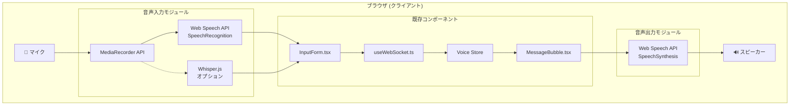

### 技術選定

#### 音声入力（Speech-to-Text）

| オプション | 利点 | 欠点 | 推奨度 |
|-----------|------|------|--------|
| **Web Speech API (SpeechRecognition)** | ブラウザ標準、実装容易、低コスト | Chrome/Edge限定、オンライン依存 | ⭐⭐⭐ **Phase 1推奨** |
| Whisper.js (Transformers.js) | オフライン対応、高精度 | 初回ロード大、CPU負荷 | ⭐⭐ Phase 2 |
| Whisper Server (OpenAI API) | 最高精度 | コスト発生、レイテンシ | ⭐ オプション |

#### 音声出力（Text-to-Speech）

| オプション | 利点 | 欠点 | 推奨度 |
|-----------|------|------|--------|
| **Web Speech API (SpeechSynthesis)** | ブラウザ標準、無料、オフライン対応 | 音声品質は環境依存 | ⭐⭐⭐ **推奨** |
| OpenAI TTS API | 高品質音声 | コスト発生 | ⭐ オプション |

### 音声機能コンポーネント

#### 新規ファイル

```
src/
├── types/
│   └── voice.ts                      # 音声機能の型定義
├── hooks/
│   ├── useSpeechRecognition.ts       # 音声認識Hook
│   └── useSpeechSynthesis.ts         # 音声合成Hook
├── components/
│   └── voice/
│       ├── VoiceInputButton.tsx      # 音声入力ボタン
│       ├── VoicePlayButton.tsx       # 読み上げボタン
│       ├── VoiceIndicator.tsx        # 音声状態インジケーター
│       └── VoiceSettingsPanel.tsx    # 音声設定パネル
├── store/
│   └── voice.ts                      # 音声状態管理
└── lib/
    └── voice/
        ├── speech-recognition.ts     # SpeechRecognition ユーティリティ
        ├── speech-synthesis.ts       # SpeechSynthesis ユーティリティ
        └── text-processor.ts         # Markdown→プレーンテキスト変換
```

#### 既存ファイル変更

| ファイル | 変更内容 |
|----------|----------|
| `src/components/session/InputForm.tsx` | VoiceInputButton 統合 |
| `src/components/session/MessageBubble.tsx` | VoicePlayButton 統合 |
| `src/components/layout/Header.tsx` | VoiceIndicator 追加 |
| `src/components/common/NotificationSettings.tsx` | VoiceSettingsPanel へのリンク追加 |
| `src/app/sessions/[id]/page.tsx` | 自動読み上げロジック追加 |

### 音声機能の型定義

```typescript
// src/types/voice.ts

/** 音声入力の状態 */
export type VoiceInputStatus =
  | 'idle'           // 待機中
  | 'listening'      // 音声認識中
  | 'processing'     // 処理中（Whisper使用時）
  | 'error';         // エラー

/** 音声認識結果 */
export interface SpeechRecognitionResult {
  transcript: string;      // 認識テキスト
  confidence: number;      // 信頼度 (0-1)
  isFinal: boolean;       // 確定結果かどうか
}

/** 音声入力設定 */
export interface VoiceInputSettings {
  enabled: boolean;                    // 音声入力有効
  language: string;                    // 認識言語 (e.g., 'ja-JP', 'en-US')
  continuous: boolean;                 // 連続認識モード
  interimResults: boolean;             // 中間結果表示
  autoSend: boolean;                   // 認識完了時に自動送信
  silenceTimeout: number;              // 無音タイムアウト (ms)
}

/** 音声出力設定 */
export interface VoiceOutputSettings {
  enabled: boolean;                    // 音声読み上げ有効
  voice: string | null;                // 使用する音声 (null = デフォルト)
  rate: number;                        // 読み上げ速度 (0.1 - 10)
  pitch: number;                       // ピッチ (0 - 2)
  volume: number;                      // 音量 (0 - 1)
  autoRead: boolean;                   // アシスタント応答を自動読み上げ
  readCodeBlocks: boolean;             // コードブロックも読み上げ
}
```

### 音声機能の状態管理

```typescript
// src/store/voice.ts

import { create } from 'zustand';
import { persist } from 'zustand/middleware';

interface VoiceState {
  // 音声入力設定
  inputSettings: VoiceInputSettings;
  inputStatus: VoiceInputStatus;

  // 音声出力設定
  outputSettings: VoiceOutputSettings;
  currentlySpeakingMessageId: string | null;

  // アクション
  updateInputSettings: (settings: Partial<VoiceInputSettings>) => void;
  updateOutputSettings: (settings: Partial<VoiceOutputSettings>) => void;
  setInputStatus: (status: VoiceInputStatus) => void;
  setSpeakingMessage: (messageId: string | null) => void;
}

export const useVoiceStore = create<VoiceState>()(
  persist(
    (set) => ({
      inputSettings: {
        enabled: false,
        language: 'ja-JP',
        continuous: true,
        interimResults: true,
        autoSend: false,
        silenceTimeout: 2000,
      },
      inputStatus: 'idle',
      outputSettings: {
        enabled: false,
        voice: null,
        rate: 1.0,
        pitch: 1.0,
        volume: 1.0,
        autoRead: false,
        readCodeBlocks: false,
      },
      currentlySpeakingMessageId: null,

      updateInputSettings: (settings) =>
        set((state) => ({
          inputSettings: { ...state.inputSettings, ...settings },
        })),
      updateOutputSettings: (settings) =>
        set((state) => ({
          outputSettings: { ...state.outputSettings, ...settings },
        })),
      setInputStatus: (status) => set({ inputStatus: status }),
      setSpeakingMessage: (messageId) =>
        set({ currentlySpeakingMessageId: messageId }),
    }),
    {
      name: 'voice-settings',
      partialize: (state) => ({
        inputSettings: state.inputSettings,
        outputSettings: state.outputSettings,
      }),
    }
  )
);
```

### 音声認識Hook

```typescript
// src/hooks/useSpeechRecognition.ts

interface UseSpeechRecognitionReturn {
  // 状態
  isListening: boolean;
  isSupported: boolean;
  error: string | null;
  transcript: string;
  interimTranscript: string;

  // アクション
  startListening: () => void;
  stopListening: () => void;
  resetTranscript: () => void;

  // 設定
  setLanguage: (lang: string) => void;
}

export function useSpeechRecognition(
  options?: Partial<VoiceInputSettings>
): UseSpeechRecognitionReturn {
  // Web Speech API SpeechRecognition を使用
  // ブラウザ互換性: Chrome, Edge, Safari (webkit prefix)
  // Firefox: 未サポート（フォールバック必要）
}
```

### 音声合成Hook

```typescript
// src/hooks/useSpeechSynthesis.ts

interface UseSpeechSynthesisReturn {
  // 状態
  isSpeaking: boolean;
  isPaused: boolean;
  isSupported: boolean;
  voices: SpeechSynthesisVoice[];

  // アクション
  speak: (text: string, options?: SpeakOptions) => void;
  pause: () => void;
  resume: () => void;
  cancel: () => void;

  // 設定
  setVoice: (voice: SpeechSynthesisVoice) => void;
  setRate: (rate: number) => void;
  setPitch: (pitch: number) => void;
  setVolume: (volume: number) => void;
}

interface SpeakOptions {
  voice?: SpeechSynthesisVoice;
  rate?: number;
  pitch?: number;
  volume?: number;
  onEnd?: () => void;
  onError?: (error: Error) => void;
}
```

### 音声入力データフロー

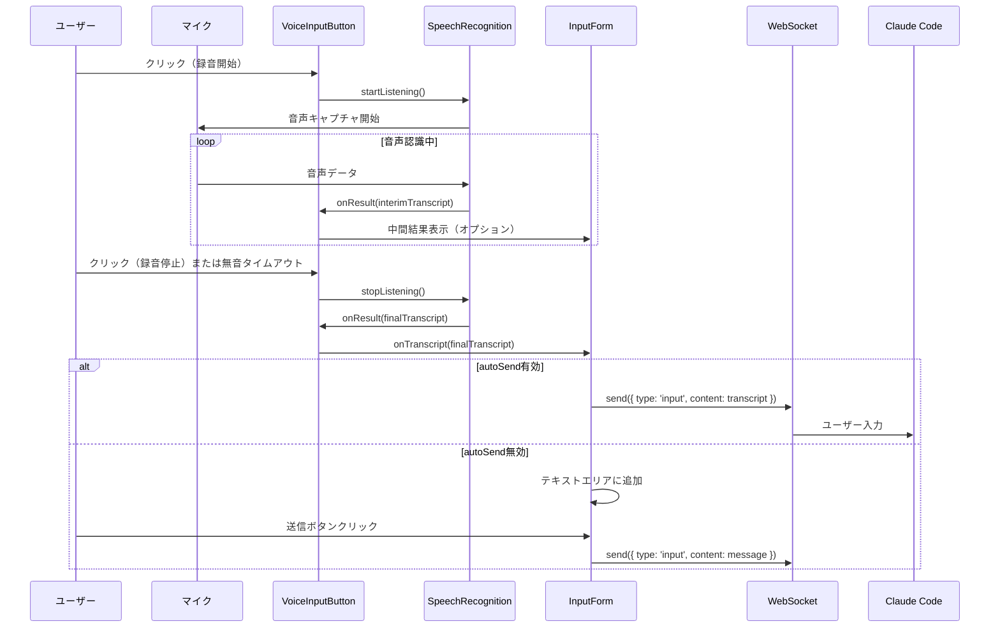

### 音声読み上げデータフロー

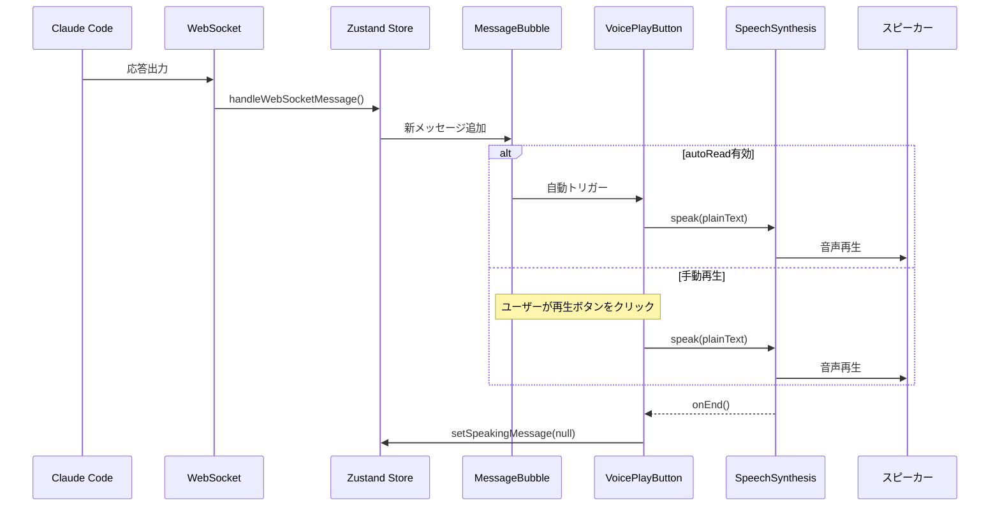

### 音声機能エラーハンドリング

#### 音声入力エラー

| エラー種別 | 原因 | 対処 |
|-----------|------|------|
| `not-allowed` | マイク権限拒否 | 権限リクエストダイアログ表示 |
| `no-speech` | 音声未検出 | タイムアウト後に自動停止 |
| `network` | ネットワークエラー | オフラインモード案内 |
| `aborted` | ユーザーによる中断 | 正常終了として処理 |
| `audio-capture` | マイクエラー | デバイス確認メッセージ |

#### 音声読み上げエラー

| エラー種別 | 原因 | 対処 |
|-----------|------|------|
| `canceled` | 別の読み上げ開始 | 無視 |
| `interrupted` | システム割り込み | 自動再開オプション |
| `synthesis-failed` | 合成エラー | エラーメッセージ表示 |

### ブラウザ互換性

#### 音声入力 (SpeechRecognition)

| ブラウザ | サポート | 備考 |
|----------|----------|------|
| Chrome | ✅ 完全サポート | webkitSpeechRecognition |
| Edge | ✅ 完全サポート | webkitSpeechRecognition |
| Safari | ⚠️ 部分サポート | iOS/macOS のみ |
| Firefox | ❌ 未サポート | フォールバック必要 |

#### 音声読み上げ (SpeechSynthesis)

| ブラウザ | サポート | 備考 |
|----------|----------|------|
| Chrome | ✅ 完全サポート | - |
| Edge | ✅ 完全サポート | - |
| Safari | ✅ 完全サポート | - |
| Firefox | ✅ 完全サポート | - |

#### 非対応ブラウザへの対応

```typescript
// src/lib/voice/browser-support.ts

export function checkVoiceSupport() {
  return {
    speechRecognition:
      'webkitSpeechRecognition' in window || 'SpeechRecognition' in window,
    speechSynthesis: 'speechSynthesis' in window,
  };
}

// 非対応の場合、音声ボタンを非表示またはグレーアウト
// ツールチップで「お使いのブラウザは音声機能に対応していません」を表示
```

### 音声機能セキュリティ考慮事項

#### マイク権限

- HTTPS環境でのみマイク使用可能
- ユーザーによる明示的な権限許可が必要
- 権限状態を永続化し、拒否時は再リクエストしない

#### プライバシー

- 音声データはブラウザ内で処理（Web Speech API使用時）
- サーバーへの音声送信はオプション（Whisper Server使用時のみ）
- 設定でサーバー送信の有無を明示

#### データ保存

- 音声データは一時的なもので永続化しない
- 認識結果テキストのみを通常のメッセージとして保存

### 音声機能パフォーマンス考慮事項

#### 音声認識

- 連続認識モードでのメモリ使用量監視
- 長時間使用時の自動タイムアウト（設定可能）
- 認識中は他のリソース集約的処理を抑制

#### 音声読み上げ

- 長文テキストの分割読み上げ（文単位）
- コードブロックのスキップオプション
- 読み上げキューの管理

### 音声機能実装フェーズ

#### Phase 1: 基本機能（推奨開始点）

1. 型定義 (`src/types/voice.ts`)
2. 音声認識Hook (`useSpeechRecognition.ts`)
3. 音声合成Hook (`useSpeechSynthesis.ts`)
4. Voice Store (`src/store/voice.ts`)
5. VoiceInputButton コンポーネント
6. VoicePlayButton コンポーネント
7. InputForm への統合
8. MessageBubble への統合

#### Phase 2: 設定UI

1. VoiceSettingsPanel コンポーネント
2. NotificationSettings への統合
3. 言語選択
4. 音声選択
5. 速度/ピッチ調整

#### Phase 3: 高度な機能（オプション）

1. Whisper.js 統合（オフライン認識）
2. 自動読み上げモード
3. VoiceIndicator（ヘッダー表示）
4. キーボードショートカット

#### Phase 4: サーバーサイド拡張（オプション）

1. Whisper Server 統合
2. 高品質TTS API 統合
3. 音声ファイル保存/再生
