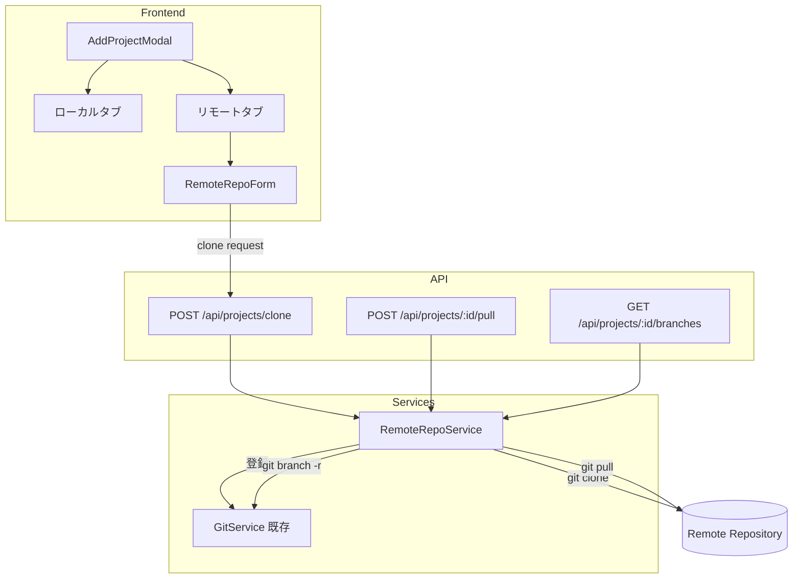
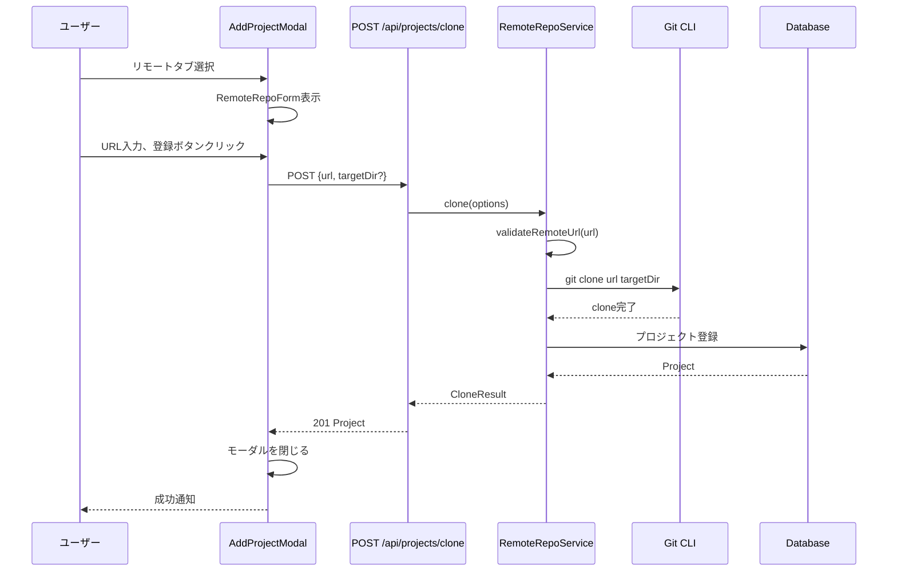
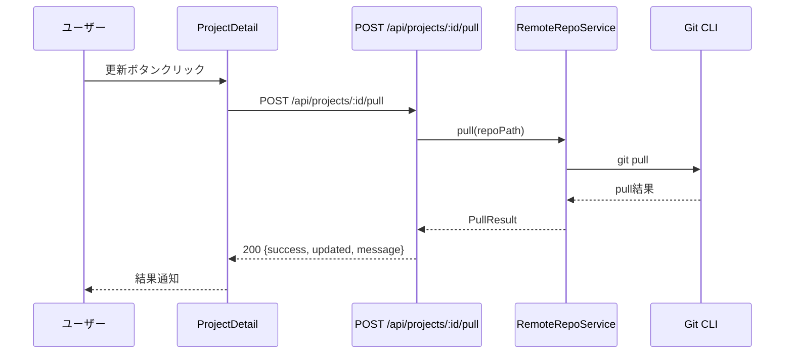

# 設計: リモートGitリポジトリ直接登録機能

> このドキュメントはAIエージェント（Claude Code等）が実装を行うことを前提としています。

## 情報の明確性チェック

### ユーザーから明示された情報

- [x] Clone先ディレクトリ: デフォルトは `data/repos/`、オプションでユーザー指定も可能
- [x] 認証方式: システムのSSH設定を利用（PAT不要）
- [x] 更新機能: 必要（pull/fetch）
- [x] Clone時のブランチ: デフォルトブランチのみ
- [x] セッション作成時: 既存ブランチ選択可能
- [x] Shallow clone: 不要（全履歴clone）
- [x] UI統合方法: タブ切替（ローカル/リモート）

### 不明/要確認の情報

| 項目 | 現状の理解 | 確認状況 |
|------|-----------|----------|
| すべての項目 | ユーザーとの対話で確認済み | [x] 確認済み |

---

## アーキテクチャ概要



## コンポーネント

### コンポーネント1: RemoteRepoService

**目的**: リモートリポジトリのclone、pull、ブランチ一覧取得を管理

**責務**:
- リモートURLの検証
- git clone実行
- git pull実行
- リモートブランチ一覧取得
- clone先ディレクトリの管理

**インターフェース**:

```typescript
// src/services/remote-repo-service.ts

export interface CloneOptions {
  url: string;           // リモートリポジトリURL
  targetDir?: string;    // clone先ディレクトリ（省略時はdata/repos/）
  name?: string;         // プロジェクト名（省略時はリポジトリ名から自動抽出）
}

export interface CloneResult {
  success: boolean;
  path: string;          // cloneしたローカルパス
  error?: string;
}

export interface PullResult {
  success: boolean;
  updated: boolean;      // 更新があったか
  message: string;
  error?: string;
}

export interface Branch {
  name: string;
  isDefault: boolean;
  isRemote: boolean;
}

class RemoteRepoService {
  // リモートURLの検証
  validateRemoteUrl(url: string): { valid: boolean; error?: string };

  // リポジトリをclone
  async clone(options: CloneOptions): Promise<CloneResult>;

  // リポジトリを更新（pull）
  async pull(repoPath: string): Promise<PullResult>;

  // ブランチ一覧を取得
  async getBranches(repoPath: string): Promise<Branch[]>;

  // リポジトリ名をURLから抽出
  extractRepoName(url: string): string;
}
```

**明示された情報**:
- SSH認証を使用（システム設定を利用）
- デフォルトclone先は `data/repos/`

### コンポーネント2: Project Model拡張

**目的**: リモートリポジトリ情報をProjectに追加

**責務**:
- リモートURL保持
- clone元情報の管理

**データベーススキーマ変更**:

```prisma
model Project {
  id           String    @id @default(uuid())
  name         String
  path         String    @unique
  remote_url   String?   // 新規追加: リモートリポジトリURL（nullの場合はローカル登録）
  created_at   DateTime  @default(now())
  updated_at   DateTime  @updatedAt
  sessions     Session[]
  scripts      RunScript[]
}
```

### コンポーネント3: API エンドポイント

**目的**: リモートリポジトリ操作のAPIを提供

#### エンドポイント: POST /api/projects/clone

**メソッド**: POST
**目的**: リモートリポジトリをcloneしてプロジェクト登録

**リクエスト**:
```json
{
  "url": "git@github.com:user/repo.git",
  "targetDir": "/optional/custom/path",
  "name": "optional-custom-name"
}
```

**レスポンス（成功 201）**:
```json
{
  "id": "uuid",
  "name": "repo",
  "path": "/home/user/claude-work/data/repos/repo",
  "remote_url": "git@github.com:user/repo.git",
  "created_at": "2024-01-01T00:00:00Z",
  "updated_at": "2024-01-01T00:00:00Z"
}
```

**エラーレスポンス**:
- 400: 無効なURL、clone失敗
- 403: 許可されていないディレクトリ（ALLOWED_PROJECT_DIRS制限）
- 409: 既に同じパスのプロジェクトが存在

#### エンドポイント: POST /api/projects/[id]/pull

**メソッド**: POST
**目的**: 登録済みリモートリポジトリを更新

**リクエスト**: なし（ボディ不要）

**レスポンス（成功 200）**:
```json
{
  "success": true,
  "updated": true,
  "message": "Successfully pulled latest changes"
}
```

**エラーレスポンス**:
- 400: pull失敗（競合等）
- 404: プロジェクトが見つからない

#### エンドポイント: GET /api/projects/[id]/branches

**メソッド**: GET
**目的**: プロジェクトのブランチ一覧を取得

**レスポンス（成功 200）**:
```json
{
  "branches": [
    { "name": "main", "isDefault": true, "isRemote": false },
    { "name": "develop", "isDefault": false, "isRemote": false },
    { "name": "origin/feature-x", "isDefault": false, "isRemote": true }
  ]
}
```

### コンポーネント4: フロントエンド

#### AddProjectModal拡張

**変更点**:
- タブUIの追加（「ローカル」「リモート」）
- RemoteRepoFormコンポーネントの追加

```typescript
// src/components/projects/RemoteRepoForm.tsx

interface RemoteRepoFormProps {
  onSubmit: (url: string, targetDir?: string) => Promise<void>;
  onCancel: () => void;
  isLoading: boolean;
  error?: string;
}
```

#### CreateSessionModal拡張

**変更点**:
- ブランチ選択ドロップダウンの追加

```typescript
// src/components/sessions/CreateSessionModal.tsx に追加

interface BranchSelectorProps {
  projectId: string;
  selectedBranch: string;
  onSelect: (branch: string) => void;
}
```

#### ProjectList拡張

**変更点**:
- リモートプロジェクトにバッジ表示
- 更新ボタンの追加

## データフロー

### シーケンス: リモートリポジトリのclone



### シーケンス: プロジェクト更新（pull）



## 技術的決定事項

### 決定1: clone先ディレクトリ構造

**検討した選択肢**:
1. `data/repos/<repo-name>/` - フラット構造
2. `data/repos/<owner>/<repo-name>/` - オーナー別構造

**決定**: 選択肢1（フラット構造）
**根拠**: シンプルで管理しやすい。同名リポジトリの場合は連番サフィックスで対応

### 決定2: URL検証方式

**検討した選択肢**:
1. 正規表現による静的検証のみ
2. git ls-remoteによる実際のアクセス検証

**決定**: 選択肢1（正規表現検証）+ clone時のエラーハンドリング
**根拠**: ls-remoteは時間がかかる場合がある。clone失敗時に適切なエラーメッセージを返せば十分

### 決定3: pull時の競合処理

**検討した選択肢**:
1. --rebase で自動リベース
2. 通常のmerge
3. fast-forward only

**決定**: 選択肢3（fast-forward only）
**根拠**: ローカル変更がある場合は失敗させ、ユーザーに判断を委ねる。worktreeでの作業は別ブランチで行われるため、mainブランチは通常fast-forward可能

## セキュリティ考慮事項

1. **URL検証**: Git URL形式（SSH/HTTPS）のみ許可
2. **パストラバーサル防止**: clone先ディレクトリの正規化とベースディレクトリチェック
3. **コマンドインジェクション防止**: URLやパスを直接シェルに渡さず、配列形式でspawn
4. **SSH認証**: システムのSSH設定を利用、アプリケーション内でのクレデンシャル保持なし

## エラー処理

| エラー種別 | 原因 | HTTPステータス | メッセージ |
|-----------|------|---------------|-----------|
| INVALID_URL | 無効なGit URL形式 | 400 | 「有効なGitリポジトリURLを入力してください」 |
| CLONE_FAILED | clone失敗（認証エラー、ネットワークエラー等） | 400 | Gitエラーメッセージを表示 |
| ALREADY_EXISTS | 同一パスのプロジェクトが存在 | 409 | 「このリポジトリは既に登録されています」 |
| FORBIDDEN_DIR | ALLOWED_PROJECT_DIRS制限 | 403 | 「指定されたディレクトリは許可されていません」 |
| PULL_CONFLICT | pull時の競合 | 400 | 「ローカルに未コミットの変更があります」 |
| NOT_REMOTE_REPO | pull対象がリモート登録でない | 400 | 「このプロジェクトはリモートから登録されていません」 |

## ファイル構成

```
src/
├── app/
│   └── api/
│       └── projects/
│           ├── clone/
│           │   └── route.ts           # 新規: clone API
│           └── [project_id]/
│               ├── pull/
│               │   └── route.ts       # 新規: pull API
│               └── branches/
│                   └── route.ts       # 新規: branches API
├── components/
│   └── projects/
│       ├── AddProjectModal.tsx        # 変更: タブUI追加
│       ├── RemoteRepoForm.tsx         # 新規: リモートURL入力フォーム
│       └── ProjectCard.tsx            # 変更: リモートバッジ、更新ボタン
├── services/
│   └── remote-repo-service.ts         # 新規: リモートリポジトリ操作
└── types/
    └── project.ts                     # 変更: remote_url追加
```
