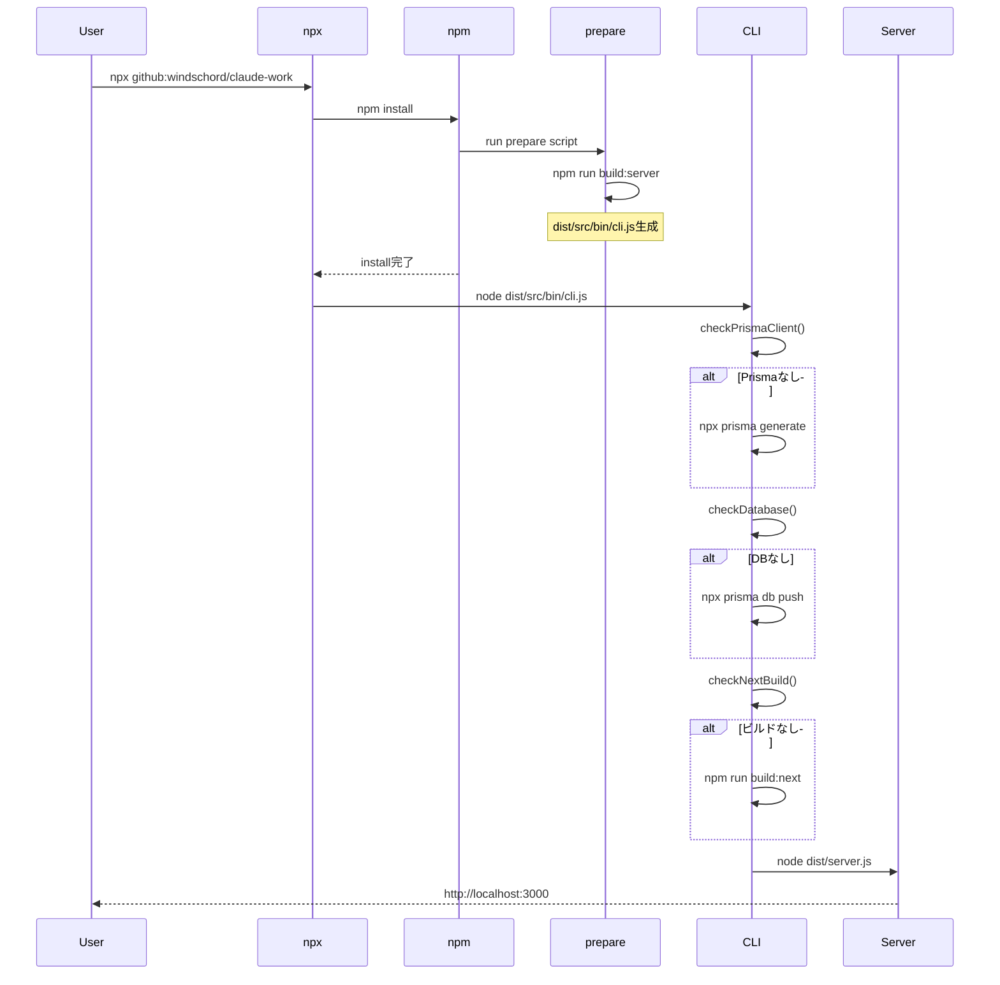
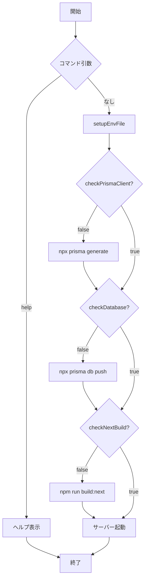

# 設計: npx実行による全自動セットアップCLI

## 情報の明確性チェック

### ユーザーから明示された情報
- 実行コマンド: `npx github:windschord/claude-work`
- CLI機能: 最小限（フォアグラウンド起動のみ）
- セットアップ: 全自動（Prisma、DB、Next.js）
- ビルド方式: prepareスクリプト

### 不明/要確認の情報

| 項目 | 現状の理解 | 確認状況 |
|------|-----------|----------|
| なし | - | [x] 確認済み |

## アーキテクチャ概要



## コンポーネント

### コンポーネント1: package.json (prepare スクリプト)

**目的**: npm install 時にCLIを自動ビルド

**責務**:
- サーバーのTypeScriptビルドを実行
- `dist/src/bin/cli.js` を生成

**インターフェース**:
```json
{
  "scripts": {
    "prepare": "npm run build:server"
  }
}
```

**対応要件**: REQ-009, REQ-010

### コンポーネント2: CLI エントリーポイント (src/bin/cli.ts)

**目的**: npx実行時のエントリーポイント

**責務**:
- コマンドライン引数の解析（最小限）
- 自動セットアップの実行
- サーバーの起動

**インターフェース**:
```bash
# フォアグラウンド起動（デフォルト）
npx github:windschord/claude-work

# ヘルプ
npx github:windschord/claude-work help
```

**対応要件**: REQ-001~005, REQ-006~008, NFR-002, NFR-003

### コンポーネント3: セットアップユーティリティ (src/bin/cli-utils.ts)

**目的**: セットアップ状態のチェック

**責務**:
- Prismaクライアント存在チェック
- データベース存在チェック
- Next.jsビルド完全性チェック

**インターフェース**:
```typescript
function checkPrismaClient(projectRoot: string): boolean
function checkDatabase(projectRoot: string): boolean
function checkNextBuild(projectRoot: string): boolean
```

**対応要件**: REQ-006~008

## 処理フロー

### メイン処理フロー



## 変更点のサマリー

### package.json の変更

```diff
 "scripts": {
+  "prepare": "npm run build:server",
   "dev": "ts-node -r tsconfig-paths/register --project tsconfig.server.json server.ts",
```

### src/bin/cli.ts の変更

削除する機能:
- `startDaemon()` - pm2バックグラウンド起動
- `stopDaemon()` - pm2停止
- `restartDaemon()` - pm2再起動
- `showStatus()` - pm2ステータス
- `showLogs()` - pm2ログ

維持する機能:
- `setupEnvFile()` - .env ファイルセットアップ
- `runSetup()` - 全自動セットアップ
- `startForeground()` - フォアグラウンド起動
- `showHelp()` - 簡易ヘルプ（内容を最小化）

### src/bin/cli-utils.ts

変更なし（既存のチェック関数をそのまま使用）

## 技術的決定事項

### 決定1: prepare スクリプトでのビルド

**検討した選択肢**:
1. prepare スクリプト（npm install後に自動実行）
2. dist/ をGitにコミット
3. JSラッパースクリプト

**決定**: prepare スクリプト

**根拠**:
- npm標準のライフサイクルフック
- ビルド成果物をリポジトリに含めない
- npx github: 形式で動作確認済みのパターン

### 決定2: CLI機能の最小化

**検討した選択肢**:
1. 全機能維持（start, stop, restart, status, logs, help）
2. 最小限（フォアグラウンド起動 + help）

**決定**: 最小限

**根拠**:
- ユーザー要件「最小限のみ」
- npx実行での一時的な利用を想定
- バックグラウンド機能は将来の拡張として対応

## 要件との整合性

| 要件ID | 設計要素 | 対応状況 |
|--------|----------|----------|
| REQ-001 | npm install（npx内部） | [x] 対応 |
| REQ-002 | runSetup() -> generatePrismaClient() | [x] 対応 |
| REQ-003 | runSetup() -> setupDatabase() | [x] 対応 |
| REQ-004 | runSetup() -> buildNext() | [x] 対応 |
| REQ-005 | startForeground() | [x] 対応 |
| REQ-006 | checkPrismaClient() | [x] 対応 |
| REQ-007 | checkDatabase() | [x] 対応 |
| REQ-008 | checkNextBuild() | [x] 対応 |
| REQ-009 | package.json prepare | [x] 対応 |
| REQ-010 | npm run build:server | [x] 対応 |
| NFR-001 | 既存リソースのスキップ | [x] 対応 |
| NFR-002 | console.log による進捗表示 | [x] 対応 |
| NFR-003 | console.error + process.exit(1) | [x] 対応 |

## CI/CD設計

### 品質ゲート

- テストカバレッジ: 既存のvitest設定を使用
- Linter: ESLint（既存設定）
- 型チェック: TypeScript strict mode

### テスト方針

- cli-utils.ts: ユニットテスト（既存のテストファイル維持）
- cli.ts: 統合テストは手動確認（npx実行の自動テストは困難）
