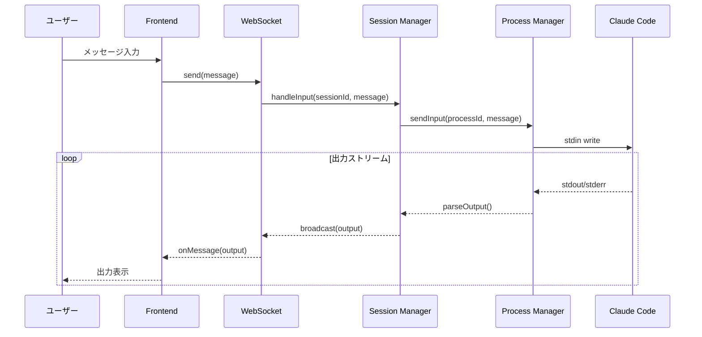
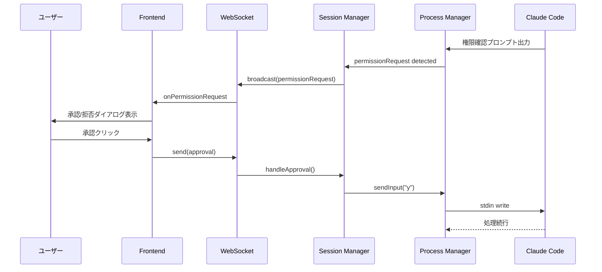
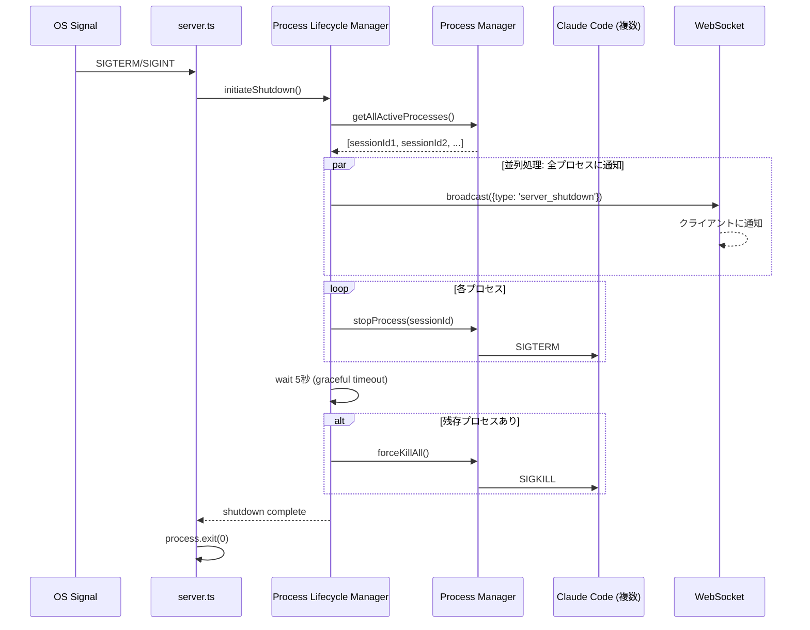
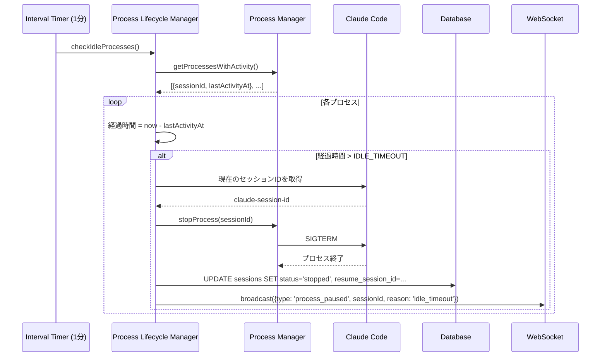
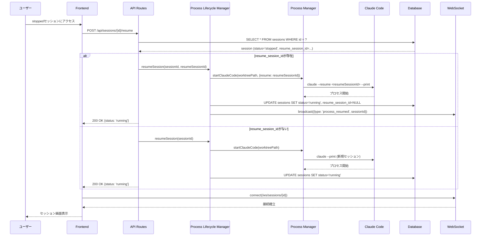
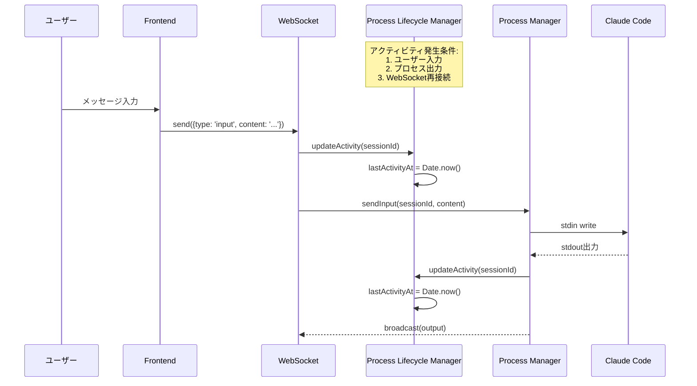

# 設計書: Claude Code連携・プロセス管理

## 概要

Claude Codeとの対話、プロセス管理、セッション復帰機能の設計を定義します。

---

## コンポーネント

### バックエンド

#### コンポーネント: WebSocket Server

**目的**: リアルタイム双方向通信

**責務**:
- Claude Code出力のブロードキャスト
- ユーザー入力のClaude Codeへの転送
- 権限確認リクエストの送信

**実装場所**: カスタムサーバー（`server.ts`）にws/socket.ioで実装

#### コンポーネント: Process Manager

**目的**: Claude Codeプロセスの管理

**責務**:
- Claude Code CLIの起動・停止
- プロセス出力の監視とパース
- 権限確認リクエストの検出
- サブエージェント出力の検出
- プロセス異常終了の検出
- stream-jsonメッセージのフィルタリング（`user`タイプ、認識されないタイプは出力しない）

**実装場所**: `src/services/process-manager.ts`（Node.js child_process使用）

**stream-jsonメッセージ処理**:

| メッセージタイプ | 処理 |
|-----------------|------|
| `assistant` | テキストを抽出して`output`イベント発火 |
| `content_block_delta` | デルタテキストを`output`イベント発火 |
| `system` | `[System]`接頭辞付きで`output`イベント発火 |
| `error` | `error`イベント発火 |
| `permission_request` | `permission`イベント発火 |
| `result` | スキップ（既にテキスト送信済み） |
| `user` | ログのみ（クライアントに送信しない） |
| その他 | ログのみ（クライアントに送信しない） |

#### コンポーネント: Process Lifecycle Manager

**目的**: Claude Codeプロセスのライフサイクル自動管理

**責務**:
- サーバーシャットダウン時の全プロセス自動停止
- アイドルタイムアウトによるプロセス自動停止
- アクティビティトラッキング（最終アクティビティ時刻の記録）
- セッション再開時の--resumeオプション使用による会話履歴復元
- プロセスライフサイクルイベントのWebSocket通知

**実装場所**: `src/services/process-lifecycle-manager.ts`

**状態定義**:
```typescript
interface ProcessLifecycleState {
  sessionId: string;
  lastActivityAt: Date;
  isStopped: boolean;      // アイドルタイムアウトで停止された状態
  resumeSessionId: string | null;  // Claude Codeの--resume用セッションID
}

// セッションステータスの拡張
type SessionStatus =
  | 'initializing'   // 初期化中
  | 'running'        // プロセス実行中
  | 'waiting_input'  // ユーザー入力待ち
  | 'completed'      // 正常終了
  | 'error'          // エラー終了
  | 'stopped';       // 停止中（アイドルタイムアウトなど）
```

**設定**:
- `PROCESS_IDLE_TIMEOUT_MINUTES`: アイドルタイムアウト（分）。デフォルト30分。0で無効化。

**シャットダウンフロー**:
1. SIGTERM/SIGINTシグナルを受信
2. 全アクティブプロセスにSIGTERMを送信
3. 5秒のグレースフル終了待機
4. タイムアウト後、残存プロセスにSIGKILLを送信
5. サーバープロセス終了

**アイドルタイムアウトフロー**:
1. 定期的なアイドルチェック（1分間隔）
2. 最終アクティビティからの経過時間を計算
3. タイムアウト超過時:
   - プロセスにSIGTERMを送信
   - セッションステータスを`stopped`に更新
   - 接続中クライアントにWebSocket通知
   - Claude Codeセッション識別子を保存

**セッション再開フロー**:
1. `stopped`状態のセッションにユーザーがアクセス
2. 保存されたセッション識別子を取得
3. `claude --resume <session-id>`でプロセス再起動
4. セッションステータスを`running`に更新
5. WebSocket接続を再確立

#### コンポーネント: ClaudePTYManager

**目的**: Claude Code PTYセッションの管理

**変更内容（ストーリー19対応）**:

```typescript
interface StartOptions {
  worktreePath: string;
  model?: string;
  prompt?: string;
  resumeSessionId?: string;  // 追加
}

async startClaude(sessionId: string, options: StartOptions): Promise<void> {
  const args: string[] = [];

  // --resume オプションの追加
  if (options.resumeSessionId) {
    args.push('--resume', options.resumeSessionId);
  }

  // モデル指定
  if (options.model && options.model !== 'auto') {
    args.push('--model', options.model);
  }

  // PTY起動
  const pty = spawn(CLAUDE_CODE_PATH, args, {
    cwd: options.worktreePath,
    // ...
  });

  // セッションID抽出（Claude CLI出力からパース）
  this.extractAndSaveSessionId(sessionId, pty);
}

private extractAndSaveSessionId(sessionId: string, pty: IPty): void {
  // Claude CLIの出力からセッションIDを抽出
  // パターン: "Session ID: xxxx" または類似形式
  pty.onData((data) => {
    const match = data.match(/session[:\s]+([a-f0-9-]+)/i);
    if (match) {
      this.updateResumeSessionId(sessionId, match[1]);
    }
  });
}
```

---

## データフロー

### シーケンス: Claude Code対話



### シーケンス: 権限確認



### シーケンス: サーバーシャットダウン時のプロセス終了



### シーケンス: アイドルタイムアウトによるプロセス停止



### シーケンス: セッション再開（--resume使用）



### シーケンス: アクティビティトラッキング



---

## API設計

### POST /api/sessions/{id}/input
**目的**: セッションへの入力送信（REST fallback）

**リクエスト**:
```json
{
  "content": "Please also add tests"
}
```

**レスポンス（200）**:
```json
{
  "message": {
    "id": "msg-uuid",
    "role": "user",
    "content": "Please also add tests",
    "timestamp": "2025-12-08T10:05:00Z"
  }
}
```

### POST /api/sessions/{id}/approve
**目的**: 権限承認

**リクエスト**:
```json
{
  "action": "approve",
  "permission_id": "perm-uuid"
}
```

### POST /api/sessions/{id}/stop
**目的**: セッション停止

### POST /api/sessions/{id}/resume
**目的**: 一時停止中のセッションを再開

**説明**: アイドルタイムアウトで停止（stopped）されたセッションのClaude Codeプロセスを再起動します。resume_session_idが保存されている場合は`--resume`オプションを使用して会話履歴を復元します。

**リクエスト**: なし（ボディ不要）

**レスポンス（200）**:
```json
{
  "session": {
    "id": "uuid",
    "name": "feature-auth",
    "status": "running",
    "worktree_path": "/path/to/worktree",
    "created_at": "2025-12-08T10:00:00Z"
  },
  "resumed_with_history": true
}
```

**レスポンス（400）** - セッションがstopped状態でない場合:
```json
{
  "error": "Session is not stopped",
  "current_status": "running"
}
```

---

## WebSocket API

### 接続

```
ws://host/ws/sessions/{session_id}
```

### メッセージ形式

#### クライアント → サーバー

```json
{
  "type": "input" | "approve" | "deny",
  "content": "string (for input)",
  "request_id": "string (for approve/deny)"
}
```

#### サーバー → クライアント

```json
{
  "type": "output" | "permission_request" | "status_change" | "error" | "process_paused" | "process_resumed" | "server_shutdown",
  "content": "string",
  "sub_agent": {
    "name": "string",
    "output": "string"
  },
  "permission": {
    "request_id": "string",
    "action": "string",
    "details": "string"
  },
  "status": "initializing" | "running" | "waiting_input" | "completed" | "error" | "stopped"
}
```

#### プロセスライフサイクルメッセージ

**process_paused** - プロセスが一時停止された時:
```json
{
  "type": "process_paused",
  "sessionId": "uuid",
  "reason": "idle_timeout" | "manual" | "server_shutdown",
  "idleMinutes": 30,
  "canResume": true
}
```

**process_resumed** - プロセスが再開された時:
```json
{
  "type": "process_resumed",
  "sessionId": "uuid",
  "resumedWithHistory": true
}
```

**server_shutdown** - サーバーがシャットダウンする時:
```json
{
  "type": "server_shutdown",
  "reason": "SIGTERM" | "SIGINT",
  "gracePeriodSeconds": 5
}
```

---

## データベーススキーマ（追加フィールド）

### テーブル: sessions（追加フィールド）

| カラム | 型 | 制約 | 説明 |
|--------|------|------|------|
| resume_session_id | TEXT | NULLABLE | Claude Codeの--resume用セッションID（stopped時に保存） |
| last_activity_at | TEXT | NULLABLE | 最終アクティビティ日時（アイドルタイムアウト計算用） |

---

## 技術的決定事項

### 決定4: プロセス管理にNode.js child_processを採用

**検討した選択肢**:
1. child_process - Node.js標準、非同期I/O対応
2. node-pty - PTY制御、ターミナルエミュレーション

**決定**: child_process（Claude Code用）+ node-pty（ターミナル用）

**根拠**:
- Claude Codeはパイプベースで十分
- ターミナル機能はPTY（node-pty）が必須
- 用途に応じた適切な選択
- Node.js標準APIで追加依存が少ない

### 決定6: プロセスライフサイクル管理の自動化

**決定**: 自動タイムアウト + 手動再開

**根拠**:
- サーバーリソースの効率的な利用（未使用プロセスの自動解放）
- ユーザーが明示的に再開することで、意図しないプロセス起動を防止
- Claude Codeの`--resume`オプションにより会話履歴を保持可能
- 手動再開によりユーザーの意思確認が可能

**設定項目**:
- `PROCESS_IDLE_TIMEOUT_MINUTES`: アイドルタイムアウト時間（分）
  - デフォルト: 30分
  - 最小値: 5分
  - 0: 無効化（タイムアウトなし）
- `PROCESS_SHUTDOWN_GRACE_SECONDS`: シャットダウン時のグレース期間（秒）
  - デフォルト: 5秒

---

## エラー処理

### Claude Codeプロセス

- 異常終了時はステータスを「error」に更新
- 終了コードとstderrをエラーメッセージとして保存
- 自動再起動は行わない（ユーザーの明示的な操作を要求）

### プロセスライフサイクル

- **アイドルタイムアウト時**:
  - セッションステータスを「stopped」に更新
  - 接続中のWebSocketクライアントに`process_paused`メッセージを送信
  - resume_session_idを保存（--resumeで復元可能にする）
  - ログレベル: info

- **セッション再開失敗時**:
  - Claude Codeの`--resume`が失敗した場合、新規セッションとして開始
  - エラーをログに記録（ログレベル: warn）
  - クライアントに`resumed_with_history: false`を返却

- **サーバーシャットダウン時**:
  - 全アクティブプロセスにSIGTERMを送信
  - 5秒のグレース期間後、残存プロセスにSIGKILLを送信
  - シャットダウン完了をログに記録
  - 全WebSocket接続に`server_shutdown`メッセージを送信

### WebSocket

- 接続切断時は自動再接続（最大5回、指数バックオフ）
- 再接続後は最新状態を自動同期
- 永続的な接続失敗時はREST APIにフォールバック
