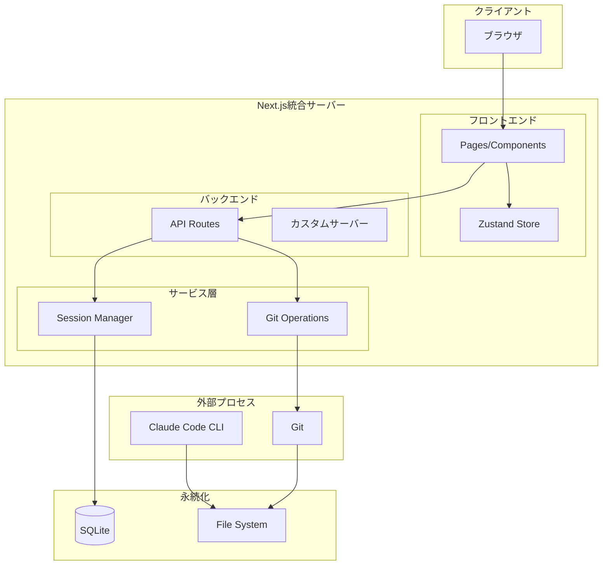
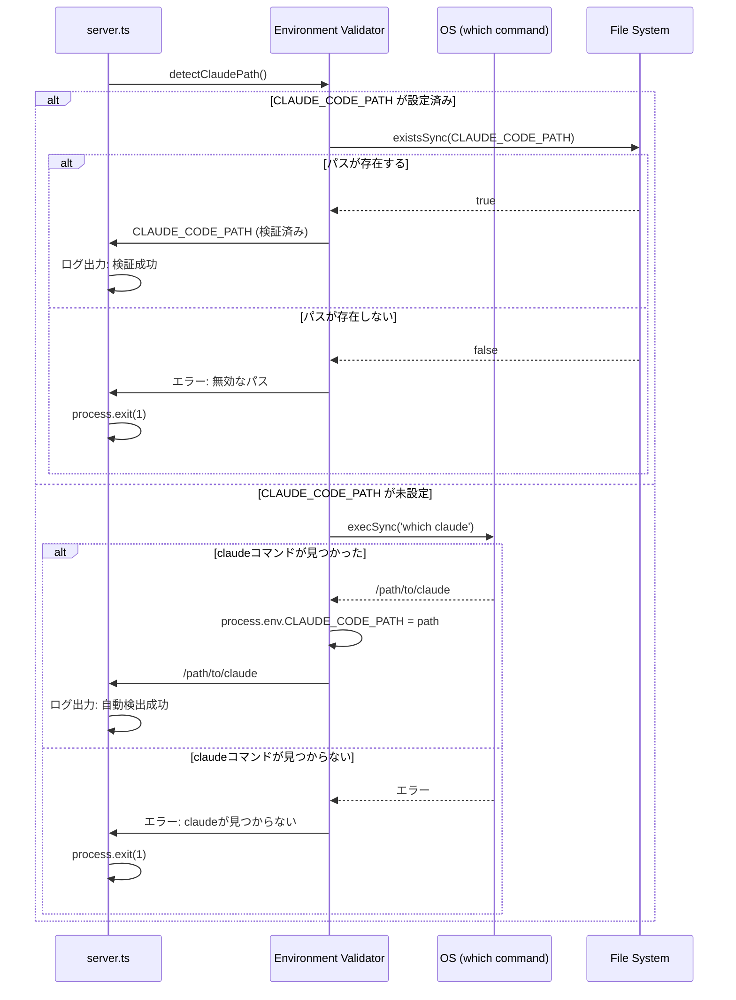
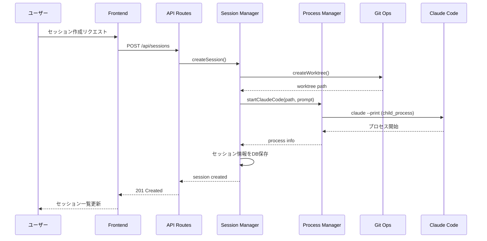

# 設計書: コア機能（プロジェクト・セッション基盤）

## 概要

ClaudeWorkの基盤となるプロジェクト管理、セッション管理、環境検証の設計を定義します。

---

## アーキテクチャ概要

ClaudeWorkは、Next.js統合アーキテクチャを採用する。フロントエンド（Pages/Components）、バックエンド（API Routes）、WebSocketサーバー（カスタムサーバー）を1つのNext.jsプロジェクトに統合し、`npx claude-work`コマンドで起動する。



---

## コンポーネント

### フロントエンド

#### コンポーネント: Pages

**目的**: ユーザーインターフェースの提供

**責務**:
- プロジェクト一覧・詳細の表示
- セッション一覧・詳細の表示

**主要ページ構成**:
- `/` - ダッシュボード（プロジェクト一覧）
- `/projects/[id]` - プロジェクト詳細（セッション一覧）
- `/sessions/[id]` - セッション詳細（Claude Code対話）

#### コンポーネント: Zustand Store

**目的**: クライアント状態管理

**責務**:
- プロジェクト・セッション状態の管理

**ストア構成**:
```typescript
interface AppState {
  // プロジェクト
  projects: Project[];
  selectedProjectId: string | null;

  // セッション
  sessions: Session[];
  selectedSessionId: string | null;
}
```

### バックエンド

#### コンポーネント: API Routes

**目的**: CRUD操作とGit操作のエンドポイント提供

**責務**:
- プロジェクト管理API（Next.js API Routes）
- セッション管理API（Next.js API Routes）
- プロンプト履歴API

**実装場所**: `src/app/api/`配下

#### コンポーネント: Session Manager

**目的**: セッションのライフサイクル管理

**責務**:
- セッションの作成・削除
- セッション状態の追跡
- 複数セッションの一括作成
- サーバー再起動後のセッション復元

#### コンポーネント: Environment Validator

**目的**: サーバー起動時の環境検証

**責務**:
- CLAUDE_CODE_PATH環境変数のチェック
- PATH環境変数からclaudeコマンドの自動検出
- 既存のCLAUDE_CODE_PATHの有効性検証
- claudeコマンドの実行可能性確認
- 検出結果のログ出力

**実装場所**: `src/lib/env-validation.ts`

**検証フロー**:
1. CLAUDE_CODE_PATH環境変数をチェック
2. 設定済みの場合 → パスの有効性を検証
3. 未設定の場合 → PATH環境変数から自動検出
4. 検出/検証失敗時 → エラーメッセージを表示してプロセス終了
5. 検出/検証成功時 → process.env.CLAUDE_CODE_PATHに設定してログ出力

---

## データフロー

### シーケンス: サーバー起動時の環境検証



### シーケンス: セッション作成



---

## API設計

### プロジェクト

#### GET /api/projects
**目的**: プロジェクト一覧取得

**レスポンス（200）**:
```json
{
  "projects": [
    {
      "id": "uuid",
      "name": "my-project",
      "path": "/path/to/repo",
      "run_scripts": [
        {"name": "test", "command": "npm test"},
        {"name": "build", "command": "npm run build"}
      ],
      "session_count": 3,
      "created_at": "2025-12-01T00:00:00Z"
    }
  ]
}
```

#### POST /api/projects
**目的**: プロジェクト追加

**リクエスト**:
```json
{
  "path": "/path/to/git/repo",
  "run_scripts": []
}
```

**レスポンス（201）**:
```json
{
  "project": {
    "id": "uuid",
    "name": "repo-name",
    "path": "/path/to/git/repo",
    "run_scripts": [],
    "created_at": "2025-12-01T00:00:00Z"
  }
}
```

**レスポンス（400）**:
```json
{
  "error": "Not a Git repository"
}
```

**レスポンス（403）**:
```json
{
  "error": "指定されたパスは許可されていません"
}
```

**レスポンス（409）**:
```json
{
  "error": "このパスは既に登録されています"
}
```

#### PUT /api/projects/{id}
**目的**: プロジェクト設定更新

**リクエスト**:
```json
{
  "name": "新しいプロジェクト名",
  "path": "/path/to/git/repo",
  "run_scripts": [
    {"name": "test", "command": "npm test"}
  ]
}
```

#### DELETE /api/projects/{id}
**目的**: プロジェクト削除（worktreeは保持）

### セッション

#### GET /api/projects/{project_id}/sessions
**目的**: セッション一覧取得

**レスポンス（200）**:
```json
{
  "sessions": [
    {
      "id": "uuid",
      "name": "feature-auth",
      "status": "running",
      "git_status": "dirty",
      "worktree_path": "/path/to/worktree",
      "created_at": "2025-12-08T10:00:00Z"
    }
  ]
}
```

#### POST /api/projects/{project_id}/sessions
**目的**: セッション作成（単一または複数）

**リクエスト**:
```json
{
  "name": "feature",
  "prompt": "Implement user authentication",
  "count": 3
}
```

**レスポンス（201）**:
```json
{
  "sessions": [
    {"id": "uuid1", "name": "feature-1"},
    {"id": "uuid2", "name": "feature-2"},
    {"id": "uuid3", "name": "feature-3"}
  ]
}
```

#### GET /api/sessions/{id}
**目的**: セッション詳細取得

#### DELETE /api/sessions/{id}
**目的**: セッション削除（worktreeも削除）

### プロンプト履歴

#### GET /api/prompts
**目的**: プロンプト履歴取得

**注意**: このエンドポイントは未実装です。

#### DELETE /api/prompts/{id}
**目的**: プロンプト履歴削除

**注意**: このエンドポイントは未実装です。

---

## データベーススキーマ

### テーブル: projects

| カラム | 型 | 制約 | 説明 |
|--------|------|------|------|
| id | TEXT | PRIMARY KEY | UUID |
| name | TEXT | NOT NULL | プロジェクト名 |
| path | TEXT | NOT NULL UNIQUE | Gitリポジトリパス |
| created_at | TEXT | NOT NULL | 作成日時（ISO 8601） |
| updated_at | TEXT | NOT NULL | 更新日時（ISO 8601） |

**リレーション**:
- `RunScript` テーブルと1対多のリレーション（project_id経由）

### テーブル: sessions

| カラム | 型 | 制約 | 説明 |
|--------|------|------|------|
| id | TEXT | PRIMARY KEY | UUID |
| project_id | TEXT | FOREIGN KEY | プロジェクトID |
| name | TEXT | NOT NULL | セッション名 |
| status | TEXT | NOT NULL | ステータス |
| worktree_path | TEXT | NOT NULL | worktreeパス |
| branch_name | TEXT | NOT NULL | ブランチ名 |
| created_at | TEXT | NOT NULL | 作成日時 |
| updated_at | TEXT | NOT NULL | 更新日時 |

### テーブル: prompts

| カラム | 型 | 制約 | 説明 |
|--------|------|------|------|
| id | TEXT | PRIMARY KEY | UUID |
| content | TEXT | NOT NULL UNIQUE | プロンプト内容 |
| used_count | INTEGER | DEFAULT 1 | 使用回数 |
| last_used_at | TEXT | NOT NULL | 最終使用日時 |
| created_at | TEXT | NOT NULL | 作成日時 |

### テーブル: run_scripts

| カラム | 型 | 制約 | 説明 |
|--------|------|------|------|
| id | TEXT | PRIMARY KEY | UUID |
| project_id | TEXT | FOREIGN KEY | プロジェクトID |
| name | TEXT | NOT NULL | スクリプト名 |
| description | TEXT | | スクリプトの説明 |
| command | TEXT | NOT NULL | 実行するコマンド |
| created_at | TEXT | NOT NULL | 作成日時（ISO 8601） |
| updated_at | TEXT | NOT NULL | 更新日時（ISO 8601） |

---

## 技術的決定事項

### 決定1: Next.js統合アーキテクチャを採用

**検討した選択肢**:
1. Next.js統合構成 - フロントエンドとバックエンドを1つのプロジェクトに統合
2. Monorepo構成 - フロントエンド(Next.js) + バックエンド(Fastify)を別プロセスで実行

**決定**: Next.js統合構成

**根拠**:
- `npx claude-work`1コマンドで起動できるシンプルさ
- 技術スタックがTypeScriptに統一され、型共有が容易
- デプロイが容易（単一プロセス）
- Next.jsカスタムサーバーでWebSocket統合が可能

### 決定2: データベースにSQLiteを採用

**検討した選択肢**:
1. SQLite - シンプル、ファイルベース、セットアップ不要
2. PostgreSQL - 高機能、スケーラブル、複雑なクエリ対応

**決定**: SQLite（better-sqlite3）

**根拠**:
- 単一ユーザー向けローカル環境では十分な性能
- セットアップ不要でnpmインストールのみで完結
- バックアップがファイルコピーで完了
- better-sqlite3は高速で同期APIが使いやすい

### 決定3: 状態管理にZustandを採用

**決定**: Zustand

**根拠**:
- シンプルなAPIでボイラープレートが少ない
- TypeScriptとの相性が良い
- 中規模アプリケーションに適切なサイズ

### 決定5: Claude CLIパスの自動検出機能を実装

**決定**: PATH環境変数から自動検出（CLAUDE_CODE_PATH設定時は検証のみ）

**根拠**:
- ユーザーがclaudeコマンドをインストール済みなら追加設定不要
- CLAUDE_CODE_PATHが設定済みの場合は既存動作を維持
- 起動時にパスを検証することでエラーを早期発見
- macOS/Linux環境では`which`コマンドで確実に検出可能

---

## エラー処理

### 環境検証（サーバー起動時）

- **claudeコマンド未検出**:
  - エラーメッセージ: `Error: claude command not found in PATH. Please install Claude Code CLI or set CLAUDE_CODE_PATH environment variable.`
  - サーバー起動を停止（process.exit(1)）

- **CLAUDE_CODE_PATH無効**:
  - エラーメッセージ: `Error: CLAUDE_CODE_PATH is set but the path does not exist: ${path}`
  - サーバー起動を停止（process.exit(1)）

- **Windows環境**:
  - エラーメッセージ: `Error: Windows is not supported. Please use macOS or Linux.`
  - サーバー起動を停止（process.exit(1)）

---

## セキュリティ考慮事項

### プロジェクトパス制限

- プロジェクトとして登録可能なパスは環境変数`ALLOWED_PROJECT_DIRS`で制限可能
- `ALLOWED_PROJECT_DIRS`はカンマ区切りで複数のディレクトリパスを指定
- 空文字列または未設定の場合、すべてのパスを許可（開発環境向け）
- 許可外のパスを指定した場合、403 Forbiddenエラーを返す

### 入力検証

- パス入力はディレクトリトラバーサル攻撃を防止
- すべての入力はサニタイズ
- SQLインジェクション対策としてパラメータ化クエリを使用

---

## パフォーマンス考慮事項

### 並列セッション

- 10セッションまでの並列実行をサポート
- 各セッションは独立したプロセスで管理
- メモリ使用量の監視と制限

### データベース

- インデックス: sessions(project_id)
- SQLite WALモードで読み取り性能向上
