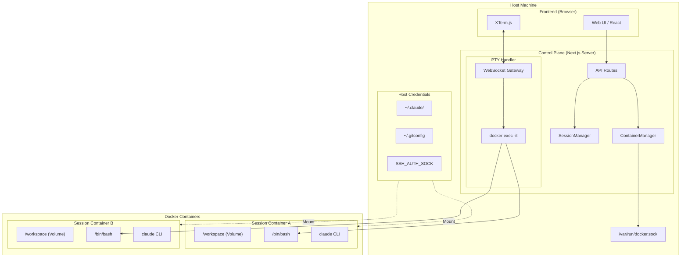
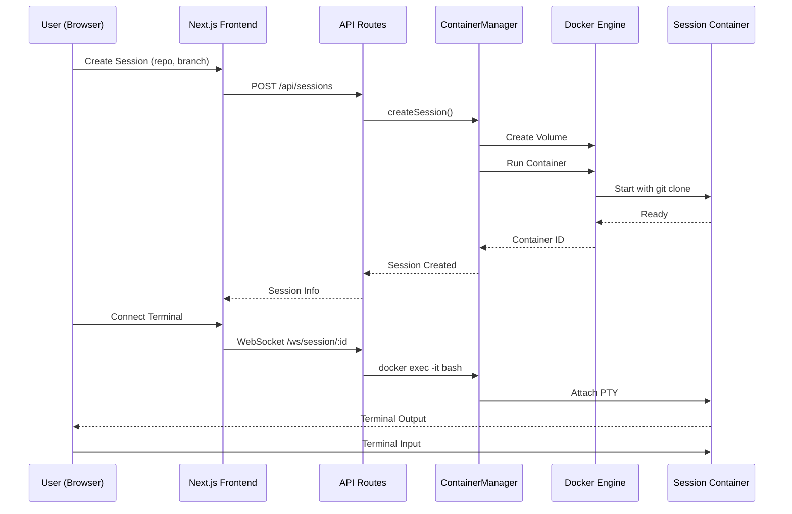

# 設計: Dockerコンテナオーケストレーション型アーキテクチャ

> このドキュメントはAIエージェント（Claude Code等）が実装を行うことを前提としています。

## 情報の明確性チェック

### ユーザーから明示された情報

- [x] 技術スタック: Next.js, dockerode, node-pty, xterm.js
- [x] アーキテクチャパターン: Control Plane (Host) / Data Plane (Container)
- [x] Docker接続方式: docker exec経由（Bridge Server不要）
- [x] 認証情報引き継ぎ: Bind Mount (Claude, Git) + SSH Agent Forwarding
- [x] 既存機能の扱い: Git Worktreeベースを完全置き換え
- [x] データ永続化: Docker Volume + 警告表示
- [x] Node.jsバージョン: 22 LTS
- [x] セキュリティ: アプリ層認証なし（外部プロキシ/VPN前提）

### 不明/要確認の情報

すべて確認済み。

---

## アーキテクチャ概要

### システム構成図



### データフロー



---

## コンポーネント

### コンポーネント1: ContainerManager

**目的**: Dockerコンテナのライフサイクル管理

**責務**:
- コンテナの作成・起動・停止・削除
- Volumeの管理
- 認証情報のマウント設定
- コンテナ状態の監視

**ファイル**: `src/services/container-manager.ts`

**インターフェース**:

```typescript
interface ContainerManager {
  createSession(options: CreateSessionOptions): Promise<Session>;
  startSession(sessionId: string): Promise<void>;
  stopSession(sessionId: string): Promise<void>;
  deleteSession(sessionId: string): Promise<void>;
  getSessionStatus(sessionId: string): Promise<SessionStatus>;
  listSessions(): Promise<Session[]>;
  attachTerminal(sessionId: string): Promise<PTYSession>;
}

interface CreateSessionOptions {
  name: string;
  repoUrl: string;
  branch: string;
}

interface Session {
  id: string;
  name: string;
  containerId: string;
  volumeName: string;
  repoUrl: string;
  branch: string;
  status: SessionStatus;
  createdAt: Date;
}

type SessionStatus = 'creating' | 'running' | 'stopped' | 'error';
```

### コンポーネント2: SessionManager

**目的**: セッション情報の永続化管理

**責務**:
- セッションメタデータのDBへの保存
- セッション一覧の取得
- セッション状態の同期

**ファイル**: `src/services/session-manager.ts`

**インターフェース**:

```typescript
interface SessionManager {
  create(session: SessionCreateInput): Promise<Session>;
  findById(id: string): Promise<Session | null>;
  findAll(): Promise<Session[]>;
  updateStatus(id: string, status: SessionStatus): Promise<void>;
  delete(id: string): Promise<void>;
  getUnpushedWarning(id: string): Promise<UnpushedWarning | null>;
}

interface UnpushedWarning {
  hasUncommittedChanges: boolean;
  unpushedCommitCount: number;
}
```

### コンポーネント3: DockerService

**目的**: dockerode経由のDocker API操作

**責務**:
- Docker Engine接続管理
- コンテナ操作の抽象化
- Volume操作
- イメージ管理

**ファイル**: `src/services/docker-service.ts`

**インターフェース**:

```typescript
interface DockerService {
  isDockerRunning(): Promise<boolean>;
  createContainer(options: ContainerOptions): Promise<Container>;
  startContainer(containerId: string): Promise<void>;
  stopContainer(containerId: string): Promise<void>;
  removeContainer(containerId: string): Promise<void>;
  execCommand(containerId: string, command: string[]): Promise<ExecResult>;
  attachPTY(containerId: string): Promise<PTYStream>;
  createVolume(name: string): Promise<Volume>;
  removeVolume(name: string): Promise<void>;
  getContainerStatus(containerId: string): Promise<ContainerStatus>;
}

interface ContainerOptions {
  image: string;
  name: string;
  env: Record<string, string>;
  volumes: VolumeMount[];
  mounts: BindMount[];
}

interface VolumeMount {
  source: string;      // Volume name
  target: string;      // Container path
}

interface BindMount {
  source: string;      // Host path
  target: string;      // Container path
  readOnly: boolean;
}
```

### コンポーネント4: WebSocket Gateway

**目的**: ターミナルセッションのWebSocket接続管理

**責務**:
- WebSocket接続の確立・維持
- docker execプロセスとの入出力パイプ
- 接続プーリング

**ファイル**: `src/lib/websocket/session-handler.ts`

**明示された情報**:
- `docker exec -it` 経由でコンテナに接続
- node-ptyでPTYセッション管理
- xterm.jsとの双方向通信

---

## Dockerイメージ設計

### Dockerfile

**ファイル**: `docker/Dockerfile`

```dockerfile
FROM node:22-slim

# Install dependencies
RUN apt-get update && apt-get install -y \
    git \
    curl \
    openssh-client \
    && rm -rf /var/lib/apt/lists/*

# Install Claude CLI
RUN npm install -g @anthropic-ai/claude-code

# Set working directory
WORKDIR /workspace

# Entrypoint script
COPY docker-entrypoint.sh /usr/local/bin/
RUN chmod +x /usr/local/bin/docker-entrypoint.sh

ENTRYPOINT ["docker-entrypoint.sh"]
CMD ["tail", "-f", "/dev/null"]
```

### Entrypoint Script

**ファイル**: `docker/docker-entrypoint.sh`

```bash
#!/bin/bash
set -e

# Clone repository if REPO_URL is provided
if [ -n "$REPO_URL" ]; then
    if [ ! -d "/workspace/.git" ]; then
        git clone "$REPO_URL" /workspace
    fi

    if [ -n "$BRANCH" ]; then
        cd /workspace
        git checkout "$BRANCH" || git checkout -b "$BRANCH"
    fi
fi

# Execute CMD
exec "$@"
```

---

## API設計

### REST API

#### POST /api/sessions

**目的**: 新規セッション作成

**リクエスト**:
```json
{
  "name": "my-session",
  "repoUrl": "git@github.com:user/repo.git",
  "branch": "main"
}
```

**レスポンス**:
```json
{
  "id": "session-uuid",
  "name": "my-session",
  "repoUrl": "git@github.com:user/repo.git",
  "branch": "main",
  "status": "creating",
  "createdAt": "2025-01-06T00:00:00Z"
}
```

#### GET /api/sessions

**目的**: セッション一覧取得

**レスポンス**:
```json
{
  "sessions": [
    {
      "id": "session-uuid",
      "name": "my-session",
      "repoUrl": "git@github.com:user/repo.git",
      "branch": "main",
      "status": "running",
      "createdAt": "2025-01-06T00:00:00Z"
    }
  ]
}
```

#### GET /api/sessions/:id

**目的**: セッション詳細取得

#### POST /api/sessions/:id/start

**目的**: 停止中セッションの再開

#### POST /api/sessions/:id/stop

**目的**: セッション停止

#### DELETE /api/sessions/:id

**目的**: セッション削除

#### GET /api/sessions/:id/warning

**目的**: 未プッシュ警告の取得

**レスポンス**:
```json
{
  "hasUncommittedChanges": true,
  "unpushedCommitCount": 3
}
```

### WebSocket API

#### /ws/session/:id

**目的**: ターミナルセッション接続

**メッセージ形式**:

```typescript
// Client -> Server
interface TerminalInput {
  type: 'input';
  data: string;
}

interface TerminalResize {
  type: 'resize';
  cols: number;
  rows: number;
}

// Server -> Client
interface TerminalOutput {
  type: 'output';
  data: string;
}

interface SessionStatus {
  type: 'status';
  status: 'connected' | 'disconnected' | 'error';
  message?: string;
}
```

---

## データベーススキーマ

### Session テーブル（既存を置き換え）

| カラム | 型 | 制約 | 説明 |
|--------|------|------|------|
| id | TEXT | PRIMARY KEY | UUID |
| name | TEXT | NOT NULL | セッション名 |
| container_id | TEXT | NULLABLE | DockerコンテナID |
| volume_name | TEXT | NOT NULL | Docker Volume名 |
| repo_url | TEXT | NOT NULL | リポジトリURL |
| branch | TEXT | NOT NULL | ブランチ名 |
| status | TEXT | NOT NULL | creating/running/stopped/error |
| created_at | DATETIME | NOT NULL | 作成日時 |
| updated_at | DATETIME | NOT NULL | 更新日時 |

### Prismaスキーマ変更

```prisma
model Session {
  id          String   @id @default(uuid())
  name        String
  containerId String?  @map("container_id")
  volumeName  String   @map("volume_name")
  repoUrl     String   @map("repo_url")
  branch      String
  status      String   @default("creating")
  createdAt   DateTime @default(now()) @map("created_at")
  updatedAt   DateTime @updatedAt @map("updated_at")

  @@map("sessions")
}
```

---

## 技術的決定事項

### 決定1: Docker API実装方式

**検討した選択肢**:
1. **dockerode** - Node.js用Docker SDK
2. **CLI (child_process)** - dockerコマンド直接実行

**決定**: dockerode

**根拠**:
- 型安全なAPI
- エラーハンドリングが容易
- ストリーム処理が標準サポート
- 非同期処理との親和性が高い

### 決定2: ターミナル接続方式

**検討した選択肢**:
1. **docker exec** - ホストからexecでアタッチ
2. **Bridge Server** - コンテナ内にエージェントを配置

**決定**: docker exec

**根拠**:
- コンテナイメージをシンプルに保てる
- 追加のネットワーク設定が不要
- 既存のnode-ptyパターンを流用可能

### 決定3: データ永続化

**検討した選択肢**:
1. **Docker Volume** - 永続化
2. **一時ファイルシステム** - コンテナ破棄時に消失

**決定**: Docker Volume + 警告表示

**根拠**:
- セッションのレジュームが可能
- 未プッシュ変更の保護
- ユーザーの作業内容を保持

---

## セキュリティ考慮事項

### 認証情報のマウント

| リソース | マウント方式 | オプション |
|---------|-------------|-----------|
| ~/.claude/ | Bind Mount | Read-only |
| ~/.gitconfig | Bind Mount | Read-only |
| SSH_AUTH_SOCK | Socket Forward | - |

### コンテナ隔離

- ホストのファイルシステムへのアクセスは認証情報のみに限定
- 各セッションは独立したネットワーク名前空間
- リソース制限（CPU/メモリ）は今後の拡張で対応

---

## エラー処理

### Docker未起動時

```typescript
if (!await dockerService.isDockerRunning()) {
  throw new DockerNotRunningError(
    'Docker is not running. Please start Docker Desktop.'
  );
}
```

### コンテナ起動失敗時

```typescript
try {
  await containerManager.createSession(options);
} catch (error) {
  if (error instanceof ContainerCreationError) {
    // DBのセッションをerror状態に更新
    await sessionManager.updateStatus(sessionId, 'error');
    // ユーザーに通知
  }
}
```

### Git Clone失敗時

- コンテナは起動するがクローンが失敗した場合
- エントリポイントでエラーログを出力
- コンテナステータスを監視して検知

---

## 削除対象（既存コード）

以下のファイル/機能は本実装で置き換えられるため削除：

| ファイル | 理由 |
|---------|------|
| src/services/git-service.ts | Git Worktree管理が不要に |
| src/services/claude-pty-manager.ts | ContainerManagerに統合 |
| src/services/pty-manager.ts | ContainerManagerに統合 |
| src/services/process-manager.ts | 不要 |
| prisma/schema.prisma (Project, Message) | 新スキーマに置き換え |
| .worktrees/ ディレクトリ | Docker Volumeに移行 |

---

## ディレクトリ構造（変更後）

```text
claude-work/
├── docker/
│   ├── Dockerfile
│   └── docker-entrypoint.sh
├── src/
│   ├── app/
│   │   ├── api/
│   │   │   └── sessions/
│   │   │       ├── route.ts           # GET, POST
│   │   │       └── [id]/
│   │   │           ├── route.ts       # GET, DELETE
│   │   │           ├── start/route.ts
│   │   │           ├── stop/route.ts
│   │   │           └── warning/route.ts
│   │   └── page.tsx                   # セッション一覧UI
│   ├── components/
│   │   ├── SessionList.tsx
│   │   ├── SessionCard.tsx
│   │   ├── CreateSessionModal.tsx
│   │   └── Terminal.tsx
│   ├── services/
│   │   ├── docker-service.ts
│   │   ├── container-manager.ts
│   │   └── session-manager.ts
│   ├── lib/
│   │   ├── websocket/
│   │   │   └── session-handler.ts
│   │   └── db.ts
│   └── hooks/
│       └── useTerminal.ts
├── prisma/
│   └── schema.prisma
└── server.ts
```
