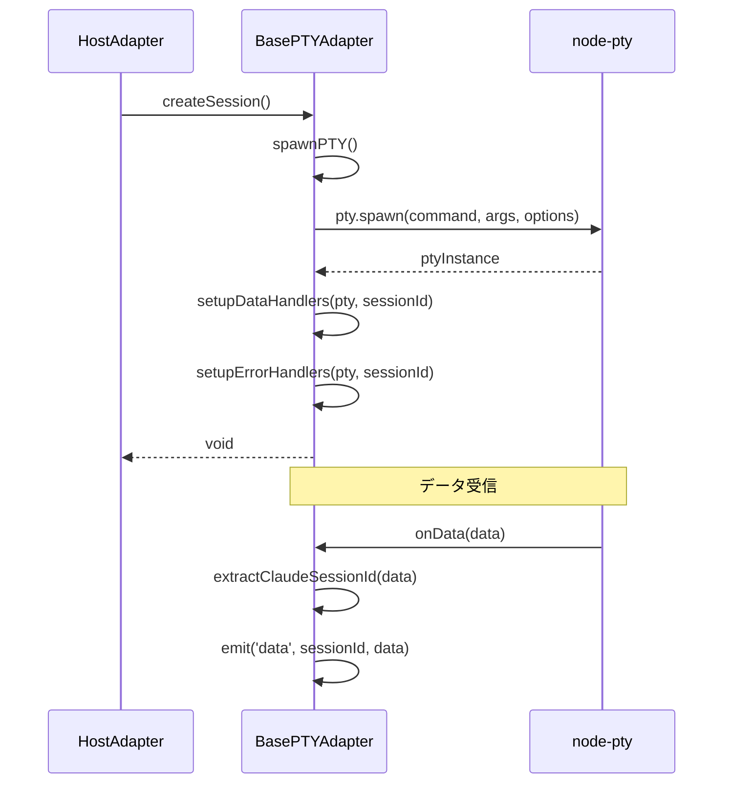

# BasePTYAdapter

## 概要

**目的**: HOST/DOCKER環境で共通のPTYロジックを提供する抽象基底クラス

**責務**:
- PTY spawn共通処理(環境変数、TERM設定)
- cols/rows初期化ロジック
- データハンドリング(ScrollbackBuffer統合)
- エラーハンドリングとクリーンアップ処理
- Claude SessionID抽出機能

## 情報の明確性

### 明示された情報
- TypeScript抽象クラスとして実装
- EnvironmentAdapterインターフェースを実装
- node-ptyを直接使用
- EventEmitterを継承
- US-004の要件に準拠

### 不明/要確認の情報
- [x] extractClaudeSessionId機能の移動: ClaudePTYManagerから移動(確認済み)
- [x] ScrollbackBuffer統合方法: 既存パターンを踏襲(確認済み)

---

## インターフェース

### 抽象メソッド(継承先で実装)

#### `createSession(sessionId, workingDir, initialPrompt?, options?): void | Promise<void>`

**説明**: 環境固有のセッション作成処理

**パラメータ**:
| 名前 | 型 | 必須 | 説明 |
|------|-----|------|------|
| sessionId | string | Yes | セッションID |
| workingDir | string | Yes | 作業ディレクトリ |
| initialPrompt | string | No | 初期プロンプト |
| options | CreateSessionOptions | No | cols/rows等のオプション |

**戻り値**: `void` または `Promise<void>`

**例外**:
- `Error`: セッション作成失敗時

#### `destroySession(sessionId): void`

**説明**: 環境固有のセッション破棄処理

**パラメータ**:
| 名前 | 型 | 必須 | 説明 |
|------|-----|------|------|
| sessionId | string | Yes | セッションID |

---

### 共通メソッド(protected)

#### `spawnPTY(command, args, options): IPty`

**説明**: PTY spawn共通処理

**パラメータ**:
| 名前 | 型 | 必須 | 説明 |
|------|-----|------|------|
| command | string | Yes | 実行コマンド(claude, docker等) |
| args | string[] | Yes | コマンド引数 |
| options | SpawnOptions | Yes | cols/rows, cwd, env等 |

**戻り値**: `IPty` - node-ptyのPTYインスタンス

**処理内容**:
1. cols/rowsのデフォルト値処理(80x24)
2. 環境変数設定(TERM, COLORTERM)
3. pty.spawn()呼び出し
4. PTYインスタンス返却

#### `setupDataHandlers(pty, sessionId): void`

**説明**: データハンドリング設定

**処理内容**:
1. pty.onData()リスナー登録
2. ScrollbackBufferへの書き込み
3. 'data' eventの発火
4. extractClaudeSessionId()呼び出し

#### `setupErrorHandlers(pty, sessionId): void`

**説明**: エラーハンドリング設定

**処理内容**:
1. pty.onExit()リスナー登録
2. 'exit' eventの発火
3. cleanupPTY()呼び出し

#### `cleanupPTY(pty): Promise<void>`

**説明**: PTYクリーンアップ処理

**処理内容**:
1. pty.kill()呼び出し
2. ScrollbackBufferのクリア
3. イベントリスナーの削除

#### `extractClaudeSessionId(data): string | null`

**説明**: Claude SessionID抽出(ClaudePTYManagerから移動)

**パラメータ**:
| 名前 | 型 | 必須 | 説明 |
|------|-----|------|------|
| data | string | Yes | PTY出力データ |

**戻り値**: `string | null` - 抽出されたSessionID、またはnull

**処理内容**:
1. 正規表現マッチング
2. SessionIDが見つかれば'claudeSessionId' event発火
3. SessionIDを返却

---

## 依存関係

### 依存するコンポーネント
- node-pty: PTYプロセス管理
- EventEmitter: イベント通知
- logger: ログ記録

### 依存されるコンポーネント
- [HostAdapter](host-adapter.md) @host-adapter.md: HOST環境実装
- [DockerAdapter](docker-adapter.md) @docker-adapter.md: Docker環境実装

## データフロー



## 内部設計

### クラス構造

```typescript
export abstract class BasePTYAdapter extends EventEmitter implements EnvironmentAdapter {
  // 共通保護メソッド
  protected spawnPTY(command: string, args: string[], options: SpawnOptions): IPty;
  protected setupDataHandlers(pty: IPty, sessionId: string): void;
  protected setupErrorHandlers(pty: IPty, sessionId: string): void;
  protected cleanupPTY(pty: IPty): Promise<void>;
  protected extractClaudeSessionId(data: string): string | null;

  // 抽象メソッド(継承先で実装)
  abstract createSession(
    sessionId: string,
    workingDir: string,
    initialPrompt?: string,
    options?: CreateSessionOptions
  ): void | Promise<void>;

  abstract destroySession(sessionId: string): void;

  // EnvironmentAdapterインターフェース実装
  write(sessionId: string, data: string): void;
  resize(sessionId: string, cols: number, rows: number): void;
  restartSession(sessionId: string): void;
}
```

### PTY Spawn共通処理の実装

```typescript
protected spawnPTY(command: string, args: string[], options: SpawnOptions): IPty {
  const { cols = 80, rows = 24, cwd, env = {} } = options;

  return pty.spawn(command, args, {
    name: 'xterm-256color',
    cols,
    rows,
    cwd,
    env: {
      ...process.env,
      ...env,
      TERM: 'xterm-256color',
      COLORTERM: 'truecolor',
    },
  });
}
```

### Claude SessionID抽出の実装

```typescript
protected extractClaudeSessionId(data: string): string | null {
  // ClaudePTYManagerから移動
  const match = data.match(/Session ID: ([a-f0-9-]{36})/);
  if (match) {
    const claudeSessionId = match[1];
    this.emit('claudeSessionId', sessionId, claudeSessionId);
    return claudeSessionId;
  }
  return null;
}
```

## テスト戦略

### ユニットテスト

1. **spawnPTY()**
   - cols/rowsデフォルト値(80x24)の検証
   - 環境変数設定(TERM, COLORTERM)の検証
   - pty.spawn()呼び出しの検証

2. **extractClaudeSessionId()**
   - 正規表現マッチングの検証
   - 'claudeSessionId' event発火の検証

3. **setupDataHandlers()**
   - pty.onData()リスナー登録の検証
   - 'data' event発火の検証

4. **cleanupPTY()**
   - pty.kill()呼び出しの検証
   - リスナー削除の検証

### モック戦略

- node-ptyをモック化
- EventEmitterのemit()をスパイ
- loggerをモック化

## 品質基準

- テストカバレッジ: 80%以上(NFR-MNT-002)
- 循環的複雑度: 10以下
- コード重複率: 30%以下(NFR-MNT-001)

## 実装ファイル

**作成先**: `src/services/adapters/base-adapter.ts`

**推定行数**: 200-250行

**実装優先度**: 高(他のアダプター実装の前提)
