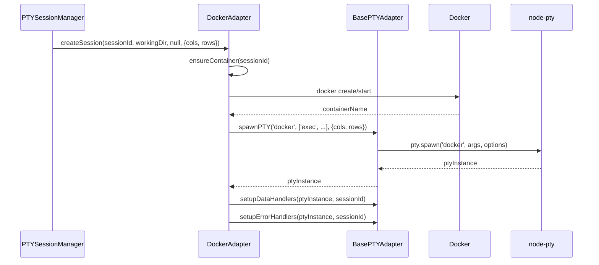
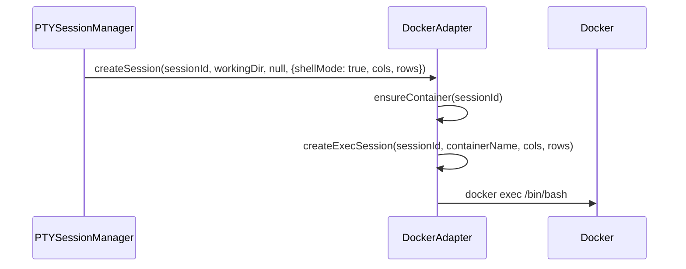

# DockerAdapter

## 概要

**目的**: Docker環境用のPTYアダプター

**責務**:
- Dockerコンテナ内でのClaude Code実行
- Dockerコンテナ内でのシェル実行
- BasePTYAdapterの共通ロジックを利用
- 既存のcols/rows伝播ロジックをbase-adapterへ移動

## 情報の明確性

### 明示された情報
- BasePTYAdapterを継承
- 既存のcols/rows初期化ロジック(docker-adapter.ts:471-489)をbase-adapterへ移動
- Docker固有のロジック(コンテナ準備、exec作成)は維持
- US-003, US-004の要件に準拠

### 不明/要確認の情報
- [x] Dockerコンテナ準備ロジックの変更要否: 変更なし(確認済み)
- [x] createExecSessionのcols/rows問題: 修正対象(確認済み、docker-adapter.ts:329-333)

---

## インターフェース

### 公開メソッド

#### `createSession(sessionId, workingDir, initialPrompt?, options?): Promise<void>`

**説明**: Docker環境でのセッション作成

**パラメータ**:
| 名前 | 型 | 必須 | 説明 |
|------|-----|------|------|
| sessionId | string | Yes | セッションID |
| workingDir | string | Yes | 作業ディレクトリ |
| initialPrompt | string | No | 初期プロンプト |
| options | CreateSessionOptions | No | shellMode, cols/rows等 |

**処理フロー**:
```typescript
async createSession(...) {
  const cols = options?.cols ?? 80;
  const rows = options?.rows ?? 24;

  // Docker固有: コンテナ準備
  const containerName = await this.ensureContainer(sessionId);

  if (options?.shellMode) {
    // シェルモード: docker exec /bin/bash
    await this.createExecSession(sessionId, containerName, cols, rows);
  } else {
    // Claude Codeモード: docker exec claude
    const command = 'docker';
    const args = ['exec', '-it', containerName, 'claude', '--cwd', workingDir];
    const ptyInstance = this.spawnPTY(command, args, { cols, rows });
    this.setupDataHandlers(ptyInstance, sessionId);
    this.setupErrorHandlers(ptyInstance, sessionId);
  }
}
```

#### `destroySession(sessionId): void`

**説明**: Docker環境でのセッション破棄

**処理フロー**:
```typescript
destroySession(sessionId: string): void {
  // BasePTYAdapter経由でクリーンアップ
  await this.cleanupPTY(sessionId);

  // Docker固有: コンテナクリーンアップ
  await this.cleanupContainer(sessionId);
}
```

**重要**: 一方向の呼び出しチェーン → 循環なし

---

## 依存関係

### 依存するコンポーネント
- [BasePTYAdapter](base-adapter.md) @base-adapter.md: 共通PTYロジック
- Docker: コンテナ管理
- logger: ログ記録

### 依存されるコンポーネント
- PTYSessionManager: セッション管理
- AdapterFactory: アダプター作成

## データフロー

### Claude Codeモード(shellMode=false)



### シェルモード(shellMode=true)



## 内部設計

### クラス構造

```typescript
export class DockerAdapter extends BasePTYAdapter {
  // Docker固有の管理用フィールド
  private containers: Map<string, ContainerInfo> = new Map();
  private ptyInstances: Map<string, IPty> = new Map();

  constructor(environmentConfig: DockerEnvironmentConfig) {
    super();
    this.config = environmentConfig;
  }

  // BasePTYAdapterの抽象メソッド実装
  async createSession(sessionId: string, workingDir: string, initialPrompt?: string, options?: CreateSessionOptions): Promise<void> {
    // 上記の処理フロー参照
  }

  async destroySession(sessionId: string): Promise<void> {
    // 上記の処理フロー参照
  }

  // EnvironmentAdapterインターフェース実装
  write(sessionId: string, data: string): void { /* BasePTYAdapter経由 */ }
  resize(sessionId: string, cols: number, rows: number): void { /* BasePTYAdapter経由 */ }

  // Docker固有のメソッド
  private async ensureContainer(sessionId: string): Promise<string> { /* 既存ロジック維持 */ }
  private async createExecSession(sessionId: string, containerName: string, cols: number, rows: number): Promise<void> { /* 修正対象 */ }
  private async cleanupContainer(sessionId: string): Promise<void> { /* 既存ロジック維持 */ }
}
```

### 主要な変更点

**移動(base-adapterへ)**:
- cols/rows初期化ロジック(docker-adapter.ts:471-489)
- PTY spawn処理(TERM, COLORTERM環境変数設定)
- データハンドリング設定

**修正対象**:
- `createExecSession()` (docker-adapter.ts:329-333): cols/rowsをハードコード(80x24)から引数で受け取るように変更

**維持**:
- Docker固有のロジック(ensureContainer, cleanupContainer)
- コンテナ準備・検証ロジック

### createExecSession修正

**現状(問題)**:
```typescript
// docker-adapter.ts:329-333
const ptyProcess = pty.spawn('docker', args, {
  name: 'xterm-256color',
  cols: 80,  // ← ハードコード
  rows: 24,  // ← ハードコード
  env: { ...process.env, TERM: 'xterm-256color', COLORTERM: 'truecolor' },
});
```

**修正後**:
```typescript
private async createExecSession(sessionId: string, containerName: string, cols: number, rows: number): Promise<void> {
  const args = ['exec', '-it', containerName, '/bin/bash'];
  const ptyInstance = this.spawnPTY('docker', args, { cols, rows });
  this.setupDataHandlers(ptyInstance, sessionId);
  this.setupErrorHandlers(ptyInstance, sessionId);
}
```

## テスト戦略

### ユニットテスト

1. **createSession() - Claude Codeモード**
   - cols/rowsがpty.spawn()に正しく渡されることを検証
   - BasePTYAdapter.spawnPTY()が呼び出されることを検証
   - Docker固有のensureContainer()が呼び出されることを検証

2. **createSession() - シェルモード**
   - createExecSession()にcols/rowsが渡されることを検証
   - 80x24にハードコードされていないことを検証

3. **destroySession()**
   - BasePTYAdapter.cleanupPTY()が呼び出されることを検証
   - cleanupContainer()が呼び出されることを検証

### 統合テスト

1. **Docker環境cols/rows伝播の検証**
   - ブラウザから送信されたcols/rowsがDockerコンテナ内のPTYに正しく伝播されることを検証
   - Issue #101の修正が維持されることを検証(回帰テスト)

2. **createExecSessionの検証**
   - シェルモードでcols/rowsが正しく設定されることを検証

## 品質基準

- テストカバレッジ: 80%以上(NFR-MNT-002)
- 循環的複雑度: 10以下
- REQ-003-007: DOCKER環境でのcols/rows伝播が引き続き正常に動作すること(回帰防止)

## 実装ファイル

**変更先**: `src/services/adapters/docker-adapter.ts`

**推定差分行数**: +40, -60行(共通ロジック移動により減少)

**実装優先度**: 高(US-003, US-004)

## 備考

- Issue #101で修正済みのcols/rows伝播ロジック(docker-adapter.ts:471-489)はbase-adapterへ移動
- createExecSession()のハードコード問題も同時に修正
- Docker固有のロジック(コンテナ準備、クリーンアップ)は変更なし
