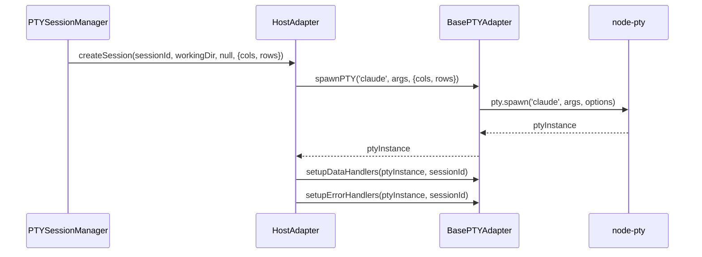
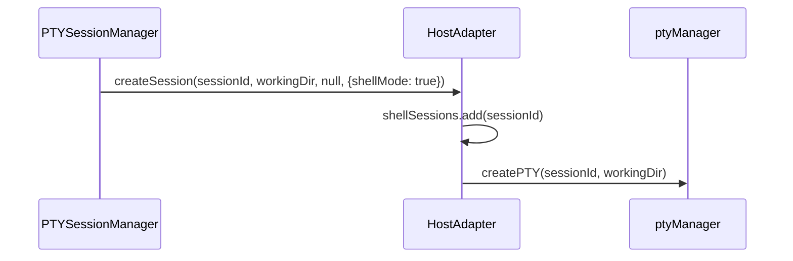

# HostAdapter

## 概要

**目的**: HOST環境(ローカル実行)用のPTYアダプター

**責務**:
- Claude Code実行(shellMode=false)
- シェル実行(shellMode=true)
- BasePTYAdapterの共通ロジックを利用
- ClaudePTYManager依存の削除

## 情報の明確性

### 明示された情報
- BasePTYAdapterを継承
- ClaudePTYManager依存を削除
- shellMode=trueの場合、ptyManagerを使用(変更なし)
- shellMode=falseの場合、BasePTYAdapter経由でnode-ptyを直接使用
- US-001の要件に準拠

### 不明/要確認の情報
- [x] ptyManagerの変更要否: 変更なし(確認済み、スコープ外)
- [x] shellSessionsの管理方法: 既存パターン維持(確認済み)

---

## インターフェース

### 公開メソッド

#### `createSession(sessionId, workingDir, initialPrompt?, options?): void`

**説明**: HOST環境でのセッション作成

**パラメータ**:
| 名前 | 型 | 必須 | 説明 |
|------|-----|------|------|
| sessionId | string | Yes | セッションID |
| workingDir | string | Yes | 作業ディレクトリ |
| initialPrompt | string | No | 初期プロンプト |
| options | CreateSessionOptions | No | shellMode, cols/rows等 |

**処理フロー**:
```typescript
if (options?.shellMode) {
  // シェルモード: ptyManager使用(既存ロジック維持)
  this.shellSessions.add(sessionId);
  ptyManager.createPTY(sessionId, workingDir);
} else {
  // Claude Codeモード: BasePTYAdapter使用
  const cols = options?.cols ?? 80;
  const rows = options?.rows ?? 24;
  const claudeCommand = 'claude';
  const args = ['--cwd', workingDir];
  if (options?.resumeSessionId) {
    args.push('--resume', options.resumeSessionId);
  }
  const ptyInstance = this.spawnPTY(claudeCommand, args, { cols, rows, cwd: workingDir });
  this.setupDataHandlers(ptyInstance, sessionId);
  this.setupErrorHandlers(ptyInstance, sessionId);
}
```

#### `destroySession(sessionId): void`

**説明**: HOST環境でのセッション破棄

**処理フロー**:
```typescript
if (this.shellSessions.has(sessionId)) {
  ptyManager.kill(sessionId);
  this.shellSessions.delete(sessionId);
} else {
  // BasePTYAdapter経由でクリーンアップ
  await this.cleanupPTY(sessionId);
}
```

**重要**: ClaudePTYManager.destroySession()を呼び出さない → 循環参照解消

#### `write(sessionId, data): void`

**説明**: PTYへの入力送信

**処理フロー**:
```typescript
if (this.shellSessions.has(sessionId)) {
  ptyManager.write(sessionId, data);
} else {
  // BasePTYAdapter経由でPTYに書き込み
  this.ptyInstances.get(sessionId)?.write(data);
}
```

#### `resize(sessionId, cols, rows): void`

**説明**: PTYサイズ変更

**処理フロー**:
```typescript
if (this.shellSessions.has(sessionId)) {
  ptyManager.resize(sessionId, cols, rows);
} else {
  this.ptyInstances.get(sessionId)?.resize(cols, rows);
}
```

---

## 依存関係

### 依存するコンポーネント
- [BasePTYAdapter](base-adapter.md) @base-adapter.md: 共通PTYロジック
- ptyManager: シェルモード用PTY管理
- logger: ログ記録

### 依存されるコンポーネント
- PTYSessionManager: セッション管理
- AdapterFactory: アダプター作成

## データフロー

### Claude Codeモード(shellMode=false)



### シェルモード(shellMode=true)



## 内部設計

### クラス構造

```typescript
export class HostAdapter extends BasePTYAdapter {
  // shellModeで作成されたセッションのIDを管理
  private shellSessions: Set<string> = new Set();
  // Claude Codeモードで作成されたPTYインスタンスを管理
  private ptyInstances: Map<string, IPty> = new Map();

  constructor() {
    super();
    // ptyManagerからのイベント転送設定(既存ロジック維持)
    this.setupPtyManagerEvents();
  }

  // BasePTYAdapterの抽象メソッド実装
  createSession(sessionId: string, workingDir: string, initialPrompt?: string, options?: CreateSessionOptions): void {
    // 上記の処理フロー参照
  }

  destroySession(sessionId: string): void {
    // 上記の処理フロー参照
  }

  // EnvironmentAdapterインターフェース実装
  write(sessionId: string, data: string): void { /* 上記参照 */ }
  resize(sessionId: string, cols: number, rows: number): void { /* 上記参照 */ }
  restartSession(sessionId: string): void { /* 既存ロジック維持 */ }

  // ptyManagerイベント転送設定
  private setupPtyManagerEvents(): void {
    // 既存ロジック維持
  }
}
```

### 主要な変更点

**削除**:
- `import { claudePtyManager } from '../claude-pty-manager';` - 削除
- `claudePtyManager.createSession()` - 削除
- `claudePtyManager.destroySession()` - 削除
- `claudePtyManager.on(...)` イベント転送 - 削除

**追加**:
- `extends BasePTYAdapter` - 追加
- `private ptyInstances: Map<string, IPty>` - 追加
- BasePTYAdapterの共通メソッド使用

**維持**:
- shellModeロジック(ptyManager使用)
- shellSessions管理

## テスト戦略

### ユニットテスト

1. **createSession() - Claude Codeモード**
   - cols/rowsがpty.spawn()に正しく渡されることを検証
   - BasePTYAdapter.spawnPTY()が呼び出されることを検証
   - ClaudePTYManagerが呼び出されないことを検証

2. **createSession() - シェルモード**
   - ptyManager.createPTY()が呼び出されることを検証
   - shellSessionsに追加されることを検証

3. **destroySession() - Claude Codeモード**
   - BasePTYAdapter.cleanupPTY()が呼び出されることを検証
   - ClaudePTYManager.destroySession()が呼び出されないことを検証

4. **destroySession() - シェルモード**
   - ptyManager.kill()が呼び出されることを検証
   - shellSessionsから削除されることを検証

### 統合テスト

1. **Circular delegation解消の検証**
   - セッション作成時、createSession()が1回のみ呼び出されることを検証
   - "Session already exists"エラーが発生しないことを検証

2. **cols/rows伝播の検証**
   - ブラウザから送信されたcols/rowsがPTYに正しく伝播されることを検証

## 品質基準

- テストカバレッジ: 80%以上(NFR-MNT-002)
- 循環的複雑度: 10以下
- REQ-001-007: createSession()が1回のみ呼び出されること

## 実装ファイル

**変更先**: `src/services/adapters/host-adapter.ts`

**推定差分行数**: +50, -30行

**実装優先度**: 高(US-001, US-003)
