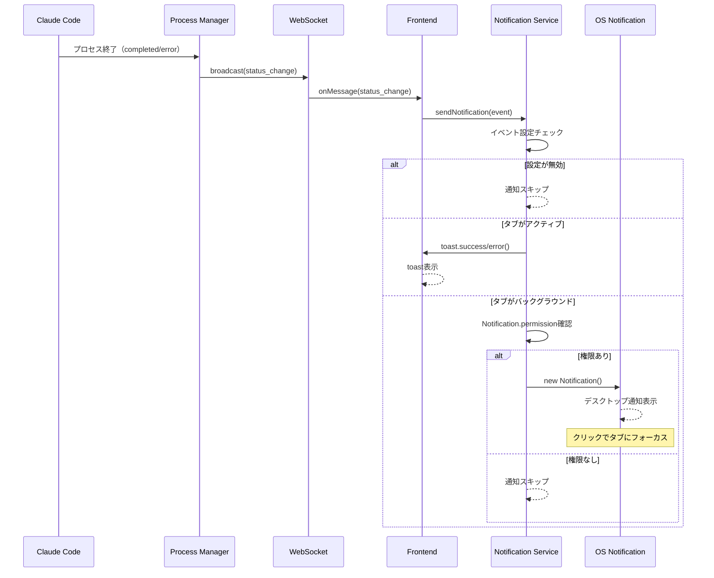
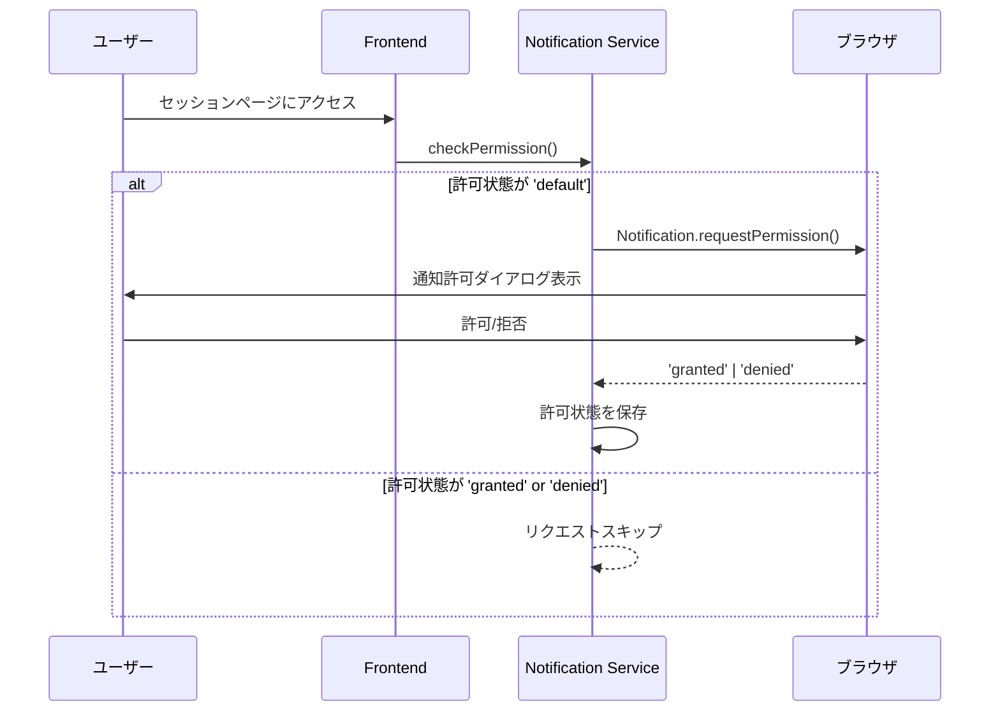
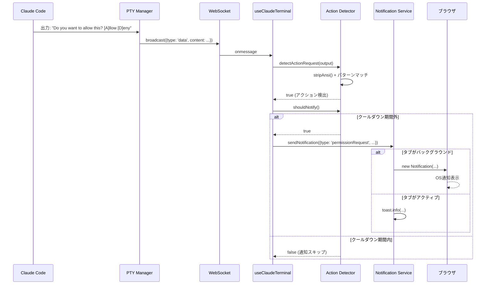

# 設計書: ブラウザ通知

## 概要

ブラウザ通知機能（OS通知とアプリ内toast通知）の設計を定義します。

---

## コンポーネント

### フロントエンド

#### コンポーネント: Notification Service

**目的**: ブラウザ通知とアプリ内toast通知の管理

**責務**:
- ブラウザ通知権限のリクエストと状態管理
- OS通知（Notification API）の送信
- アプリ内toast通知の送信
- タブのアクティブ/バックグラウンド状態の検出
- イベント別通知設定の管理と永続化

**実装場所**: `src/lib/notification-service.ts`

**対応イベント**:

| イベント | OS通知タイトル | 条件 |
|----------|----------------|------|
| タスク完了 | タスク完了: [セッション名] | `status_change` で `completed` |
| 権限要求 | アクション要求: [セッション名] | `permission_request` メッセージ |
| エラー発生 | エラー発生: [セッション名] | `status_change` で `error` または `error` メッセージ |

**通知ルーティング**:
```typescript
function sendNotification(event: NotificationEvent): void {
  const settings = getSettings();

  // イベント別の有効/無効チェック
  if (!isEventEnabled(event.type, settings)) return;

  // タブのアクティブ状態で通知方法を切り替え
  if (document.visibilityState === 'visible') {
    // アプリ内toast通知
    showToast(event);
  } else {
    // OS通知（権限がある場合のみ）
    if (Notification.permission === 'granted') {
      showOSNotification(event);
    } else {
      // 権限が未許可の場合はtoast通知にフォールバック
      // （ユーザーがページに戻った際に表示される）
      showToast(event);
    }
  }
}
```

**設定の永続化**:
- ローカルストレージのキー: `claudework:notification-settings`
- デフォルト: すべてのイベントで通知有効

#### コンポーネント: Notification Store

**目的**: 通知状態の管理

**ストア構成**:
```typescript
// 通知設定（別ストアとして実装）
interface NotificationState {
  // 通知許可状態
  permission: 'default' | 'granted' | 'denied';

  // イベント別通知設定
  settings: {
    onTaskComplete: boolean;    // タスク完了時
    onPermissionRequest: boolean; // 権限要求時
    onError: boolean;           // エラー発生時
  };

  // アクション
  requestPermission: () => Promise<void>;
  updateSettings: (settings: Partial<NotificationSettings>) => void;
  sendNotification: (event: NotificationEvent) => void;
}
```

---

## データフロー

### シーケンス: ブラウザ通知



### シーケンス: 通知許可リクエスト



### シーケンス: アクション要求検出と通知



---

## 実装詳細

### アクション検出ユーティリティ

**実装場所**: `src/lib/action-detector.ts`

```typescript
// ANSIエスケープシーケンス除去（より完全なパターン）
export function stripAnsi(str: string): string {
  // CSI sequences, OSC sequences, その他のコントロールシーケンスを除去
  return str
    .replace(/\x1B\[[0-9;]*[A-Za-z]/g, '')  // CSI
    .replace(/\x1B\][^\x07]*\x07/g, '')      // OSC
    .replace(/\x1B[PX^_][^\x1B]*\x1B\\/g, '') // DCS, SOS, PM, APC
    .replace(/\x1B[\x40-\x5F]/g, '');         // C1 control codes
}

// ユーザーアクション要求パターン（Claude CLI実際の出力に対応）
const ACTION_PATTERNS = [
  // Allow/Deny選択（Claude CLIの実際のパターン）
  /Allow|Deny/,
  /\[Y\]es.*\[N\]o/i,
  /Yes.*to confirm/i,
  /Press Enter to continue/i,
  // ツール実行確認
  /Do you want to/i,
  /Would you like to/i,
  /Shall I/i,
  // 入力待ちプロンプト
  /\?[\s]*$/,
  /Enter your/i,
  /Type your/i,
  // Claude特有のパターン
  /waiting for.*input/i,
  /requires.*confirmation/i,
];

// 通知クールダウンをクロージャで実装
export function createCooldownChecker(cooldownMs: number = 5000): () => boolean {
  let lastTime = 0;
  return () => {
    const now = Date.now();
    if (now - lastTime >= cooldownMs) {
      lastTime = now;
      return true;
    }
    return false;
  };
}

export function detectActionRequest(output: string): boolean {
  const cleanOutput = stripAnsi(output);

  // 短すぎる出力は無視
  if (cleanOutput.trim().length < 5) {
    return false;
  }

  for (const pattern of ACTION_PATTERNS) {
    if (pattern.test(cleanOutput)) {
      return true;
    }
  }
  return false;
}
```

### フック変更（useClaudeTerminal）

**実装場所**: `src/hooks/useClaudeTerminal.ts`

```typescript
import { detectActionRequest, createCooldownChecker } from '@/lib/action-detector';
import { sendNotification } from '@/lib/notification-service';

export function useClaudeTerminal(sessionId: string) {
  // クールダウンチェッカーを初期化時に一度だけ作成
  const notificationCooldownRef = useRef<(() => boolean) | null>(null);
  if (!notificationCooldownRef.current) {
    notificationCooldownRef.current = createCooldownChecker(5000);
  }

  // 出力受信時の処理を拡張
  const handleOutput = useCallback((data: string) => {
    terminal?.write(data);

    // アクション要求パターン検出
    if (
      detectActionRequest(data) &&
      notificationCooldownRef.current &&
      notificationCooldownRef.current()
    ) {
      sendNotification({
        type: 'permissionRequest',
        sessionId,
        sessionName: currentSession?.name || 'Unknown',
        message: 'Claudeがユーザーアクションを待っています'
      });
    }
  }, [terminal, sessionId, currentSession]);

  // WebSocketメッセージハンドラ
  useEffect(() => {
    if (!ws) return;

    ws.onmessage = (event) => {
      const message = JSON.parse(event.data);

      if (message.type === 'data') {
        handleOutput(message.content);
      }
    };
  }, [ws, handleOutput]);
}
```

### 通知サービス

**実装場所**: `src/lib/notification-service.ts`

```typescript
export type NotificationEventType =
  | 'taskComplete'
  | 'permissionRequest'
  | 'error'
  | 'actionRequired';

const DEFAULT_MESSAGES: Record<NotificationEventType, string> = {
  taskComplete: 'タスクが完了しました',
  permissionRequest: '権限確認が必要です',
  error: 'エラーが発生しました',
  actionRequired: 'ユーザーアクションが必要です',
};

export interface NotificationSettings {
  onTaskComplete: boolean;
  onPermissionRequest: boolean;
  onError: boolean;
  onActionRequired: boolean;
}
```

---

## 要件との整合性チェック

| 要件ID | 要件内容 | 設計対応 |
|--------|----------|----------|
| REQ-137 | パターン検出で通知送信 | action-detector.ts |
| REQ-138 | Allow/Deny等のパターン検出 | ACTION_PATTERNS配列 |
| REQ-139 | ANSIエスケープ除去後に検出 | stripAnsi() |
| REQ-140 | 5秒以内の重複通知抑制 | NOTIFICATION_COOLDOWN |
| REQ-141 | 設定オフ時は通知しない | isEventEnabled()チェック |
