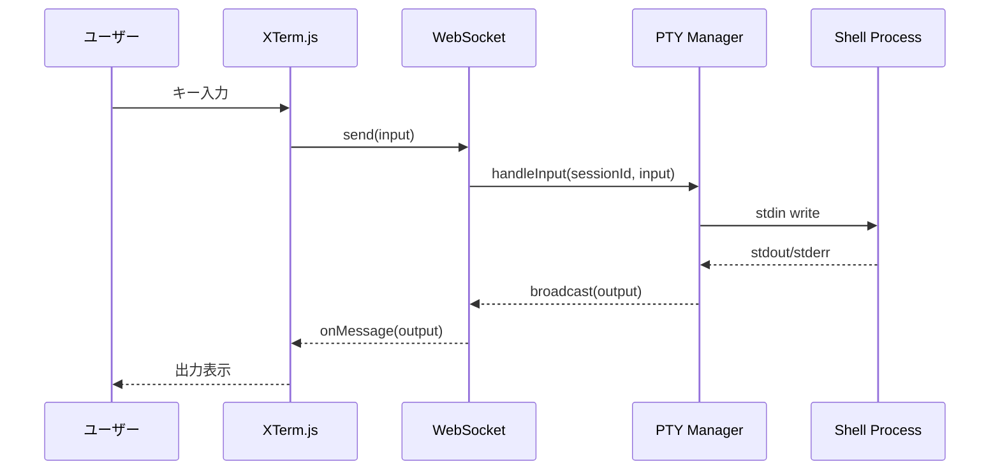
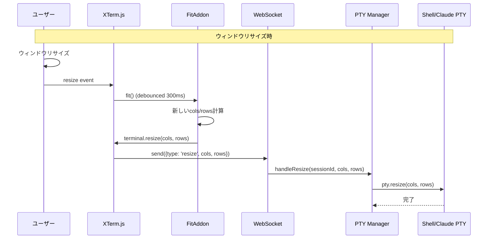
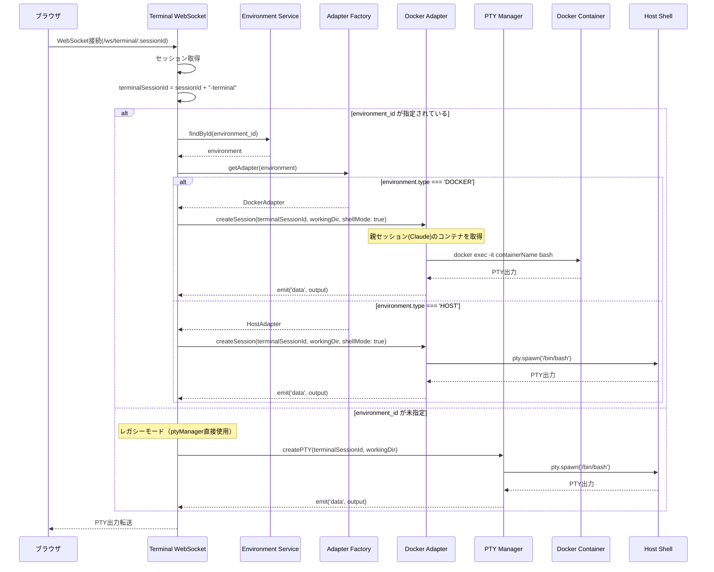

# 設計書: ターミナル統合

## 概要

ターミナル統合機能（XTerm.js）およびターミナルサイズの自動調整機能の設計を定義します。

---

## コンポーネント

### フロントエンド

#### コンポーネント: WebSocket Client

**目的**: リアルタイム通信の管理

**責務**:
- ターミナル入出力の送受信
- 接続状態の管理と自動再接続

### バックエンド

#### コンポーネント: PTY Manager

**目的**: ターミナルセッションの管理

**責務**:
- PTYプロセスの生成
- 入出力のWebSocket中継
- セッションごとのPTY管理
- ANSIエスケープシーケンスの透過的転送

**実装場所**: `src/services/pty-manager.ts`（node-ptyライブラリ使用）

#### コンポーネント: Environment Adapter

**目的**: 実行環境の抽象化とPTY操作の統一インターフェース提供

**責務**:
- 環境タイプに依存しないPTY操作の提供
- セッションのライフサイクル管理
- 入出力イベントの統一的な発行

**実装場所**: `src/services/environment-adapter.ts`

**インターフェース**:
```typescript
interface CreateSessionOptions {
  model?: string;
  shellMode?: boolean;  // true: シェルターミナルモード、false: Claude対話モード（デフォルト）
}

interface EnvironmentAdapter extends EventEmitter {
  createSession(sessionId: string, workingDir: string, initialPrompt?: string, options?: CreateSessionOptions): Promise<void>;
  write(sessionId: string, data: string): void;
  resize(sessionId: string, cols: number, rows: number): void;
  destroySession(sessionId: string): void;
  restartSession(sessionId: string): void;
  hasSession(sessionId: string): boolean;
  getWorkingDir(sessionId: string): string | undefined;

  // イベント: 'data', 'exit', 'error', 'claudeSessionId'
}
```

---

## データフロー

### シーケンス: ターミナル操作



### シーケンス: ターミナルリサイズフロー



---

## WebSocket API

### ターミナルWebSocket

```text
ws://host/ws/terminal/{session_id}
```

バイナリデータとして入出力を送受信。

### メッセージ形式

**データ送受信**:
- **入力データ（クライアント → サーバー）**: バイナリ（UTF-8エンコードされたテキスト）として送信。制御メッセージ（リサイズなど）はJSON形式
- **出力データ（サーバー → クライアント）**: バイナリ（UTF-8エンコードされたテキスト）として送信

#### クライアント → サーバー

```typescript
// テキスト入力: バイナリ（UTF-8文字列）として直接送信

// リサイズメッセージ: JSON形式
interface ResizeMessage {
  type: 'resize';
  cols: number;
  rows: number;
}
```

---

## 実装詳細

### ストーリー18: ターミナルサイズの自動調整

#### コンポーネント変更

**変更対象**: `src/hooks/useClaudeTerminal.ts`, `src/hooks/useTerminal.ts`

```typescript
// XTerm.js FitAddon の追加
import { FitAddon } from 'xterm-addon-fit';

interface UseTerminalOptions {
  sessionId: string;
  onResize?: (cols: number, rows: number) => void;
}

// ターミナル初期化時にFitAddonを追加
const fitAddon = new FitAddon();
terminal.loadAddon(fitAddon);

// 初期フィット実行
useEffect(() => {
  if (terminalRef.current && isConnected) {
    fitAddon.fit();
    // サーバーにリサイズイベント送信
    sendResize(terminal.cols, terminal.rows);
  }
}, [isConnected, isVisible]);

// ウィンドウリサイズ時のデバウンス付きリサイズ
useEffect(() => {
  const handleResize = debounce(() => {
    if (terminalRef.current) {
      fitAddon.fit();
      sendResize(terminal.cols, terminal.rows);
    }
  }, 300);

  window.addEventListener('resize', handleResize);
  return () => window.removeEventListener('resize', handleResize);
}, []);
```

**変更対象**: `src/components/sessions/ClaudeTerminalPanel.tsx`, `src/components/sessions/TerminalPanel.tsx`

- `isVisible` prop を hooks に渡してタブ切り替え時のリサイズをトリガー
- コンテナに `ref` を設定し、ResizeObserver でサイズ変更を検知

**サーバー側変更**: `src/services/claude-pty-manager.ts`, `src/services/pty-manager.ts`

```typescript
// リサイズメッセージ受信時
handleMessage(sessionId: string, message: WebSocketMessage) {
  if (message.type === 'resize') {
    const pty = this.getPty(sessionId);
    if (pty) {
      pty.resize(message.cols, message.rows);
    }
  }
}
```

#### 依存パッケージ追加

```bash
npm install xterm-addon-fit
```

---

## WebSocket環境対応

### Terminal WebSocket (`/ws/terminal/:id`)

**環境切替ロジック**:
1. `session.environment_id`が指定 → AdapterFactory経由でアダプター取得
2. Docker環境 → `--entrypoint /bin/sh`でコンテナ内シェルを起動
3. HOST環境 → ptyManagerでホストシェルを起動

**実装場所**: `src/lib/websocket/terminal-ws.ts`

**シーケンス図: Terminal WebSocketの環境切替**:



---

## 要件との整合性チェック

| 要件ID | 要件内容 | 設計対応 |
|--------|----------|----------|
| REQ-114 | コンテナサイズに合わせたターミナルサイズ計算 | FitAddon + ResizeObserver |
| REQ-115 | ウィンドウリサイズ時の300ms以内再計算 | debounce(300ms) + fit() |
| REQ-116 | タブ切り替え時のリサイズ | isVisible prop + useEffect |
| REQ-117 | WebSocketでリサイズイベント送信 | ResizeMessage + pty.resize() |
| REQ-118 | Claude/Shell両方に同じリサイズ動作 | 共通フック実装 |
