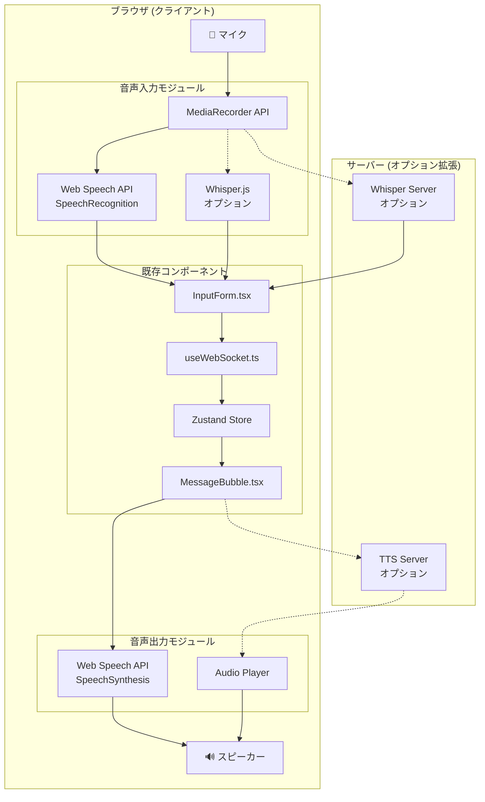
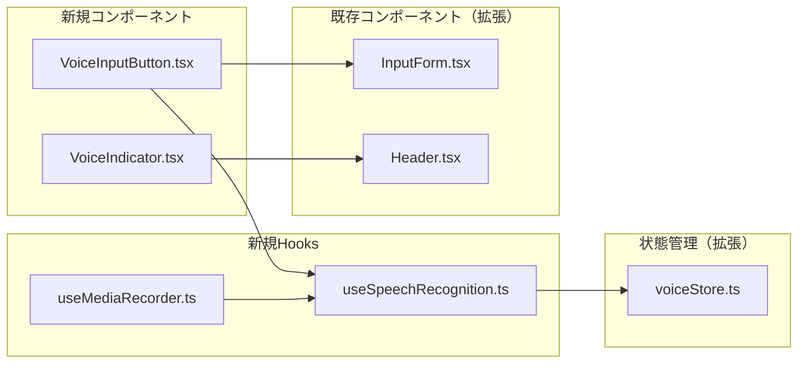
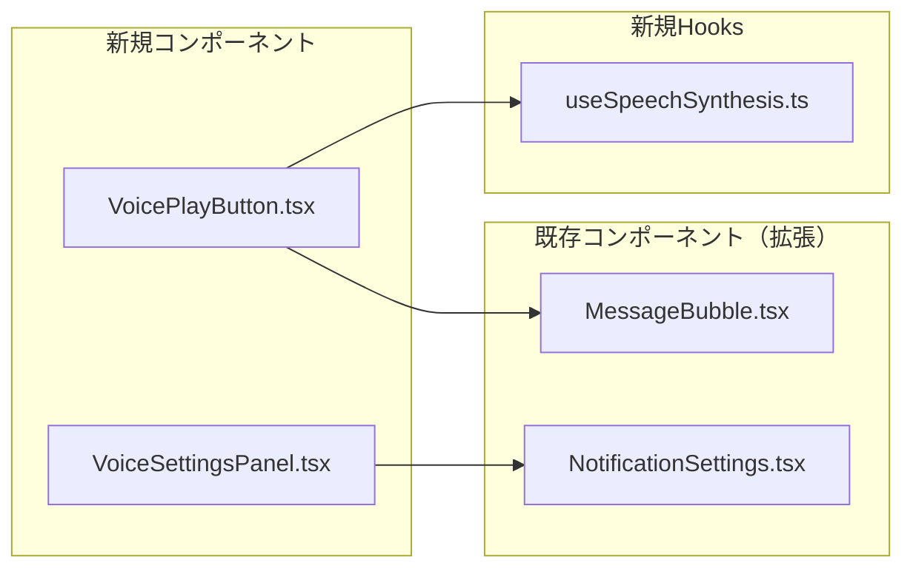
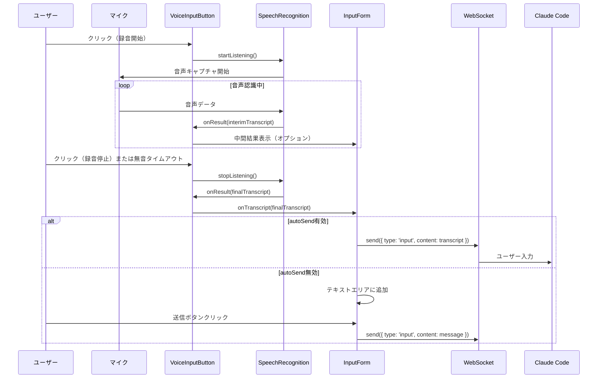
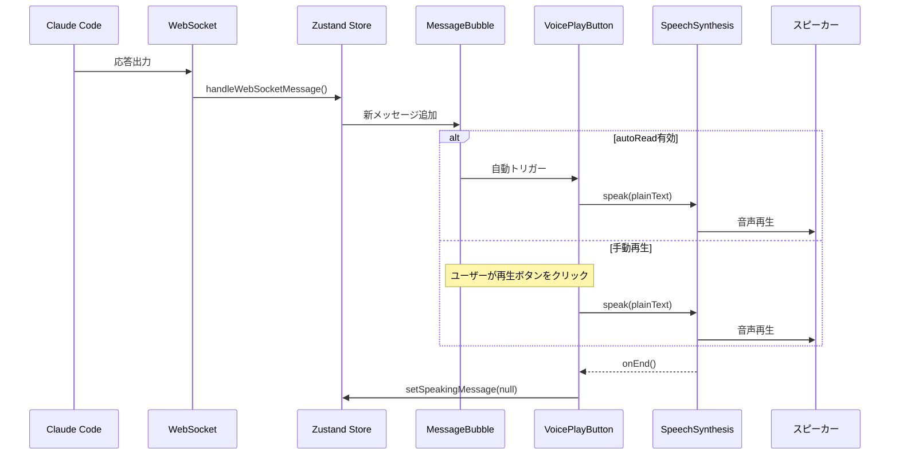

# 音声機能 ソフトウェア設計書 (SDD)

## 1. 概要

### 1.1 目的

ClaudeWorkに音声入力（Speech-to-Text）と音声読み上げ（Text-to-Speech）機能を追加し、ハンズフリーでのClaude Code操作を可能にする。

### 1.2 スコープ

- **音声入力**: マイクからの音声をテキストに変換し、Claude Codeへ送信
- **音声読み上げ**: Claude Codeの出力テキストを音声で読み上げ

### 1.3 参考資料

- [Web Speech API - MDN](https://developer.mozilla.org/en-US/docs/Web/API/Web_Speech_API)
- [Whisper-Web (Transformers.js)](https://github.com/xenova/whisper-web)
- [Web Speech API SpeechSynthesis - MDN](https://developer.mozilla.org/en-US/docs/Web/API/SpeechSynthesis)

---

## 2. アーキテクチャ概要

### 2.1 システム構成図



### 2.2 技術選定

#### 音声入力（Speech-to-Text）

| オプション | 利点 | 欠点 | 推奨度 |
|-----------|------|------|--------|
| **Web Speech API (SpeechRecognition)** | ブラウザ標準、実装容易、低コスト | Chrome/Edge限定、オンライン依存 | ⭐⭐⭐ **推奨（Phase 1）** |
| Whisper.js (Transformers.js) | オフライン対応、高精度 | 初回ロード大、CPU負荷 | ⭐⭐ Phase 2 |
| Whisper Server (OpenAI API) | 最高精度 | コスト発生、レイテンシ | ⭐ オプション |

#### 音声出力（Text-to-Speech）

| オプション | 利点 | 欠点 | 推奨度 |
|-----------|------|------|--------|
| **Web Speech API (SpeechSynthesis)** | ブラウザ標準、無料、オフライン対応 | 音声品質は環境依存 | ⭐⭐⭐ **推奨** |
| OpenAI TTS API | 高品質音声 | コスト発生 | ⭐ オプション |

---

## 3. 詳細設計

### 3.1 音声入力機能

#### 3.1.1 コンポーネント構成



#### 3.1.2 インターフェース定義

```typescript
// src/types/voice.ts

/** 音声入力の状態 */
export type VoiceInputStatus =
  | 'idle'           // 待機中
  | 'listening'      // 音声認識中
  | 'processing'     // 処理中（Whisper使用時）
  | 'error';         // エラー

/** 音声認識結果 */
export interface SpeechRecognitionResult {
  transcript: string;      // 認識テキスト
  confidence: number;      // 信頼度 (0-1)
  isFinal: boolean;       // 確定結果かどうか
}

/** 音声入力設定 */
export interface VoiceInputSettings {
  enabled: boolean;                    // 音声入力有効
  language: string;                    // 認識言語 (e.g., 'ja-JP', 'en-US')
  continuous: boolean;                 // 連続認識モード
  interimResults: boolean;             // 中間結果表示
  autoSend: boolean;                   // 認識完了時に自動送信
  silenceTimeout: number;              // 無音タイムアウト (ms)
}

/** 音声出力設定 */
export interface VoiceOutputSettings {
  enabled: boolean;                    // 音声読み上げ有効
  voice: string | null;                // 使用する音声 (null = デフォルト)
  rate: number;                        // 読み上げ速度 (0.1 - 10)
  pitch: number;                       // ピッチ (0 - 2)
  volume: number;                      // 音量 (0 - 1)
  autoRead: boolean;                   // アシスタント応答を自動読み上げ
  readCodeBlocks: boolean;             // コードブロックも読み上げ
}
```

#### 3.1.3 useSpeechRecognition Hook

```typescript
// src/hooks/useSpeechRecognition.ts

interface UseSpeechRecognitionReturn {
  // 状態
  isListening: boolean;
  isSupported: boolean;
  error: string | null;
  transcript: string;
  interimTranscript: string;

  // アクション
  startListening: () => void;
  stopListening: () => void;
  resetTranscript: () => void;

  // 設定
  setLanguage: (lang: string) => void;
}

export function useSpeechRecognition(
  options?: Partial<VoiceInputSettings>
): UseSpeechRecognitionReturn {
  // Web Speech API SpeechRecognition を使用
  // ブラウザ互換性: Chrome, Edge, Safari (webkit prefix)
  // Firefox: 未サポート（フォールバック必要）
}
```

#### 3.1.4 VoiceInputButton コンポーネント

```typescript
// src/components/voice/VoiceInputButton.tsx

interface VoiceInputButtonProps {
  onTranscript: (text: string) => void;  // 認識結果コールバック
  disabled?: boolean;                     // 無効化
  className?: string;                     // スタイル
}

/**
 * マイクボタンコンポーネント
 *
 * 状態表示:
 * - idle: グレーのマイクアイコン
 * - listening: 赤い点滅アニメーション
 * - processing: スピナー
 * - error: 赤いマイクアイコン + ツールチップ
 */
export function VoiceInputButton({ onTranscript, disabled }: VoiceInputButtonProps) {
  const { isListening, startListening, stopListening, transcript } = useSpeechRecognition();

  // トグル動作: クリックで開始/停止
  // 認識完了時に onTranscript を呼び出し
}
```

### 3.2 音声読み上げ機能

#### 3.2.1 コンポーネント構成



#### 3.2.2 useSpeechSynthesis Hook

```typescript
// src/hooks/useSpeechSynthesis.ts

interface UseSpeechSynthesisReturn {
  // 状態
  isSpeaking: boolean;
  isPaused: boolean;
  isSupported: boolean;
  voices: SpeechSynthesisVoice[];

  // アクション
  speak: (text: string, options?: SpeakOptions) => void;
  pause: () => void;
  resume: () => void;
  cancel: () => void;

  // 設定
  setVoice: (voice: SpeechSynthesisVoice) => void;
  setRate: (rate: number) => void;
  setPitch: (pitch: number) => void;
  setVolume: (volume: number) => void;
}

interface SpeakOptions {
  voice?: SpeechSynthesisVoice;
  rate?: number;
  pitch?: number;
  volume?: number;
  onEnd?: () => void;
  onError?: (error: Error) => void;
}
```

#### 3.2.3 VoicePlayButton コンポーネント

```typescript
// src/components/voice/VoicePlayButton.tsx

interface VoicePlayButtonProps {
  text: string;                    // 読み上げるテキスト
  disabled?: boolean;
  className?: string;
}

/**
 * 読み上げボタンコンポーネント
 *
 * 状態表示:
 * - idle: スピーカーアイコン
 * - speaking: 音波アニメーション + 停止ボタン
 * - paused: 一時停止アイコン
 */
export function VoicePlayButton({ text, disabled }: VoicePlayButtonProps) {
  const { speak, cancel, isSpeaking } = useSpeechSynthesis();

  // クリックで再生/停止トグル
  // Markdownからプレーンテキストを抽出して読み上げ
}
```

### 3.3 状態管理

#### 3.3.1 Voice Store

```typescript
// src/store/voice.ts

import { create } from 'zustand';
import { persist } from 'zustand/middleware';

interface VoiceState {
  // 音声入力設定
  inputSettings: VoiceInputSettings;
  inputStatus: VoiceInputStatus;

  // 音声出力設定
  outputSettings: VoiceOutputSettings;
  currentlySpeakingMessageId: string | null;

  // アクション
  updateInputSettings: (settings: Partial<VoiceInputSettings>) => void;
  updateOutputSettings: (settings: Partial<VoiceOutputSettings>) => void;
  setInputStatus: (status: VoiceInputStatus) => void;
  setSpeakingMessage: (messageId: string | null) => void;
}

export const useVoiceStore = create<VoiceState>()(
  persist(
    (set) => ({
      inputSettings: {
        enabled: false,
        language: 'ja-JP',
        continuous: true,
        interimResults: true,
        autoSend: false,
        silenceTimeout: 2000,
      },
      inputStatus: 'idle',
      outputSettings: {
        enabled: false,
        voice: null,
        rate: 1.0,
        pitch: 1.0,
        volume: 1.0,
        autoRead: false,
        readCodeBlocks: false,
      },
      currentlySpeakingMessageId: null,

      updateInputSettings: (settings) =>
        set((state) => ({
          inputSettings: { ...state.inputSettings, ...settings },
        })),
      updateOutputSettings: (settings) =>
        set((state) => ({
          outputSettings: { ...state.outputSettings, ...settings },
        })),
      setInputStatus: (status) => set({ inputStatus: status }),
      setSpeakingMessage: (messageId) => set({ currentlySpeakingMessageId: messageId }),
    }),
    {
      name: 'voice-settings',
      partialize: (state) => ({
        inputSettings: state.inputSettings,
        outputSettings: state.outputSettings,
      }),
    }
  )
);
```

### 3.4 UI統合

#### 3.4.1 InputForm 拡張

```typescript
// src/components/session/InputForm.tsx の拡張

export function InputForm({ onSubmit, disabled }: InputFormProps) {
  const [message, setMessage] = useState('');
  const { inputSettings } = useVoiceStore();

  const handleVoiceTranscript = (transcript: string) => {
    if (inputSettings.autoSend) {
      onSubmit(transcript);
    } else {
      setMessage((prev) => prev + ' ' + transcript);
    }
  };

  return (
    <form onSubmit={handleFormSubmit} className="flex items-end gap-2">
      <textarea
        value={message}
        onChange={(e) => setMessage(e.target.value)}
        // ... 既存のプロパティ
      />

      {/* 新規: 音声入力ボタン */}
      {inputSettings.enabled && (
        <VoiceInputButton
          onTranscript={handleVoiceTranscript}
          disabled={disabled}
        />
      )}

      <button type="submit" disabled={disabled || !message.trim()}>
        送信
      </button>
    </form>
  );
}
```

#### 3.4.2 MessageBubble 拡張

```typescript
// src/components/session/MessageBubble.tsx の拡張

export function MessageBubble({ message }: MessageBubbleProps) {
  const { outputSettings } = useVoiceStore();

  // Markdownからプレーンテキストを抽出
  const plainText = extractPlainText(message.content, {
    includeCodeBlocks: outputSettings.readCodeBlocks,
  });

  return (
    <div className={`message-bubble ${message.role}`}>
      <MessageDisplay content={message.content} />

      {/* 新規: 読み上げボタン（アシスタントメッセージのみ） */}
      {message.role === 'assistant' && outputSettings.enabled && (
        <VoicePlayButton text={plainText} />
      )}

      <span className="timestamp">
        {formatTimestamp(message.createdAt)}
      </span>
    </div>
  );
}
```

#### 3.4.3 設定パネル

```typescript
// src/components/voice/VoiceSettingsPanel.tsx

export function VoiceSettingsPanel() {
  const { inputSettings, outputSettings, updateInputSettings, updateOutputSettings } = useVoiceStore();
  const { voices } = useSpeechSynthesis();

  return (
    <div className="voice-settings-panel">
      <h3>音声設定</h3>

      {/* 音声入力設定 */}
      <section>
        <h4>音声入力</h4>
        <Toggle
          label="音声入力を有効化"
          checked={inputSettings.enabled}
          onChange={(enabled) => updateInputSettings({ enabled })}
        />
        <Select
          label="認識言語"
          value={inputSettings.language}
          options={[
            { value: 'ja-JP', label: '日本語' },
            { value: 'en-US', label: 'English (US)' },
          ]}
          onChange={(language) => updateInputSettings({ language })}
        />
        <Toggle
          label="認識完了時に自動送信"
          checked={inputSettings.autoSend}
          onChange={(autoSend) => updateInputSettings({ autoSend })}
        />
      </section>

      {/* 音声出力設定 */}
      <section>
        <h4>音声読み上げ</h4>
        <Toggle
          label="読み上げを有効化"
          checked={outputSettings.enabled}
          onChange={(enabled) => updateOutputSettings({ enabled })}
        />
        <Select
          label="音声"
          value={outputSettings.voice ?? ''}
          options={voices.map((v) => ({ value: v.name, label: v.name }))}
          onChange={(voice) => updateOutputSettings({ voice })}
        />
        <Slider
          label="読み上げ速度"
          min={0.5}
          max={2.0}
          step={0.1}
          value={outputSettings.rate}
          onChange={(rate) => updateOutputSettings({ rate })}
        />
        <Toggle
          label="新しい応答を自動読み上げ"
          checked={outputSettings.autoRead}
          onChange={(autoRead) => updateOutputSettings({ autoRead })}
        />
      </section>
    </div>
  );
}
```

---

## 4. ファイル構成

### 4.1 新規作成ファイル

```
src/
├── types/
│   └── voice.ts                      # 音声機能の型定義
├── hooks/
│   ├── useSpeechRecognition.ts       # 音声認識Hook
│   └── useSpeechSynthesis.ts         # 音声合成Hook
├── components/
│   └── voice/
│       ├── VoiceInputButton.tsx      # 音声入力ボタン
│       ├── VoicePlayButton.tsx       # 読み上げボタン
│       ├── VoiceIndicator.tsx        # 音声状態インジケーター
│       └── VoiceSettingsPanel.tsx    # 音声設定パネル
├── store/
│   └── voice.ts                      # 音声状態管理
└── lib/
    └── voice/
        ├── speech-recognition.ts     # SpeechRecognition ユーティリティ
        ├── speech-synthesis.ts       # SpeechSynthesis ユーティリティ
        └── text-processor.ts         # Markdown→プレーンテキスト変換
```

### 4.2 既存ファイル変更

| ファイル | 変更内容 |
|----------|----------|
| `src/components/session/InputForm.tsx` | VoiceInputButton 統合 |
| `src/components/session/MessageBubble.tsx` | VoicePlayButton 統合 |
| `src/components/layout/Header.tsx` | VoiceIndicator 追加 |
| `src/components/common/NotificationSettings.tsx` | VoiceSettingsPanel へのリンク追加 |
| `src/app/sessions/[id]/page.tsx` | 自動読み上げロジック追加 |

---

## 5. データフロー

### 5.1 音声入力フロー



### 5.2 音声読み上げフロー



---

## 6. エラーハンドリング

### 6.1 音声入力エラー

| エラー種別 | 原因 | 対処 |
|-----------|------|------|
| `not-allowed` | マイク権限拒否 | 権限リクエストダイアログ表示 |
| `no-speech` | 音声未検出 | タイムアウト後に自動停止 |
| `network` | ネットワークエラー | オフラインモード案内 |
| `aborted` | ユーザーによる中断 | 正常終了として処理 |
| `audio-capture` | マイクエラー | デバイス確認メッセージ |

### 6.2 音声読み上げエラー

| エラー種別 | 原因 | 対処 |
|-----------|------|------|
| `canceled` | 別の読み上げ開始 | 無視 |
| `interrupted` | システム割り込み | 自動再開オプション |
| `synthesis-failed` | 合成エラー | エラーメッセージ表示 |

---

## 7. ブラウザ互換性

### 7.1 音声入力 (SpeechRecognition)

| ブラウザ | サポート | 備考 |
|----------|----------|------|
| Chrome | ✅ 完全サポート | webkitSpeechRecognition |
| Edge | ✅ 完全サポート | webkitSpeechRecognition |
| Safari | ⚠️ 部分サポート | iOS/macOS のみ |
| Firefox | ❌ 未サポート | フォールバック必要 |

### 7.2 音声読み上げ (SpeechSynthesis)

| ブラウザ | サポート | 備考 |
|----------|----------|------|
| Chrome | ✅ 完全サポート | - |
| Edge | ✅ 完全サポート | - |
| Safari | ✅ 完全サポート | - |
| Firefox | ✅ 完全サポート | - |

### 7.3 非対応ブラウザへの対応

```typescript
// src/lib/voice/browser-support.ts

export function checkVoiceSupport() {
  return {
    speechRecognition: 'webkitSpeechRecognition' in window || 'SpeechRecognition' in window,
    speechSynthesis: 'speechSynthesis' in window,
  };
}

// 非対応の場合、音声ボタンを非表示またはグレーアウト
// ツールチップで「お使いのブラウザは音声機能に対応していません」を表示
```

---

## 8. セキュリティ考慮事項

### 8.1 マイク権限

- HTTPS環境でのみマイク使用可能
- ユーザーによる明示的な権限許可が必要
- 権限状態を永続化し、拒否時は再リクエストしない

### 8.2 プライバシー

- 音声データはブラウザ内で処理（Web Speech API使用時）
- サーバーへの音声送信はオプション（Whisper Server使用時のみ）
- 設定でサーバー送信の有無を明示

### 8.3 データ保存

- 音声データは一時的なもので永続化しない
- 認識結果テキストのみを通常のメッセージとして保存

---

## 9. パフォーマンス考慮事項

### 9.1 音声認識

- 連続認識モードでのメモリ使用量監視
- 長時間使用時の自動タイムアウト（設定可能）
- 認識中は他のリソース集約的処理を抑制

### 9.2 音声読み上げ

- 長文テキストの分割読み上げ（文単位）
- コードブロックのスキップオプション
- 読み上げキューの管理

---

## 10. 実装フェーズ

### Phase 1: 基本機能（推奨開始点）

1. 型定義 (`src/types/voice.ts`)
2. 音声認識Hook (`useSpeechRecognition.ts`)
3. 音声合成Hook (`useSpeechSynthesis.ts`)
4. Voice Store (`src/store/voice.ts`)
5. VoiceInputButton コンポーネント
6. VoicePlayButton コンポーネント
7. InputForm への統合
8. MessageBubble への統合

### Phase 2: 設定UI

1. VoiceSettingsPanel コンポーネント
2. NotificationSettings への統合
3. 言語選択
4. 音声選択
5. 速度/ピッチ調整

### Phase 3: 高度な機能（オプション）

1. Whisper.js 統合（オフライン認識）
2. 自動読み上げモード
3. VoiceIndicator（ヘッダー表示）
4. キーボードショートカット

### Phase 4: サーバーサイド拡張（オプション）

1. Whisper Server 統合
2. 高品質TTS API 統合
3. 音声ファイル保存/再生

---

## 11. テスト計画

### 11.1 ユニットテスト

| テスト対象 | テスト内容 |
|-----------|-----------|
| useSpeechRecognition | モック SpeechRecognition での状態遷移 |
| useSpeechSynthesis | モック SpeechSynthesis での再生制御 |
| Voice Store | 設定の保存/読み込み |
| text-processor | Markdown→プレーンテキスト変換 |

### 11.2 統合テスト

| テスト対象 | テスト内容 |
|-----------|-----------|
| VoiceInputButton + InputForm | 音声入力→テキスト入力フロー |
| VoicePlayButton + MessageBubble | メッセージ読み上げフロー |
| VoiceSettingsPanel | 設定変更の反映 |

### 11.3 E2Eテスト

| テスト対象 | テスト内容 |
|-----------|-----------|
| 音声入力フロー | マイク権限→録音→認識→送信 |
| 音声読み上げフロー | 応答受信→読み上げ開始→完了 |
| 設定永続化 | 設定変更→リロード→設定維持 |

---

## 12. 依存関係

### 12.1 新規パッケージ（不要）

Web Speech API はブラウザ標準APIのため、追加パッケージは不要。

### 12.2 オプション依存（Phase 3以降）

```json
{
  "@xenova/transformers": "^2.x.x"  // Whisper.js 使用時
}
```

---

## 13. 付録

### A. Web Speech API リファレンス

- [SpeechRecognition - MDN](https://developer.mozilla.org/en-US/docs/Web/API/SpeechRecognition)
- [SpeechSynthesis - MDN](https://developer.mozilla.org/en-US/docs/Web/API/SpeechSynthesis)

### B. 関連Issue/PR

- (実装時に追加)

### C. 変更履歴

| 日付 | バージョン | 変更内容 |
|------|-----------|----------|
| 2025-12-25 | 1.0 | 初版作成 |
