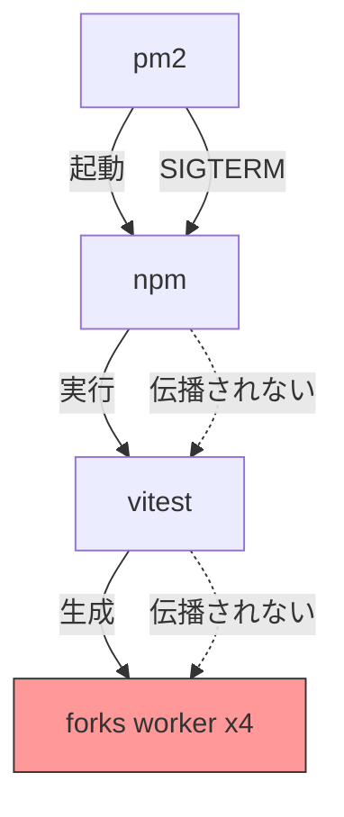
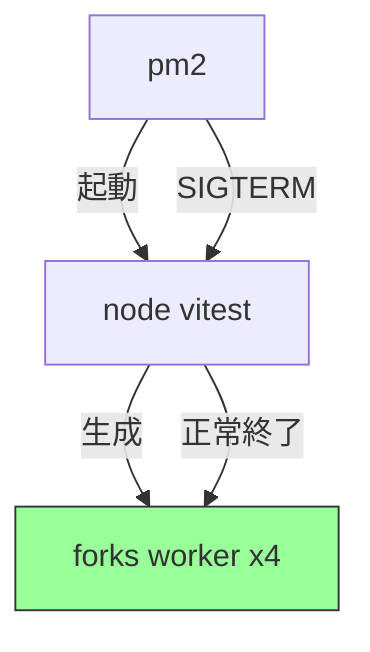
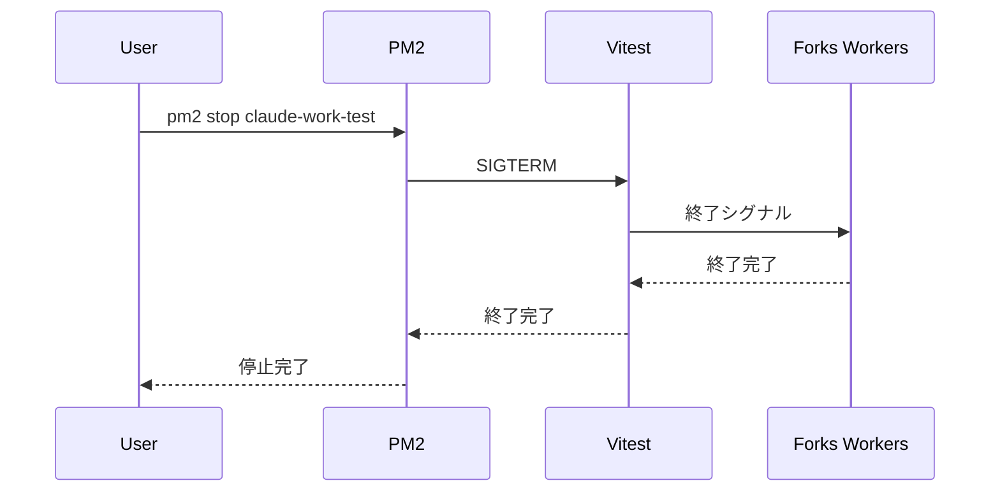
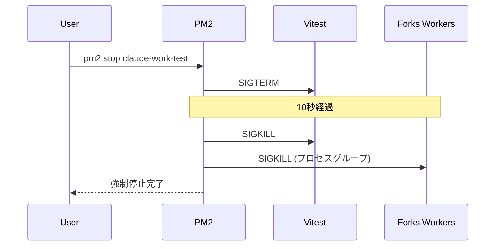

# 設計書: vitest forks workerプロセス孤児化問題の修正

## 情報の明確性チェック

### ユーザーから明示された情報

- 問題: vitest forks workerプロセスが孤児化してメモリを大量消費（約8GB、メモリの80%）
- 原因: pm2からnpm経由でvitestを実行する際にシグナルが正しく伝播しない
- 対象環境: ローカル開発環境（Linux）

### 不明/要確認の情報

| 項目 | 現状の理解 | 確認状況 |
|------|-----------|----------|
| なし | - | [x] 確認済み |

## 問題分析

### 現在のプロセス構造



### 問題の詳細

1. **多層プロセス構造**
   - pm2 → npm → vitest → forks worker という4層構造
   - pm2がnpmにSIGTERMを送信しても、npmはvitestに適切にシグナルを転送しない

2. **ecosystem.config.jsの設定**
   ```javascript
   // 問題のある設定
   {
     name: 'claude-work-test',
     script: 'npm',           // npm経由
     args: 'test',
     autorestart: false,
   },
   {
     name: 'claude-work-test-watch',
     script: 'npm',           // npm経由
     args: 'run test:watch',
     autorestart: true,       // 自動再起動が問題を悪化させる可能性
   }
   ```

3. **vitest.config.tsの設定**
   ```typescript
   pool: 'forks',  // forks poolを使用（子プロセスを生成）
   ```

## アーキテクチャ設計

### 解決アプローチ

npm経由ではなく、vitestを直接実行するように変更する。



## コンポーネント設計

### 変更対象ファイル

| ファイル | 変更内容 | 優先度 |
|----------|----------|--------|
| `ecosystem.config.js` | vitestを直接実行するように変更、kill_timeout追加 | 高 |
| `package.json` | 必要に応じてスクリプト追加 | 低 |
| `vitest.config.ts` | forceRerun設定の検討 | 低 |

### ecosystem.config.js の設計

```javascript
module.exports = {
  apps: [
    // ... 既存のアプリ設定 ...

    {
      name: 'claude-work-test',
      script: './node_modules/.bin/vitest',  // vitestを直接実行
      args: 'run',
      cwd: __dirname,
      env: {
        NODE_ENV: 'test',
      },
      watch: false,
      autorestart: false,
      kill_timeout: 10000,  // 10秒後にSIGKILL
      error_file: './logs/pm2-test-error.log',
      out_file: './logs/pm2-test-out.log',
      log_date_format: 'YYYY-MM-DD HH:mm:ss',
    },
    {
      name: 'claude-work-test-watch',
      script: './node_modules/.bin/vitest',  // vitestを直接実行
      args: '',  // watch モード（デフォルト）
      cwd: __dirname,
      env: {
        NODE_ENV: 'test',
      },
      watch: false,
      autorestart: false,  // 自動再起動を無効化
      kill_timeout: 10000,  // 10秒後にSIGKILL
      error_file: './logs/pm2-test-watch-error.log',
      out_file: './logs/pm2-test-watch-out.log',
      log_date_format: 'YYYY-MM-DD HH:mm:ss',
    },
  ],
};
```

### 設計ポイント

1. **vitestを直接実行**
   - `script: './node_modules/.bin/vitest'` でnpmを経由せずに直接実行
   - シグナルがvitestに直接伝達される

2. **kill_timeout の追加**
   - pm2 stopがSIGTERMを送信後、10秒待機してもプロセスが終了しない場合はSIGKILLを送信
   - 孤児プロセスの発生を防止

3. **autorestart の無効化**
   - `claude-work-test-watch` の `autorestart: true` を `false` に変更
   - watchモードは手動で再起動する運用に変更

## シーケンス図

### 正常終了フロー（修正後）



### タイムアウト時のフロー



## 技術的決定事項

### 決定1: npm経由からvitest直接実行への変更

**検討した選択肢:**
1. npm経由のまま、シェルスクリプトでラップ
2. vitestを直接実行
3. npx vitest を使用

**決定:** vitestを直接実行（選択肢2）

**根拠:**
- シグナル伝播が確実
- 追加のラッパーが不要
- pm2のkill_timeoutが正しく機能する

### 決定2: autorestart の設定

**検討した選択肢:**
1. autorestart: true を維持
2. autorestart: false に変更
3. max_restarts を設定

**決定:** autorestart: false に変更（選択肢2）

**根拠:**
- watchモードの異常終了時に自動再起動すると、孤児プロセスが蓄積する可能性
- 手動での再起動が安全
- 開発者が問題に気づきやすい

### 決定3: kill_timeout の値

**検討した選択肢:**
1. 5000ms（5秒）
2. 10000ms（10秒）
3. 30000ms（30秒）

**決定:** 10000ms（10秒）（選択肢2）

**根拠:**
- vitestのteardownTimeoutが5000msに設定されているため、それより長く設定
- 30秒は長すぎて運用に支障
- 10秒は適切なバランス

## 要件との整合性

この修正は既存の要件に直接関連しませんが、以下の非機能要件に貢献します:

| 要件ID | 内容 | 対応 |
|--------|------|------|
| NFR-007 | システムはサーバー再起動後も既存のworktree情報を復元できなければならない | テストプロセスの適切な終了により、サーバー再起動の信頼性向上 |

## 検証チェックリスト

- [x] アーキテクチャ概要が記載されている
- [x] 主要コンポーネントが定義されている
- [x] 技術的決定事項と根拠が記載されている
- [x] シーケンス図が含まれている
- [x] 情報の明確性チェックが完了している
- [x] requirements.mdとの整合性を確認

## テスト計画

### 手動テスト項目

1. **pm2でテスト実行・停止**
   ```bash
   npm run test:pm2
   pm2 stop claude-work-test
   ps aux | grep vitest  # vitest関連プロセスが存在しないことを確認
   ```

2. **pm2でwatch実行・停止**
   ```bash
   npm run test:watch:pm2
   pm2 stop claude-work-test-watch
   ps aux | grep vitest  # vitest関連プロセスが存在しないことを確認
   ```

3. **kill_timeout動作確認**
   - vitestプロセスがハングした状態をシミュレート
   - 10秒後にSIGKILLが送信されることを確認

## ロールバック計画

問題が発生した場合、以下の手順でロールバック:

1. `ecosystem.config.js` を以前の状態に戻す
2. `pm2 delete claude-work-test claude-work-test-watch`
3. `pm2 start ecosystem.config.js`

## 実装タスク

1. [ ] `ecosystem.config.js` の `claude-work-test` 設定を変更
2. [ ] `ecosystem.config.js` の `claude-work-test-watch` 設定を変更
3. [ ] 手動テストで動作確認
4. [ ] CLAUDE.md の運用手順を更新（必要に応じて）
