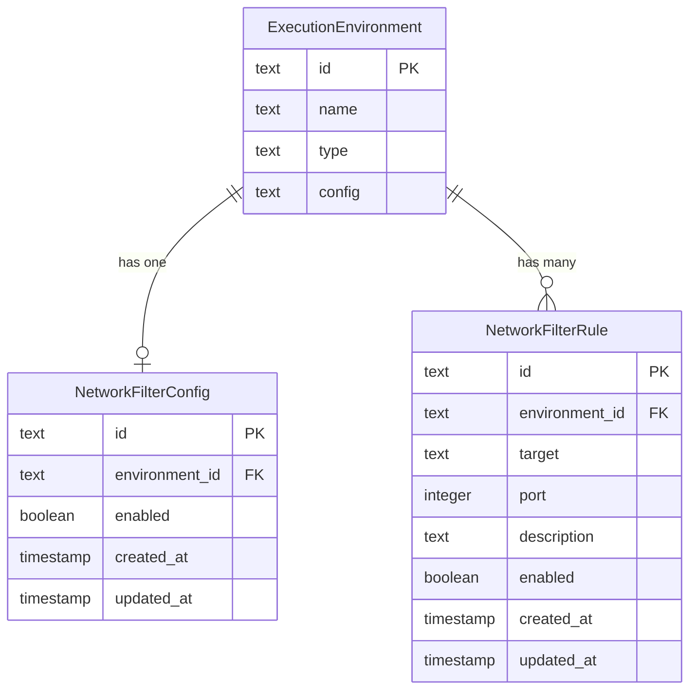

# データベーススキーマ

## 概要

**データベース種別**: SQLite
**ORM**: Drizzle ORM

## 情報の明確性

### 明示された情報
- テーブル名はPascalCase（既存プロジェクトの慣習）
- ExecutionEnvironmentとの外部キーリレーション
- タイムスタンプはinteger型（mode: 'timestamp'）

### 不明/要確認の情報
全て確認済み。

---

## ER図



---

## テーブル定義

### NetworkFilterConfig {#networkfilterconfig}

**概要**: 環境ごとのネットワークフィルタリング有効/無効設定

| カラム | 型 | 制約 | デフォルト | 説明 |
|--------|------|-------------|-----------|------|
| id | TEXT | PRIMARY KEY | crypto.randomUUID() | 一意識別子 |
| environment_id | TEXT | NOT NULL, FOREIGN KEY, UNIQUE | - | 環境ID |
| enabled | INTEGER (boolean) | NOT NULL | false | フィルタリング有効/無効 |
| created_at | INTEGER (timestamp) | NOT NULL | new Date() | 作成日時 |
| updated_at | INTEGER (timestamp) | NOT NULL | new Date() | 更新日時 |

**インデックス**:

| 名前 | カラム | 種類 | 用途 |
|------|--------|------|------|
| PK | id | PRIMARY | 主キー |
| UQ_env | environment_id | UNIQUE | 環境ごとに1レコード |

**外部キー**:

| 名前 | カラム | 参照先 | ON DELETE |
|------|--------|--------|-----------|
| fk_env | environment_id | ExecutionEnvironment(id) | CASCADE |

**Drizzle ORM定義**:
```typescript
export const networkFilterConfigs = sqliteTable('NetworkFilterConfig', {
  id: text('id').primaryKey().$defaultFn(() => crypto.randomUUID()),
  environment_id: text('environment_id')
    .notNull()
    .unique()
    .references(() => executionEnvironments.id, { onDelete: 'cascade' }),
  enabled: integer('enabled', { mode: 'boolean' }).notNull().default(false),
  created_at: integer('created_at', { mode: 'timestamp' })
    .notNull()
    .$defaultFn(() => new Date()),
  updated_at: integer('updated_at', { mode: 'timestamp' })
    .notNull()
    .$defaultFn(() => new Date()),
});
```

---

### NetworkFilterRule {#networkfilterrule}

**概要**: ネットワークフィルタリングのホワイトリストルール

| カラム | 型 | 制約 | デフォルト | 説明 |
|--------|------|-------------|-----------|------|
| id | TEXT | PRIMARY KEY | crypto.randomUUID() | 一意識別子 |
| environment_id | TEXT | NOT NULL, FOREIGN KEY | - | 環境ID |
| target | TEXT | NOT NULL | - | ドメイン名/IP/ワイルドカード/CIDR |
| port | INTEGER | NULL | null | ポート番号（null=全ポート） |
| description | TEXT | NULL | null | ルールの説明 |
| enabled | INTEGER (boolean) | NOT NULL | true | ルール有効/無効 |
| created_at | INTEGER (timestamp) | NOT NULL | new Date() | 作成日時 |
| updated_at | INTEGER (timestamp) | NOT NULL | new Date() | 更新日時 |

**インデックス**:

| 名前 | カラム | 種類 | 用途 |
|------|--------|------|------|
| PK | id | PRIMARY | 主キー |
| idx_env | environment_id | BTREE | 環境別検索 |
| idx_env_target | environment_id, target | BTREE | 重複チェック |

**外部キー**:

| 名前 | カラム | 参照先 | ON DELETE |
|------|--------|--------|-----------|
| fk_env | environment_id | ExecutionEnvironment(id) | CASCADE |

**Drizzle ORM定義**:
```typescript
export const networkFilterRules = sqliteTable('NetworkFilterRule', {
  id: text('id').primaryKey().$defaultFn(() => crypto.randomUUID()),
  environment_id: text('environment_id')
    .notNull()
    .references(() => executionEnvironments.id, { onDelete: 'cascade' }),
  target: text('target').notNull(),
  port: integer('port'),
  description: text('description'),
  enabled: integer('enabled', { mode: 'boolean' }).notNull().default(true),
  created_at: integer('created_at', { mode: 'timestamp' })
    .notNull()
    .$defaultFn(() => new Date()),
  updated_at: integer('updated_at', { mode: 'timestamp' })
    .notNull()
    .$defaultFn(() => new Date()),
});
```

---

## マイグレーション方針

### バージョン管理
- マイグレーションツール: Drizzle ORM (`db:push` for SQLite)
- 既存テーブルへの変更なし（新規テーブル追加のみ）

### 適用手順
1. `src/db/schema.ts` に上記テーブル定義を追加
2. `npm run db:push` でスキーマを適用
3. 既存データへの影響なし（新規テーブルのため）

### ロールバック手順
1. テーブル定義をschema.tsから削除
2. `npm run db:push` で反映
3. SQLite上のテーブルが削除される

## 関連要件

- [REQ-001](../../requirements/network-filtering/stories/US-001.md) @../../requirements/network-filtering/stories/US-001.md: ルールのデータ要件
- [REQ-001-008](../../requirements/network-filtering/stories/US-001.md) @../../requirements/network-filtering/stories/US-001.md: 環境ごとの個別管理
