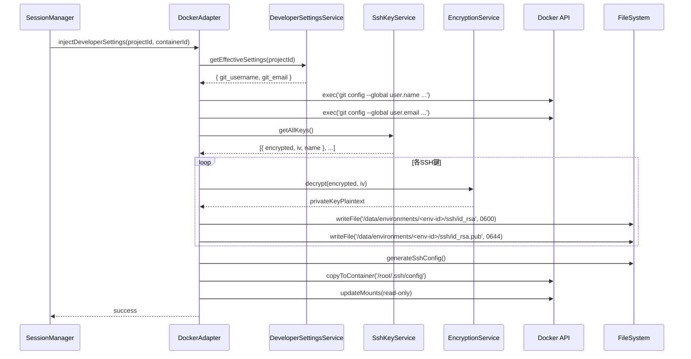

# DockerAdapter Extension

## 概要

**目的**: Docker環境への開発ツール設定（Git設定、SSH鍵）の自動適用

**責務**:
- Docker コンテナ起動時の git config 自動設定
- SSH 鍵の一時ファイル作成とコンテナへのマウント
- SSH 鍵ファイルのパーミッション管理（0600）
- コンテナ停止時の一時ファイルクリーンアップ

## 情報の明確性

### 明示された情報
- 一時ファイル保存場所: `data/environments/<env-id>/ssh/`
- SSH鍵パーミッション: `0600`（秘密鍵）、`0644`（公開鍵）
- マウント方式: read-only

### 不明/要確認の情報

なし（すべて確認済み）

---

## インターフェース

### 公開API/メソッド

#### `injectDeveloperSettings(projectId: string, containerId: string): Promise<void>`

**説明**: Docker コンテナに開発ツール設定を注入

**パラメータ**:
| 名前 | 型 | 必須 | 説明 |
|------|-----|------|------|
| projectId | string | Yes | プロジェクトID（設定取得に使用） |
| containerId | string | Yes | DockerコンテナID |

**戻り値**: `Promise<void>`

**例外**:
- `SettingsError`: 設定の取得に失敗
- `DecryptionError`: SSH鍵の復号化に失敗
- `DockerError`: Docker API呼び出しに失敗

**処理フロー**:
1. DeveloperSettingsService から有効な Git 設定を取得（プロジェクト設定 > グローバル設定）
2. `docker exec` で `git config --global user.name` と `user.email` を設定
3. SshKeyService からすべての SSH 鍵を取得
4. 各SSH鍵を復号化して一時ファイルに保存
5. ファイルパーミッションを設定（秘密鍵: 0600、公開鍵: 0644）
6. SSH鍵を `docker cp` でコンテナの `/root/.ssh/` にコピー
7. `/root/.ssh/config` を生成してコンテナにコピー

**注**: 当初の設計ではSSH鍵をコンテナ起動時にマウントする想定でしたが、実装ではコンテナ起動後に動的に追加するため、`docker cp` を使用しています。

**使用例**:
```typescript
const adapter = new DockerAdapter(/* ... */);
await adapter.injectDeveloperSettings('project-uuid', 'container-id');
```

---

#### `cleanupSshKeys(envId: string): Promise<void>`

**説明**: コンテナ停止時に一時 SSH 鍵ファイルを削除

**パラメータ**:
| 名前 | 型 | 必須 | 説明 |
|------|-----|------|------|
| envId | string | Yes | 環境ID |

**戻り値**: `Promise<void>`

**処理フロー**:
1. `data/environments/<env-id>/ssh/` ディレクトリ内のすべてのファイルを削除
2. ディレクトリ自体は削除しない（次回起動時に再利用）

**使用例**:
```typescript
await adapter.cleanupSshKeys('env-uuid');
```

---

## 依存関係

### 依存するコンポーネント
- [DeveloperSettingsService](developer-settings-service.md) @developer-settings-service.md: Git設定の取得
- [SshKeyService](ssh-key-service.md) @ssh-key-service.md: SSH鍵の取得
- [EncryptionService](encryption-service.md) @encryption-service.md: SSH鍵の復号化
- **dockerode**: Docker API クライアント
- **fs/promises**: ファイル操作

### 依存されるコンポーネント
- **セッション管理**: コンテナ起動時に `injectDeveloperSettings` を呼び出す

## データフロー



## 内部設計

### Git 設定の適用

```typescript
async applyGitConfig(containerId: string, settings: DeveloperSettings): Promise<void> {
  if (settings.git_username) {
    await this.dockerExec(containerId, [
      'git', 'config', '--global', 'user.name', settings.git_username
    ]);
  }

  if (settings.git_email) {
    await this.dockerExec(containerId, [
      'git', 'config', '--global', 'user.email', settings.git_email
    ]);
  }
}
```

### SSH 鍵の一時ファイル作成

```typescript
async createSshKeyFiles(envId: string, keys: SshKey[]): Promise<string[]> {
  const sshDir = path.join('data', 'environments', envId, 'ssh');
  await fs.mkdir(sshDir, { recursive: true });

  const mountPaths: string[] = [];

  for (const key of keys) {
    // 秘密鍵を復号化
    const privateKey = await this.encryptionService.decrypt(
      key.private_key_encrypted,
      key.encryption_iv
    );

    // ファイルパス
    const privateKeyPath = path.join(sshDir, `id_${key.name}`);
    const publicKeyPath = `${privateKeyPath}.pub`;

    // ファイルに書き込み
    await fs.writeFile(privateKeyPath, privateKey, { mode: 0o600 });
    await fs.writeFile(publicKeyPath, key.public_key, { mode: 0o644 });

    mountPaths.push(privateKeyPath, publicKeyPath);
  }

  return mountPaths;
}
```

### SSH config の生成

```typescript
async generateSshConfig(keys: SshKey[]): Promise<string> {
  const identityFiles = keys.map(key => `IdentityFile /root/.ssh/id_${key.name}`).join('\n  ');

  return `
Host *
  StrictHostKeyChecking accept-new
  ${identityFiles}
`.trim();
}
```

## セキュリティ考慮事項

### ファイルパーミッション
- 秘密鍵: `0600`（所有者のみ読み書き可能）
- 公開鍵: `0644`（所有者が読み書き、他は読み取りのみ）
- SSH ディレクトリ: `0700`（所有者のみアクセス可能）

### read-only マウント
- SSH 鍵は read-only でコンテナにマウント
- コンテナ内での改変を防止

### クリーンアップ
- コンテナ停止時に一時ファイルを確実に削除
- 異常終了時も次回起動時にクリーンアップ

## エラーハンドリング

### Git 設定適用の失敗
- エラーログを出力
- セッション起動は続行（Git設定なしでも動作可能）

### SSH 鍵復号化の失敗
- 該当鍵をスキップ
- エラーログを出力
- 他の鍵は引き続き処理

### 一時ファイル削除の失敗
- エラーログを出力
- 次回起動時に再試行

## テスト戦略

### 単体テスト
1. Git 設定が正しく適用されることを確認（モックDocker API）
2. SSH 鍵ファイルが正しいパーミッションで作成されることを確認
3. SSH config が正しく生成されることを確認
4. クリーンアップで一時ファイルが削除されることを確認

### 統合テスト
1. 実際のDockerコンテナで Git 設定が適用されることを確認
2. SSH 鍵でプライベートリポジトリにアクセスできることを確認

## 関連要件

- [US-004](../../requirements/dev-tool-settings/stories/US-004.md) @../../requirements/dev-tool-settings/stories/US-004.md: Docker 環境への設定自動適用
- [NFR-SEC-003](../../requirements/dev-tool-settings/nfr/security.md) @../../requirements/dev-tool-settings/nfr/security.md: SSH 鍵ファイルのパーミッション管理
- [NFR-SEC-004](../../requirements/dev-tool-settings/nfr/security.md) @../../requirements/dev-tool-settings/nfr/security.md: Docker 環境への read-only マウント
- [NFR-SEC-005](../../requirements/dev-tool-settings/nfr/security.md) @../../requirements/dev-tool-settings/nfr/security.md: 一時ファイルのクリーンアップ
