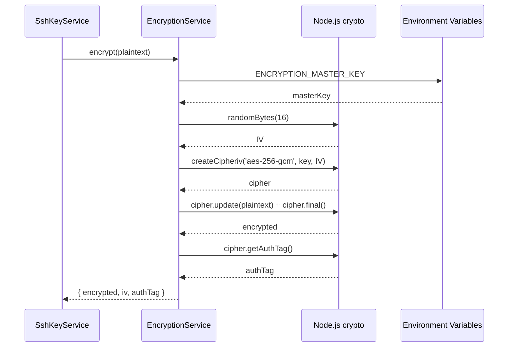

# EncryptionService

## 概要

**目的**: SSH秘密鍵のAES-256-GCM暗号化・復号化を提供

**責務**:
- SSH秘密鍵のAES-256-GCM暗号化
- 暗号化されたSSH秘密鍵の復号化
- 暗号化初期化ベクトル（IV）のランダム生成
- マスターキーの管理（環境変数からの取得）

## 情報の明確性

### 明示された情報
- 暗号化アルゴリズム: AES-256-GCM
- マスターキー管理: 環境変数 `ENCRYPTION_MASTER_KEY`
- IV: 鍵ごとにランダム生成（16バイト）

### 不明/要確認の情報

なし（すべて確認済み）

---

## インターフェース

### 公開API/メソッド

#### `encrypt(plaintext: string): Promise<EncryptedData>`

**説明**: SSH秘密鍵を暗号化

**パラメータ**:
| 名前 | 型 | 必須 | 説明 |
|------|-----|------|------|
| plaintext | string | Yes | SSH秘密鍵（平文） |

**戻り値**: `Promise<EncryptedData>` - 暗号化されたデータとIV

```typescript
interface EncryptedData {
  encrypted: string; // Base64エンコードされた暗号文
  iv: string;        // Base64エンコードされたIV
  authTag: string;   // Base64エンコードされた認証タグ (GCM)
}
```

**例外**:
- `EncryptionError`: 環境変数 `ENCRYPTION_MASTER_KEY` が未設定
- `EncryptionError`: 暗号化処理に失敗

**使用例**:
```typescript
const service = new EncryptionService();
const result = await service.encrypt(privateKeyContent);
// result.encrypted: 暗号化された秘密鍵
// result.iv: 初期化ベクトル
```

---

#### `decrypt(encrypted: string, iv: string, authTag: string): Promise<string>`

**説明**: 暗号化されたSSH秘密鍵を復号化

**パラメータ**:
| 名前 | 型 | 必須 | 説明 |
|------|-----|------|------|
| encrypted | string | Yes | Base64エンコードされた暗号文 |
| iv | string | Yes | Base64エンコードされたIV |
| authTag | string | Yes | Base64エンコードされた認証タグ (GCM) |

**戻り値**: `Promise<string>` - 復号化されたSSH秘密鍵（平文）

**例外**:
- `DecryptionError`: 環境変数 `ENCRYPTION_MASTER_KEY` が未設定
- `DecryptionError`: 復号化処理に失敗（IVが不正、暗号文が破損など）

**使用例**:
```typescript
const service = new EncryptionService();
const plaintext = await service.decrypt(encryptedKey, iv, authTag);
// plaintext: 元のSSH秘密鍵
```

---

## 依存関係

### 依存するコンポーネント
- **Node.js crypto**: 標準ライブラリによる暗号化・復号化
- **環境変数**: `process.env.ENCRYPTION_MASTER_KEY`

### 依存されるコンポーネント
- [SshKeyService](ssh-key-service.md) @ssh-key-service.md: SSH鍵登録時に暗号化を使用

## データフロー



## 内部設計

### クラス/モジュール構造

```typescript
export class EncryptionService {
  private readonly ALGORITHM = 'aes-256-gcm';
  private readonly KEY_LENGTH = 32; // 256 bits

  /**
   * 環境変数からマスターキーを取得
   * @throws {EncryptionError} マスターキーが未設定の場合
   */
  private getMasterKey(): Buffer {
    const masterKey = process.env.ENCRYPTION_MASTER_KEY;
    if (!masterKey) {
      throw new EncryptionError('ENCRYPTION_MASTER_KEY is not set');
    }
    // SHA-256ハッシュで32バイトの鍵を導出
    return crypto.createHash('sha256').update(masterKey).digest();
  }

  /**
   * SSH秘密鍵を暗号化
   */
  async encrypt(plaintext: string): Promise<EncryptedData> {
    const key = this.getMasterKey();
    const iv = crypto.randomBytes(16); // 128 bits IV

    const cipher = crypto.createCipheriv(this.ALGORITHM, key, iv);
    const encrypted = Buffer.concat([
      cipher.update(plaintext, 'utf8'),
      cipher.final()
    ]);
    const authTag = cipher.getAuthTag();

    return {
      encrypted: encrypted.toString('base64'),
      iv: iv.toString('base64'),
      authTag: authTag.toString('base64')
    };
  }

  /**
   * 暗号化されたSSH秘密鍵を復号化
   */
  async decrypt(encrypted: string, iv: string, authTag: string): Promise<string> {
    const key = this.getMasterKey();
    const ivBuffer = Buffer.from(iv, 'base64');
    const encryptedBuffer = Buffer.from(encrypted, 'base64');
    const authTagBuffer = Buffer.from(authTag, 'base64');

    const decipher = crypto.createDecipheriv(this.ALGORITHM, key, ivBuffer);
    decipher.setAuthTag(authTagBuffer);
    const decrypted = Buffer.concat([
      decipher.update(encryptedBuffer),
      decipher.final()
    ]);

    return decrypted.toString('utf8');
  }
}

export class EncryptionError extends Error {
  constructor(message: string) {
    super(message);
    this.name = 'EncryptionError';
  }
}

export class DecryptionError extends Error {
  constructor(message: string) {
    super(message);
    this.name = 'DecryptionError';
  }
}
```

## セキュリティ考慮事項

### マスターキー管理
- 環境変数 `ENCRYPTION_MASTER_KEY` に保存
- `.env` ファイルに記載（`.gitignore` で除外）
- 本番環境では専用のシークレット管理サービス使用を推奨

### 鍵導出
- マスターキーをSHA-256でハッシュ化して32バイトの鍵を導出
- マスターキーは最低32文字以上を推奨

### IV の安全性
- 各暗号化操作で新しいIVをランダム生成
- 同じ平文を暗号化しても異なる暗号文が生成される

### エラーハンドリング
- 復号化エラー時は詳細なエラー情報を外部に漏らさない
- ログには暗号化/復号化の失敗のみ記録（鍵の内容は記録しない）

## テスト戦略

### 単体テスト
1. 暗号化→復号化のラウンドトリップテスト
2. 異なる平文で異なる暗号文が生成されることを確認
3. 同じ平文でもIVが異なれば異なる暗号文が生成されることを確認
4. 不正なIVでの復号化エラーを確認
5. マスターキー未設定時のエラーを確認

### 統合テスト
- SshKeyService との統合テスト（SSH鍵の登録→取得→復号化）

## 関連要件

- [NFR-SEC-001](../../requirements/dev-tool-settings/nfr/security.md) @../../requirements/dev-tool-settings/nfr/security.md: SSH 秘密鍵の暗号化保存
- [NFR-SEC-002](../../requirements/dev-tool-settings/nfr/security.md) @../../requirements/dev-tool-settings/nfr/security.md: 暗号化マスターキーの管理
