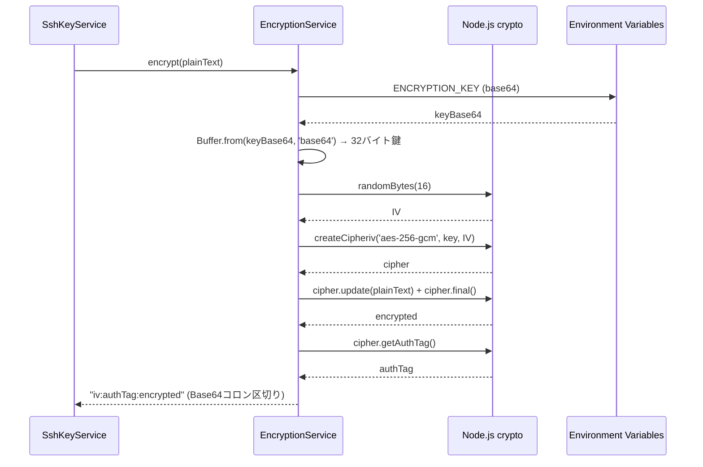

# EncryptionService

## 概要

**目的**: SSH秘密鍵のAES-256-GCM暗号化・復号化を提供

**責務**:
- SSH秘密鍵のAES-256-GCM暗号化
- 暗号化されたSSH秘密鍵の復号化
- 暗号化初期化ベクトル（IV）のランダム生成
- 暗号化鍵の管理（環境変数からの取得）

## 情報の明確性

### 明示された情報
- 暗号化アルゴリズム: AES-256-GCM
- 暗号化鍵管理: 環境変数 `ENCRYPTION_KEY`（Base64エンコードされた32バイト鍵）
- IV: 鍵ごとにランダム生成（16バイト）

### 不明/要確認の情報

なし（すべて確認済み）

---

## インターフェース

### 公開API/メソッド

#### `encrypt(plainText: string): Promise<string>`

**説明**: SSH秘密鍵を暗号化し、`iv:authTag:encrypted` 形式の文字列を返す

**パラメータ**:
| 名前 | 型 | 必須 | 説明 |
|------|-----|------|------|
| plainText | string | Yes | SSH秘密鍵（平文） |

**戻り値**: `Promise<string>` - `iv:authTag:encrypted` 形式（各要素はBase64エンコード、コロン区切り）

**例外**:
- `EncryptionKeyNotFoundError`: 環境変数 `ENCRYPTION_KEY` が未設定
- `EncryptionError`: `ENCRYPTION_KEY` が32バイトでない、または暗号化処理に失敗

**使用例**:
```typescript
const service = new EncryptionService();
const encrypted = await service.encrypt(privateKeyContent);
// encrypted: "base64iv:base64authTag:base64encrypted"
```

---

#### `decrypt(encryptedText: string): Promise<string>`

**説明**: `iv:authTag:encrypted` 形式の文字列を復号化

**パラメータ**:
| 名前 | 型 | 必須 | 説明 |
|------|-----|------|------|
| encryptedText | string | Yes | `iv:authTag:encrypted` 形式の暗号化文字列 |

**戻り値**: `Promise<string>` - 復号化されたSSH秘密鍵（平文）

**例外**:
- `EncryptionKeyNotFoundError`: 環境変数 `ENCRYPTION_KEY` が未設定
- `DecryptionError`: 形式が不正（コロン区切りで3要素でない）、または復号化失敗

**使用例**:
```typescript
const service = new EncryptionService();
const plaintext = await service.decrypt(encryptedText);
// plaintext: 元のSSH秘密鍵
```

---

#### `isKeyConfigured(): boolean`

**説明**: `ENCRYPTION_KEY` が設定されているかを確認

**戻り値**: `boolean` - 設定されている場合は `true`

---

## 依存関係

### 依存するコンポーネント
- **Node.js crypto**: 標準ライブラリによる暗号化・復号化
- **環境変数**: `process.env.ENCRYPTION_KEY`

### 依存されるコンポーネント
- [SshKeyService](ssh-key-service.md) @ssh-key-service.md: SSH鍵登録時に暗号化を使用

## データフロー



## 内部設計

### クラス/モジュール構造

```typescript
export class EncryptionService {
  private getKey(): Buffer {
    const keyBase64 = process.env.ENCRYPTION_KEY;
    if (!keyBase64) {
      throw new EncryptionKeyNotFoundError();
    }
    const key = Buffer.from(keyBase64, 'base64');
    if (key.length !== 32) {
      throw new EncryptionError(`Invalid ENCRYPTION_KEY length: expected 32 bytes, got ${key.length} bytes.`);
    }
    return key;
  }

  isKeyConfigured(): boolean {
    const key = process.env.ENCRYPTION_KEY;
    return typeof key === 'string' && key.length > 0;
  }

  async encrypt(plainText: string): Promise<string> {
    const key = this.getKey();
    const iv = randomBytes(16);
    const cipher = createCipheriv('aes-256-gcm', key, iv);

    let encrypted = cipher.update(plainText, 'utf8', 'base64');
    encrypted += cipher.final('base64');
    const authTag = cipher.getAuthTag();

    return `${iv.toString('base64')}:${authTag.toString('base64')}:${encrypted}`;
  }

  async decrypt(encryptedText: string): Promise<string> {
    const key = this.getKey();
    const parts = encryptedText.split(':');
    if (parts.length !== 3) {
      throw new DecryptionError('Invalid encrypted text format: expected iv:authTag:encrypted');
    }
    const iv = Buffer.from(parts[0], 'base64');
    const authTag = Buffer.from(parts[1], 'base64');
    const encrypted = parts[2];

    const decipher = createDecipheriv('aes-256-gcm', key, iv);
    decipher.setAuthTag(authTag);

    let decrypted = decipher.update(encrypted, 'base64', 'utf8');
    decrypted += decipher.final('utf8');
    return decrypted;
  }
}
```

## セキュリティ考慮事項

### 暗号化鍵管理
- 環境変数 `ENCRYPTION_KEY` に保存（Base64エンコードされた32バイト鍵）
- 鍵の生成: `openssl rand -base64 32`
- `.env` ファイルに記載（`.gitignore` で除外）
- 本番環境では専用のシークレット管理サービス使用を推奨

### 鍵の形式
- Base64エンコードされた32バイト（256ビット）の鍵を直接使用
- ハッシュ化や鍵導出は行わない（`ENCRYPTION_KEY` 自体が32バイトの最終鍵）

### IV の安全性
- 各暗号化操作で新しいIVをランダム生成
- 同じ平文を暗号化しても異なる暗号文が生成される

### 保存形式
- `iv:authTag:encrypted` 形式でひとつのカラムに保存（コロン区切り、各要素はBase64）
- GCM認証タグにより改ざん検出が可能

### エラーハンドリング
- 復号化エラー時は詳細なエラー情報を外部に漏らさない
- ログには暗号化/復号化の失敗のみ記録（鍵の内容は記録しない）

## テスト戦略

### 単体テスト
1. 暗号化→復号化のラウンドトリップテスト
2. 異なる平文で異なる暗号文が生成されることを確認
3. 同じ平文でもIVが異なれば異なる暗号文が生成されることを確認
4. 不正な形式でのDecryptionErrorを確認
5. `ENCRYPTION_KEY` 未設定時のEncryptionKeyNotFoundErrorを確認
6. 鍵長が32バイトでない場合のEncryptionErrorを確認

### 統合テスト
- SshKeyService との統合テスト（SSH鍵の登録→取得→復号化）

## 関連要件

- [NFR-SEC-001](../../requirements/dev-tool-settings/nfr/security.md) @../../requirements/dev-tool-settings/nfr/security.md: SSH 秘密鍵の暗号化保存
- [NFR-SEC-002](../../requirements/dev-tool-settings/nfr/security.md) @../../requirements/dev-tool-settings/nfr/security.md: 暗号化マスターキーの管理
