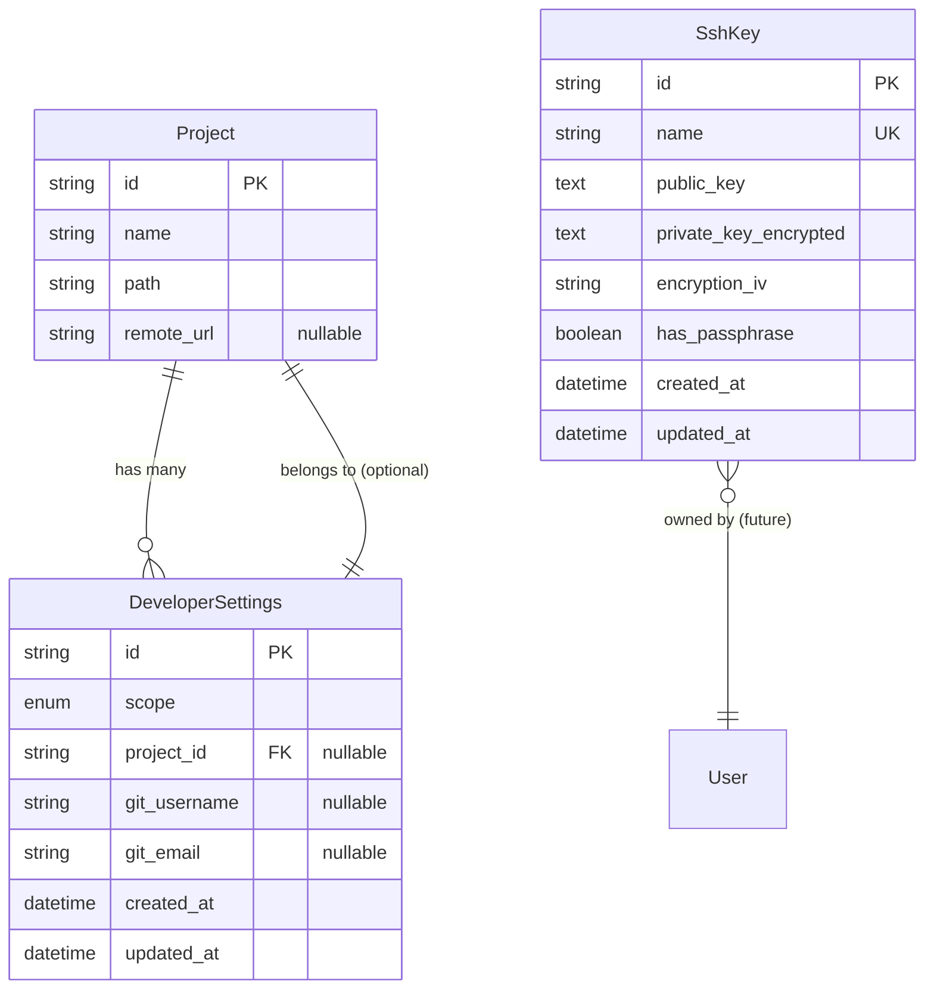

# データベーススキーマ

## 概要

**データベース種別**: SQLite
**ORM/クエリビルダー**: Drizzle ORM

## 情報の明確性

### 明示された情報
- データベース: SQLite（既存システムと同じ）
- ORM: Drizzle（既存システムと同じ）
- タイムスタンプ: UTC（既存システムと同じ）
- ソフトデリート: 採用しない（物理削除）

### 不明/要確認の情報

なし（すべて確認済み）

---

## ER図



---

## テーブル定義

### DeveloperSettings {#developersettings}

**概要**: Git設定を階層的に管理（グローバル設定・プロジェクト別設定）

**Drizzleスキーマ**:
```typescript
export const developerSettings = sqliteTable('DeveloperSettings', {
  id: text('id').primaryKey().$defaultFn(() => crypto.randomUUID()),
  scope: text('scope').notNull(), // 'GLOBAL' | 'PROJECT'
  project_id: text('project_id').references(() => projects.id, { onDelete: 'cascade' }),
  git_username: text('git_username'),
  git_email: text('git_email'),
  created_at: integer('created_at', { mode: 'timestamp' }).notNull().$defaultFn(() => new Date()),
  updated_at: integer('updated_at', { mode: 'timestamp' }).notNull().$defaultFn(() => new Date()),
}, (table) => ({
  scopeProjectIdIdx: index('developer_settings_scope_project_id_idx').on(table.scope, table.project_id),
  scopeProjectIdUnique: uniqueIndex('developer_settings_scope_project_id_key').on(table.scope, table.project_id),
}));

export const developerSettingsRelations = relations(developerSettings, ({ one }) => ({
  project: one(projects, {
    fields: [developerSettings.project_id],
    references: [projects.id],
  }),
}));
```

**カラム詳細**:
| カラム | 型 | 制約 | デフォルト | 説明 |
|--------|------|-------------|-----------|------|
| id | String(UUID) | PRIMARY KEY | uuid() | 一意識別子 |
| scope | Enum | NOT NULL | - | 設定スコープ（GLOBAL/PROJECT） |
| project_id | String(UUID) | NULLABLE, FOREIGN KEY | NULL | プロジェクトID（GLOBALの場合はNULL） |
| git_username | String | NULLABLE | NULL | Git user.name |
| git_email | String | NULLABLE | NULL | Git user.email |
| created_at | DateTime | NOT NULL | now() | 作成日時（UTC） |
| updated_at | DateTime | NOT NULL | updatedAt | 更新日時（UTC） |

**インデックス**:
| 名前 | カラム | 種類 | 用途 |
|------|--------|------|------|
| DeveloperSettings_pkey | id | PRIMARY | 主キー |
| DeveloperSettings_scope_project_id_key | scope, project_id | UNIQUE | 重複防止（グローバル1つ、プロジェクト別1つ） |
| DeveloperSettings_scope_project_id_idx | scope, project_id | BTREE | 設定検索の高速化 |

**外部キー**:
| 名前 | カラム | 参照先 | ON DELETE |
|------|--------|--------|-----------|
| DeveloperSettings_project_id_fkey | project_id | Project(id) | CASCADE |

**制約ロジック**:
- `scope = GLOBAL` の場合、`project_id` は NULL でなければならない
- `scope = PROJECT` の場合、`project_id` は NOT NULL でなければならない

---

### SshKey {#sshkey}

**概要**: SSH鍵ペアを管理（秘密鍵はAES-256で暗号化保存）

**Drizzleスキーマ**:
```typescript
export const sshKeys = sqliteTable('SshKey', {
  id: text('id').primaryKey().$defaultFn(() => crypto.randomUUID()),
  name: text('name').notNull().unique(),
  public_key: text('public_key').notNull(),
  private_key_encrypted: text('private_key_encrypted').notNull(),
  encryption_iv: text('encryption_iv').notNull(),
  has_passphrase: integer('has_passphrase', { mode: 'boolean' }).notNull().default(false),
  created_at: integer('created_at', { mode: 'timestamp' }).notNull().$defaultFn(() => new Date()),
  updated_at: integer('updated_at', { mode: 'timestamp' }).notNull().$defaultFn(() => new Date()),
});
```

**カラム詳細**:
| カラム | 型 | 制約 | デフォルト | 説明 |
|--------|------|-------------|-----------|------|
| id | String(UUID) | PRIMARY KEY | uuid() | 一意識別子 |
| name | String | NOT NULL, UNIQUE | - | 鍵の識別名 |
| public_key | Text | NOT NULL | - | SSH公開鍵（平文） |
| private_key_encrypted | Text | NOT NULL | - | SSH秘密鍵（AES-256-CBC暗号化） |
| encryption_iv | String | NOT NULL | - | 暗号化初期化ベクトル（Base64エンコード） |
| has_passphrase | Boolean | NOT NULL | false | パスフレーズ保護の有無 |
| created_at | DateTime | NOT NULL | now() | 作成日時（UTC） |
| updated_at | DateTime | NOT NULL | updatedAt | 更新日時（UTC） |

**インデックス**:
| 名前 | カラム | 種類 | 用途 |
|------|--------|------|------|
| SshKey_pkey | id | PRIMARY | 主キー |
| SshKey_name_key | name | UNIQUE | 名前重複チェック |

**暗号化仕様**:
- **アルゴリズム**: AES-256-CBC
- **鍵**: 環境変数 `ENCRYPTION_MASTER_KEY` から導出
- **IV**: 各鍵ごとにランダム生成（16バイト）
- **IV保存**: Base64エンコードして `encryption_iv` カラムに保存

---

## 既存テーブルとの関係

### Project テーブル（既存）

DeveloperSettings テーブルは Project テーブルと外部キーで関連付けられます。

**関係性**:
- 1つのプロジェクトは、0個または1個の DeveloperSettings を持つ（1:0..1）
- DeveloperSettings が削除されてもプロジェクトは削除されない
- プロジェクトが削除されると、紐づくDeveloperSettingsも削除される（CASCADE）

### ExecutionEnvironment テーブル（既存）

現時点では直接的な外部キー関係はありませんが、ロジック上は連携します：
- DockerAdapter が ExecutionEnvironment.type を参照して、設定適用方法を決定
- 将来的には環境別設定（DEC-003の拡張）で外部キーを追加する可能性あり

### GitHubPAT テーブル（既存）

独立して共存します：
- GitHubPAT: HTTPS リポジトリ用（`https://github.com/...`）
- SshKey: SSH リポジトリ用（`git@github.com:...`）
- Git は自動的に適切な認証方式を選択

---

## マイグレーション方針

### バージョン管理
- マイグレーションツール: Drizzle Kit（`npm run db:push`）
- SQLiteのため、マイグレーションファイルは生成せず直接スキーマを同期

### 追加手順

1. `src/db/schema.ts` に新しいテーブル定義を追加:
   ```typescript
   export const developerSettings = sqliteTable('DeveloperSettings', { /* ... */ });
   export const sshKeys = sqliteTable('SshKey', { /* ... */ });
   ```

2. マイグレーションファイルを生成:
   ```bash
   npm run db:generate
   ```

3. スキーマをデータベースに反映:
   ```bash
   npm run db:push
   ```

### ロールバック手順

SQLiteはマイグレーション履歴を管理しないため、ロールバックは以下の手順で行います：

1. スキーマから該当モデルを削除
2. `npx prisma db push --force-reset` でデータベースをリセット（注意: 全データ削除）
3. バックアップからデータを復元（必要に応じて）

**推奨**: 本番環境ではバックアップを定期的に取得

---

## パフォーマンス考慮

### インデックス戦略

1. **DeveloperSettings**:
   - 複合インデックス `(scope, project_id)`: 設定検索で頻繁に使用
   - 設定解決ロジック（プロジェクト設定 → グローバル設定）の高速化

2. **SshKey**:
   - ユニークインデックス `name`: 重複チェックとSSH鍵名検索の高速化

### クエリ最適化

**階層的設定の読み込み**:
```typescript
// プロジェクト設定を優先、存在しなければグローバル設定
const settings = await prisma.developerSettings.findFirst({
  where: {
    OR: [
      { scope: 'PROJECT', project_id: projectId },
      { scope: 'GLOBAL', project_id: null }
    ]
  },
  orderBy: { scope: 'desc' } // PROJECT > GLOBAL の順
});
```

**SSH鍵一覧の取得**:
```typescript
// 公開鍵のみ選択（秘密鍵は取得しない）
const keys = await prisma.sshKey.findMany({
  select: {
    id: true,
    name: true,
    public_key: true,
    created_at: true
  }
});
```

### N+1問題の回避

プロジェクト一覧と設定を同時に取得する場合:
```typescript
const projects = await prisma.project.findMany({
  include: {
    developerSettings: true // 1クエリで JOIN
  }
});
```

---

## 関連要件

- [US-001](../../requirements/dev-tool-settings/stories/US-001.md) @../../requirements/dev-tool-settings/stories/US-001.md: グローバル Git 設定の管理 → DeveloperSettings テーブル
- [US-002](../../requirements/dev-tool-settings/stories/US-002.md) @../../requirements/dev-tool-settings/stories/US-002.md: プロジェクト別 Git 設定の上書き → DeveloperSettings テーブル（scope=PROJECT）
- [US-003](../../requirements/dev-tool-settings/stories/US-003.md) @../../requirements/dev-tool-settings/stories/US-003.md: SSH 鍵ペアの登録・管理 → SshKey テーブル
- [NFR-PERF-001](../../requirements/dev-tool-settings/nfr/performance.md) @../../requirements/dev-tool-settings/nfr/performance.md: 設定読み込み性能 → インデックス戦略
- [NFR-SEC-001](../../requirements/dev-tool-settings/nfr/security.md) @../../requirements/dev-tool-settings/nfr/security.md: SSH 秘密鍵の暗号化保存 → private_key_encrypted カラム
