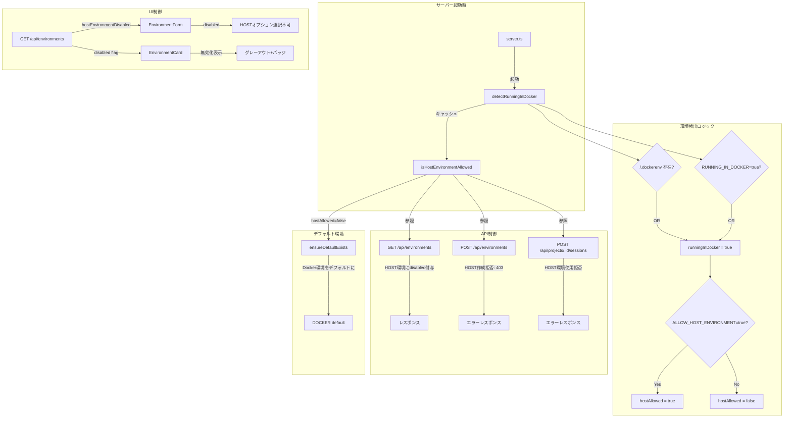

# 技術設計: Docker環境でのHOST機能無効化

## 概要

| 項目 | 内容 |
|------|------|
| フィーチャー名 | disable-host-in-docker |
| 関連要件 | [requirements](../../requirements/disable-host-in-docker/index.md) |
| 作成日 | 2026-02-26 |
| ステータス | ACTIVE |

## アーキテクチャ概要



## コンポーネント設計

### 1. 環境検出ユーティリティ (`src/lib/environment-detect.ts`)

新規ファイル。Docker内動作の検出とHOST環境の許可判定を行う。

**責務:**
- `/.dockerenv` ファイルの存在チェック
- `RUNNING_IN_DOCKER` 環境変数のチェック
- `ALLOW_HOST_ENVIRONMENT` 環境変数のチェック
- 検出結果のキャッシュ（サーバー起動時に1回実行）

**インターフェース:**

```typescript
/**
 * Dockerコンテナ内で動作しているかを検出する
 * /.dockerenv の存在 OR RUNNING_IN_DOCKER=true で判定
 */
export function isRunningInDocker(): boolean;

/**
 * HOST環境の利用が許可されているかを判定する
 * - Docker内でない場合: 常にtrue
 * - Docker内の場合: ALLOW_HOST_ENVIRONMENT=true の時のみtrue
 */
export function isHostEnvironmentAllowed(): boolean;

/**
 * 検出を実行してキャッシュする（サーバー起動時に1回呼び出し）
 */
export function initializeEnvironmentDetection(): void;
```

**実装詳細:**

```typescript
import * as fs from 'fs';

let _isRunningInDocker: boolean | null = null;
let _isHostAllowed: boolean | null = null;

export function initializeEnvironmentDetection(): void {
  const dockerenvExists = fs.existsSync('/.dockerenv');
  const envFlag = process.env.RUNNING_IN_DOCKER === 'true';
  _isRunningInDocker = dockerenvExists || envFlag;

  if (_isRunningInDocker) {
    _isHostAllowed = process.env.ALLOW_HOST_ENVIRONMENT === 'true';
  } else {
    _isHostAllowed = true;
  }
}

export function isRunningInDocker(): boolean {
  if (_isRunningInDocker === null) {
    initializeEnvironmentDetection();
  }
  return _isRunningInDocker!;
}

export function isHostEnvironmentAllowed(): boolean {
  if (_isHostAllowed === null) {
    initializeEnvironmentDetection();
  }
  return _isHostAllowed!;
}
```

**要件対応:** FR-004, FR-005, FR-006, FR-007, NFR-001

### 2. EnvironmentService 変更 (`src/services/environment-service.ts`)

**変更点:**

#### 2.1 `ensureDefaultExists()` の変更

Docker内で動作している場合（かつHOST環境が許可されていない場合）、デフォルト環境をDOCKERにする。

```typescript
async ensureDefaultExists(): Promise<void> {
  const hostAllowed = isHostEnvironmentAllowed();

  if (!hostAllowed) {
    // Docker内動作: デフォルトDocker環境を作成・設定
    await this.ensureDefaultEnvironment();
    return;
  }

  // 既存ロジック: HOSTデフォルト環境の作成
  // ...（変更なし）
}
```

**要件対応:** FR-003

#### 2.2 `create()` にHOST制限ガードを追加

```typescript
async create(input: CreateEnvironmentInput): Promise<ExecutionEnvironment> {
  if (input.type === 'HOST' && !isHostEnvironmentAllowed()) {
    throw new Error('HOST環境はこの環境では作成できません');
  }
  // ...既存ロジック
}
```

**要件対応:** FR-001, NFR-002

#### 2.3 `checkStatus()` のHOST環境チェック変更

```typescript
case 'HOST':
  if (!isHostEnvironmentAllowed()) {
    return {
      available: false,
      authenticated: false,
      error: 'Docker環境内ではHOST環境は利用できません',
    };
  }
  return { available: true, authenticated: true };
```

**要件対応:** FR-002

### 3. 環境API変更

#### 3.1 GET `/api/environments` 変更 (`src/app/api/environments/route.ts`)

レスポンスにメタデータとして `hostEnvironmentDisabled` フラグを追加。
HOST環境に `disabled: true` フラグを付与。

```typescript
export async function GET(request: NextRequest) {
  const hostAllowed = isHostEnvironmentAllowed();

  // ...既存の環境取得ロジック

  // HOST環境にdisabledフラグを追加
  const envData = environments.map(env => ({
    ...env,
    ...(env.type === 'HOST' && !hostAllowed ? { disabled: true } : {}),
  }));

  return NextResponse.json({
    environments: envData, // or envWithStatus
    meta: {
      hostEnvironmentDisabled: !hostAllowed,
    },
  });
}
```

**要件対応:** FR-009

#### 3.2 POST `/api/environments` 変更

HOSTタイプの作成リクエストを制限。

```typescript
// バリデーション後に追加
if (type === 'HOST' && !isHostEnvironmentAllowed()) {
  return NextResponse.json(
    { error: 'Docker環境内ではHOST環境は作成できません' },
    { status: 403 }
  );
}
```

**要件対応:** FR-008, NFR-002

#### 3.3 セッション作成API変更 (`src/app/api/projects/[project_id]/sessions/route.ts`)

HOST環境を使用したセッション作成を制限。

```typescript
// 環境取得後に追加
if (environment.type === 'HOST' && !isHostEnvironmentAllowed()) {
  return NextResponse.json(
    { error: 'Docker環境内ではHOST環境でのセッション作成はできません' },
    { status: 403 }
  );
}
```

**要件対応:** FR-002, NFR-002

### 4. server.ts 変更

起動時に環境検出を初期化。

```typescript
import { initializeEnvironmentDetection, isRunningInDocker, isHostEnvironmentAllowed } from '@/lib/environment-detect';

// サーバー起動処理の最初に呼び出し
initializeEnvironmentDetection();
logger.info('Environment detection initialized', {
  runningInDocker: isRunningInDocker(),
  hostEnvironmentAllowed: isHostEnvironmentAllowed(),
});
```

**要件対応:** NFR-001

### 5. docker-compose.yml 変更

`RUNNING_IN_DOCKER=true` と `ALLOW_HOST_ENVIRONMENT` の設定を追加。

```yaml
environment:
  # ...既存設定
  - RUNNING_IN_DOCKER=true
  # HOST環境を有効にする場合はコメントを外す
  # - ALLOW_HOST_ENVIRONMENT=true
```

**要件対応:** FR-012

### 6. フロントエンド変更

#### 6.1 useEnvironments フック変更 (`src/hooks/useEnvironments.ts`)

Environment interfaceに `disabled` フィールドを追加。
メタデータとして `hostEnvironmentDisabled` を追跡。

```typescript
export interface Environment {
  // ...既存フィールド
  disabled?: boolean;
}

export interface UseEnvironmentsReturn {
  // ...既存フィールド
  hostEnvironmentDisabled: boolean;
}
```

**要件対応:** FR-009

#### 6.2 EnvironmentForm 変更 (`src/components/environments/EnvironmentForm.tsx`)

`hostEnvironmentDisabled` propを受け取り、HOSTオプションをdisabledにする。

```typescript
interface EnvironmentFormProps {
  // ...既存props
  hostEnvironmentDisabled?: boolean;
}

// Listbox.Optionのdisabled条件を変更
<Listbox.Option
  disabled={
    typeOption.value === 'SSH' ||
    (typeOption.value === 'HOST' && hostEnvironmentDisabled)
  }
>
```

HOSTがdisabledの場合のデフォルト選択をDOCKERに変更。

**要件対応:** FR-010

#### 6.3 EnvironmentCard 変更 (`src/components/environments/EnvironmentCard.tsx`)

`disabled` フラグに基づいて無効化表示を追加。

```typescript
// カードにグレーアウトスタイルを適用
<div className={`... ${environment.disabled ? 'opacity-60' : ''}`}>
  {environment.disabled && (
    <span className="bg-red-100 dark:bg-red-900/30 text-red-800 dark:text-red-200 rounded-full px-2 py-0.5 text-xs font-medium">
      無効
    </span>
  )}
```

**要件対応:** FR-011

## API設計

### 変更されるエンドポイント

#### GET /api/environments

**変更点:** レスポンスに `meta` フィールド追加。HOST環境に `disabled` フィールド追加。

**レスポンス:**

```json
{
  "environments": [
    {
      "id": "host-default",
      "name": "Local Host",
      "type": "HOST",
      "disabled": true,
      "status": {
        "available": false,
        "authenticated": false,
        "error": "Docker環境内ではHOST環境は利用できません"
      }
    },
    {
      "id": "docker-default",
      "name": "Default Docker",
      "type": "DOCKER",
      "is_default": true
    }
  ],
  "meta": {
    "hostEnvironmentDisabled": true
  }
}
```

#### POST /api/environments

**変更点:** HOST環境作成時に403を返す場合がある。

**新しいエラーレスポンス (403):**

```json
{
  "error": "Docker環境内ではHOST環境は作成できません"
}
```

#### POST /api/projects/:id/sessions

**変更点:** HOST環境でのセッション作成時に403を返す場合がある。

**新しいエラーレスポンス (403):**

```json
{
  "error": "Docker環境内ではHOST環境でのセッション作成はできません"
}
```

## データベース設計

データベーススキーマの変更は不要。`disabled` フラグはAPIレスポンスで動的に付与される。

## 技術的決定事項

### 決定1: 検出結果のキャッシュ方式

**検討した選択肢:**
- A) モジュールレベル変数でキャッシュ（選択）
- B) ConfigServiceに組み込み
- C) 環境変数のみ（キャッシュなし）

**決定:** A) モジュールレベル変数

**根拠:** ファイルシステムアクセス（`/.dockerenv`）は起動時に1回で十分。モジュールレベル変数は最もシンプルで、既存のアーキテクチャと整合性が高い。

### 決定2: disabledフラグの実装方式

**検討した選択肢:**
- A) APIレスポンスで動的付与（選択）
- B) データベースにカラム追加
- C) 別APIエンドポイント

**決定:** A) APIレスポンスで動的付与

**根拠:** `disabled` 状態はランタイム環境に依存するため、データベースに永続化する必要がない。APIレスポンスで動的に判定する方が、環境変更時に自動的に反映される。

### 決定3: デフォルト環境の切り替え方式

**検討した選択肢:**
- A) `ensureDefaultExists()` のロジック変更（選択）
- B) 新メソッドの追加
- C) server.tsで直接制御

**決定:** A) `ensureDefaultExists()` のロジック変更

**根拠:** 既存の`ensureDefaultEnvironment()`（Docker用）が既に実装されているため、`ensureDefaultExists()`でHOST許可判定を行い、不許可の場合は`ensureDefaultEnvironment()`に委譲するのが最もシンプル。

## CI/CD設計

### テスト戦略

既存のCIパイプライン（lint, test-backend, test-frontend, build）に含まれる。

**追加テスト:**
- `src/lib/__tests__/environment-detect.test.ts`: 検出ロジックのユニットテスト
- `src/services/__tests__/environment-service.test.ts`: HOST制限付きのサービステスト
- `src/app/api/environments/__tests__/route.test.ts`: API制限のテスト

## 変更ファイル一覧

| ファイル | 変更種別 | 説明 |
|---------|---------|------|
| `src/lib/environment-detect.ts` | 新規 | Docker内動作検出ユーティリティ |
| `src/lib/__tests__/environment-detect.test.ts` | 新規 | 検出ロジックのテスト |
| `src/services/environment-service.ts` | 変更 | HOST制限ガード追加、ensureDefaultExists変更 |
| `src/app/api/environments/route.ts` | 変更 | GET/POSTにHOST制限追加 |
| `src/app/api/projects/[project_id]/sessions/route.ts` | 変更 | セッション作成にHOST制限追加 |
| `src/hooks/useEnvironments.ts` | 変更 | disabled/meta対応 |
| `src/components/environments/EnvironmentForm.tsx` | 変更 | HOSTオプション無効化 |
| `src/components/environments/EnvironmentCard.tsx` | 変更 | 無効化表示 |
| `src/components/environments/EnvironmentList.tsx` | 変更 | hostEnvironmentDisabled propのパススルー |
| `server.ts` | 変更 | 起動時に環境検出初期化 |
| `docker-compose.yml` | 変更 | RUNNING_IN_DOCKER追加 |
| `docs/ENV_VARS.md` | 変更 | 新環境変数のドキュメント |

## 要件との整合性チェック

| 要件ID | 設計要素 | 対応状況 |
|--------|---------|---------|
| FR-001 | EnvironmentService.create() ガード | 対応済 |
| FR-002 | checkStatus() + セッション作成API制限 | 対応済 |
| FR-003 | ensureDefaultExists() ロジック変更 | 対応済 |
| FR-004 | environment-detect.ts (/.dockerenv) | 対応済 |
| FR-005 | environment-detect.ts (RUNNING_IN_DOCKER) | 対応済 |
| FR-006 | environment-detect.ts (OR条件) | 対応済 |
| FR-007 | environment-detect.ts (ALLOW_HOST_ENVIRONMENT) | 対応済 |
| FR-008 | POST /api/environments 403レスポンス | 対応済 |
| FR-009 | GET /api/environments disabled付与 | 対応済 |
| FR-010 | EnvironmentForm HOSTオプション無効化 | 対応済 |
| FR-011 | EnvironmentCard 無効化表示 | 対応済 |
| FR-012 | docker-compose.yml 変更 | 対応済 |
| NFR-001 | initializeEnvironmentDetection() + キャッシュ | 対応済 |
| NFR-002 | API/サービスレベルでの強制 | 対応済 |
| NFR-003 | isHostEnvironmentAllowed() 非Docker時true | 対応済 |
