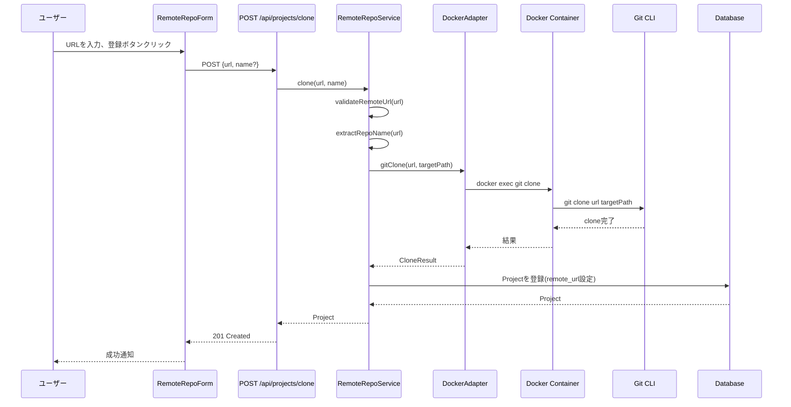
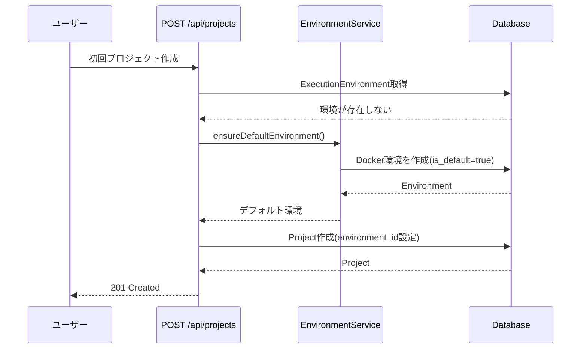
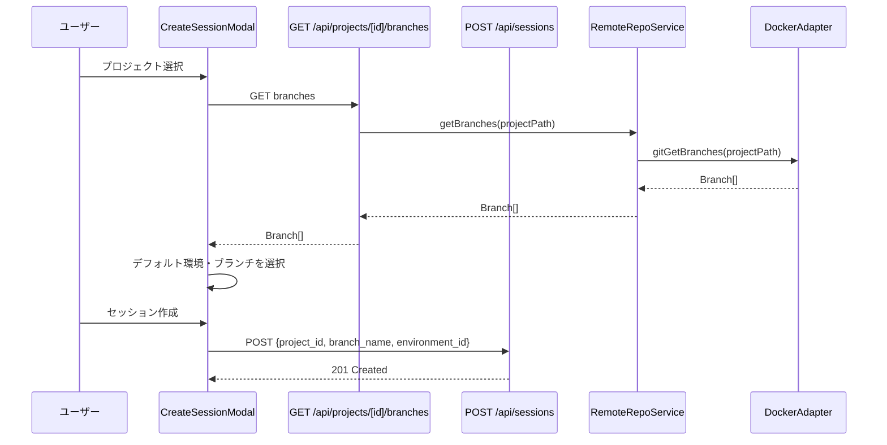

# 設計書: Docker主体＋リモートリポジトリ対応への移行

> このドキュメントはAIエージェント（Claude Code等）が実装を行うことを前提としています。

## アーキテクチャ概要

```mermaid
graph TD
    subgraph Frontend
        A[AddProjectModal] --> B[ローカルタブ]
        A --> C[リモートタブ]
        C --> D[RemoteRepoForm]
        E[CreateSessionModal] --> F[環境選択ドロップダウン]
        E --> G[ブランチ選択ドロップダウン]
        H[ProjectCard] --> I[リモートバッジ]
        H --> J[更新ボタン]
    end

    subgraph API Layer
        K[POST /api/projects/clone]
        L[POST /api/projects/[id]/pull]
        M[GET /api/projects/[id]/branches]
    end

    subgraph Service Layer
        N[RemoteRepoService]
        O[DockerAdapter + Git操作]
        P[EnvironmentService]
        Q[GitService]
    end

    subgraph Docker Environment
        R[Docker Container]
        S[Git Clone]
        T[Git Pull]
        U[Git Branch]
    end

    D -->|clone request| K
    J -->|pull request| L
    G -->|get branches| M

    K --> N
    L --> N
    M --> N

    N --> O
    O --> R
    R --> S
    R --> T
    R --> U

    F --> P
    P -->|デフォルト環境| O
```

## 設計の原則

1. **Docker優先**: 新規セッションはDockerをデフォルトとし、HOSTは後方互換性のために残す
2. **完全な環境分離**: Docker内でGit操作を実行し、ホストとの依存を最小化
3. **既存機能の活用**: 既存のDockerAdapter、GitService、EnvironmentServiceを拡張
4. **段階的移行**: 既存HOSTセッションは影響を受けず、新規セッションのみDocker化
5. **セキュリティ第一**: SSH推奨（HTTPSはPAT利用時のみサポート）、パストラバーサル対策、コマンドインジェクション防止

## 主要コンポーネント

| コンポーネント | 責務 | ファイルパス | 状態 |
|--------------|------|------------|------|
| [DockerAdapter拡張](components/docker-adapter-git.md) @components/docker-adapter-git.md | Docker内でのGit操作 | src/services/adapters/docker-adapter.ts | 拡張 |
| [RemoteRepoService](components/remote-repo-service.md) @components/remote-repo-service.md | リモートリポジトリ操作の抽象化 | src/services/remote-repo-service.ts | 新規 |
| [Clone API](api/clone.md) @api/clone.md | リモートリポジトリのクローン | src/app/api/projects/clone/route.ts | 新規 |
| [Pull API](api/pull.md) @api/pull.md | リポジトリの更新 | src/app/api/projects/[id]/pull/route.ts | 新規 |
| [Branches API](api/branches.md) @api/branches.md | ブランチ一覧取得 | src/app/api/projects/[id]/branches/route.ts | 新規 |
| [RemoteRepoForm](components/remote-repo-form.md) @components/remote-repo-form.md | リモートURL入力UI | src/components/projects/RemoteRepoForm.tsx | 新規 |
| [環境選択UI](components/environment-selector.md) @components/environment-selector.md | 環境選択とデフォルト設定 | src/components/sessions/CreateSessionModal.tsx | 拡張 |
| [ブランチ選択UI](components/branch-selector.md) @components/branch-selector.md | ブランチ選択ドロップダウン | src/components/sessions/CreateSessionModal.tsx | 新規 |

## データモデル

### Drizzleスキーマ変更

既存のスキーマに以下のフィールドが既に存在：

```typescript
// src/db/schema.ts

export const projects = sqliteTable('Project', {
  // ... 既存フィールド
  remote_url: text('remote_url'),           // 既存: リモートリポジトリURL
  clone_location: text('clone_location').default('docker'), // 既存: 'host' | 'docker'
  docker_volume_id: text('docker_volume_id'),              // 既存: Dockerボリューム名
  environment_id: text('environment_id')    // 既存: プロジェクトのデフォルト環境
    .references(() => executionEnvironments.id, { onDelete: 'set null' }),
});

export const executionEnvironments = sqliteTable('ExecutionEnvironment', {
  // ... 既存フィールド
  is_default: integer('is_default', { mode: 'boolean' })
    .notNull().default(false),              // 既存: デフォルト環境フラグ
});
```

**変更不要**: 必要なフィールドは全て既に存在しています。

## データフロー

### シーケンス1: リモートリポジトリのクローン



### シーケンス2: デフォルト環境の初期化



### シーケンス3: セッション作成時の環境・ブランチ選択



## 技術的決定事項

| ID | 決定事項 | 根拠 | リンク |
|----|---------|------|--------|
| DEC-001 | Docker内でGit操作を実行 | 完全な環境分離、SSH認証の一貫性 | [詳細](decisions/DEC-001-docker-git-execution.md) @decisions/DEC-001-docker-git-execution.md |
| DEC-002 | デフォルト環境は初回プロジェクト作成時に作成 | 起動時間の短縮、遅延初期化 | [詳細](decisions/DEC-002-default-env-init.md) @decisions/DEC-002-default-env-init.md |
| DEC-003 | SSH推奨・HTTPS+PATもサポート | セキュリティ、既存SETUP.mdとの整合性 | [詳細](decisions/DEC-003-ssh-auth-only.md) @decisions/DEC-003-ssh-auth-only.md |
| DEC-004 | HOSTモードは削除せず継続サポート | 後方互換性、段階的移行 | [詳細](decisions/DEC-004-host-mode-retention.md) @decisions/DEC-004-host-mode-retention.md |
| DEC-005 | 既存スキーマを活用 | 変更の最小化、実装コストの削減 | [詳細](decisions/DEC-005-reuse-existing-schema.md) @decisions/DEC-005-reuse-existing-schema.md |

## セキュリティ設計

### 認証とアクセス制御

1. **SSH認証**:
   - ホストの`~/.ssh`ディレクトリを読み取り専用でDockerにマウント
   - SSH Agentソケットも転送（`SSH_AUTH_SOCK`）
   - GIT_TERMINAL_PROMPT=0でインタラクティブプロンプト無効化

2. **URL検証**:
   - Git URL形式（SSH/HTTPS）のみ許可
   - 正規表現による検証: `^(git@|https://).+\.git$`
   - コマンドインジェクション防止: 配列形式でspawnに渡す

3. **パストラバーサル対策**:
   - クローン先ディレクトリの正規化
   - ベースディレクトリ（`/workspace/data/repos/`）配下のみ許可
   - 絶対パスへの解決後に範囲チェック

4. **Docker環境分離**:
   - セキュリティオプション: `--cap-drop=ALL`, `--security-opt=no-new-privileges`
   - 必要最小限のボリュームマウント
   - 環境ごとに独立した認証ディレクトリ

## CI/CD設計

### ビルド要件

- **TypeScript**: 型チェック（`npm run build`）
- **ESLint**: コードスタイル（`npm run lint`）
- **Vitest**: ユニットテスト（`npm test`）
- **Playwright**: E2Eテスト（`npm run e2e`）

### 品質基準

- **カバレッジ**: 80%以上（ユニットテスト）
- **Linter**: エラー0、警告最小化
- **型エラー**: 0
- **複雑度**: 関数あたり10以下（推奨）

### テスト戦略

| テストレベル | 対象 | ツール | カバレッジ目標 |
|------------|------|-------|-------------|
| ユニットテスト | RemoteRepoService, DockerAdapter Git操作 | Vitest | 90%以上 |
| 統合テスト | API エンドポイント | Vitest | 80%以上 |
| E2Eテスト | リモートクローン、ブランチ選択、環境選択 | Playwright | 主要フロー |

## 依存関係

### 既存コンポーネント

- `DockerAdapter` (src/services/adapters/docker-adapter.ts) - 拡張対象
- `GitService` (src/services/git-service.ts) - 参考実装
- `EnvironmentService` (src/services/environment-service.ts) - デフォルト環境作成
- `AdapterFactory` (src/services/adapter-factory.ts) - アダプター取得

### 外部依存

- Docker Engine - Docker環境実行に必須
- Git CLI - クローン、ブランチ操作に必須
- SSH設定 - プライベートリポジトリアクセスに必要

## 非機能要件の設計対応

### 互換性（NFR-001〜NFR-012）

- 既存HOSTセッションは変更なし
- `environment_id`がnullの場合はHOST環境使用
- 新規セッションのみDockerデフォルト

### セキュリティ（NFR-013〜NFR-028）

- Docker環境分離
- SSH認証（読み取り専用マウント）
- URL検証、パストラバーサル対策、コマンドインジェクション防止

### 性能（NFR-029〜NFR-044）

- Docker環境初期化: 10秒以内
- クローン処理: 非同期、進捗表示
- ブランチ取得: 5秒以内
- UI応答性: 100-500ms以内

### ユーザビリティ（NFR-045〜NFR-065）

- 直感的なタブUI（ローカル/リモート）
- 環境タイプバッジ（DOCKER=緑、HOST=灰）
- 明確なエラーメッセージ
- プレースホルダーに例を表示

## 実装の優先順位

### Phase 1: 基盤整備（高優先度）
1. DockerAdapterにGit操作メソッド追加
2. RemoteRepoService実装
3. デフォルトDocker環境の初期化

### Phase 2: API実装（高優先度）
4. POST /api/projects/clone
5. POST /api/projects/[id]/pull
6. GET /api/projects/[id]/branches

### Phase 3: UI実装（中優先度）
7. RemoteRepoForm
8. AddProjectModalのタブ追加
9. 環境選択UIの改善
10. ブランチ選択ドロップダウン
11. ProjectCardのリモートバッジ・更新ボタン

### Phase 4: テスト・ドキュメント（中優先度）
12. ユニットテスト
13. E2Eテスト
14. ドキュメント更新

## 関連ドキュメント

- 要件定義: @../requirements/docker-default-remote-clone/index.md
- タスク: @../tasks/docker-default-remote-clone/index.md
- 既存のリモートリポジトリ設計: `docs/remote-repo/design.md`

## 変更履歴

| 日付 | 変更内容 | 担当者 |
|------|---------|--------|
| 2026-02-17 | 初版作成 | Claude Code |
