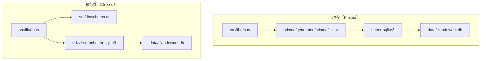
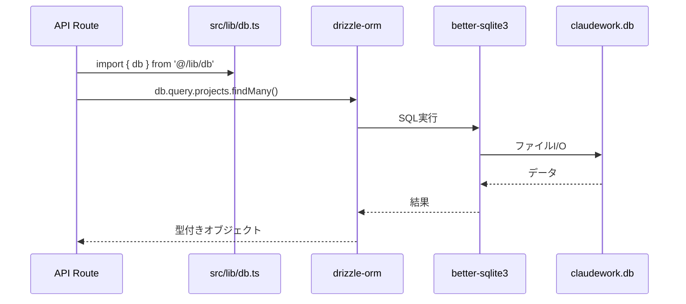

# 設計: Prisma から Drizzle ORM への移行

> このドキュメントはAIエージェント（Claude Code等）が実装を行うことを前提としています。

## 情報の明確性チェック

### ユーザーから明示された情報

- [x] 技術スタック: Drizzle ORM + better-sqlite3
- [x] アーキテクチャパターン: 既存パターンを維持（シングルトン）
- [x] フレームワーク: Next.js 15 App Router（既存）
- [x] データベース: SQLite（既存、継続使用）
- [x] クエリスタイル: Relational queries（Prismaに近い宣言的API）
- [x] 移行方式: 完全置換（Prismaを完全削除）
- [x] データ移行: 不要（リセット可）

### 不明/要確認の情報

なし（すべて確認済み）

---

## アーキテクチャ概要



## コンポーネント

### コンポーネント1: スキーマ定義 (src/db/schema.ts)

**目的**: Drizzle ORMのテーブル定義とリレーション定義

**責務**:
- 6つのテーブル（projects, sessions, messages, prompts, run_scripts, execution_environments）の定義
- リレーション定義（Project-Session, Session-Message等）
- 型エクスポート

**定義するテーブル**:

```typescript
// projects テーブル
export const projects = sqliteTable('Project', {
  id: text('id').primaryKey().$defaultFn(() => crypto.randomUUID()),
  name: text('name').notNull(),
  path: text('path').notNull().unique(),
  remote_url: text('remote_url'),
  created_at: integer('created_at', { mode: 'timestamp' }).notNull().$defaultFn(() => new Date()),
  updated_at: integer('updated_at', { mode: 'timestamp' }).notNull().$defaultFn(() => new Date()),
});

// execution_environments テーブル
export const executionEnvironments = sqliteTable('ExecutionEnvironment', {
  id: text('id').primaryKey().$defaultFn(() => crypto.randomUUID()),
  name: text('name').notNull(),
  type: text('type').notNull(), // 'HOST' | 'DOCKER' | 'SSH'
  description: text('description'),
  config: text('config').notNull(),
  auth_dir_path: text('auth_dir_path'),
  is_default: integer('is_default', { mode: 'boolean' }).notNull().default(false),
  created_at: integer('created_at', { mode: 'timestamp' }).notNull().$defaultFn(() => new Date()),
  updated_at: integer('updated_at', { mode: 'timestamp' }).notNull().$defaultFn(() => new Date()),
});

// sessions テーブル
export const sessions = sqliteTable('Session', {
  id: text('id').primaryKey().$defaultFn(() => crypto.randomUUID()),
  project_id: text('project_id').notNull().references(() => projects.id, { onDelete: 'cascade' }),
  name: text('name').notNull(),
  status: text('status').notNull(),
  worktree_path: text('worktree_path').notNull(),
  branch_name: text('branch_name').notNull(),
  resume_session_id: text('resume_session_id'),
  last_activity_at: integer('last_activity_at', { mode: 'timestamp' }),
  pr_url: text('pr_url'),
  pr_number: integer('pr_number'),
  pr_status: text('pr_status'),
  pr_updated_at: integer('pr_updated_at', { mode: 'timestamp' }),
  docker_mode: integer('docker_mode', { mode: 'boolean' }).notNull().default(false),
  container_id: text('container_id'),
  environment_id: text('environment_id').references(() => executionEnvironments.id, { onDelete: 'set null' }),
  created_at: integer('created_at', { mode: 'timestamp' }).notNull().$defaultFn(() => new Date()),
  updated_at: integer('updated_at', { mode: 'timestamp' }).notNull().$defaultFn(() => new Date()),
});

// messages テーブル
export const messages = sqliteTable('Message', {
  id: text('id').primaryKey().$defaultFn(() => crypto.randomUUID()),
  session_id: text('session_id').notNull().references(() => sessions.id, { onDelete: 'cascade' }),
  role: text('role').notNull(),
  content: text('content').notNull(),
  sub_agents: text('sub_agents'),
  created_at: integer('created_at', { mode: 'timestamp' }).notNull().$defaultFn(() => new Date()),
});

// prompts テーブル
export const prompts = sqliteTable('Prompt', {
  id: text('id').primaryKey().$defaultFn(() => crypto.randomUUID()),
  content: text('content').notNull().unique(),
  used_count: integer('used_count').notNull().default(1),
  last_used_at: integer('last_used_at', { mode: 'timestamp' }).notNull().$defaultFn(() => new Date()),
  created_at: integer('created_at', { mode: 'timestamp' }).notNull().$defaultFn(() => new Date()),
  updated_at: integer('updated_at', { mode: 'timestamp' }).notNull().$defaultFn(() => new Date()),
});

// run_scripts テーブル
export const runScripts = sqliteTable('RunScript', {
  id: text('id').primaryKey().$defaultFn(() => crypto.randomUUID()),
  project_id: text('project_id').notNull().references(() => projects.id, { onDelete: 'cascade' }),
  name: text('name').notNull(),
  description: text('description'),
  command: text('command').notNull(),
  created_at: integer('created_at', { mode: 'timestamp' }).notNull().$defaultFn(() => new Date()),
  updated_at: integer('updated_at', { mode: 'timestamp' }).notNull().$defaultFn(() => new Date()),
}, (table) => [
  index('run_scripts_project_id_idx').on(table.project_id),
]);
```

### コンポーネント2: リレーション定義 (src/db/schema.ts)

**目的**: テーブル間のリレーションを定義

```typescript
export const projectsRelations = relations(projects, ({ many }) => ({
  sessions: many(sessions),
  scripts: many(runScripts),
}));

export const executionEnvironmentsRelations = relations(executionEnvironments, ({ many }) => ({
  sessions: many(sessions),
}));

export const sessionsRelations = relations(sessions, ({ one, many }) => ({
  project: one(projects, {
    fields: [sessions.project_id],
    references: [projects.id],
  }),
  environment: one(executionEnvironments, {
    fields: [sessions.environment_id],
    references: [executionEnvironments.id],
  }),
  messages: many(messages),
}));

export const messagesRelations = relations(messages, ({ one }) => ({
  session: one(sessions, {
    fields: [messages.session_id],
    references: [sessions.id],
  }),
}));

export const runScriptsRelations = relations(runScripts, ({ one }) => ({
  project: one(projects, {
    fields: [runScripts.project_id],
    references: [projects.id],
  }),
}));
```

### コンポーネント3: データベース接続 (src/lib/db.ts)

**目的**: Drizzle ORMのシングルトンインスタンスを提供

**責務**:
- better-sqlite3を使用したデータベース接続
- シングルトンパターンでの接続管理
- 型エクスポート

```typescript
import 'dotenv/config';
import { drizzle } from 'drizzle-orm/better-sqlite3';
import Database from 'better-sqlite3';
import * as schema from '@/db/schema';

// DATABASE_URL環境変数の検証
const envDatabaseUrl = process.env.DATABASE_URL;

if (!envDatabaseUrl || envDatabaseUrl.trim() === '') {
  throw new Error(
    'DATABASE_URL environment variable is not set. ' +
    'Please set it in your .env file. ' +
    'Example: DATABASE_URL=file:../data/claudework.db'
  );
}

// file:プレフィックスを除去してパスを取得
// file:// (full URL format) と file: (simple prefix) の両方に対応
const dbPath = envDatabaseUrl.startsWith('file://')
  ? fileURLToPath(envDatabaseUrl)
  : envDatabaseUrl.replace(/^file:/, '');

const globalForDb = globalThis as unknown as {
  db: ReturnType<typeof drizzle<typeof schema>> | undefined;
};

function createDb() {
  const sqlite = new Database(dbPath);
  sqlite.pragma('journal_mode = WAL');
  return drizzle(sqlite, { schema });
}

export const db = globalForDb.db ?? createDb();

if (process.env.NODE_ENV !== 'production') {
  globalForDb.db = db;
}

// 型エクスポート
export type Project = typeof schema.projects.$inferSelect;
export type NewProject = typeof schema.projects.$inferInsert;
export type Session = typeof schema.sessions.$inferSelect;
export type NewSession = typeof schema.sessions.$inferInsert;
export type Message = typeof schema.messages.$inferSelect;
export type NewMessage = typeof schema.messages.$inferInsert;
export type Prompt = typeof schema.prompts.$inferSelect;
export type NewPrompt = typeof schema.prompts.$inferInsert;
export type RunScript = typeof schema.runScripts.$inferSelect;
export type NewRunScript = typeof schema.runScripts.$inferInsert;
export type ExecutionEnvironment = typeof schema.executionEnvironments.$inferSelect;
export type NewExecutionEnvironment = typeof schema.executionEnvironments.$inferInsert;

export { schema };
export default db;
```

### コンポーネント4: Drizzle設定 (drizzle.config.ts)

**目的**: drizzle-kitの設定

```typescript
import type { Config } from 'drizzle-kit';

export default {
  schema: './src/db/schema.ts',
  out: './drizzle',
  dialect: 'sqlite',
  dbCredentials: {
    url: process.env.DATABASE_URL?.replace(/^file:/, '') || './data/claudework.db',
  },
} satisfies Config;
```

## データフロー

### シーケンス: データベースクエリの実行



## API変更対応

### Prisma → Drizzle クエリ変換パターン

| Prisma | Drizzle (Relational) |
|--------|---------------------|
| `prisma.project.findMany()` | `db.query.projects.findMany()` |
| `prisma.project.findUnique({ where: { id } })` | `db.query.projects.findFirst({ where: eq(projects.id, id) })` |
| `prisma.project.create({ data })` | `db.insert(projects).values(data).returning()` |
| `prisma.project.update({ where, data })` | `db.update(projects).set(data).where(eq(...)).returning()` |
| `prisma.project.delete({ where })` | `db.delete(projects).where(eq(...))` |
| `include: { sessions: true }` | `with: { sessions: true }` |
| `orderBy: { created_at: 'desc' }` | `orderBy: [desc(projects.created_at)]` |

### エラーハンドリング変換

| Prisma | Drizzle |
|--------|---------|
| `Prisma.PrismaClientKnownRequestError` + `error.code === 'P2002'` | `UNIQUE constraint failed` エラーメッセージで判定 |
| `Prisma.PrismaClientKnownRequestError` + `error.code === 'P2025'` | 結果が空かどうかで判定 |

## 技術的決定事項

### 決定1: テーブル名の維持

**検討した選択肢**:
1. Prismaのテーブル名を維持（Project, Session等のPascalCase）
2. Drizzle標準のsnake_caseに変更

**決定**: 選択肢1（Prismaのテーブル名を維持）
**根拠**: 既存データベースとの互換性を保ち、移行を単純化するため

### 決定2: タイムスタンプの保存形式

**検討した選択肢**:
1. integer型（UNIXタイムスタンプ）でmode: 'timestamp'
2. text型（ISO 8601文字列）

**決定**: 選択肢1（integer + mode: 'timestamp'）
**根拠**: Prismaの既存データとの互換性、SQLiteでのソート効率

### 決定3: UUID生成方法

**検討した選択肢**:
1. crypto.randomUUID()
2. uuid パッケージ

**決定**: 選択肢1（crypto.randomUUID()）
**根拠**: Node.js組み込みで追加依存なし

## ファイル構成

```text
src/
├── db/
│   └── schema.ts          # NEW: Drizzleスキーマ定義
├── lib/
│   └── db.ts              # 修正: Drizzle接続に変更
├── app/api/               # 修正: 全APIルートのクエリ変換
└── services/              # 修正: サービス層のクエリ変換

drizzle/                   # NEW: マイグレーションファイル
drizzle.config.ts          # NEW: Drizzle Kit設定

prisma/                    # 削除予定
├── schema.prisma
├── generated/
└── seed-environments.ts
```

## 削除対象

### 依存関係
- `@prisma/client`
- `@prisma/adapter-better-sqlite3`
- `prisma` (devDependencies)

### ファイル・ディレクトリ
- `prisma/` ディレクトリ全体
- `prisma/generated/` ディレクトリ

### package.json スクリプト
- `prepare`スクリプトの`prisma generate`部分
- `db:migrate-environments`スクリプト

## セキュリティ考慮事項

- Drizzleのパラメータ化クエリにより、SQLインジェクションは防止される
- 既存のバリデーションロジックは維持

## パフォーマンス考慮事項

- better-sqlite3のWALモードを有効化
- インデックスは既存のものを維持（run_scripts.project_id）

## エラー処理

### UNIQUE制約違反の検出

```typescript
try {
  db.insert(projects).values(data).returning().get();
} catch (error) {
  const sqliteError = error as { code?: string };
  const isUniqueViolation = sqliteError.code === 'SQLITE_CONSTRAINT_UNIQUE' ||
    (error instanceof Error && error.message.includes('UNIQUE constraint failed'));
  if (isUniqueViolation) {
    // 重複エラー処理
  }
  throw error;
}
```

## 拡張性

### 新規テーブルの追加

**手順**:
1. `src/db/schema.ts` にテーブル定義を追加
2. リレーションが必要な場合は `relations()` を定義
3. `src/lib/db.ts` に型エクスポートを追加
4. `npx drizzle-kit push` でスキーマを同期

**例**（GitHubPATテーブルを追加する場合）:
```typescript
export const githubPATs = sqliteTable('GitHubPAT', {
  id: text('id').primaryKey().$defaultFn(() => crypto.randomUUID()),
  name: text('name').notNull(),
  token: text('token').notNull(),
  is_active: integer('is_active', { mode: 'boolean' }).notNull().default(true),
  created_at: integer('created_at', { mode: 'timestamp' }).notNull().$defaultFn(() => new Date()),
});
```

### クエリの最適化

- 頻繁に使用するクエリには適切なインデックスを追加
- Drizzleの `prepare()` メソッドでプリペアドステートメントを活用
- 必要に応じてRaw SQLクエリも使用可能（`db.run(sql)`）

## 今後の改善案

1. **マイグレーション履歴の管理**: drizzle-kitのマイグレーション機能を本番環境で活用
2. **クエリビルダーの活用**: 複雑なクエリには、Drizzleのクエリビルダーを積極的に活用
3. **パフォーマンスモニタリング**: クエリ実行時間のロギングとモニタリング
4. **型生成の自動化**: スキーマ変更時の型生成を自動化（CI/CD統合）
5. **Drizzle Studio統合**: 開発時のデータベース確認ツールとして常時活用
