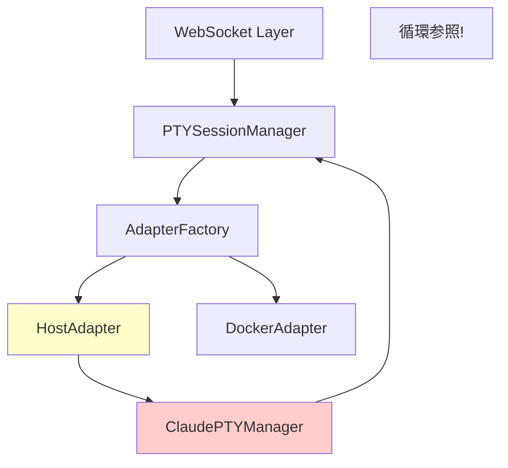
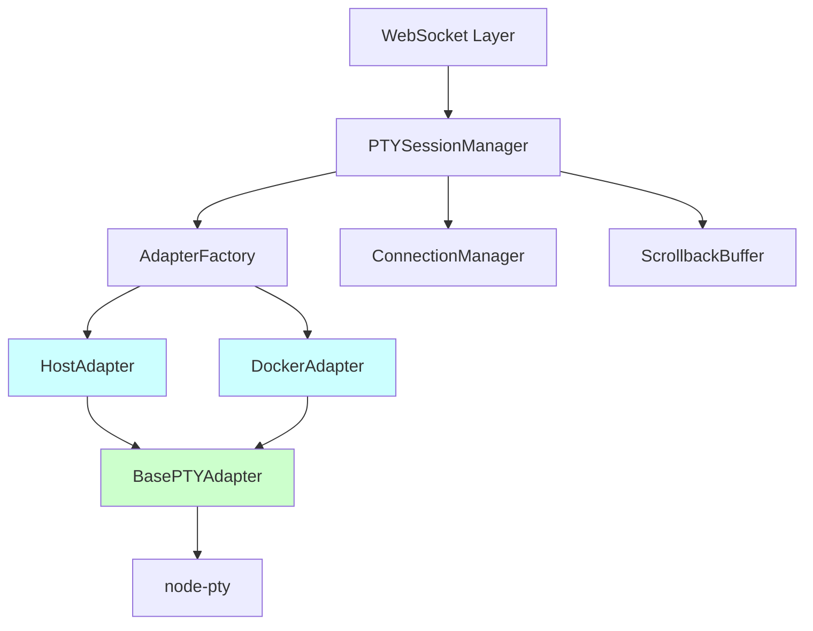

# 設計: Issue #101 PTY Architecture Refactor

> このドキュメントはAIエージェント（Claude Code等）が実装を行うことを前提としています。
> 各セクションで「明示された情報」と「不明/要確認の情報」を明確に区別してください。
> **不明な情報が1つでもある場合は、実装前に必ず確認を取ってください。**

## 情報の明確性チェック

### ユーザーから明示された情報
- [x] 技術スタック: TypeScript, node-pty, EventEmitter
- [x] アーキテクチャパターン: Adapterパターン、抽象基底クラス
- [x] フレームワーク: Next.js 15 (既存)
- [x] データベース: Drizzle ORM (既存、変更なし)
- [x] 外部依存: Docker (DOCKER環境のみ)
- [x] 設計原則: docs/design-principles-pty-session-management.md
- [x] パフォーマンス要件: 既存性能維持(NFR-PERF-001, NFR-PERF-002)

### 不明/要確認の情報

| 項目 | 現状の理解 | 確認状況 |
|------|-----------|----------|
| SessionID抽出機能の移動先 | extractClaudeSessionId()はbase-adapterへ移動 | [x] 確認済み(US-004に記載) |
| ptyManagerの変更要否 | shellMode用ptyManagerは変更なし | [x] 確認済み(スコープ外) |
| テストカバレッジ目標 | 80%以上 | [x] 確認済み(NFR-MNT-002) |

### 確認が必要な質問リスト
なし（全ての必要情報が明示されている）

---

## アーキテクチャ概要

PTY/セッション管理のアーキテクチャをリファクタリングし、Circular delegationを解消する。

### リファクタリング前（現状）



**問題点:**
- HostAdapter → ClaudePTYManager → PTYSessionManager の循環委譲
- cols/rows がハードコード(80x24)
- destroySession 無限再帰

### リファクタリング後（目標）



**改善点:**
- 一方向の依存関係(上位 → 下位)
- 共通ロジックをBasePTYAdapterに集約
- ClaudePTYManager削除により循環解消

### レイヤー構成

| レイヤー | 責務 | 主要コンポーネント |
|---------|------|------------------|
| WebSocket Layer | プロトコル変換、メッセージルーティング | claude-ws.ts, terminal-ws.ts |
| Session Manager | セッションライフサイクル管理、状態遷移 | PTYSessionManager |
| Adapter Layer | 環境差異の吸収(HOST/Docker) | HostAdapter, DockerAdapter |
| Base Adapter | PTY共通ロジック | BasePTYAdapter(新規) |
| PTY Layer | プロセス生成・入出力管理 | node-pty |
| Infrastructure | 横断的関心事(接続プール、バッファ) | ConnectionManager, ScrollbackBuffer |

## コンポーネント一覧

| コンポーネント名 | 種別 | 目的 | 詳細リンク |
|-----------------|------|------|-----------|
| BasePTYAdapter | 新規作成 | 共通PTYロジック抽出(抽象基底クラス) | [詳細](components/base-adapter.md) @components/base-adapter.md |
| HostAdapter | 変更 | HOST環境アダプター(ClaudePTYManager依存削除) | [詳細](components/host-adapter.md) @components/host-adapter.md |
| DockerAdapter | 変更 | Docker環境アダプター(共通ロジックをbase-adapterへ移動) | [詳細](components/docker-adapter.md) @components/docker-adapter.md |
| ClaudePTYManager | 削除 | (削除対象: Circular delegationの原因) | - |

## API一覧

本リファクタリングではHTTP APIの変更はなし。内部アダプターインターフェースのみ変更。

### EnvironmentAdapterインターフェース (既存、変更なし)

| メソッド | 説明 | 変更 |
|---------|------|------|
| createSession() | セッション作成 | なし(シグネチャ維持) |
| write() | PTY入力送信 | なし |
| resize() | PTYサイズ変更 | なし |
| destroySession() | セッション終了 | なし |
| restartSession() | セッション再起動 | なし |

### BasePTYAdapterインターフェース (新規)

| メソッド | 種別 | 説明 |
|---------|------|------|
| spawnPTY() | protected | PTY spawn共通処理 |
| setupDataHandlers() | protected | データハンドリング設定 |
| setupErrorHandlers() | protected | エラーハンドリング設定 |
| cleanupPTY() | protected | PTYクリーンアップ |
| extractClaudeSessionId() | protected | Claude SessionID抽出 |
| createSession() | abstract | 環境固有の実装(継承先で定義) |
| destroySession() | abstract | 環境固有の実装(継承先で定義) |

## データベーススキーマ

本リファクタリングではデータベーススキーマの変更はなし。

## 技術的決定事項

| ID | 決定内容 | ステータス | 詳細リンク |
|----|---------|-----------|-----------|
| DEC-001 | ClaudePTYManager削除によるCircular delegation解消 | 承認済 | [詳細](decisions/DEC-001.md) @decisions/DEC-001.md |
| DEC-002 | BasePTYAdapter共通ロジック抽出による保守性向上 | 承認済 | [詳細](decisions/DEC-002.md) @decisions/DEC-002.md |
| DEC-003 | cols/rows伝播方法の統一(options経由) | 承認済 | [詳細](decisions/DEC-003.md) @decisions/DEC-003.md |

## セキュリティ考慮事項

本リファクタリングはアーキテクチャ改善であり、セキュリティ要件の変更はなし。

**維持すべきセキュリティ要件:**
- PTYプロセスの権限分離(既存機能)
- Docker環境の分離(既存機能)
- 環境変数のサニタイゼーション(既存機能)

## パフォーマンス考慮事項

**NFR-PERF-001: セッション作成時間の維持**
- 目標: HOST環境500ms以下、DOCKER環境2000ms以下
- 対策: Circular delegation解消により不要な呼び出しを削減

**NFR-PERF-002: リサイズ操作の応答性**
- 目標: 50ms以下
- 対策: 既存実装の性能を維持

**最適化ポイント:**
- ClaudePTYManager削除により、1層の委譲オーバーヘッドを削減
- 共通ロジック抽出により、コード重複による保守コストを削減

## エラー処理戦略

### エラーハンドリングの統一

BasePTYAdapterで以下のエラーハンドリングを実装:

1. **PTY spawn失敗**
   - ログ記録: error level
   - イベント発火: 'error' event
   - 状態遷移: セッション状態をERRORに更新

2. **PTY異常終了**
   - ログ記録: warn level
   - イベント発火: 'exit' event
   - クリーンアップ: cleanupPTY()呼び出し

3. **リサイズエラー**
   - ログ記録: warn level
   - リトライ: なし(ベストエフォート)

4. **destroySession無限再帰防止**
   - 一方向の呼び出しチェーン強制
   - 再帰検出ガード(既存のcreating Setパターン)

### エラーからの復旧

- セッション再起動機能(既存機能を維持)
- 自動復旧なし(ユーザー操作で再起動)

## CI/CD設計

### 品質ゲート

| 項目 | 基準値 | 採用ツール |
|------|--------|-----------|
| テストカバレッジ | 80%以上 | Vitest (c8/istanbul) |
| Linter | エラー0件 | ESLint |
| 型チェック | エラー0件 | TypeScript tsc |
| コード複雑性 | 循環的複雑度10以下 | ESLint complexity rule |

### テスト戦略

1. **ユニットテスト**
   - BasePTYAdapter: 共通ロジックのテスト
   - HostAdapter: HOST環境固有のテスト
   - DockerAdapter: Docker環境固有のテスト

2. **統合テスト**
   - HOST環境セッション作成→破棄フロー
   - DOCKER環境セッション作成→破棄フロー
   - cols/rows伝播の検証

3. **回帰テスト**
   - 既存のE2Eテスト全実行
   - Circular delegation解消の検証
   - destroySession無限再帰の検証

### GitHub Actions

既存のGitHub Actionsを活用:
- `npm test` - ユニットテスト実行
- `npm run build` - TypeScriptビルド
- `npm run lint` - ESLint実行

---

## リンク形式について

詳細ファイルへのリンクは、マークダウン形式と`@`形式の両方を記載してください：
- **マークダウン形式**: `[詳細](components/base-adapter.md)` - GitHub等での閲覧用
- **@形式**: `@components/base-adapter.md` - Claude Codeがファイルを参照する際に使用

---

## ドキュメント構成

```
docs/sdd/design/issue-101-pty-refactor/
├── index.md                     # このファイル（目次）
├── components/
│   ├── base-adapter.md          # BasePTYAdapter設計
│   ├── host-adapter.md          # HostAdapter設計
│   └── docker-adapter.md        # DockerAdapter設計
└── decisions/
    ├── DEC-001.md               # ClaudePTYManager削除
    ├── DEC-002.md               # 共通ロジック抽出
    └── DEC-003.md               # cols/rows伝播統一
```
