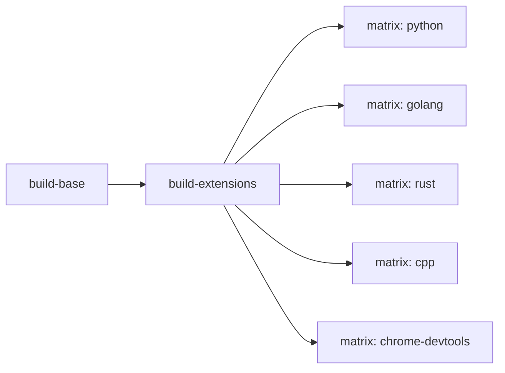

# CI/CD Pipeline

## 概要

**目的**: 基本イメージと全拡張イメージを2段階でビルド・プッシュするGitHub Actionsワークフロー

**責務**:
- 基本イメージのビルドとプッシュ（1段階目）
- 全拡張イメージの並列ビルドとプッシュ（2段階目、matrix strategy）
- バリアント別タグの付与
- PRではビルドのみ（pushなし）
- GitHub Actions Cacheによるレイヤーキャッシュ

## 情報の明確性

### 明示された情報
- 2段階ビルド構成（base -> extensions）
- matrix strategyで並列化
- アプリケーション本体とは別のタグ
- `docker/**` と `.github/workflows/docker-publish.yml` の変更でトリガー

---

## ファイル

**パス**: `.github/workflows/docker-publish.yml`

## ワークフロー設計

```yaml
name: Docker Publish

on:
  push:
    branches: [main]
    paths:
      - 'docker/**'
      - '.github/workflows/docker-publish.yml'
  pull_request:
    branches: [main]
    paths:
      - 'docker/**'
      - '.github/workflows/docker-publish.yml'
  workflow_dispatch:

env:
  REGISTRY: ghcr.io

permissions:
  contents: read
  packages: write

jobs:
  build-base:
    runs-on: ubuntu-latest
    timeout-minutes: 30
    outputs:
      image-name: ${{ steps.image.outputs.name }}
      base-tag: ${{ steps.base-tag.outputs.tag }}
    steps:
      - uses: actions/checkout@v4
      - id: image
        run: echo "name=${GITHUB_REPOSITORY_OWNER,,}/claude-work-sandbox" >> "$GITHUB_OUTPUT"
      - uses: docker/setup-qemu-action@v3
      - uses: docker/setup-buildx-action@v3
      - uses: docker/login-action@v3
        if: github.event_name != 'pull_request'
        with:
          registry: ${{ env.REGISTRY }}
          username: ${{ github.actor }}
          password: ${{ secrets.GITHUB_TOKEN }}
      - id: meta
        uses: docker/metadata-action@v5
        with:
          images: ${{ env.REGISTRY }}/${{ steps.image.outputs.name }}
          tags: |
            type=ref,event=branch
            type=semver,pattern={{version}}
            type=semver,pattern={{major}}.{{minor}}
            type=semver,pattern={{major}}
            type=sha
            type=raw,value=latest,enable={{is_default_branch}}
      - name: Set base tag for extensions
        id: base-tag
        run: |
          if [ "${{ github.event_name }}" = "pull_request" ]; then
            # PR時はベースイメージがpushされないため、レジストリの既存latestを使用
            echo "tag=${{ env.REGISTRY }}/${{ steps.image.outputs.name }}:latest" >> "$GITHUB_OUTPUT"
          else
            # push時は同一ワークフローでビルドしたshaタグを使用
            SHA_SHORT="${GITHUB_SHA::7}"
            echo "tag=${{ env.REGISTRY }}/${{ steps.image.outputs.name }}:sha-${SHA_SHORT}" >> "$GITHUB_OUTPUT"
          fi
      - uses: docker/build-push-action@v6
        with:
          context: docker
          file: docker/Dockerfile
          platforms: linux/amd64,linux/arm64
          push: ${{ github.event_name != 'pull_request' }}
          tags: ${{ steps.meta.outputs.tags }}
          labels: ${{ steps.meta.outputs.labels }}
          cache-from: type=gha,scope=base
          cache-to: type=gha,mode=max,scope=base

  build-extensions:
    needs: build-base
    runs-on: ubuntu-latest
    timeout-minutes: 30
    strategy:
      fail-fast: false
      matrix:
        include:
          - variant: python
            dockerfile: docker/extensions/Dockerfile.python
          - variant: golang
            dockerfile: docker/extensions/Dockerfile.golang
          - variant: rust
            dockerfile: docker/extensions/Dockerfile.rust
          - variant: cpp
            dockerfile: docker/extensions/Dockerfile.cpp
          - variant: chrome-devtools
            dockerfile: docker/extensions/Dockerfile.chrome-devtools
    steps:
      - uses: actions/checkout@v4
      - uses: docker/setup-qemu-action@v3
      - uses: docker/setup-buildx-action@v3
      - uses: docker/login-action@v3
        if: github.event_name != 'pull_request'
        with:
          registry: ${{ env.REGISTRY }}
          username: ${{ github.actor }}
          password: ${{ secrets.GITHUB_TOKEN }}
      - id: meta
        uses: docker/metadata-action@v5
        with:
          images: ${{ env.REGISTRY }}/${{ needs.build-base.outputs.image-name }}
          tags: |
            type=sha,prefix=${{ matrix.variant }}-
            type=raw,value=${{ matrix.variant }},enable={{is_default_branch}}
      - uses: docker/build-push-action@v6
        with:
          context: docker
          file: ${{ matrix.dockerfile }}
          platforms: linux/amd64,linux/arm64
          push: ${{ github.event_name != 'pull_request' }}
          tags: ${{ steps.meta.outputs.tags }}
          labels: ${{ steps.meta.outputs.labels }}
          build-args: |
            BASE_IMAGE=${{ needs.build-base.outputs.base-tag }}
          cache-from: type=gha,scope=${{ matrix.variant }}
          cache-to: type=gha,mode=max,scope=${{ matrix.variant }}
```

## ジョブ間の依存関係



## タグ生成ロジック

### build-base

| タグ種別 | 例 | 条件 |
|---------|-----|------|
| branch | `:main` | push時 |
| semver | `:1.2.3`, `:1.2`, `:1` | タグpush時 |
| sha | `:sha-abc1234` | 常時 |
| latest | `:latest` | mainブランチ push時 |

### build-extensions

| タグ種別 | 例 | 条件 |
|---------|-----|------|
| variant-sha | `:python-sha-abc1234` | 常時 |
| variant | `:python` | mainブランチ push時 |

## 設計判断

### fail-fast: false

1つの拡張ビルドが失敗しても、他の拡張ビルドは継続する。特定言語のDockerfileに問題があっても、他の言語イメージは正常にデプロイされる。

### BASE_IMAGE のタグ選択（PR vs push）

拡張ビルドでは `needs.build-base.outputs.base-tag` を `BASE_IMAGE` として渡す。タグはイベント種別により異なる:

- **push時**: 同一ワークフローでビルドしたshaタグ（`:sha-abc1234`）を使用。同一ビルド内のベースイメージを確実に参照する。
- **PR時**: レジストリの既存 `:latest` を使用。PR時はベースイメージがpushされないため、shaタグはレジストリに存在しない。

### キャッシュスコープの分離

baseジョブでは `scope=base` を指定し、各バリアントでは `scope=${{ matrix.variant }}` を指定してキャッシュを分離する。拡張ごとにインストールするパッケージが異なるため、キャッシュの競合を防止する。

## テスト観点

- [ ] build-base完了後にbuild-extensionsが開始される
- [ ] 全5バリアントが並列でビルドされる
- [ ] PR時はpushされない
- [ ] mainブランチpush時にバリアント別タグが付与される
- [ ] 1つのバリアントが失敗しても他は継続する
