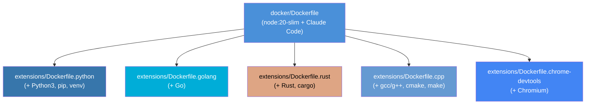
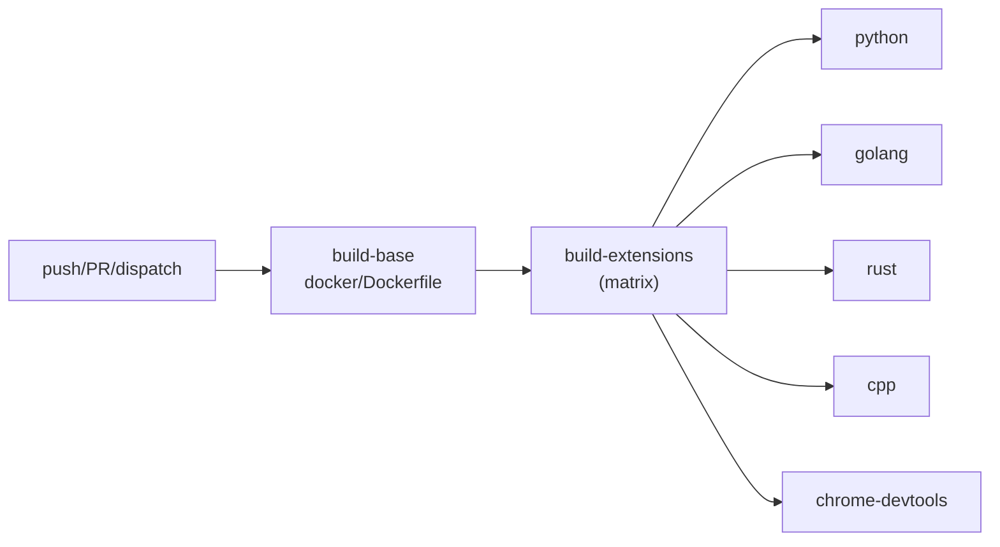

# Sandbox拡張イメージ設計

> このドキュメントはAIエージェント（Claude Code等）が実装を行うことを前提としています。

## 情報の明確性チェック

### ユーザーから明示された情報

- [x] 対象言語: Go, Python, Rust, C++
- [x] アーキテクチャパターン: 基本イメージを継承した拡張Dockerfile
- [x] Chrome DevTools MCP: 言語拡張と同列の拡張として扱う
- [x] ディレクトリ構成: `docker/extensions/` に配置
- [x] タグ設計: アプリケーション本体とは別のタグ（バリアント別prefix）
- [x] CI/CD: GitHub Actionsで2段階ビルド（base -> extensions matrix）
- [x] 複合イメージ: 将来的に必要（現時点では対応不要）
- [x] 全拡張が `ARG BASE_IMAGE` で積み重ね可能にする

### 不明/要確認の情報

なし（全てユーザーとの対話で確認済み）

---

## アーキテクチャ概要

基本のsandboxイメージ（`docker/Dockerfile`）をベースに、言語別およびツール別の拡張イメージを `docker/extensions/` に配置する。全拡張イメージは `ARG BASE_IMAGE` パターンで任意のイメージを継承可能であり、将来の複合イメージにも対応する。



### イメージ継承パターン

全拡張Dockerfileは同一のパターンに従う:

```dockerfile
ARG BASE_IMAGE=ghcr.io/windschord/claude-work-sandbox:latest
FROM ${BASE_IMAGE}
USER root
RUN <ツールのインストール>
USER node
ENV <固有の環境変数>
```

### 複合イメージ（将来対応）

`BASE_IMAGE` を別の拡張イメージに差し替えることで積み重ね可能:

```bash
# 例: Python + Chrome DevTools
docker build --build-arg BASE_IMAGE=ghcr.io/windschord/claude-work-sandbox:python \
  -f docker/extensions/Dockerfile.chrome-devtools \
  -t ghcr.io/windschord/claude-work-sandbox:python-chrome-devtools docker/
```

## コンポーネント一覧

| コンポーネント名 | 目的 | 詳細リンク |
|-----------------|------|-----------|
| Base Image | Node.js + Claude Code 基本環境 | [詳細](components/base-image.md) @components/base-image.md |
| Python Extension | Python3開発環境の追加 | [詳細](components/python-extension.md) @components/python-extension.md |
| Go Extension | Go開発環境の追加 | [詳細](components/golang-extension.md) @components/golang-extension.md |
| Rust Extension | Rust開発環境の追加 | [詳細](components/rust-extension.md) @components/rust-extension.md |
| C++ Extension | C++開発環境の追加 | [詳細](components/cpp-extension.md) @components/cpp-extension.md |
| Chrome DevTools Extension | Chromium + MCP環境の追加 | [詳細](components/chrome-devtools-extension.md) @components/chrome-devtools-extension.md |
| CI/CD Pipeline | 2段階マトリクスビルド | [詳細](components/cicd-pipeline.md) @components/cicd-pipeline.md |

## タグ設計

レジストリ: `ghcr.io/windschord/claude-work-sandbox`

| バリアント | タグ | Dockerfile |
|---|---|---|
| base | `:latest`, `:sha-xxxxx` | `docker/Dockerfile` |
| Python | `:python`, `:python-sha-xxxxx` | `docker/extensions/Dockerfile.python` |
| Go | `:golang`, `:golang-sha-xxxxx` | `docker/extensions/Dockerfile.golang` |
| Rust | `:rust`, `:rust-sha-xxxxx` | `docker/extensions/Dockerfile.rust` |
| C++ | `:cpp`, `:cpp-sha-xxxxx` | `docker/extensions/Dockerfile.cpp` |
| Chrome DevTools | `:chrome-devtools`, `:chrome-devtools-sha-xxxxx` | `docker/extensions/Dockerfile.chrome-devtools` |

## 技術的決定事項

| ID | 決定内容 | ステータス | 詳細リンク |
|----|---------|-----------|-----------|
| DEC-001 | 拡張Dockerfileの継承パターン | 承認済 | [詳細](decisions/DEC-001.md) @decisions/DEC-001.md |
| DEC-002 | ディレクトリ構成とファイル配置 | 承認済 | [詳細](decisions/DEC-002.md) @decisions/DEC-002.md |
| DEC-003 | CI/CDの2段階マトリクスビルド戦略 | 承認済 | [詳細](decisions/DEC-003.md) @decisions/DEC-003.md |

## セキュリティ考慮事項

- 全拡張イメージは `USER node` で実行（root権限なし）
- ツールのインストールは `USER root` に切り替えて実施し、完了後に `USER node` に戻す
- `apt-get clean` と `rm -rf /var/lib/apt/lists/*` でキャッシュを削除
- Chrome DevToolsでは `--no-sandbox` をデフォルトで使用しない（必要時のみ明示的に追加）
- Goのtarballは公式サイト（dl.google.com）からのみ取得
- Rustはrustup公式インストーラを使用

## パフォーマンス考慮事項

- 各拡張イメージはベースイメージのレイヤーを共有（Docker layer caching）
- CI/CDでは `cache-from: type=gha` でGitHub Actions Cacheを活用
- 拡張ビルドはmatrix strategyで並列実行
- 不要な `--no-install-recommends` でaptパッケージサイズを最小化

## ディレクトリ構成

```
docker/
├── Dockerfile                       # base: Node.js + Claude Code
├── .dockerignore                    # ビルドコンテキスト除外設定
└── extensions/
    ├── Dockerfile.python            # + Python3, pip, venv
    ├── Dockerfile.golang            # + Go
    ├── Dockerfile.rust              # + Rust, cargo
    ├── Dockerfile.cpp               # + gcc/g++, cmake, make
    └── Dockerfile.chrome-devtools   # + Chromium（既存を移動）

.github/workflows/
└── docker-publish.yml               # 2段階マトリクスビルド
```

## CI/CD設計

### ビルドフロー



### トリガー条件

- `push` to main: `docker/**` または `.github/workflows/docker-publish.yml` の変更
- `pull_request` to main: 同上（ビルドのみ、pushなし）
- `workflow_dispatch`: 手動実行

### 品質ゲート

| 項目 | 基準値 | 確認方法 |
|------|--------|---------|
| Docker build成功 | 全バリアント | CI matrix |
| イメージサイズ | 極端な肥大化なし | ビルドログ確認 |
| ツール動作確認 | バージョン出力 | 将来的にスモークテスト追加 |
