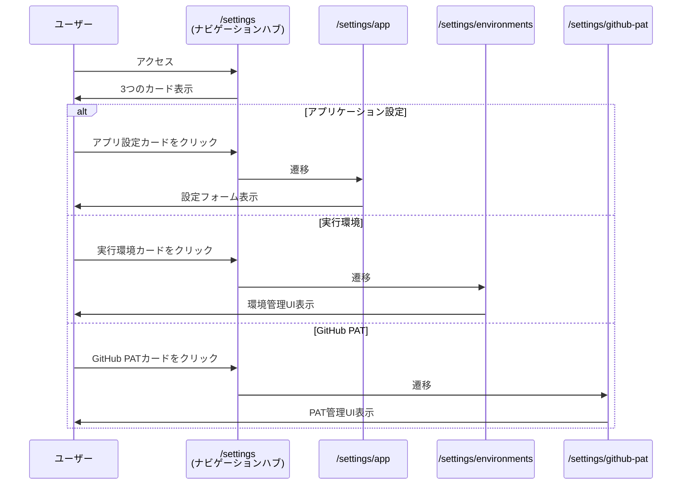
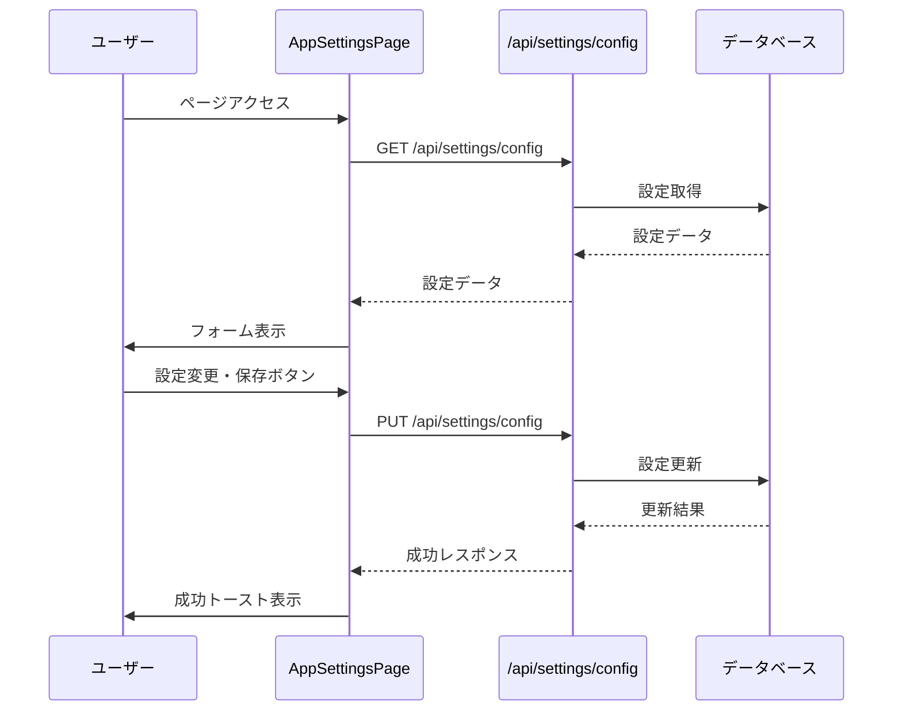
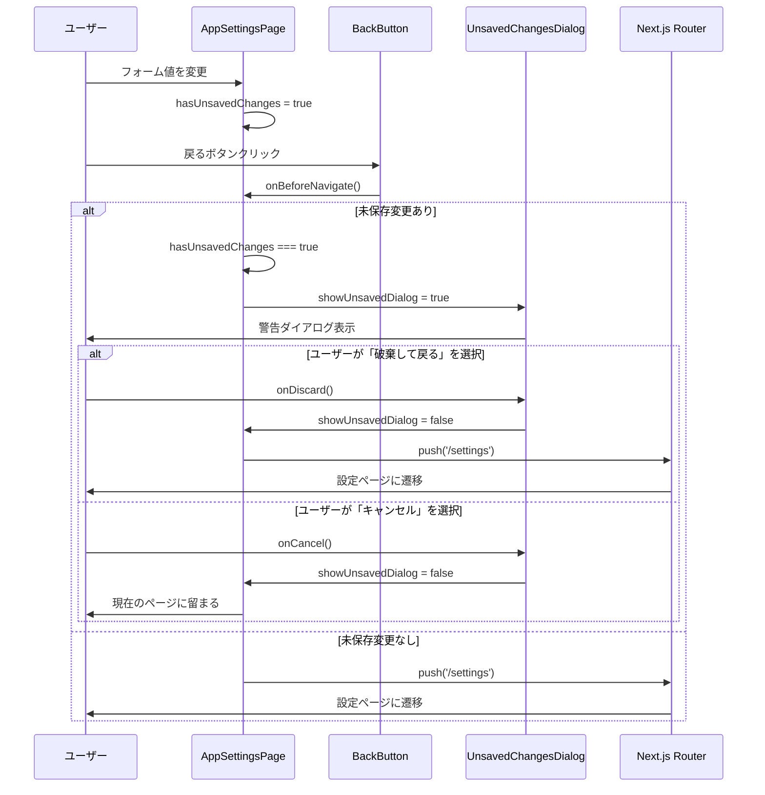
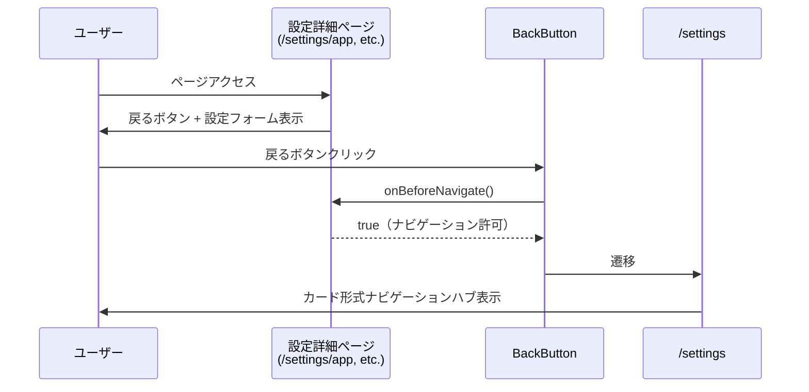

# 設計: 設定ページのナビゲーション改善

> このドキュメントは実装完了後の逆順レビューにより作成されました。
> AIエージェント（Claude Code等）が実装を行うことを前提としています。

## 情報の明確性チェック

### ユーザーから明示された情報

- [x] 実装パターン: カード形式のナビゲーションハブ
- [x] UI要件: 環境設定と同様の導線
- [x] レスポンシブ要件: モバイル、タブレット、デスクトップ対応
- [x] テーマ要件: ダークモード対応必須
- [x] 技術スタック: Next.js 15 App Router, Tailwind CSS, lucide-react
- [x] カード構成: アプリケーション設定、実行環境、GitHub PAT
- [x] 戻るボタン: 全設定詳細ページにページ上部に配置
- [x] 未保存変更警告: アプリ設定ページで実装、破棄/キャンセルの選択肢

### 不明/要確認の情報

なし（すべて確認済み）

---

## アーキテクチャ概要

### ページ構造の変更

```mermaid
graph TD
    subgraph "変更前"
        A1[/settings] --> B1[設定フォーム直接表示]
        B1 --> C1[Git Cloneタイムアウト]
        B1 --> D1[デバッグモード]
    end

    subgraph "変更後"
        A2[/settings] --> B2[カード形式ナビゲーションハブ]
        B2 --> C2[/settings/app]
        B2 --> D2[/settings/environments]
        B2 --> E2[/settings/github-pat]

        C2 --> F2[Git Cloneタイムアウト]
        C2 --> G2[デバッグモード]
    end
```

### ルーティング構造

```text
/settings                          # ナビゲーションハブ（カード形式）
├── /settings/app                  # アプリケーション設定
│   ├── Git Cloneタイムアウト
│   └── デバッグモード
├── /settings/environments         # 実行環境管理（既存）
└── /settings/github-pat          # GitHub PAT管理（既存）
```

### ディレクトリ構造

```text
src/app/settings/
├── page.tsx                 # カード形式ナビゲーションハブ（修正）
├── layout.tsx              # 共通レイアウト（既存）
├── app/
│   └── page.tsx            # アプリケーション設定（新規作成）
├── environments/
│   └── page.tsx            # 実行環境管理（既存）
└── github-pat/
    └── page.tsx            # GitHub PAT管理（既存）
```

## コンポーネント設計

### コンポーネント1: SettingCard

**目的**: 設定ページへのナビゲーションカードを表示

**責務**:
- 設定カテゴリの視覚的表現
- クリック可能なリンクとしての機能
- ホバーエフェクトの提供

**Props定義**:
```typescript
interface SettingCardProps {
  href: string;           // 遷移先URL
  icon: React.ReactNode;  // カードアイコン（lucide-react）
  title: string;          // カードタイトル
  description: string;    // カード説明文
}
```

**実装詳細**:
```tsx
function SettingCard({ href, icon, title, description }: SettingCardProps) {
  return (
    <Link
      href={href}
      className="group block p-6 bg-white dark:bg-gray-800 border border-gray-200 dark:border-gray-700 rounded-lg hover:shadow-lg transition-all duration-200 hover:border-blue-500 dark:hover:border-blue-400"
    >
      <div className="flex flex-col h-full">
        {/* アイコン */}
        <div className="mb-4 text-blue-600 dark:text-blue-400 group-hover:scale-110 transition-transform duration-200">
          {icon}
        </div>
        {/* タイトル */}
        <h2 className="text-xl font-semibold text-gray-900 dark:text-gray-100 mb-2">
          {title}
        </h2>
        {/* 説明文 */}
        <p className="text-sm text-gray-600 dark:text-gray-400 leading-relaxed">
          {description}
        </p>
      </div>
    </Link>
  );
}
```

**スタイリング戦略**:
- **基本スタイル**: padding、背景色、ボーダー、角丸
- **ホバーエフェクト**:
  - シャドウ強調: `hover:shadow-lg`
  - ボーダーカラー変更: `hover:border-blue-500`
  - アイコン拡大: `group-hover:scale-110`
- **トランジション**: `transition-all duration-200`（スムーズな変化）
- **ダークモード**: `dark:` プレフィックスで全カラーを対応

### コンポーネント2: SettingsPage (ナビゲーションハブ)

**目的**: 設定カテゴリの一覧表示と各設定ページへの導線提供

**責務**:
- 3つの設定カードの配置
- レスポンシブグリッドレイアウトの提供
- ページタイトルと説明の表示

**実装詳細**:
```tsx
export default function SettingsPage() {
  return (
    <div className="p-6">
      {/* ページヘッダー */}
      <div className="mb-8">
        <h1 className="text-3xl font-bold text-gray-900 dark:text-gray-100 mb-2">
          設定
        </h1>
        <p className="text-gray-600 dark:text-gray-400">
          ClaudeWorkの各種設定を管理します。
        </p>
      </div>

      {/* カードグリッド */}
      <div className="grid grid-cols-1 md:grid-cols-2 lg:grid-cols-3 gap-6">
        <SettingCard
          href="/settings/app"
          icon={<Settings className="w-8 h-8" />}
          title="アプリケーション設定"
          description="Git Cloneタイムアウトやデバッグモードなどのアプリケーション設定を管理します。"
        />

        <SettingCard
          href="/settings/environments"
          icon={<Server className="w-8 h-8" />}
          title="実行環境"
          description="Claude Code実行環境の管理（HOST、DOCKER、SSH）を行います。"
        />

        <SettingCard
          href="/settings/github-pat"
          icon={<Key className="w-8 h-8" />}
          title="GitHub PAT"
          description="GitHubリポジトリアクセス用のPersonal Access Token管理を行います。"
        />
      </div>
    </div>
  );
}
```

**レイアウト構造**:
- **外側のコンテナ**: `p-6`（6単位のpadding）
- **ヘッダーセクション**: `mb-8`（8単位の下マージン）
- **グリッドコンテナ**: レスポンシブグリッド + `gap-6`（6単位の間隔）

### コンポーネント3: AppSettingsPage

**目的**: アプリケーション設定の表示と編集

**責務**:
- Git Cloneタイムアウト設定の管理
- デバッグモード設定の管理
- 設定の取得・保存API連携

**実装詳細**:
```tsx
export default function AppSettingsPage() {
  const [config, setConfig] = useState<AppConfig | null>(null);
  const [isLoading, setIsLoading] = useState(true);
  const [isSaving, setIsSaving] = useState(false);
  const [timeoutMinutes, setTimeoutMinutes] = useState(5);
  const [keepVolumes, setKeepVolumes] = useState(false);

  // 設定の取得
  const fetchConfig = async () => {
    const response = await fetch('/api/settings/config');
    const data = await response.json();
    setConfig(data.config);
    setTimeoutMinutes(data.config.git_clone_timeout_minutes);
    setKeepVolumes(data.config.debug_mode_keep_volumes);
  };

  // 設定の保存
  const handleSave = async (e: React.FormEvent) => {
    const response = await fetch('/api/settings/config', {
      method: 'PUT',
      body: JSON.stringify({
        git_clone_timeout_minutes: timeoutMinutes,
        debug_mode_keep_volumes: keepVolumes,
      }),
    });
  };

  // UIレンダリング
  // ...
}
```

**状態管理**:
- `config`: 現在の設定データ
- `isLoading`: 初期読み込み状態
- `isSaving`: 保存処理中状態
- `timeoutMinutes`: Git Cloneタイムアウト値（フォーム入力）
- `keepVolumes`: デバッグモードフラグ（フォーム入力）

**API連携**:
- `GET /api/settings/config`: 設定の取得
- `PUT /api/settings/config`: 設定の保存

### コンポーネント4: BackButton

**目的**: 設定詳細ページから設定ページに戻るボタン

**責務**:
- /settingsへのナビゲーション提供
- 未保存変更がある場合の警告（AppSettingsPageのみ）
- 視覚的に識別しやすい配置

**Props定義**:
```typescript
interface BackButtonProps {
  onBeforeNavigate?: () => boolean; // 戻る前のチェック関数（false返却で中断）
}
```

**実装詳細**:
```tsx
function BackButton({ onBeforeNavigate }: BackButtonProps) {
  const router = useRouter();

  const handleClick = () => {
    // 戻る前のチェック（未保存変更の確認など）
    if (onBeforeNavigate && !onBeforeNavigate()) {
      return; // ナビゲーション中断
    }
    router.push('/settings');
  };

  return (
    <button
      onClick={handleClick}
      className="inline-flex items-center gap-2 text-sm text-gray-600 dark:text-gray-400 hover:text-blue-600 dark:hover:text-blue-400 transition-colors"
    >
      <ArrowLeft className="w-4 h-4" />
      設定に戻る
    </button>
  );
}
```

**スタイリング戦略**:
- **基本スタイル**: インラインフレックス、アイコン+テキストの配置
- **ホバーエフェクト**: テキストカラーを青色に変更
- **トランジション**: `transition-colors`（スムーズなカラー変化）
- **ダークモード**: `dark:` プレフィックスで全カラーを対応
- **アイコン**: lucide-reactの `ArrowLeft`（16px × 16px）

**配置**:
- ページ上部（タイトルの上または横）
- 全ての設定詳細ページで統一的な位置に配置

### コンポーネント5: UnsavedChangesDialog

**目的**: 未保存の変更がある場合に警告ダイアログを表示

**責務**:
- 未保存変更の警告メッセージ表示
- ユーザー選択（破棄/キャンセル）の受付
- キーボード操作対応（ESC/Enter）

**Props定義**:
```typescript
interface UnsavedChangesDialogProps {
  isOpen: boolean;                // ダイアログ表示状態
  onDiscard: () => void;          // 「破棄して戻る」アクション
  onCancel: () => void;           // 「キャンセル」アクション
}
```

**実装詳細**:
```tsx
function UnsavedChangesDialog({ isOpen, onDiscard, onCancel }: UnsavedChangesDialogProps) {
  useEffect(() => {
    if (!isOpen) return;

    const handleKeyDown = (e: KeyboardEvent) => {
      if (e.key === 'Escape') {
        onCancel();
      } else if (e.key === 'Enter') {
        onDiscard();
      }
    };

    window.addEventListener('keydown', handleKeyDown);
    return () => window.removeEventListener('keydown', handleKeyDown);
  }, [isOpen, onDiscard, onCancel]);

  if (!isOpen) return null;

  return (
    <div className="fixed inset-0 bg-black bg-opacity-50 flex items-center justify-center z-50">
      <div className="bg-white dark:bg-gray-800 rounded-lg p-6 max-w-md w-full mx-4 shadow-xl">
        {/* タイトル */}
        <h2 className="text-lg font-semibold text-gray-900 dark:text-gray-100 mb-4">
          未保存の変更があります
        </h2>

        {/* メッセージ */}
        <p className="text-gray-600 dark:text-gray-400 mb-6">
          変更が保存されていません。破棄しますか？
        </p>

        {/* アクションボタン */}
        <div className="flex gap-3 justify-end">
          <button
            onClick={onCancel}
            className="px-4 py-2 text-sm font-medium text-gray-700 dark:text-gray-300 bg-gray-100 dark:bg-gray-700 rounded-md hover:bg-gray-200 dark:hover:bg-gray-600 transition-colors"
          >
            キャンセル
          </button>
          <button
            onClick={onDiscard}
            className="px-4 py-2 text-sm font-medium text-white bg-red-600 rounded-md hover:bg-red-700 transition-colors"
          >
            破棄して戻る
          </button>
        </div>
      </div>
    </div>
  );
}
```

**スタイリング戦略**:
- **モーダルオーバーレイ**: `fixed inset-0 bg-black bg-opacity-50`（半透明背景）
- **ダイアログボックス**: 中央配置、白/ダーク背景、角丸、シャドウ
- **ボタン配置**: フレックスボックスで右寄せ、3単位の間隔
- **破棄ボタン**: 赤色（警告色）を使用
- **キャンセルボタン**: グレー（中立色）を使用
- **ダークモード**: `dark:` プレフィックスで全カラーを対応

**キーボード操作**:
- **ESCキー**: キャンセル
- **Enterキー**: 破棄して戻る

### コンポーネント6: AppSettingsPage（拡張）

**変更点**: 未保存変更の検知と警告ダイアログの統合

**追加する状態管理**:
```typescript
const [hasUnsavedChanges, setHasUnsavedChanges] = useState(false); // 未保存変更フラグ
const [showUnsavedDialog, setShowUnsavedDialog] = useState(false); // ダイアログ表示状態
```

**フォーム変更検知**:
```typescript
// タイムアウト値が変更された時
const handleTimeoutChange = (value: number) => {
  setTimeoutMinutes(value);
  setHasUnsavedChanges(true);
};

// デバッグモードが変更された時
const handleKeepVolumesChange = (checked: boolean) => {
  setKeepVolumes(checked);
  setHasUnsavedChanges(true);
};
```

**保存時の変更フラグリセット**:
```typescript
const handleSave = async (e: React.FormEvent) => {
  // ... 保存処理
  setHasUnsavedChanges(false); // 保存後にフラグをリセット
};
```

**戻るボタンの統合**:
```typescript
const handleBeforeNavigate = () => {
  if (hasUnsavedChanges) {
    setShowUnsavedDialog(true);
    return false; // ナビゲーション中断
  }
  return true; // ナビゲーション許可
};

// JSX
<BackButton onBeforeNavigate={handleBeforeNavigate} />
<UnsavedChangesDialog
  isOpen={showUnsavedDialog}
  onDiscard={() => {
    setShowUnsavedDialog(false);
    router.push('/settings');
  }}
  onCancel={() => setShowUnsavedDialog(false)}
/>
```

## データフロー

### ナビゲーションフロー



### アプリケーション設定のデータフロー



### 未保存変更警告のデータフロー



### 戻るボタンのナビゲーションフロー



## UI/UX設計

### レスポンシブグリッドレイアウト

**デザイン原則**: モバイルファースト

**ブレークポイント**:

| デバイス | 画面幅 | グリッド列数 | Tailwind Class |
|---------|-------|------------|----------------|
| モバイル | 〜767px | 1列 | `grid-cols-1` |
| タブレット | 768px〜1023px | 2列 | `md:grid-cols-2` |
| デスクトップ | 1024px〜 | 3列 | `lg:grid-cols-3` |

**実装**:
```tsx
<div className="grid grid-cols-1 md:grid-cols-2 lg:grid-cols-3 gap-6">
  {/* カード配置 */}
</div>
```

**間隔**: `gap-6`（1.5rem = 24px）

### ホバーエフェクト

**目的**: クリック可能要素であることを視覚的に示す

**エフェクト詳細**:

1. **シャドウ強調**:
   - 通常: `shadow`（軽いシャドウ）
   - ホバー: `hover:shadow-lg`（大きなシャドウ）

2. **ボーダーカラー変更**:
   - 通常: `border-gray-200 dark:border-gray-700`
   - ホバー: `hover:border-blue-500 dark:hover:border-blue-400`

3. **アイコン拡大**:
   - 通常: `scale-100`
   - ホバー: `group-hover:scale-110`（10%拡大）

4. **トランジション**:
   - デュレーション: `duration-200`（200ms）
   - イージング: `transition-all`（全プロパティに適用）

### カラースキーム

**ライトモード**:
- 背景: `bg-white`（#FFFFFF）
- ボーダー: `border-gray-200`（#E5E7EB）
- テキスト: `text-gray-900`（#111827）
- アイコン: `text-blue-600`（#2563EB）
- ホバーボーダー: `hover:border-blue-500`（#3B82F6）

**ダークモード**:
- 背景: `dark:bg-gray-800`（#1F2937）
- ボーダー: `dark:border-gray-700`（#374151）
- テキスト: `dark:text-gray-100`（#F3F4F6）
- アイコン: `dark:text-blue-400`（#60A5FA）
- ホバーボーダー: `dark:hover:border-blue-400`（#60A5FA）

### アイコン選定

| カテゴリ | アイコン | 理由 |
|---------|---------|------|
| アプリケーション設定 | `Settings` | 一般的な設定を表す標準的なアイコン |
| 実行環境 | `Server` | サーバー/環境を直感的に示す |
| GitHub PAT | `Key` | 認証トークン/鍵を象徴的に表現 |

**アイコンサイズ**: `w-8 h-8`（32px × 32px）

## 技術的決定事項

### 決定1: カード形式ナビゲーションハブの採用

**検討した選択肢**:
1. カード形式のナビゲーションハブ
2. サイドバーメニュー形式
3. タブ形式
4. ドロップダウンメニュー形式

**決定**: 選択肢1（カード形式のナビゲーションハブ）

**根拠**:
- 視覚的にわかりやすく、各設定の説明を表示できる
- レスポンシブ対応が容易（グリッドレイアウト）
- 将来的な設定追加が容易（カードを追加するだけ）
- 環境設定と同様の導線パターンを提供できる

### 決定2: 既存設定の移動先

**検討した選択肢**:
1. `/settings/app` に移動
2. `/settings` にそのまま配置（カードの下に表示）
3. `/settings/general` に移動

**決定**: 選択肢1（`/settings/app` に移動）

**根拠**:
- 全ての設定が同じ階層で統一される
- ページ構造が明確になる
- ナビゲーションハブが単純化される（カードのみ）

### 決定3: レスポンシブブレークポイント

**検討した選択肢**:
1. Tailwind CSS標準ブレークポイント（md: 768px, lg: 1024px）
2. カスタムブレークポイント

**決定**: 選択肢1（Tailwind CSS標準ブレークポイント）

**根拠**:
- 既存コンポーネントとの一貫性
- Tailwindのベストプラクティスに準拠
- メンテナンス性の向上

### 決定4: アイコンライブラリ

**検討した選択肢**:
1. lucide-react（既存採用）
2. react-icons
3. heroicons

**決定**: 選択肢1（lucide-react）

**根拠**:
- 既にプロジェクトで使用中（追加依存なし）
- 軽量でTreeshaking対応
- 適切なアイコンが揃っている

### 決定5: ホバーエフェクトのデュレーション

**検討した選択肢**:
1. 200ms
2. 300ms
3. 150ms

**決定**: 選択肢1（200ms）

**根拠**:
- 既存コンポーネントとの一貫性
- ユーザー体験として適切な速度（速すぎず遅すぎず）

### 決定6: 戻るボタンの実装方法

**検討した選択肢**:
1. コールバック関数による制御（onBeforeNavigate）
2. React Router のブロックAPI
3. ブラウザのbeforeunloadイベント

**決定**: 選択肢1（コールバック関数による制御）

**根拠**:
- Next.js App Routerに適した実装
- 柔軟な制御が可能（ページごとに異なる動作を実装可能）
- コンポーネントの再利用性が高い

### 決定7: 未保存変更の検知方法

**検討した選択肢**:
1. useState による変更フラグ管理
2. フォームライブラリ（react-hook-form）の dirtyフィールド
3. 初期値との比較による検知

**決定**: 選択肢1（useState による変更フラグ管理）

**根拠**:
- シンプルで理解しやすい
- 既存コードに新規依存を追加しない
- フォームが単純なため、ライブラリ導入の必要性が低い

### 決定8: 警告ダイアログのUI実装

**検討した選択肢**:
1. カスタムモーダルコンポーネント
2. Headless UI Dialogコンポーネント
3. ブラウザネイティブのconfirm

**決定**: 選択肢1（カスタムモーダルコンポーネント）

**根拠**:
- デザインの完全な制御が可能
- ダークモード対応が容易
- キーボード操作のカスタマイズが可能
- ブラウザネイティブのconfirmはデザインが固定され、ダークモード非対応

### 決定9: 破棄ボタンの色

**検討した選択肢**:
1. 赤色（bg-red-600）- 警告色
2. 青色（bg-blue-600）- プライマリ色
3. グレー（bg-gray-600）- 中立色

**決定**: 選択肢1（赤色 - 警告色）

**根拠**:
- 破棄は破壊的なアクションであることを視覚的に示す
- ユーザーが慎重に判断するよう促す
- UIデザインの一般的なベストプラクティス

## ファイル構成

```text
src/app/settings/
├── page.tsx                        # 修正: カード形式ナビゲーションハブ（90行）
│   ├── SettingCard                 # 新規: カードコンポーネント
│   └── SettingsPage                # 修正: ページコンポーネント
├── layout.tsx                     # 既存: 共通レイアウト（変更なし）
├── app/
│   └── page.tsx                   # 修正: アプリケーション設定（220行）
│       ├── BackButton             # 新規: 戻るボタンコンポーネント
│       ├── UnsavedChangesDialog   # 新規: 未保存変更警告ダイアログ
│       └── AppSettingsPage        # 修正: ページコンポーネント（変更検知追加）
├── environments/
│   └── page.tsx                   # 修正: 実行環境管理（BackButton追加）
└── github-pat/
    └── page.tsx                   # 修正: GitHub PAT管理（BackButton追加）
```

**追加/修正ファイル**:
1. `src/app/settings/app/page.tsx` - BackButton、UnsavedChangesDialog、変更検知ロジック追加
2. `src/app/settings/environments/page.tsx` - BackButton追加
3. `src/app/settings/github-pat/page.tsx` - BackButton追加

## セキュリティ考慮事項

- クライアントサイドナビゲーション（Next.js Link）によるXSS対策
- 設定値のバリデーションは既存API層で実施（変更なし）
- ユーザー入力は既存フォームコンポーネントで処理（変更なし）

## パフォーマンス考慮事項

### クライアントサイドナビゲーション

- Next.js `<Link>` コンポーネントによるプリフェッチ
- ページ遷移時のフルリロードなし（SPA的な挙動）

### CSS最適化

- Tailwind CSSのJITモード（必要なスタイルのみ生成）
- ホバーエフェクトはGPUアクセラレーション対応（transform使用）

### バンドルサイズ

- lucide-reactアイコンは3つのみインポート（TreeShaking効果）
- 新規依存パッケージなし

## アクセシビリティ

### キーボードナビゲーション

- `<Link>` コンポーネントによる標準的なフォーカス対応
- Tabキーでカード間を移動可能
- Enterキーでカード選択可能

### セマンティックHTML

- `<h1>`, `<h2>`, `<p>` による適切な見出し構造
- `<Link>` による適切なナビゲーション要素

### カラーコントラスト

- WCAG AA基準準拠のカラーコントラスト比
- ダークモード時も適切なコントラストを維持

### 戻るボタンのアクセシビリティ

- `<button>` 要素による適切なフォーカス対応
- Tabキーでフォーカス可能
- Enterキーまたはスペースキーでクリック可能
- アイコン+テキストで視覚的に理解しやすい

### 警告ダイアログのアクセシビリティ

- キーボード操作対応:
  - ESCキー: キャンセル
  - Enterキー: 破棄して戻る
- モーダルオーバーレイによるフォーカストラップ（ダイアログ外のクリックは無効）
- 明確なメッセージとアクションボタン
- カラーコントラストWCAG AA基準準拠

## エラー処理

### ナビゲーションエラー

- Next.js Routerによる標準的なエラーハンドリング
- 存在しないパスへのアクセスは404ページに遷移

### アプリケーション設定ページのエラー

- API通信エラー: react-hot-toastでエラーメッセージ表示
- ローディング状態: Loader2アイコンで視覚的フィードバック
- 保存エラー: エラーメッセージをトースト表示

### 戻るボタンのエラー

- ナビゲーションエラー: Next.js Routerによる標準的なエラーハンドリング
- onBeforeNavigate関数のエラー: tryキャッチでキャッチし、ナビゲーションを継続

### 警告ダイアログのエラー

- キーボードイベントリスナーのクリーンアップ: useEffectのreturnでリスナー削除
- ダイアログが閉じられない場合: ESCキーで強制クローズ可能

## 拡張性

### 新規設定カテゴリの追加

**手順**:
1. 新規ページを `/settings/{category}/page.tsx` に作成
2. `SettingsPage` に新しい `<SettingCard>` を追加
3. 適切なアイコン、タイトル、説明を設定

**例**（通知設定を追加する場合）:
```tsx
<SettingCard
  href="/settings/notifications"
  icon={<Bell className="w-8 h-8" />}
  title="通知設定"
  description="システム通知やメール通知の設定を管理します。"
/>
```

### グリッドレイアウトの調整

- 4つ目のカード追加時: 自動的に2×2グリッド（タブレット）、4列グリッド（デスクトップ）に拡張可能
- カスタムブレークポイントも追加可能

## 今後の改善案

1. **カード順序のカスタマイズ**: ユーザーがカードの順序を変更できる機能
2. **検索機能**: 設定項目の検索機能
3. **お気に入り機能**: よく使う設定へのクイックアクセス
4. **アニメーション強化**: カード表示時のフェードインアニメーション
5. **未保存変更の自動保存**: 一定時間ごとに自動保存する機能
6. **変更履歴の表示**: 設定変更の履歴を表示する機能
7. **戻るボタンのパンくずリスト化**: 設定 > アプリケーション設定 のような階層表示
8. **警告ダイアログのアニメーション**: フェードイン/アウトアニメーション追加
