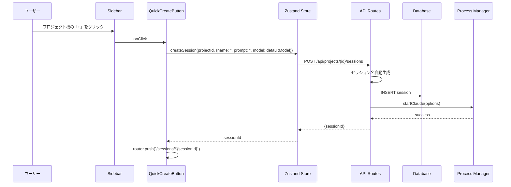

# 設計書: サイドバーUI・Tree表示・左メニュー

## 概要

サイドバーのTree表示、セッション作成の簡略化、左メニューUI改善の設計を定義します。

---

## コンポーネント

### フロントエンド

#### コンポーネント: Sidebar

**目的**: 左メニューのナビゲーションとプロジェクト/セッション管理

**責務**:
- プロジェクト一覧のツリー表示
- セッション一覧の表示（プロジェクト配下）
- プロジェクト追加ボタンの提供
- プロジェクトコンテキストメニュー（設定・削除）
- セッション削除アイコンの表示（ホバー時）
- PR番号とステータスの表示

**実装場所**: `src/components/layout/Sidebar.tsx`

**サブコンポーネント**:

| コンポーネント | ファイル | 責務 |
|---------------|----------|------|
| ProjectTreeItem | `ProjectTreeItem.tsx` | プロジェクトノードの表示、コンテキストメニュー |
| SessionTreeItem | `SessionTreeItem.tsx` | セッションノード、削除アイコン、PR表示 |
| AddProjectButton | `AddProjectButton.tsx` | リポジトリ追加ボタン |
| AddProjectModal | `AddProjectModal.tsx` | リポジトリ追加モーダル |
| ProjectSettingsModal | `ProjectSettingsModal.tsx` | プロジェクト設定モーダル |
| DeleteConfirmDialog | `DeleteConfirmDialog.tsx` | 削除確認ダイアログ |

**UIフロー図**:

```text
Sidebar
├── AddProjectButton [+ リポジトリを追加]
│   └── onClick → AddProjectModal
│
├── ProjectTreeItem (各プロジェクト)
│   ├── プロジェクト名
│   ├── 展開/折りたたみボタン
│   ├── セッション追加ボタン [+]
│   ├── onContextMenu → ContextMenu
│   │   ├── [設定] → ProjectSettingsModal
│   │   └── [削除] → DeleteConfirmDialog
│   │
│   └── SessionTreeItem (各セッション)
│       ├── ステータスアイコン
│       ├── セッション名
│       ├── 動作環境バッジ (HOST/DOCKER/SSH)
│       │   └── onHover → 環境名ツールチップ
│       ├── PR番号バッジ (存在時)
│       │   └── onClick → GitHubページを新規タブで開く
│       └── 削除アイコン (ホバー時表示)
│           └── onClick → DeleteConfirmDialog
```

---

### 新規コンポーネント詳細

#### AddProjectModal

**目的**: 新規リポジトリの追加

**責務**:
- リポジトリパスの入力
- プロジェクト名の入力（パスから自動推定）
- バリデーション（パスの存在確認、Git リポジトリ確認）
- API呼び出し（POST /api/projects）

**Props**:
```typescript
interface AddProjectModalProps {
  isOpen: boolean;
  onClose: () => void;
  onSuccess?: (project: Project) => void;
}
```

**実装場所**: `src/components/layout/AddProjectModal.tsx`

#### ProjectSettingsModal

**目的**: プロジェクト設定の編集

**責務**:
- プロジェクト名の編集
- リポジトリパスの編集
- ランスクリプトの追加・編集・削除
- API呼び出し（PUT /api/projects/[id]）

**Props**:
```typescript
interface ProjectSettingsModalProps {
  isOpen: boolean;
  onClose: () => void;
  project: Project;
  onSuccess?: (project: Project) => void;
}
```

**フォーム構造**:
```typescript
interface ProjectSettingsForm {
  name: string;
  path: string;
  runScripts: Array<{
    name: string;
    command: string;
  }>;
}
```

**実装場所**: `src/components/layout/ProjectSettingsModal.tsx`

#### SessionTreeItem（拡張）

**目的**: セッションノードの表示と操作

**追加責務**:
- 動作環境バッジの表示
- PR番号とステータスバッジの表示
- ホバー時の削除アイコン表示
- 削除確認ダイアログとの連携

**Props**:
```typescript
interface SessionTreeItemProps {
  session: Session;
  isActive: boolean;
  onClick: () => void;
  onDelete: () => void;
}
```

**動作環境バッジ表示ロジック**:
```typescript
// 環境タイプに応じたバッジの色
const environmentColors = {
  HOST: 'bg-green-100 text-green-800 dark:bg-green-900 dark:text-green-200',
  DOCKER: 'bg-blue-100 text-blue-800 dark:bg-blue-900 dark:text-blue-200',
  SSH: 'bg-purple-100 text-purple-800 dark:bg-purple-900 dark:text-purple-200',
};

// 環境タイプの短縮表示
const environmentLabels = {
  HOST: 'H',
  DOCKER: 'D',
  SSH: 'S',
};

// 環境バッジの表示
{session.environment_type && (
  <span
    className={`text-xs px-1 py-0.5 rounded font-medium ${environmentColors[session.environment_type]}`}
    title={session.environment_name || session.environment_type}
  >
    {environmentLabels[session.environment_type]}
  </span>
)}
```

**PR表示ロジック**:
```typescript
// PRステータスに応じたバッジの色
const prStatusColors = {
  open: 'bg-green-100 text-green-800',
  merged: 'bg-purple-100 text-purple-800',
  closed: 'bg-red-100 text-red-800',
};

// PR番号の表示（例: #123）
{session.pr_number && (
  <a
    href={session.pr_url}
    target="_blank"
    rel="noopener noreferrer"
    className={`text-xs px-1.5 py-0.5 rounded ${prStatusColors[session.pr_status]}`}
    onClick={(e) => e.stopPropagation()}
  >
    #{session.pr_number}
  </a>
)}
```

#### QuickCreateButton

**目的**: ワンクリックセッション作成

**Props**:
```typescript
interface QuickCreateButtonProps {
  projectId: string;
  onSuccess?: (sessionId: string) => void;
}
```

**実装**:
```typescript
export function QuickCreateButton({ projectId, onSuccess }: QuickCreateButtonProps) {
  const { createSession } = useAppStore();
  const { defaultModel } = useSettingsStore();
  const [isCreating, setIsCreating] = useState(false);

  const handleClick = async () => {
    setIsCreating(true);
    try {
      const sessionId = await createSession(projectId, {
        name: '', // 自動生成
        prompt: '', // 空
        model: defaultModel
      });
      onSuccess?.(sessionId);
    } catch (error) {
      toast.error('セッション作成に失敗しました');
    } finally {
      setIsCreating(false);
    }
  };

  return (
    <button
      onClick={handleClick}
      disabled={isCreating}
      className="p-1 hover:bg-gray-200 dark:hover:bg-gray-600 rounded"
      title="新しいセッションを作成"
    >
      {isCreating ? (
        <Loader2 className="w-4 h-4 animate-spin" />
      ) : (
        <Plus className="w-4 h-4" />
      )}
    </button>
  );
}
```

---

## ストア設計

### UIストア

**目的**: UI状態（展開/折りたたみ状態）の永続化

**実装場所**: `src/store/ui.ts`

```typescript
import { create } from 'zustand';
import { persist } from 'zustand/middleware';

interface UIState {
  // プロジェクトの展開状態（true = 展開、false = 折りたたみ）
  expandedProjects: Record<string, boolean>;

  // アクション
  toggleProject: (projectId: string) => void;
  setProjectExpanded: (projectId: string, expanded: boolean) => void;
  isProjectExpanded: (projectId: string) => boolean;
}

export const useUIStore = create<UIState>()(
  persist(
    (set, get) => ({
      expandedProjects: {},

      toggleProject: (projectId) => {
        set((state) => ({
          expandedProjects: {
            ...state.expandedProjects,
            [projectId]: !(state.expandedProjects[projectId] ?? true), // デフォルトは展開
          },
        }));
      },

      setProjectExpanded: (projectId, expanded) => {
        set((state) => ({
          expandedProjects: {
            ...state.expandedProjects,
            [projectId]: expanded,
          },
        }));
      },

      // デフォルトは展開（true）
      isProjectExpanded: (projectId) => {
        const state = get();
        return state.expandedProjects[projectId] ?? true;
      },
    }),
    {
      name: 'claudework:ui-state',
    }
  )
);
```

---

## データフロー

### シーケンス: ワンクリックセッション作成



---

## 実装詳細

### ストーリー23: セッション一覧ページの廃止

**リダイレクト処理**: `src/app/sessions/page.tsx`

```typescript
import { redirect } from 'next/navigation';

export default function SessionsPage() {
  redirect('/');
}
```

**Navigation変更**: `src/components/layout/Navigation.tsx`

```typescript
// 削除するリンク
// { href: '/sessions', label: 'Sessions', icon: Terminal }

// 変更後のナビゲーション項目
const navItems = [
  { href: '/', label: 'Projects', icon: FolderGit2 },
  { href: '/settings', label: 'Settings', icon: Settings },
];
```

### ストーリー25: セッション詳細ページからの削除

**DeleteSessionButton**: `src/components/sessions/DeleteSessionButton.tsx`

```typescript
interface DeleteSessionButtonProps {
  sessionId: string;
  sessionName: string;
  worktreePath: string;
  projectId: string;
}

export function DeleteSessionButton({
  sessionId,
  sessionName,
  worktreePath,
  projectId,
}: DeleteSessionButtonProps) {
  const [isDialogOpen, setIsDialogOpen] = useState(false);

  return (
    <>
      <button
        onClick={() => setIsDialogOpen(true)}
        className="flex items-center gap-2 px-3 py-2 text-red-600 hover:bg-red-50 dark:hover:bg-red-900/20 rounded"
      >
        <Trash2 className="w-4 h-4" />
        セッション削除
      </button>

      <DeleteSessionDialog
        isOpen={isDialogOpen}
        onClose={() => setIsDialogOpen(false)}
        sessionId={sessionId}
        sessionName={sessionName}
        worktreePath={worktreePath}
        projectId={projectId}
      />
    </>
  );
}
```

**DeleteSessionDialog**: `src/components/sessions/DeleteSessionDialog.tsx`

```typescript
import { Dialog } from '@headlessui/react';
import { useRouter } from 'next/navigation';
import { toast } from 'react-hot-toast';

interface DeleteSessionDialogProps {
  isOpen: boolean;
  onClose: () => void;
  sessionId: string;
  sessionName: string;
  worktreePath: string;
  projectId: string;
}

export function DeleteSessionDialog({
  isOpen,
  onClose,
  sessionId,
  sessionName,
  worktreePath,
  projectId,
}: DeleteSessionDialogProps) {
  const router = useRouter();
  const [isDeleting, setIsDeleting] = useState(false);

  const handleDelete = async () => {
    setIsDeleting(true);
    try {
      const response = await fetch(`/api/sessions/${sessionId}`, {
        method: 'DELETE',
      });

      if (!response.ok) {
        const error = await response.json();
        throw new Error(error.message || 'Failed to delete session');
      }

      toast.success('セッションを削除しました');
      router.push(`/projects/${projectId}`);
    } catch (error) {
      toast.error(error instanceof Error ? error.message : '削除に失敗しました');
    } finally {
      setIsDeleting(false);
      onClose();
    }
  };

  return (
    <Dialog open={isOpen} onClose={onClose} className="relative z-50">
      <div className="fixed inset-0 bg-black/30" aria-hidden="true" />
      <div className="fixed inset-0 flex items-center justify-center p-4">
        <Dialog.Panel className="w-full max-w-md rounded-lg bg-white dark:bg-gray-800 p-6 shadow-xl">
          <Dialog.Title className="text-lg font-bold text-red-600">
            セッションを削除しますか？
          </Dialog.Title>

          <div className="mt-4 space-y-2 text-sm">
            <p><strong>セッション名:</strong> {sessionName}</p>
            <p><strong>Worktreeパス:</strong> {worktreePath}</p>
            <p className="text-red-500">
              この操作は取り消せません。Worktreeも削除されます。
            </p>
          </div>

          <div className="mt-6 flex justify-end gap-3">
            <button
              onClick={onClose}
              className="px-4 py-2 text-gray-600 hover:bg-gray-100 dark:hover:bg-gray-700 rounded"
              disabled={isDeleting}
            >
              キャンセル
            </button>
            <button
              onClick={handleDelete}
              disabled={isDeleting}
              className="px-4 py-2 bg-red-600 text-white hover:bg-red-700 rounded disabled:opacity-50"
            >
              {isDeleting ? '削除中...' : '削除'}
            </button>
          </div>
        </Dialog.Panel>
      </div>
    </Dialog>
  );
}
```

---

## 要件との整合性チェック

| 要件ID | 要件内容 | 設計対応 |
|--------|----------|----------|
| REQ-123 | プロジェクト配下のTree表示 | ProjectTreeItem + SessionTreeItem |
| REQ-124 | 展開/折りたたみ切り替え | expandedProjects state |
| REQ-125 | セッションクリックで遷移 | router.push() |
| REQ-126 | 現在セッションのハイライト | isActive prop |
| REQ-127 | セッション名+ステータスアイコン | SessionStatusIcon |
| REQ-129 | プロジェクト横の「+」ボタン | QuickCreateButton |
| REQ-130 | 自動生成セッション名 | 既存ロジック維持 |
| REQ-133 | セッション名編集機能 | SessionNameEditor |
