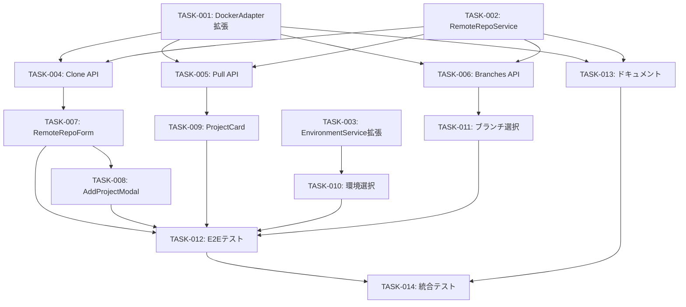

# タスク計画: Docker主体＋リモートリポジトリ対応への移行

> このドキュメントはAIエージェント（Claude Code等）が実行するタスク計画です。

## 概要

ClaudeWorkをHOST主体からDocker主体のアーキテクチャに移行し、リモートリポジトリからのクローン機能を追加します。TDD（テスト駆動開発）で進め、各タスク完了時にコミットします。

## 進捗サマリ

| フェーズ | タスク数 | 完了 | 進行中 | 未着手 | 進捗率 |
|---------|---------|------|-------|-------|-------|
| Phase 1: 基盤整備 | 3 | 3 | 0 | 0 | 100% |
| Phase 2: API実装 | 3 | 3 | 0 | 0 | 100% |
| Phase 3: UI実装 | 5 | 5 | 0 | 0 | 100% |
| Phase 4: テスト・ドキュメント | 3 | 2 | 1 | 0 | 67% |
| **合計** | **14** | **13** | **1** | **0** | **93%** |

## 並列実行グループ

### グループ A（Phase 1 - 並列実行可能）

| タスク | 対象ファイル | 依存 | 推定工数 |
|--------|-------------|------|---------|
| TASK-001 | src/services/adapters/docker-adapter.ts | なし | 60分 |
| TASK-002 | src/services/remote-repo-service.ts | なし | 40分 |
| TASK-003 | src/services/environment-service.ts | なし | 30分 |

### グループ B（Phase 2 - グループA完了後に並列実行可能）

| タスク | 対象ファイル | 依存 | 推定工数 |
|--------|-------------|------|---------|
| TASK-004 | src/app/api/projects/clone/route.ts | TASK-001, TASK-002 | 40分 |
| TASK-005 | src/app/api/projects/[id]/pull/route.ts | TASK-001, TASK-002 | 30分 |
| TASK-006 | src/app/api/projects/[id]/branches/route.ts | TASK-001, TASK-002 | 30分 |

### グループ C（Phase 3 - グループB完了後に並列実行可能）

| タスク | 対象ファイル | 依存 | 推定工数 |
|--------|-------------|------|---------|
| TASK-007 | src/components/projects/RemoteRepoForm.tsx | TASK-004 | 40分 |
| TASK-008 | src/components/projects/AddProjectModal.tsx | TASK-007 | 30分 |
| TASK-009 | src/components/projects/ProjectCard.tsx | TASK-005 | 30分 |
| TASK-010 | src/components/sessions/CreateSessionModal.tsx (環境選択) | TASK-003 | 30分 |
| TASK-011 | src/components/sessions/CreateSessionModal.tsx (ブランチ選択) | TASK-006 | 30分 |

### グループ D（Phase 4 - グループC完了後に並列実行可能）

| タスク | 対象ファイル | 依存 | 推定工数 |
|--------|-------------|------|---------|
| TASK-012 | e2e/remote-clone.spec.ts | TASK-007〜011 | 40分 |
| TASK-013 | CLAUDE.md, README.md, docs/** | TASK-001〜011 | 40分 |
| TASK-014 | docs/sdd/tasks/ (統合テスト) | TASK-001〜013 | 30分 |

## タスク一覧

### Phase 1: 基盤整備

| ID | タイトル | ステータス | 担当 | 推定工数 | リンク |
|----|----------|-----------|------|---------|--------|
| TASK-001 | DockerAdapterにGit操作メソッドを追加 | DONE | backend-dev-1 | 60分 | [詳細](phase-1/TASK-001.md) @phase-1/TASK-001.md |
| TASK-002 | RemoteRepoServiceの実装 | DONE | backend-dev-2 | 40分 | [詳細](phase-1/TASK-002.md) @phase-1/TASK-002.md |
| TASK-003 | EnvironmentServiceにデフォルト環境初期化を追加 | DONE | backend-dev-3 | 30分 | [詳細](phase-1/TASK-003.md) @phase-1/TASK-003.md |

### Phase 2: API実装

| ID | タイトル | ステータス | 担当 | 推定工数 | リンク |
|----|----------|-----------|------|---------|--------|
| TASK-004 | Clone APIエンドポイントの実装 | DONE | backend-dev-1 | 40分 | [詳細](phase-2/TASK-004.md) @phase-2/TASK-004.md |
| TASK-005 | Pull APIエンドポイントの実装 | DONE | backend-dev-2 | 30分 | [詳細](phase-2/TASK-005.md) @phase-2/TASK-005.md |
| TASK-006 | Branches APIエンドポイントの実装 | DONE | backend-dev-3 | 30分 | [詳細](phase-2/TASK-006.md) @phase-2/TASK-006.md |

### Phase 3: UI実装

| ID | タイトル | ステータス | 担当 | 推定工数 | リンク |
|----|----------|-----------|------|---------|--------|
| TASK-007 | RemoteRepoFormコンポーネントの実装 | DONE | backend-dev-1 | 40分 | [詳細](phase-3/TASK-007.md) @phase-3/TASK-007.md |
| TASK-008 | AddProjectModalにリモートタブを追加 | DONE | backend-dev-1 | 30分 | [詳細](phase-3/TASK-008.md) @phase-3/TASK-008.md |
| TASK-009 | ProjectCardにリモートバッジと更新ボタンを追加 | DONE | backend-dev-2 | 30分 | [詳細](phase-3/TASK-009.md) @phase-3/TASK-009.md |
| TASK-010 | CreateSessionModalの環境選択をDocker優先に変更 | DONE | backend-dev-3 | 30分 | [詳細](phase-3/TASK-010.md) @phase-3/TASK-010.md |
| TASK-011 | CreateSessionModalにブランチ選択を追加 | DONE | backend-dev-3 | 30分 | [詳細](phase-3/TASK-011.md) @phase-3/TASK-011.md |

### Phase 4: テスト・ドキュメント

| ID | タイトル | ステータス | 担当 | 推定工数 | リンク |
|----|----------|-----------|------|---------|--------|
| TASK-012 | E2Eテストの作成 | DONE | backend-dev-3 | 40分 | [詳細](phase-4/TASK-012.md) @phase-4/TASK-012.md |
| TASK-013 | ドキュメントの更新 | DONE | backend-dev-1 | 40分 | [詳細](phase-4/TASK-013.md) @phase-4/TASK-013.md |
| TASK-014 | 統合テストと最終確認 | IN_PROGRESS | backend-dev-2 | 30分 | [詳細](phase-4/TASK-014.md) @phase-4/TASK-014.md |

## 依存関係グラフ

## TDD原則

すべてのタスクで以下のTDDサイクルを実施：

1. **テスト作成**: 失敗するテストを書く
2. **テスト実行**: 失敗を確認
3. **テストコミット**: テストのみをコミット
4. **実装**: テストを通過させる最小限のコード
5. **テスト実行**: 通過を確認
6. **実装コミット**: 実装をコミット
7. **リファクタリング**: 必要に応じて改善

## 品質基準

- **カバレッジ**: 80%以上（ユニットテスト）
- **Linter**: ESLintエラー0
- **型エラー**: TypeScriptエラー0
- **E2Eテスト**: 主要フロー網羅

## 関連ドキュメント

- 要件定義: @../requirements/docker-default-remote-clone/index.md
- 設計書: @../design/docker-default-remote-clone/index.md

## 変更履歴

| 日付 | 変更内容 | 担当者 |
|------|---------|--------|
| 2026-02-17 | 初版作成 | Claude Code |
