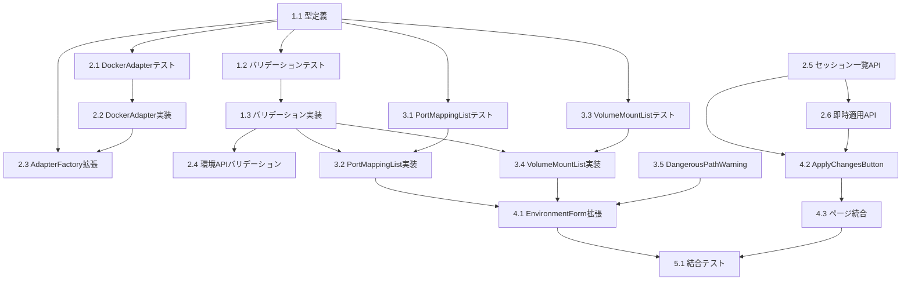

# タスク: Docker環境のポートマッピング・ボリュームマウント設定

## 参照ドキュメント

- [要件定義書](../../requirements/docker-port-volume/index.md)
- [技術設計書](../../design/docker-port-volume/design.md)

## 実装計画

### フェーズ1: 基盤構築（型定義・バリデーション）

#### タスク1.1: データ型定義の作成

**説明**:
- 対象ファイルパス: `src/types/environment.ts`（新規作成）
- PortMapping, VolumeMount, DockerEnvironmentConfig インターフェースを定義
- 既存コードで使用されている型定義との整合性を確保

**技術的文脈**:
- フレームワーク: TypeScript
- 既存の型: `src/services/adapters/docker-adapter.ts` の DockerAdapterConfig
- 既存の型: `src/services/adapter-factory.ts` の DockerEnvironmentConfig（ローカル定義）

**実装手順（TDD）**:
1. `src/types/environment.ts` を作成し、PortMapping, VolumeMount, DockerEnvironmentConfig を定義
2. 既存の `adapter-factory.ts` 内のローカル DockerEnvironmentConfig を新しい型に置き換え
3. TypeScriptコンパイルが通ることを確認
4. コミット

**受入基準**:
- [ ] `src/types/environment.ts` が存在する
- [ ] PortMapping インターフェースが hostPort, containerPort, protocol を持つ
- [ ] VolumeMount インターフェースが hostPath, containerPath, accessMode を持つ
- [ ] DockerEnvironmentConfig が portMappings?, volumeMounts? を持つ
- [ ] `npm run build` でコンパイルエラーがない

**依存関係**: なし
**推定工数**: 15分
**ステータス**: `DONE`
**対応要件**: REQ-011, REQ-115

---

#### タスク1.2: バリデーションモジュールの作成（テスト）

**説明**:
- 対象ファイルパス: `src/lib/__tests__/docker-config-validator.test.ts`（新規作成）
- ポートマッピングとボリュームマウントのバリデーションテストを作成
- TDDの原則に従い、まずテストのみを作成

**技術的文脈**:
- テストフレームワーク: Vitest
- 参照すべき既存テスト: `src/lib/__tests__/` 内の既存テスト

**実装手順（TDD）**:
1. テスト作成: `src/lib/__tests__/docker-config-validator.test.ts`
2. テストケース:
   - `validatePortMappings`:
     - 正常なポートマッピング配列で valid: true
     - 空配列で valid: true
     - ポート番号0でエラー
     - ポート番号65536でエラー
     - ポート番号が整数でない場合エラー
     - 同一hostPort+protocol重複でエラー
     - 異なるプロトコルの同一ポートは許可
     - hostPort/containerPortが空でエラー
   - `validateVolumeMounts`:
     - 正常なボリュームマウント配列で valid: true
     - 空配列で valid: true
     - hostPathが絶対パスでないとエラー
     - containerPathが絶対パスでないとエラー
     - 同一containerPath重複でエラー
     - `../` を含むパスでエラー
     - システムコンテナパス（/workspace等）でエラー
   - `isDangerousPath`:
     - /etc で true
     - /proc で true
     - /home/user で false
     - /etc/nginx（サブパス）で true
   - `isSystemContainerPath`:
     - /workspace で true
     - /home/node/.claude で true
     - /data で false
     - /workspace/sub（サブパス）で true
3. テスト実行: 全テスト失敗を確認
4. テストコミット

**受入基準**:
- [ ] テストファイルが存在する
- [ ] 20件以上のテストケースがある
- [ ] `npx vitest run src/lib/__tests__/docker-config-validator.test.ts` で全テスト失敗（モジュール未実装のため）

**依存関係**: タスク1.1
**推定工数**: 30分
**ステータス**: `DONE`
**対応要件**: REQ-007〜010, REQ-107〜111, REQ-119, NFR-001〜004

---

#### タスク1.3: バリデーションモジュールの実装

**説明**:
- 対象ファイルパス: `src/lib/docker-config-validator.ts`（新規作成）
- タスク1.2で作成したテストを通過させるバリデーションロジックを実装

**技術的文脈**:
- Node.js path モジュール使用（path.resolve()でパス正規化）
- フロントエンド・バックエンド両方で使用するため、Node.js固有APIは避ける（pathはNext.jsで利用可能）

**実装手順（TDD）**:
1. `src/lib/docker-config-validator.ts` を作成
2. `validatePortMappings()`, `validateVolumeMounts()`, `isDangerousPath()`, `isSystemContainerPath()` を実装
3. テスト実行: 全テスト通過を確認
4. 実装コミット

**受入基準**:
- [ ] `src/lib/docker-config-validator.ts` が存在する
- [ ] DANGEROUS_HOST_PATHS 定数がエクスポートされている
- [ ] SYSTEM_CONTAINER_PATHS 定数がエクスポートされている
- [ ] `npx vitest run src/lib/__tests__/docker-config-validator.test.ts` で全テスト通過
- [ ] ESLintエラーがない

**依存関係**: タスク1.2
**推定工数**: 30分
**ステータス**: `DONE`
**対応要件**: REQ-007〜010, REQ-107〜111, REQ-119, NFR-001〜005

---

### フェーズ2: バックエンド実装（DockerAdapter・API）

#### タスク2.1: DockerAdapter拡張（テスト）

**説明**:
- 対象ファイルパス: `src/services/adapters/__tests__/docker-adapter.test.ts`（既存修正）
- `buildDockerArgs()` にポートマッピングとボリュームマウントの引数が追加されることをテスト

**技術的文脈**:
- 既存テスト: `src/services/adapters/__tests__/docker-adapter.test.ts` があれば参照
- DockerAdapterConfig にportMappings, volumeMountsを追加した状態でテスト
- buildDockerArgs()はprotectedメソッドのため、テスト用サブクラスで公開するか、createSession()の結果を検証

**実装手順（TDD）**:
1. 既存テストファイルを確認し、buildDockerArgsのテストを追加
2. テストケース:
   - portMappingsが設定されている場合、`-p` 引数が生成される
   - 複数のportMappingsが正しい形式で出力される（`-p 3000:3000/tcp`）
   - プロトコル未指定時、デフォルトでtcpが使用される
   - volumeMountsが設定されている場合、`-v` 引数が生成される
   - roモードで `:ro` サフィックスが付与される
   - rwモードでサフィックスなし
   - ポートマッピング/ボリュームマウントが空配列の場合、引数なし
   - システムボリュームの後にカスタムボリュームが配置される
3. テスト実行: 新規テストが失敗することを確認
4. テストコミット

**受入基準**:
- [ ] テストケースが8件以上追加されている
- [ ] ポートマッピングの `-p` 引数生成テストがある
- [ ] ボリュームマウントの `-v` 引数生成テストがある
- [ ] 引数順序のテストがある

**依存関係**: タスク1.1
**推定工数**: 30分
**ステータス**: `DONE`
**対応要件**: REQ-011〜012, REQ-115〜118

---

#### タスク2.2: DockerAdapter拡張（実装）

**説明**:
- 対象ファイルパス: `src/services/adapters/docker-adapter.ts`（既存修正）
- DockerAdapterConfig に portMappings, volumeMounts を追加
- `buildDockerArgs()` にポートマッピングとボリュームマウントの引数生成を追加

**技術的文脈**:
- 変更箇所: `buildDockerArgs()` メソッド内、SSH Agent転送の後、環境変数の前に追加
- DockerAdapterConfig インターフェースの拡張

**実装手順（TDD）**:
1. DockerAdapterConfig に `portMappings?: PortMapping[]` と `volumeMounts?: VolumeMount[]` を追加
2. `buildDockerArgs()` 内、SSH Agent転送セクション（行140-144）の後に:
   - ポートマッピング: `args.push('-p', '{hostPort}:{containerPort}/{protocol}')` を追加
   - ボリュームマウント: `args.push('-v', '{hostPath}:{containerPath}[:ro]')` を追加
3. テスト実行: タスク2.1のテスト通過を確認
4. 実装コミット

**受入基準**:
- [ ] DockerAdapterConfig に portMappings, volumeMounts が追加されている
- [ ] ポートマッピングが `-p` 引数として正しく生成される
- [ ] ボリュームマウントが `-v` 引数として正しく生成される
- [ ] システムボリュームの後にカスタムボリュームが配置される
- [ ] タスク2.1のテスト全通過

**依存関係**: タスク2.1
**推定工数**: 20分
**ステータス**: `DONE`
**対応要件**: REQ-011〜012, REQ-115〜118

---

#### タスク2.3: AdapterFactory拡張

**説明**:
- 対象ファイルパス: `src/services/adapter-factory.ts`（既存修正）
- config JSONからportMappings, volumeMountsを読み取り、DockerAdapterConfigに渡す
- ローカルの DockerEnvironmentConfig 型を `src/types/environment.ts` からインポートに変更

**技術的文脈**:
- 現在 `adapter-factory.ts` 行7-10にローカル定義の DockerEnvironmentConfig がある
- これを `src/types/environment.ts` の型に置き換え、portMappings/volumeMountsを含める
- DockerAdapterキャッシュの再作成が必要（設定変更時にキャッシュを削除→再作成）

**実装手順**:
1. `adapter-factory.ts` のローカル DockerEnvironmentConfig を `src/types/environment.ts` からインポートに変更
2. `getDockerAdapter()` 内、DockerAdapterConfig生成部分（行79-84）に portMappings と volumeMounts を追加
3. 既存テスト（あれば）通過を確認
4. コミット

**受入基準**:
- [ ] ローカル型定義が削除され、`src/types/environment.ts` からインポートされている
- [ ] DockerAdapterConfig に portMappings, volumeMounts が渡されている
- [ ] `npm run build` でコンパイルエラーがない

**依存関係**: タスク1.1, タスク2.2
**推定工数**: 15分
**ステータス**: `DONE`
**対応要件**: REQ-011, REQ-115

---

#### タスク2.4: 環境API拡張（バリデーション追加）

**説明**:
- 対象ファイルパス: `src/app/api/environments/route.ts`（既存修正）
- POST/PUTリクエストでconfig内のportMappings, volumeMountsをバリデーション

**技術的文脈**:
- 既存のPOSTハンドラー内、skipPermissionsバリデーションの後に追加
- `docker-config-validator` モジュールをインポートして使用

**実装手順（TDD）**:
1. テスト作成: `src/app/api/environments/__tests__/route.test.ts` にportMappings/volumeMountsバリデーションテストを追加
   - 不正なポート番号で400エラー
   - 不正なパスで400エラー
   - システムコンテナパス重複で400エラー
   - 正常なconfig（portMappings/volumeMounts付き）で201成功
2. テスト実行: 失敗を確認
3. `route.ts` のPOST/PUTハンドラーにバリデーションを追加
4. テスト実行: 通過を確認
5. コミット

**受入基準**:
- [ ] POSTリクエストでportMappingsのバリデーションが実行される
- [ ] POSTリクエストでvolumeMountsのバリデーションが実行される
- [ ] PUTリクエストでも同様のバリデーションが実行される
- [ ] 不正な値で400レスポンスが返る
- [ ] テスト通過

**依存関係**: タスク1.3
**推定工数**: 30分
**ステータス**: `DONE`
**対応要件**: REQ-007〜010, REQ-107〜111, REQ-119, NFR-001, NFR-005

---

#### タスク2.5: セッション一覧API作成

**説明**:
- 対象ファイルパス: `src/app/api/environments/[id]/sessions/route.ts`（新規作成）
- 指定環境を使用している実行中セッションの一覧を返すAPIエンドポイント

**技術的文脈**:
- Next.js App Router のダイナミックルート
- Drizzle ORM で sessions テーブルを environment_id でフィルタ
- container_id が null でないセッションを「実行中」とみなす

**実装手順（TDD）**:
1. テスト作成: `src/app/api/environments/[id]/sessions/__tests__/route.test.ts`
   - 存在しない環境IDで404
   - セッションがない場合、空配列を返す
   - 実行中セッションがある場合、一覧を返す
2. テスト実行: 失敗を確認
3. `route.ts` を実装
4. テスト実行: 通過を確認
5. コミット

**受入基準**:
- [ ] `GET /api/environments/:id/sessions` が動作する
- [ ] レスポンスに sessions 配列と count が含まれる
- [ ] 存在しない環境IDで404が返る
- [ ] テスト通過

**依存関係**: なし
**推定工数**: 25分
**ステータス**: `DONE`
**対応要件**: REQ-211

---

#### タスク2.6: 即時適用API作成

**説明**:
- 対象ファイルパス: `src/app/api/environments/[id]/apply/route.ts`（新規作成）
- 環境設定変更を実行中セッションに即時適用するAPIエンドポイント

**技術的文脈**:
- AdapterFactory.removeDockerAdapter() でキャッシュを削除
- 各セッションに対して restartSession() を呼び出してコンテナを再作成
- PTYSessionManager または EnvironmentAdapter を使用

**実装手順（TDD）**:
1. テスト作成: `src/app/api/environments/[id]/apply/__tests__/route.test.ts`
   - 存在しない環境IDで404
   - 実行中セッションがない場合、applied: 0を返す
   - 実行中セッションがある場合、再起動される
   - 再起動失敗時、failed数が増える
2. テスト実行: 失敗を確認
3. `route.ts` を実装:
   - 環境の存在確認
   - AdapterFactory.removeDockerAdapter(id) でキャッシュ削除
   - 該当環境のセッション一覧を取得
   - 各セッションの restartSession() を呼び出し
   - 結果を集約して返す
4. テスト実行: 通過を確認
5. コミット

**受入基準**:
- [ ] `POST /api/environments/:id/apply` が動作する
- [ ] レスポンスに applied, failed, sessions が含まれる
- [ ] AdapterFactoryのDockerAdapterキャッシュが削除される
- [ ] 対象セッションが再起動される
- [ ] テスト通過

**依存関係**: タスク2.5
**推定工数**: 40分
**ステータス**: `DONE`
**対応要件**: REQ-205〜210

---

### フェーズ3: フロントエンド実装（UIコンポーネント）

#### タスク3.1: PortMappingListコンポーネント作成（テスト）

**説明**:
- 対象ファイルパス: `src/components/environments/__tests__/PortMappingList.test.tsx`（新規作成）
- ポートマッピングの動的リスト入力コンポーネントのテスト

**技術的文脈**:
- テストフレームワーク: Vitest + @testing-library/react
- 参照すべき既存コンポーネント: `src/components/environments/EnvironmentForm.tsx` のUI構成

**実装手順（TDD）**:
1. テスト作成:
   - 空の場合「設定なし」メッセージと「ポートを追加」ボタンが表示される
   - 「ポートを追加」クリックで入力行が追加される
   - 削除ボタンクリックで行が削除される
   - onChange が正しい PortMapping 配列で呼ばれる
   - プロトコルのデフォルトが tcp
   - 不正なポート番号でエラー表示
2. テスト実行: 失敗を確認
3. テストコミット

**受入基準**:
- [ ] テストファイルが存在する
- [ ] 6件以上のテストケースがある

**依存関係**: タスク1.1
**推定工数**: 25分
**ステータス**: `DONE`
**対応要件**: REQ-001〜003, NFR-101〜103, NFR-105

---

#### タスク3.2: PortMappingListコンポーネント実装

**説明**:
- 対象ファイルパス: `src/components/environments/PortMappingList.tsx`（新規作成）
- ポートマッピングの動的リスト入力コンポーネント

**技術的文脈**:
- Tailwind CSS でスタイリング
- ダークモード対応（dark: プレフィックス）
- Headless UI の Listbox を参考にプロトコル選択

**実装手順（TDD）**:
1. `PortMappingList.tsx` を作成
2. UI構成:
   - セクションタイトル「ポートマッピング」
   - 各行: ホストポート入力、コンテナポート入力、プロトコル選択（TCP/UDP）、削除ボタン
   - 「ポートを追加」ボタン
   - 行ごとのエラー表示
   - 空状態メッセージ
3. リアルタイムバリデーション: validatePortMappings を使用
4. テスト実行: タスク3.1のテスト通過を確認
5. 実装コミット

**受入基準**:
- [ ] コンポーネントが存在する
- [ ] ポートの追加・削除が動作する
- [ ] プロトコル選択（TCP/UDP）が動作する
- [ ] リアルタイムバリデーションが動作する
- [ ] ダークモード対応
- [ ] タスク3.1のテスト全通過

**依存関係**: タスク1.3, タスク3.1
**推定工数**: 30分
**ステータス**: `DONE`
**対応要件**: REQ-001〜003, NFR-101〜103, NFR-105

---

#### タスク3.3: VolumeMountListコンポーネント作成（テスト）

**説明**:
- 対象ファイルパス: `src/components/environments/__tests__/VolumeMountList.test.tsx`（新規作成）
- ボリュームマウントの動的リスト入力コンポーネントのテスト

**技術的文脈**:
- テストフレームワーク: Vitest + @testing-library/react

**実装手順（TDD）**:
1. テスト作成:
   - 空の場合「設定なし」メッセージと「ボリュームを追加」ボタンが表示される
   - 「ボリュームを追加」クリックで入力行が追加される
   - 削除ボタンクリックで行が削除される
   - onChange が正しい VolumeMount 配列で呼ばれる
   - アクセスモードのデフォルトが rw
   - 絶対パスでないとエラー表示
   - システムコンテナパスでエラー表示
2. テスト実行: 失敗を確認
3. テストコミット

**受入基準**:
- [ ] テストファイルが存在する
- [ ] 7件以上のテストケースがある

**依存関係**: タスク1.1
**推定工数**: 25分
**ステータス**: `DONE`
**対応要件**: REQ-101〜103, NFR-101〜103, NFR-105

---

#### タスク3.4: VolumeMountListコンポーネント実装

**説明**:
- 対象ファイルパス: `src/components/environments/VolumeMountList.tsx`（新規作成）
- ボリュームマウントの動的リスト入力コンポーネント

**技術的文脈**:
- Tailwind CSS でスタイリング
- ダークモード対応

**実装手順（TDD）**:
1. `VolumeMountList.tsx` を作成
2. UI構成:
   - セクションタイトル「ボリュームマウント」
   - 各行: ホストパス入力、コンテナパス入力、アクセスモード選択（RW/RO）、削除ボタン
   - 「ボリュームを追加」ボタン
   - 行ごとのエラー表示
   - 空状態メッセージ
3. リアルタイムバリデーション: validateVolumeMounts を使用
4. テスト実行: タスク3.3のテスト通過を確認
5. 実装コミット

**受入基準**:
- [ ] コンポーネントが存在する
- [ ] ボリュームの追加・削除が動作する
- [ ] アクセスモード選択（RW/RO）が動作する
- [ ] リアルタイムバリデーションが動作する
- [ ] ダークモード対応
- [ ] タスク3.3のテスト全通過

**依存関係**: タスク1.3, タスク3.3
**推定工数**: 30分
**ステータス**: `DONE`
**対応要件**: REQ-101〜103, NFR-101〜103, NFR-105

---

#### タスク3.5: DangerousPathWarningダイアログ作成

**説明**:
- 対象ファイルパス: `src/components/environments/DangerousPathWarning.tsx`（新規作成）
- 危険パス入力時の警告確認ダイアログ

**技術的文脈**:
- Headless UI の Dialog コンポーネントを使用
- 既存の EnvironmentForm.tsx のダイアログスタイルを参考にする

**実装手順**:
1. `DangerousPathWarning.tsx` を作成
2. UI構成:
   - 警告アイコンとメッセージ
   - 入力されたパスの表示
   - 「このパスはシステムディレクトリです。マウントするとセキュリティリスクがあります。」の説明
   - 「同意して設定」ボタン（赤系）
   - 「キャンセル」ボタン
3. ダークモード対応
4. コミット

**受入基準**:
- [ ] コンポーネントが存在する
- [ ] 警告メッセージが表示される
- [ ] 「同意して設定」で onConfirm が呼ばれる
- [ ] 「キャンセル」で onCancel が呼ばれる
- [ ] ダークモード対応

**依存関係**: なし
**推定工数**: 20分
**ステータス**: `DONE`
**対応要件**: REQ-112〜114, NFR-002

---

### フェーズ4: 統合

#### タスク4.1: EnvironmentForm拡張

**説明**:
- 対象ファイルパス: `src/components/environments/EnvironmentForm.tsx`（既存修正）
- Docker設定セクション内にPortMappingList, VolumeMountList, DangerousPathWarningを統合

**技術的文脈**:
- 既存のDocker設定セクション（Skip Permissionsトグルの前）にポート・ボリューム設定を追加
- 編集モードでの既存設定の復元対応
- buildDockerConfig() の拡張

**実装手順**:
1. PortMappingList, VolumeMountList をインポート
2. state追加: portMappings, volumeMounts, dangerousPathWarning
3. Docker設定セクションにコンポーネントを配置（Skip Permissionsトグルの前）
4. buildDockerConfig() に portMappings, volumeMounts を追加
5. 編集モードの useEffect で portMappings, volumeMounts を復元
6. handleClose() でportMappings, volumeMounts をリセット
7. DangerousPathWarning のイベントハンドリング
8. コミット

**受入基準**:
- [ ] Docker環境作成フォームにポートマッピングセクションが表示される
- [ ] Docker環境作成フォームにボリュームマウントセクションが表示される
- [ ] 編集フォームで既存設定が復元される
- [ ] config JSONに portMappings, volumeMounts が含まれる
- [ ] 危険パス入力時に警告ダイアログが表示される
- [ ] `npm run build` でコンパイルエラーがない

**依存関係**: タスク3.2, タスク3.4, タスク3.5
**推定工数**: 40分
**ステータス**: `DONE`
**対応要件**: REQ-001〜006, REQ-101〜106, REQ-112〜114

---

#### タスク4.2: ApplyChangesButtonコンポーネント作成

**説明**:
- 対象ファイルパス: `src/components/environments/ApplyChangesButton.tsx`（新規作成）
- 設定変更の即時適用ボタンと確認ダイアログ

**技術的文脈**:
- `GET /api/environments/:id/sessions` で影響セッション数を取得
- `POST /api/environments/:id/apply` で即時適用を実行
- Headless UI の Dialog を使用

**実装手順**:
1. `ApplyChangesButton.tsx` を作成
2. UI構成:
   - 「今すぐ適用」ボタン（影響セッション数が0なら非表示）
   - 影響セッション数のバッジ表示
   - 確認ダイアログ: セッション一覧、「適用」「キャンセル」ボタン
   - 適用中のローディング表示
   - 適用結果（成功/失敗数）の表示
3. コミット

**受入基準**:
- [ ] コンポーネントが存在する
- [ ] 影響セッションが0の場合、ボタンが非表示
- [ ] 確認ダイアログにセッション一覧が表示される
- [ ] 適用後に結果が表示される
- [ ] onApplied コールバックが呼ばれる

**依存関係**: タスク2.5, タスク2.6
**推定工数**: 35分
**ステータス**: `DONE`
**対応要件**: REQ-205〜212

---

#### タスク4.3: 環境設定ページにApplyChangesButton統合

**説明**:
- 対象ファイルパス: `src/app/settings/environments/page.tsx`（既存修正）または該当するページコンポーネント
- 環境編集後にApplyChangesButtonを表示する

**技術的文脈**:
- 環境編集の成功後に表示
- Docker環境のみで表示

**実装手順**:
1. 環境設定ページの構造を確認
2. 環境編集成功後にApplyChangesButtonを表示するロジックを追加
3. Docker環境かつ実行中セッションがある場合にのみ表示
4. コミット

**受入基準**:
- [ ] 環境編集後に「今すぐ適用」が表示される（条件を満たす場合）
- [ ] HOST環境では表示されない
- [ ] 実行中セッションがない場合は表示されない

**依存関係**: タスク4.2
**推定工数**: 20分
**ステータス**: `DONE`
**対応要件**: REQ-205, REQ-211

---

### フェーズ5: 結合テスト・リファクタリング

#### タスク5.1: 結合テスト

**説明**:
- 全フェーズの統合動作を確認
- lint, build, 全テスト実行

**実装手順**:
1. `npm run lint` でLintエラーがないことを確認
2. `npm run build` でビルドが通ることを確認
3. `npm test` で全テスト通過を確認
4. 必要に応じて修正
5. コミット

**受入基準**:
- [ ] `npm run lint` 通過
- [ ] `npm run build` 通過
- [ ] `npm test` 通過（既知の失敗テストを除く）

**依存関係**: タスク4.1, タスク4.3
**推定工数**: 20分
**ステータス**: `DONE`

---

## タスクステータスの凡例

- `TODO` - 未着手
- `IN_PROGRESS` - 作業中
- `BLOCKED` - ブロック中
- `REVIEW` - レビュー待ち
- `DONE` - 完了

## タスク依存関係図

## リスクと軽減策

| リスク | 影響度 | 軽減策 |
|--------|--------|--------|
| ポートの競合（ホスト側） | 中 | バリデーションでは検出不可。ユーザーへのドキュメント提供で対応 |
| 即時適用時のセッション中断 | 高 | 確認ダイアログで明示的な同意を取得 |
| 危険パスのマウントによるセキュリティリスク | 高 | 警告ダイアログ + 二重チェック（FE/BE）で軽減 |

## 逆順レビュー結果

### タスク → 設計

| チェック項目 | 結果 |
|-------------|------|
| 全コンポーネントに対応タスクがある | OK |
| 全APIエンドポイントに対応タスクがある | OK |
| データ型定義に対応タスクがある | OK |
| テスト方針に対応タスクがある | OK |

### 設計 → 要件

| チェック項目 | 結果 |
|-------------|------|
| 全REQ-XXXに対応する設計要素がある | OK（設計書の整合性チェック表で確認済み） |
| 全NFR-XXXが設計に反映されている | OK |
| スコープ外の機能が設計に含まれていない | OK |
