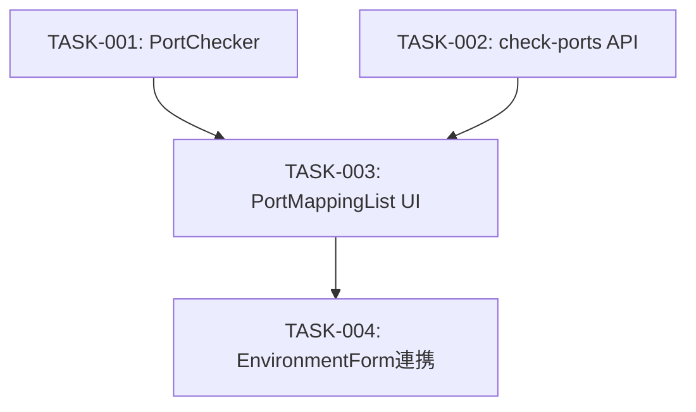

# タスク管理: ポートマッピング設定時のポート使用状況チェック

## 概要

ポートマッピング設定時のポート使用状況チェック機能をTDDで実装する。

- 要件定義書: `docs/sdd/requirements/port-check/`
- 設計書: `docs/sdd/design/port-check/`

## タスク一覧

| ID | タイトル | フェーズ | ステータス | 依存 | 推定工数 | リンク |
|----|----------|---------|-----------|------|---------|--------|
| TASK-001 | PortCheckerサービスのテスト作成・実装 | Phase 1 | TODO | なし | 40min | [詳細](phase-1/TASK-001.md) |
| TASK-002 | check-ports APIエンドポイントのテスト作成・実装 | Phase 1 | TODO | なし | 30min | [詳細](phase-1/TASK-002.md) |
| TASK-003 | PortMappingList UI拡張のテスト作成・実装 | Phase 2 | TODO | TASK-001, TASK-002 | 40min | [詳細](phase-2/TASK-003.md) |
| TASK-004 | EnvironmentForm連携とE2E確認 | Phase 2 | TODO | TASK-003 | 20min | [詳細](phase-2/TASK-004.md) |

## 並列実行グループ

### Phase 1: 並列実行可能

| タスク | 対象ファイル | 依存 |
|--------|-------------|------|
| TASK-001 | src/services/port-checker.ts, src/services/__tests__/port-checker.test.ts | なし |
| TASK-002 | src/app/api/environments/check-ports/route.ts, src/app/api/environments/check-ports/__tests__/route.test.ts | なし |

### Phase 2: 順次実行（Phase 1完了後）

| タスク | 対象ファイル | 依存 |
|--------|-------------|------|
| TASK-003 | src/components/environments/PortMappingList.tsx, src/components/environments/__tests__/PortMappingList.test.tsx | TASK-001, TASK-002 |
| TASK-004 | src/components/environments/EnvironmentForm.tsx | TASK-003 |

## タスク依存関係図

## 進捗サマリ

- 全タスク数: 4
- 完了: 0
- 進行中: 0
- TODO: 4

## タスクステータスの凡例

- `TODO`: 未着手
- `IN_PROGRESS`: 作業中
- `BLOCKED`: ブロック中
- `DONE`: 完了
