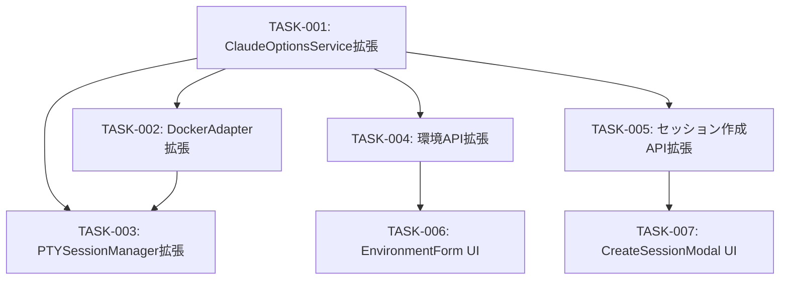

# タスク計画: Docker環境での --dangerously-skip-permissions オプション対応

> このドキュメントはAIエージェント（Claude Code等）が実行するタスク計画です。

## 概要

Docker実行環境でClaude Code起動時に `--dangerously-skip-permissions` フラグを付与できる機能を実装する。環境レベルのデフォルト設定とセッション単位の上書きをサポートする。TDD（テスト駆動開発）で進める。

## 進捗サマリ

| フェーズ | タスク数 | 完了 | 進行中 | 未着手 | 進捗率 |
|---------|---------|------|-------|-------|-------|
| Phase 1: バックエンド基盤 | 3 | 3 | 0 | 0 | 100% |
| Phase 2: API | 2 | 2 | 0 | 0 | 100% |
| Phase 3: UI | 2 | 2 | 0 | 0 | 100% |
| **合計** | **7** | **7** | **0** | **0** | **100%** |

## 並列実行グループ

### グループ A（Phase 1 - 順次実行）

| タスク | 対象ファイル | 依存 | 推定工数 |
|--------|-------------|------|---------|
| TASK-001 | src/services/claude-options-service.ts | なし | 30分 |
| TASK-002 | src/services/environment-adapter.ts, src/services/adapters/docker-adapter.ts | TASK-001 | 30分 |
| TASK-003 | src/services/pty-session-manager.ts | TASK-001, TASK-002 | 20分 |

### グループ B（Phase 2 - グループA完了後に並列実行可能）

| タスク | 対象ファイル | 依存 | 推定工数 |
|--------|-------------|------|---------|
| TASK-004 | src/app/api/environments/[id]/route.ts | TASK-001 | 15分 |
| TASK-005 | src/app/api/projects/[project_id]/sessions/route.ts | TASK-001 | 15分 |

### グループ C（Phase 3 - グループB完了後に並列実行可能）

| タスク | 対象ファイル | 依存 | 推定工数 |
|--------|-------------|------|---------|
| TASK-006 | src/components/environments/EnvironmentForm.tsx | TASK-004 | 30分 |
| TASK-007 | src/components/sessions/CreateSessionModal.tsx | TASK-005 | 30分 |

## タスク詳細

---

### TASK-001: ClaudeOptionsService に boolean フィールド対応を追加

**ステータス**: DONE
**推定工数**: 30分
**対象ファイル**:
- `src/services/claude-options-service.ts`
- `src/services/__tests__/claude-options-service.test.ts`

**実装内容**:

1. `ClaudeCodeOptions` インターフェースに `dangerouslySkipPermissions?: boolean` を追加

2. `buildCliArgs()` では `dangerouslySkipPermissions` を意図的に除外:
   - Docker環境種別やシェルモードの条件付けが必要なため、`DockerAdapter.buildDockerArgs()` で直接処理する
   - `buildCliArgs()` にはコメントで除外理由を記載

3. `validateClaudeCodeOptions()` を拡張:
   - `allowedKeys` に `'dangerouslySkipPermissions'` を追加
   - 型チェック: `boolean` または `undefined` を許可（文字列は不可）
   ```typescript
   if (key === 'dangerouslySkipPermissions') {
     if (typeof fieldValue !== 'boolean' && fieldValue !== undefined) {
       return null;
     }
     if (typeof fieldValue === 'boolean') {
       result.dangerouslySkipPermissions = fieldValue;
     }
   }
   ```

4. `getUnknownKeys()` を拡張:
   - `allowedKeys` に `'dangerouslySkipPermissions'` を追加

5. `parseOptions()` を拡張:
   - boolean フィールドのパース対応
   ```typescript
   if ('dangerouslySkipPermissions' in parsed && typeof parsed.dangerouslySkipPermissions === 'boolean') {
     result.dangerouslySkipPermissions = parsed.dangerouslySkipPermissions;
   }
   ```

6. `mergeOptions()` を拡張:
   - boolean フィールドのマージ対応
   - `undefined` = 上書きなし、`true`/`false` = 明示的上書き
   ```typescript
   if (sessionOptions.dangerouslySkipPermissions !== undefined) {
     merged.dangerouslySkipPermissions = sessionOptions.dangerouslySkipPermissions;
   } else if (projectOptions.dangerouslySkipPermissions !== undefined) {
     merged.dangerouslySkipPermissions = projectOptions.dangerouslySkipPermissions;
   }
   ```

**TDD手順**:
1. テスト作成:
   - `buildCliArgs()`: dangerouslySkipPermissions=true でも `--dangerously-skip-permissions` が含まれない（DockerAdapterで処理）
   - `validateClaudeCodeOptions()`: boolean値を受け入れる
   - `validateClaudeCodeOptions()`: 文字列値を拒否する
   - `parseOptions()`: JSONからboolean値をパースできる
   - `mergeOptions()`: session値がproject値をオーバーライドする
   - `getUnknownKeys()`: dangerouslySkipPermissionsを未知キーとして報告しない
2. テスト実行 → 失敗確認
3. 実装
4. テスト実行 → 通過確認

**受入基準**:
- [x] `buildCliArgs()` はdangerouslySkipPermissionsを出力しない（DockerAdapterで処理）
- [x] boolean型のみ受け入れ、文字列は拒否する
- [x] 既存のstring型フィールドの動作が変わらない
- [x] 全テスト通過

---

### TASK-002: DockerAdapter と CreateSessionOptions に skipPermissions を追加

**ステータス**: DONE
**推定工数**: 30分
**依存**: TASK-001
**対象ファイル**:
- `src/services/environment-adapter.ts`
- `src/services/adapters/docker-adapter.ts`
- `src/services/adapters/__tests__/docker-adapter.test.ts`

**実装内容**:

1. `CreateSessionOptions` に `skipPermissions?: boolean` を追加:
   ```typescript
   // src/services/environment-adapter.ts
   export interface CreateSessionOptions {
     // ... 既存フィールド
     skipPermissions?: boolean; // 解決済みの値（環境config + セッション上書き）
   }
   ```

2. `DockerAdapter.buildDockerArgs()` を拡張:
   ```typescript
   // イメージ名の後、他のclaude引数の前に追加
   args.push(`${this.config.imageName}:${this.config.imageTag}`);

   // skipPermissions フラグ（shellModeではスキップ）
   if (!options?.shellMode && options?.skipPermissions) {
     args.push('--dangerously-skip-permissions');
     logger.info('DockerAdapter: --dangerously-skip-permissions enabled', { sessionId: 'building' });
   }

   // 既存: --resume, カスタムCLIオプション...
   ```

**TDD手順**:
1. テスト作成:
   - `buildDockerArgs()`: skipPermissions=true で `--dangerously-skip-permissions` が引数に含まれる
   - `buildDockerArgs()`: skipPermissions=false で含まれない
   - `buildDockerArgs()`: shellMode=true + skipPermissions=true で含まれない
   - フラグの位置がイメージ名の後にあること
2. テスト実行 → 失敗確認
3. 実装
4. テスト実行 → 通過確認

**受入基準**:
- [x] Docker runコマンドに `--dangerously-skip-permissions` が適切に追加される
- [x] shellModeでは追加されない
- [x] 既存のセッション作成動作が変わらない

---

### TASK-003: PTYSessionManager に skipPermissions 解決ロジックを追加

**ステータス**: DONE
**推定工数**: 20分
**依存**: TASK-001, TASK-002
**対象ファイル**:
- `src/services/pty-session-manager.ts`
- `src/services/__tests__/pty-session-manager.test.ts`（該当部分）

**実装内容**:

PTYSessionManager.createSession() 内で、環境configとセッションオプションからskipPermissionsを解決:

```typescript
// 環境configからskipPermissionsデフォルト値を取得
const envConfig = JSON.parse(environment.config || '{}');

// セッションのclaudeCodeOptionsをパース
const sessionClaudeOptions = ClaudeOptionsService.parseOptions(session.claude_code_options);

// skipPermissions解決（Docker環境のみ）
let skipPermissions = false;
if (environment.type === 'DOCKER') {
  skipPermissions = sessionClaudeOptions.dangerouslySkipPermissions
    ?? envConfig.skipPermissions
    ?? false;
}

// Adapterに解決済み値を渡す
await adapter.createSession(sessionId, workingDir, initialPrompt, {
  ...otherOptions,
  skipPermissions,
});
```

**TDD手順**:
1. テスト作成:
   - Docker環境 + env skipPermissions=true + session undefined → true
   - Docker環境 + env skipPermissions=true + session false → false
   - Docker環境 + env skipPermissions=false + session true → true
   - Docker環境 + env skipPermissions=false + session undefined → false
   - HOST環境 + session skipPermissions=true → false（強制無効）
2. テスト実行 → 失敗確認
3. 実装
4. テスト実行 → 通過確認

**受入基準**:
- [x] 環境デフォルトとセッション上書きが正しく解決される
- [x] HOST環境では常にfalse
- [x] 解決済みの値がAdapterに正しく渡される

---

### TASK-004: 環境API に skipPermissions バリデーションを追加

**ステータス**: DONE
**推定工数**: 15分
**依存**: TASK-001
**対象ファイル**:
- `src/app/api/environments/route.ts`（POST）
- `src/app/api/environments/[id]/route.ts`（PUT）
- テストファイル

**実装内容**:

1. POST（環境作成）: config内の `skipPermissions` がbooleanであることを検証
   ```typescript
   if (type === 'DOCKER' && config?.skipPermissions !== undefined) {
     if (typeof config.skipPermissions !== 'boolean') {
       return NextResponse.json({ error: 'skipPermissions must be a boolean' }, { status: 400 });
     }
   }
   // HOST環境のconfigにskipPermissionsがあっても無視（削除して保存）
   if (type !== 'DOCKER' && config?.skipPermissions !== undefined) {
     delete config.skipPermissions;
   }
   ```

2. PUT（環境更新）: 同様のバリデーション

**TDD手順**:
1. テスト作成:
   - Docker環境作成: config.skipPermissions=true で成功
   - Docker環境作成: config.skipPermissions="true"（文字列）で失敗
   - HOST環境作成: config.skipPermissions=true で無視される
   - Docker環境更新: config.skipPermissions=false で成功
2. テスト実行 → 失敗確認
3. 実装
4. テスト実行 → 通過確認

**受入基準**:
- [x] Docker環境のみskipPermissionsを受け入れる
- [x] 不正な型はバリデーションエラー
- [x] HOST環境では無視される

---

### TASK-005: セッション作成API に dangerouslySkipPermissions バリデーションを追加

**ステータス**: DONE
**推定工数**: 15分
**依存**: TASK-001
**対象ファイル**:
- `src/app/api/projects/[project_id]/sessions/route.ts`
- テストファイル

**実装内容**:

`validateClaudeCodeOptions()` がTASK-001で拡張済みのため、追加実装は最小限。

1. バリデーション: 既に `ClaudeOptionsService.validateClaudeCodeOptions()` で処理される
2. DB保存: 既存ロジックで `JSON.stringify(claude_code_options)` により保存される

**確認事項**:
- `claude_code_options` に `dangerouslySkipPermissions: true` を含むリクエストが正しく保存されること
- `dangerouslySkipPermissions: "true"` （文字列）がバリデーションエラーになること

**TDD手順**:
1. テスト作成:
   - セッション作成: dangerouslySkipPermissions=true で成功、DB保存確認
   - セッション作成: dangerouslySkipPermissions="true" でバリデーションエラー
   - セッション作成: dangerouslySkipPermissions未指定で成功（従来動作）
2. テスト実行 → 失敗確認
3. 実装
4. テスト実行 → 通過確認

**受入基準**:
- [x] boolean値が正しく保存される
- [x] 文字列値はバリデーションエラー
- [x] 未指定時は従来と同じ動作

---

### TASK-006: EnvironmentForm に skipPermissions トグルを追加

**ステータス**: DONE
**推定工数**: 30分
**依存**: TASK-004
**対象ファイル**:
- `src/components/environments/EnvironmentForm.tsx`

**実装内容**:

1. state追加:
   ```typescript
   const [skipPermissions, setSkipPermissions] = useState(false);
   ```

2. edit mode時の初期値設定:
   ```typescript
   useEffect(() => {
     if (environment) {
       const config = JSON.parse(environment.config || '{}');
       setSkipPermissions(config.skipPermissions ?? false);
     }
   }, [environment]);
   ```

3. Docker環境の場合のみトグル表示:
   ```tsx
   {type === 'DOCKER' && (
     <div className="space-y-1">
       <div className="flex items-center justify-between">
         <label className="text-sm font-medium text-gray-700 dark:text-gray-300">
           パーミッション確認スキップ
         </label>
         <button
           type="button"
           role="switch"
           aria-checked={skipPermissions}
           onClick={() => setSkipPermissions(!skipPermissions)}
           className={`relative inline-flex h-6 w-11 items-center rounded-full transition-colors ${
             skipPermissions ? 'bg-blue-600' : 'bg-gray-200 dark:bg-gray-600'
           }`}
         >
           <span className={`inline-block h-4 w-4 transform rounded-full bg-white transition-transform ${
             skipPermissions ? 'translate-x-6' : 'translate-x-1'
           }`} />
         </button>
       </div>
       <p className="text-xs text-gray-500 dark:text-gray-400">
         Docker環境はサンドボックスとして動作するため、Claude Codeのパーミッション確認をスキップできます。
         この環境を使用する新規セッションにデフォルトで適用されます。
       </p>
     </div>
   )}
   ```

4. handleSubmit で config に skipPermissions を含める:
   ```typescript
   const config = buildDockerConfig();
   if (type === 'DOCKER') {
     config.skipPermissions = skipPermissions;
   }
   ```

**受入基準**:
- [x] Docker環境の新規作成モーダルでトグルが表示される
- [x] Docker環境の編集画面でトグルが表示される
- [x] HOST環境では作成・編集ともにトグルが非表示
- [x] 編集時に既存値が正しく読み込まれる
- [x] 新規作成時のデフォルト値はfalse
- [x] 保存時にconfigに含まれる

---

### TASK-007: CreateSessionModal に skipPermissions セレクタを追加

**ステータス**: DONE
**推定工数**: 30分
**依存**: TASK-005
**対象ファイル**:
- `src/components/sessions/CreateSessionModal.tsx`

**実装内容**:

1. state追加:
   ```typescript
   const [skipPermissionsOverride, setSkipPermissionsOverride] = useState<'default' | 'true' | 'false'>('default');
   ```

2. 選択環境のskipPermissionsデフォルト値を取得:
   ```typescript
   const selectedEnvConfig = useMemo(() => {
     const env = environments.find(e => e.id === selectedEnvironmentId);
     if (!env) return {};
     try { return JSON.parse(env.config || '{}'); } catch { return {}; }
   }, [environments, selectedEnvironmentId]);

   const envSkipPermissions = selectedEnvConfig.skipPermissions ?? false;
   ```

3. Docker環境選択時のみセレクタ表示:
   ```tsx
   {selectedEnvironmentType === 'DOCKER' && (
     <div className="space-y-1">
       <label className="text-sm font-medium text-gray-700 dark:text-gray-300">
         パーミッション確認スキップ
       </label>
       <select
         value={skipPermissionsOverride}
         onChange={(e) => setSkipPermissionsOverride(e.target.value as 'default' | 'true' | 'false')}
         className="w-full rounded-md border ..."
       >
         <option value="default">
           環境デフォルトを使用（{envSkipPermissions ? '有効' : '無効'}）
         </option>
         <option value="true">有効</option>
         <option value="false">無効</option>
       </select>
       <p className="text-xs text-gray-500 dark:text-gray-400">
         Claude Codeのパーミッション確認をスキップします。
       </p>
     </div>
   )}
   ```

4. 環境変更時にリセット:
   ```typescript
   useEffect(() => {
     setSkipPermissionsOverride('default');
   }, [selectedEnvironmentId]);
   ```

5. handleCreateSession で claude_code_options に反映:
   ```typescript
   const claudeCodeOptions = { ...claudeOptions };
   if (skipPermissionsOverride === 'true') {
     claudeCodeOptions.dangerouslySkipPermissions = true;
   } else if (skipPermissionsOverride === 'false') {
     claudeCodeOptions.dangerouslySkipPermissions = false;
   }
   // 'default' の場合は undefined のまま
   ```

**受入基準**:
- [x] Docker環境でのみセレクタが表示される
- [x] HOST環境ではセレクタが非表示
- [x] 環境変更時に'default'にリセットされる
- [x] 環境デフォルト値が「有効」「無効」で正しく表示される
- [x] 選択値が claude_code_options に正しく反映される

---

## 依存関係グラフ



## TDD原則

すべてのタスクで以下のTDDサイクルを実施:

1. **テスト作成**: 失敗するテストを書く
2. **テスト実行**: 失敗を確認
3. **テストコミット**: テストのみをコミット
4. **実装**: テストを通過させる最小限のコード
5. **テスト実行**: 通過を確認
6. **実装コミット**: 実装をコミット

## 品質基準

- **カバレッジ**: 新規コードは90%以上
- **Linter**: ESLintエラー0
- **型エラー**: TypeScriptエラー0
- **既存テスト**: 全て通過

## 関連ドキュメント

- 要件定義: [要件](../requirements/skip-permissions/index.md)
- 設計書: [設計](../design/skip-permissions/index.md)

## 変更履歴

| 日付 | 変更内容 | 担当者 |
|------|---------|--------|
| 2026-02-20 | 初版作成 | Claude Code |
